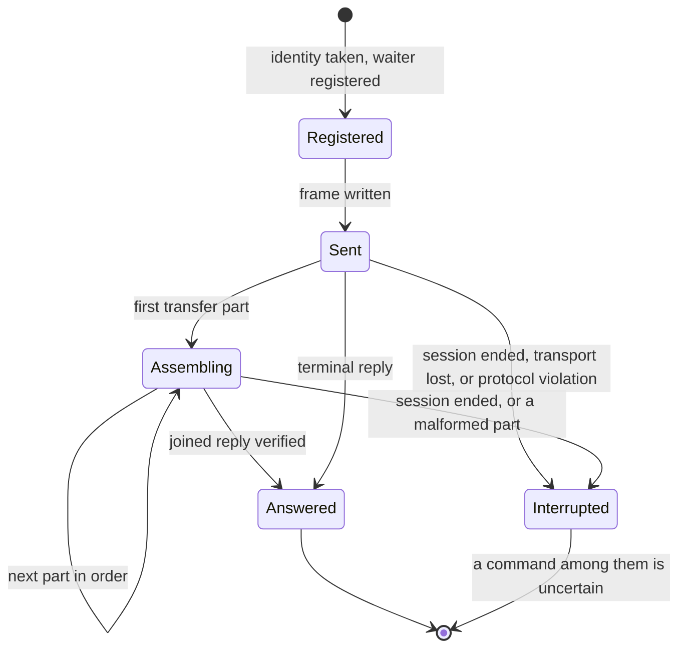

# Client Implementation Manual

This manual is the normative contract for a program that speaks the Nervix client session protocol.
It states what an implementation must do to frame and verify messages, correlate requests, recover
commands exactly, follow the leader, hold a transaction, read subscriptions without misreading a
value, and upload resources. [Client Session Protocol](./client-session-protocol.md) explains why
the system behaves this way. This manual does not repeat those reasons, and the chapter does not
repeat these rules.

The Rust client, `nervix-client-core`, is the reference implementation. The shared binding,
`nervix-client-ffi`, exposes it to C, C++, Python, JVM, and Ruby hosts, and a host that loads the
binding inherits every rule below from it except those in [Using The Shared
Binding](#using-the-shared-binding). An implementation that speaks the protocol itself, as the Go
and TypeScript conformance clients do, follows all of it.

## Conformance Language

The key words **MUST**, **MUST NOT**, **SHOULD**, and **MAY** are used as RFC 2119 defines them.
Each rule has an identifier, such as `F-3`, which [Conformance Evidence](#conformance-evidence) ties
to the executable tests that exercise it. An implementation conforms when it follows every **MUST**
and **MUST NOT** rule for the parts of the protocol it uses. It MAY implement a subset, for example
commands without subscriptions, and MUST NOT send a request whose replies it does not handle.

The protocol has one current form: no version negotiation, no compatibility mode, and no fallback
encoding. An implementation MUST be generated from, or checked against, the
`crates/client-wire/schema/session.fbs` of the server release it talks to.

## Messages At A Glance

Every request is a `ClientMessage` carrying a request identity and one `ClientRequest`. The server
answers each request with one terminal `Reply`, possibly delivered as transfer parts:

| Request | Served on | Served by | Terminal reply body |
| --- | --- | --- | --- |
| `CommandRequest` | Ordered lane | The leader, except for the reads the chapter lists | `CommandOutcome` |
| `AttachTransactionRequest` | Ordered lane | The leader | `AttachOutcome` |
| `SubscribeRequest` | Ordered lane | Any node | `SubscribeOutcome` |
| `UnsubscribeRequest` | Ordered lane | The session's node | `UnsubscribeOutcome` |
| `AttachDomainClockRequest` | Ordered lane | Any node | `DomainClockAttachOutcome` |
| `DetachDomainClockRequest` | Ordered lane | The session's node | `DomainClockDetachOutcome` |
| `SuggestRequest` | Concurrently | Any node | `SuggestOutcome` |
| `ChoiceLookupRequest` | Concurrently | Any node | `ChoiceOutcome` |
| `ListDomainsRequest` | Concurrently | Any node | `DomainList` |
| `SelectDomainRequest` | Concurrently | Any node | `DomainSelectionOutcome` |
| `InspectTransactionRequest` | Concurrently | The leader | `InspectionOutcome` |
| `CancelRequest` | On arrival | Any node | `CancelOutcome` |

Any request may instead end with `RequestRejected`, or with `RequestCancelled` when a cancellation
targeted it. A command sent to a follower is served there only when it is one of the reads the
chapter lists in [Which Requests Need The
Leader](./client-session-protocol.md#which-requests-need-the-leader); every other command is
answered with a `LeaderRedirect` disposition.

Unsolicited `ServerMessage` bodies carry no request identity:

| Body | Meaning |
| --- | --- |
| `LeadershipObserved` | Which node leads, first on every session and again on every change |
| `DomainsObserved` | The domain list, second on every session and again on every change |
| `DomainSnapshotObserved`, `ClusterObserved` | The selected domain's live graph and entities, and the cluster summary, after `SelectDomainRequest` |
| `ServerNotice` | Text for display at `Info`, `Warning`, or `Error` |
| `SubscriptionRows`, `SubscriptionDeliveryLost`, `SubscriptionRowsSkipped`, `SubscriptionEnded` | Frames of one subscription generation |
| `DomainClockObserved`, `DomainClockAttachmentEnded` | Frames of one domain clock attachment |
| `SessionEnding` | The last frame of a session the server ends |

An upload is a separate call with its own frames; see [Resource Uploads](#resource-uploads).

## Frames

- **F-1.** An implementation MUST read and write every frame with code generated from `session.fbs`
  by `flatc`, or with code checked against it. It MUST NOT renumber, reorder, or omit schema
  members.
- **F-2.** It MUST send exactly one finished frame per transport message, that is one gRPC message
  or one WebSocket binary message, finished with its root's file identifier, `NXCM` for a
  `ClientMessage` and `NXUM` for an `UploadMessage`, and without a size prefix. It MUST NOT split a
  frame across messages, join frames in one message, or send a WebSocket text message.
- **F-3.** Before it reads any field of a received frame, it MUST check that the frame is at most
  the frame limit of 4 MiB, at least 8 bytes long, and carries the expected identifier, `NXSM` on a
  session and `NXUR` for an upload reply. Where its FlatBuffers runtime has a verifier, it MUST
  verify the frame with a nesting limit of 64, a table limit of the frame length divided by 4, and
  an apparent-size limit of 8 times the frame length. Where its runtime has none, as for Go and
  TypeScript, it MUST check every union discriminant, required field, and required value it reads,
  and MUST treat a read that its runtime fails, such as an offset outside the frame, as a protocol
  violation.
- **F-4.** It MUST treat as a protocol violation a `NONE` or undeclared union discriminant, an
  undeclared enum value, a missing required field, an absent optional scalar that a schema comment
  requires, a zero that a schema comment forbids, and an empty collection that a schema comment
  forbids. It MUST NOT skip such a value, default it, or map it to another one.
- **F-5.** It MUST keep an absent optional scalar, declared `= null`, distinct from a present zero,
  both when it reads one and when it writes one. For example, it omits
  `expected_transaction_position` when it expects no position and writes `0` when it expects
  position zero.
- **F-6.** It MUST NOT send a frame above 4 MiB, a string above 64 MiB, a vector above 262,144
  entries, or tables nested deeper than 64.
- **F-7.** It MUST reassemble `TransferPart` replies into one reply per request identity. It MUST
  refuse a part that names another request identity or another total, a first total above the
  transfer limit of 64 MiB, a part whose offset is not the number of bytes received so far, and an
  empty chunk. It MUST verify the joined bytes as a `ServerMessage` frame under the transfer limit
  that holds a `Reply` to the same request whose body is not itself a transfer part. It MUST accept
  other frames between the parts of one reply, and MUST NOT deliver a partial reply.
- **F-8.** On a protocol violation it MUST stop reading the session, end every request still waiting
  on it as interrupted, and treat every command among them as uncertain under [Commands And
  Execution Identity](#commands-and-execution-identity). It MAY open a new session.
- **F-9.** A value read in place borrows the frame it was read from. An implementation MUST keep the
  frame alive and unchanged while any such value is in use, and MUST copy what must outlive it. It
  SHOULD copy a small frame out of a large receive buffer before retaining it, as the Rust gRPC
  codec does below 64 KiB, so a retained frame does not pin the whole buffer.

## Transports And Authentication

- **T-1.** A native client MUST open a session as the bidirectional gRPC stream
  `/nervix.session.Session/Exchange` over HTTP/2, and an upload as the client stream
  `/nervix.session.Session/UploadResource`. Each message MUST be one raw frame, not a protocol
  buffer, and uncompressed. It SHOULD set its gRPC message size limits to the frame limit.
- **T-2.** A server address MUST be an `http` or `https` origin whose path is `/` and that has no
  query, fragment, or user information, as an advertised `grpc_uri` is. A client that started over
  `https` MUST NOT follow a redirect or a seed to `http`.
- **T-3.** A WebSocket client MUST connect to `/console/ws` on the leader's console endpoint, using
  `ws` for an `http` endpoint and `wss` for an `https` one, and MUST send binary messages only. It
  MUST treat a close with code `1003`, `1007`, or `1009` as a defect in what it sent.
- **T-4.** A native client MUST send `authorization: Basic <base64(user:password)>` metadata on
  every call, including every upload. A WebSocket client MUST present the same credentials in an
  `Authorization: Basic` header or in the `auth` query parameter, percent-encoded, because the
  server decodes the query as a form and would read a raw `+` as a space.
- **T-5.** On `UNAUTHENTICATED`, or `401` for the WebSocket, a client MUST NOT retry with the same
  credentials automatically. The server paces a user's attempts after a failure.
- **T-6.** A client MUST NOT resend a frame that ended its call with `OUT_OF_RANGE` or `INTERNAL`,
  because the server found the frame oversized or malformed.
- **T-7.** A WebSocket client MUST expect its session to end with a `SessionEnding` whose reason is
  a `LeaderRedirect` whenever its node does not lead. It then reconnects to the named leader's
  `web_console_uri` with the path `/console/ws`, or backs off and retries when the redirect names no
  endpoint.
- **T-8.** A client MUST NOT rely on keepalives or an idle timeout, since neither side sends
  keepalives, and MUST bound every wait with a deadline of its own.

## Requests, Replies, And Cancellation

- **C-1.** A request identity MUST be non-zero and unique within its session, and MUST NOT be reused
  after its request's terminal reply. A counter that starts at 1 on every new session satisfies
  this. A client that exhausts the 64-bit range MUST open a new session.
- **C-2.** A client MUST register the waiter for a request before it sends the request's frame.
- **C-3.** A client MUST route every `Reply` by its request identity alone. An unsolicited body
  never completes a request. A reply whose identity no request is waiting for, because its caller
  stopped waiting, MUST be discarded and MUST NOT complete any other request.
- **C-4.** A client MUST expect exactly one terminal reply per request. After a `SessionEnding` or
  the end of the transport, no reply follows for any request still in flight.
- **C-5.** A client MUST NOT send a request identity that is in flight. The server answers such a
  duplicate with `DuplicateRequestId` under that same identity, and the original request's own reply
  still follows, so the two cannot be told apart.
- **C-6.** A client SHOULD NOT have more than 64 requests in flight on one session. A request
  refused with `TooManyRequestsInFlight` was not admitted and MAY be sent again once an earlier
  request has its terminal reply.
- **C-7.** A client MUST read and route replies whatever the application does with unsolicited
  frames. Every queue of unsolicited frames MUST be bounded, and a full queue MUST drop events and
  report the loss rather than stop the reader.
- **C-8.** A client MUST act on `RequestRejected` by its reason:
  - `InvalidRequest`, `UnsupportedRequest`, `UnsupportedValue`, and `DuplicateRequestId` report a
    defect in the request. The client MUST NOT send it again unchanged.
  - `TooManyRequestsInFlight` is covered by C-6.
  - `ReplyTooLarge` says the complete reply cannot be carried. Repeating an unchanged read returns
    the same result; a command's outcome is recovered by its execution reference like any lost
    reply.
  - `ServerBusy` answers a read, which a client MAY repeat later.
- **C-9.** A client MAY cancel a request with a `CancelRequest` that has an identity of its own. It
  MUST expect `CancelOutcome` under the cancellation's identity and, when that outcome is
  `Requested`, the target's own terminal reply as well, in either order. That reply is
  `RequestCancelled` or the target's ordinary reply. `BeforeAdmission` means the target has no
  effect. `AfterAdmission` means its effect continues and is recovered by its execution reference. A
  client MUST NOT present a cancellation as undoing anything.
- **C-10.** A client that stops waiting without sending `CancelRequest` MUST treat the request
  exactly as a cancellation after admission: the effect may happen, and a command's outcome is
  recovered by its execution reference.

## Structured Choice Lookups

- **Q-1.** A client that sends `ChoiceLookupRequest` MUST use the target's typed dependencies:
  domain for internal schema, branch, relay, VHOST, signaling protocol, JSON/CBOR/AVRO wire
  schema, or resource choices;
  domain followed by a relay `Model` reference for relay fields; and domain followed by a
  `Resource` reference for completed resource versions. It MUST use the distinct wire-schema
  targets when a form requires an exact format.
- **Q-2.** A client MUST use the returned `ChoiceValue`, rather than its presentation label, for
  selection. For completed resource versions it MUST handle `ResourceVersionNumber` and
  `LatestResourceVersion` as distinct values. It MUST NOT offer a version absent from the result as
  a completed upload. It MUST treat `MissingContext`, `StaleContext`, and `LookupFailed` as distinct
  outcomes, and MUST restart a paged lookup after `StaleContext` rather than reuse its cursor.

## Routing Statements

A client that accepts NSPL text sends some statements as requests of their own rather than as
commands. Sent as a command, each of these is refused with `RequestFailed` naming the request to
use.

| Statement | Sent as |
| --- | --- |
| `USE <domain>` | Nothing: it sets the domain the client puts in later requests. A client MAY send `SelectDomainRequest` to receive that domain's observations and to learn whether it exists. |
| `LIST DOMAINS` | `ListDomainsRequest` |
| `CREATE SUBSCRIPTION ...` | `SubscribeRequest` carrying exactly that statement |
| `DELETE SUBSCRIPTION <name>` | `UnsubscribeRequest` |
| `ATTACH DOMAIN CLOCK` | `AttachDomainClockRequest` for the selected domain |
| `DETACH DOMAIN CLOCK` | `DetachDomainClockRequest` for the selected domain |
| `UPLOAD RESOURCE ...` | An `UploadResource` call |
| Every other statement | `CommandRequest` |

- **L-1.** A client MUST put the selected domain in every `CommandRequest`, or leave `domain` absent
  when none is selected. The server keeps no selected domain for commands.
- **L-2.** A client MUST send a statement from the table above on its own. It MUST NOT send several
  statements in one `CommandRequest` outside a transaction, and MUST NOT combine
  `DESCRIBE TRANSACTION` or `SHOW TRANSACTIONS` with any other statement.
- **L-3.** While it holds a transaction, a client MUST NOT send `SubscribeRequest`,
  `UnsubscribeRequest`, `AttachDomainClockRequest`, or `DetachDomainClockRequest`, which the server
  refuses then, and MUST NOT change its selected domain, which every request of the transaction must
  name.

## Commands And Execution Identity

- **E-1.** A client MUST create one execution reference per logical command before it first sends
  that command. The reference MUST be 1 to 128 bytes of ASCII letters, digits, `-`, `_`, and `.`.
  For every command that can be persistent or part of a transaction, which is every command except
  the reads [Exact Recovery](./client-session-protocol.md#what-is-recorded) lists, it MUST be a
  UUIDv7 whose timestamp is the client's current time; a reference that is not one is refused before
  any effect. A client SHOULD use a UUIDv7 for every command.
- **E-2.** A client MUST keep the reference together with the exact query text, the domain, the
  expected transaction position, and the expected preview until the command's outcome is known.
  Every repetition MUST send all of them unchanged, under a new request identity.
- **E-3.** A client MUST NOT create a new reference for a command whose outcome is uncertain. It
  MUST repeat the command under the same reference until it receives a terminal disposition, or give
  up and report the outcome as unknown, naming the reference.
- **E-4.** A client SHOULD stop repeating a reference well before the retry validity, 15 minutes by
  default, has passed since the reference was created, and its clock SHOULD stay within five minutes
  of the cluster's. A repetition after the record was reclaimed is refused with
  `ExecutionReferenceExpired`, or with `RequestFailed` whose message says the reference has expired.
  A client MUST NOT present either as the outcome of the original command.
- **E-5.** A client MUST check that the `execution_reference` of a `CommandOutcome` equals its
  request's reference, and MUST treat a mismatch as a protocol violation.
- **E-6.** A client MUST act on each disposition as this table requires:

| Disposition | Required action |
| --- | --- |
| `CommandCompleted` | Report success. `already_existed` means nothing changed. |
| `RequestFailed` | Report the failure with its message and diagnostics. |
| `LeaderRedirect` | Nothing was admitted. Follow [Leader Redirect And Reconnect](#leader-redirect-and-reconnect), then repeat under the same reference. |
| `TransactionDetached` | Attach the named transaction again, then repeat under the same reference. |
| `TransactionTakenOver` | Report it. The client MUST NOT attach the transaction back automatically. |
| `OutcomeUnknown` | Back off and repeat under the same reference until another disposition arrives. The client MUST NOT report success or failure from it. |
| `ExecutionReferenceConflict` | Report a defect in the client's use of references. The client MUST NOT repeat the request. |
| `ExecutionReferenceExpired` | Report the original command's outcome as unknown. |
| `PreviewStale` | Nothing was applied, and the transaction stays open. The client MUST NOT commit again against the current preview without the user's decision. |

- **E-7.** A client MUST report a request of several statements from its `statements`, one outcome
  per statement in written order. The command's own disposition is that of the statement that ended
  it.
- **E-8.** A client MUST treat `origin` as information only. A `Recovered` outcome is the outcome of
  the command, with the message and diagnostics recorded when it happened.

## Leader Redirect And Reconnect

- **D-1.** On a `LeaderRedirect` that names the leader with an endpoint, a client MUST open a
  session at `grpc_uri` for a native client, or at `web_console_uri` for a WebSocket client. Before
  it repeats a request that belongs to a transaction, it MUST attach that transaction on the new
  session.
- **D-2.** On a `LeaderRedirect` that names no leader, or a leader without the endpoint the client
  needs, a client MUST back off and try again. It MUST NOT construct an address the redirect did not
  name.
- **D-3.** A client SHOULD remember a bounded set of endpoints it learned from redirects and
  `LeadershipObserved`, and try them, and its configured seeds, when its session is lost.
- **D-4.** A client MUST bound every call with a deadline of its own. When a deadline passes before
  a command's outcome is known, the client MUST report the command as uncertain, naming its
  reference, and never as failed or completed.
- **D-5.** After it loses a session, a client that restores session state MUST, in this order: open
  a new session; attach the domain clocks it follows; open the subscriptions it keeps again, each as
  a new generation, reporting the gap; attach its transaction; and only then repeat outstanding
  commands under their original references.
- **D-6.** A client MUST treat `SessionEnding`, the end of the transport, and a protocol violation
  alike: every request in flight ends without a reply, and every command among them is uncertain.

## Transactions

- **X-1.** A client MUST send `BEGIN` with the selected domain, which must already exist, and MUST
  keep the transaction identity from the outcome's `transaction` status as the transaction's handle.
- **X-2.** Every request that appends to the transaction the session holds MUST carry
  `expected_transaction_position` set to the `accepted_operations` of the newest status the client
  received for that transaction; that is `0` right after an empty `BEGIN`. A request of several
  statements carries the position of its first append. The client MUST advance the position only
  from an outcome that reports it.
- **X-3.** A client MUST report an append as accepted only from its own outcome: `CommandCompleted`
  under its own reference, carrying a `transaction_admission`. It MUST report a commit only from the
  outcome recorded under the commit's own reference. It MUST NOT infer either from the transaction's
  state or counts, including `COMMITTED`.
- **X-4.** A client SHOULD send `COMMIT` with `expected_preview` set to the preview identity the
  user reviewed: the one from the last append's admission, or from an inspection of the attached
  transaction at its current position. It MUST NOT refresh that preview from a `PreviewStale` reply,
  from an inspection of another transaction, or from an inspection at an older position.
- **X-5.** While a commit is `COMMITTING`, a client MUST keep waiting for the commit's own outcome,
  repeating the commit under its reference after any interruption.
- **X-6.** On `TransactionDetached`, a client MUST send `AttachTransactionRequest` for the
  transaction, adopt the domain of the attached transaction, and repeat the command under the same
  reference and position. `TransactionAlreadyFinished` reports the final status and aggregate
  outcome of a transaction that ended; the client MUST NOT treat it as the outcome of an outstanding
  append or commit.
- **X-7.** Ending a session cleanly, by half-closing the gRPC request stream or sending a WebSocket
  close with no request in flight, reverts the open transaction the session holds. A client MUST end
  a session that way only when it intends that revert. Any other ending leaves the transaction open
  for a later attach.
- **X-8.** A client MUST expect an open transaction to expire after its idle timeout, 15 minutes by
  default, whether or not a session is bound to it. Only attaching, appending, and commit admission
  renew it.
- **X-9.** A client MUST NOT assume a read is linearizable. A read served by any node reflects that
  node's applied state, and a command's effect is visible through every node once the command has
  completed.

## Subscriptions

- **S-1.** A client MUST open a subscription with `SubscribeRequest` naming the domain, carrying
  exactly one `CREATE SUBSCRIPTION` statement, and setting `subscription_type` to `Row` explicitly.
- **S-2.** A client MUST record the handle and schema of `SubscriptionOpened` in the frame reader
  itself, before it routes any later frame, because the subscription's rows can follow the reply
  immediately.
- **S-3.** A client MUST route every subscription frame by its complete handle, the name together
  with the generation. It MUST ignore a frame for a handle it does not hold, MUST NOT apply a frame
  of one generation to another, and MUST expect the `SubscriptionEnded` of an earlier generation to
  arrive after the opening reply of a later generation with the same name.
- **S-4.** A client MUST treat `SubscriptionEnded` as the last frame of its generation. After
  `RelayChanged`, it MUST NOT read later rows against the ended generation's schema, and subscribes
  again to read the relay under its current definition.
- **S-5.** A client MUST surface `SubscriptionDeliveryLost` and `SubscriptionRowsSkipped` as gaps
  with their counts, and MUST NOT present the rows around a gap as continuous.
- **S-6.** After `UnsubscribeOutcome` reports `SubscriptionDeleted`, nothing about that generation
  follows, and the client MAY reuse the name at once.
- **S-7.** A client that keeps a subscription across sessions MUST open it again as a new generation
  on the next session and report the time between as a gap. If its user deletes a subscription while
  an opening or reopening is in flight, a late successful reply MUST be followed by an unsubscribe
  before the name is used again.
- **S-8.** A client MUST bound what it retains for subscriptions, per subscription and in total, and
  SHOULD let one subscription retain at least one frame of the frame limit.
- **S-9.** A client that stops reading a `BLOCKING` subscription holds back the relay it reads. A
  client that cannot keep up SHOULD use `DROPPING` delivery.

## Reading Rows

The reply that opens a subscription carries a `RowSchema`: the relay's fields in declared order,
each with its name, type, nullability, and sensitivity, and, exactly when the relay is branched, the
declared branch with its key fields. Every later batch is positional against that schema.

- **R-1.** A client MUST read a `RowBatch` only against the schema of the generation its frame
  names.
- **R-2.** Before it exposes any value of a batch, a client MUST check the batch against that
  schema, and MUST treat a batch that does not conform as a protocol violation:
  - a batch of a branched relay carries a `branch_key`, and a batch of an unbranched relay carries
    none;
  - a row holds exactly one cell per schema field, and a branch key exactly one cell per key field,
    in declared order;
  - a sensitive field holds `RedactedCell` in every row, and no other field does;
  - only a nullable field holds `NullCell`;
  - every other cell holds exactly the cell type of its field's declared type, and a fixed-length
    list holds exactly its declared number of elements;
  - a list element is never `NullCell` or `RedactedCell`.
- **R-3.** A client MUST NOT convert a value to another type while reading it. An integer keeps its
  width and signedness, a `DATETIME` is signed nanoseconds since the Unix epoch in UTC, a `STRING`
  is UTF-8 that may contain NUL, and a `BYTES` value is raw octets that may be empty or not UTF-8.
- **R-4.** A client MUST keep a null value, a withheld value, and a present value distinct in its
  data model. A presentation MAY render a withheld value as a placeholder such as `"<masked>"`.
- **R-5.** A client MUST keep the exact bits of `F32` and `F64` values, including the sign of a
  negative zero and the payload of a NaN, wherever its data model can hold them.

| Declared type | Cell | Value |
| --- | --- | --- |
| `U8`, `U16`, `U32`, `U64` | `U8Cell`, `U16Cell`, `U32Cell`, `U64Cell` | Unsigned integer of that width |
| `I8`, `I16`, `I32`, `I64` | `I8Cell`, `I16Cell`, `I32Cell`, `I64Cell` | Signed integer of that width |
| `F32`, `F64` | `F32Cell`, `F64Cell` | An optional scalar that is always present, so a negative zero keeps its sign |
| `BOOL` | `BoolCell` | Boolean |
| `STRING` | `StringCell` | UTF-8 text |
| `BYTES` | `BytesCell` | Raw octets |
| `DATETIME` | `DatetimeCell` | Signed Unix nanoseconds in UTC |
| Fixed-length list | `ListCell` | Exactly the declared number of elements, each a cell of the element type |
| Variable-length list | `ListCell` | Any number of elements, each a cell of the element type |

### Language Pitfalls

The conformance report carries values chosen to break careless readers: every integer width at both
extremes, 64-bit values on both sides of JavaScript's safe-integer boundary, an absent and a
present-zero optional value, text with multi-byte characters and an embedded NUL, bytes that are not
UTF-8, empty text and bytes, `-0.0`, the smallest subnormal and the largest finite floats by their
bits, the extreme `DATETIME` nanoseconds, and a redacted field. The corpus adds lists, a NaN with a
payload, infinity, and nullable and sensitive branch key fields.

| Runtime | Pitfall | Required handling |
| --- | --- | --- |
| JavaScript and TypeScript | A `Number` holds 53 bits of integer precision. | Read `U64`, `I64`, `DATETIME`, request identities, generations, and counts as `BigInt`. |
| JavaScript and TypeScript | JavaScriptCore, which Bun runs on, canonicalizes a NaN it materializes as a `Number`; V8 keeps the payload. | Read a float's bits from the buffer as an unsigned integer when the bits matter, instead of calling the generated `value()` accessor. |
| JavaScript and TypeScript | `Date` has millisecond precision and a narrower range than the protocol's nanoseconds. | Keep a `DATETIME` as a `BigInt` of nanoseconds. |
| Java and other JVM languages | There are no unsigned primitive types. | A `U64` arrives in a `long`; compare and print it with the unsigned `Long` operations. Values read from the binding's column copies are raw bytes of the declared width, so widen a `U8`, `U16`, or `U32` without sign extension. |
| C and C++ | Strings may contain NUL, and the binding never terminates them. | Use the length every accessor returns; never treat a value as a C string. |
| Python | A `memoryview` borrows memory it does not own. | Keep the object that owns the buffer alive for as long as the view is used. |
| Every runtime | A borrowed value reads the frame it was verified in. | Keep the frame alive, and unchanged, while any borrowed value is used, and copy what must outlive it. |

## Domain Clock Attachment

- **K-1.** A client MUST attach with `AttachDomainClockRequest` and detach with
  `DetachDomainClockRequest`, each naming the domain. It follows each domain at most once. It MUST
  handle every disposition: `DomainClockAttached` with the clock, `DomainClockAlreadyAttached`,
  `DomainNotFound`, and `RequestFailed` for an attach; `DomainClockDetached`,
  `DomainClockNotAttached`, and `RequestFailed` for a detach.
- **K-2.** A client MUST apply the clock in the attach reply before any `DomainClockObserved` for
  the domain, MUST ignore frames about a domain it does not follow, and MUST treat
  `DomainClockAttachmentEnded` as the last frame about the attachment.
- **K-3.** A client MUST treat each `DomainClockObserved` as the newest clock, replacing the
  previous one, and MUST NOT expect a frame for every intermediate change.
- **K-4.** A client MUST read timestamps as signed 64-bit nanoseconds, period and skew as unsigned
  64-bit nanoseconds, and the time rate as a positive finite double. [Domains And
  Time](./domains-and-time.md#following-a-domain-clock) defines the projection a client computes
  from a paced clock.
- **K-5.** After it loses a session, a client that follows clocks MUST attach them again, and MUST
  NOT assume it saw the changes made in between.

## Resource Uploads

- **U-1.** A client MUST upload one archive per `UploadResource` call. The first frame is an
  `UploadStart` with a non-zero `request_id`, the domain, the declared resource, the upload
  identity, and a non-zero `total_bytes`. The archive follows as `UploadChunk` frames in order, each
  non-empty and within one frame, adding up to exactly `total_bytes`, and then the client
  half-closes the stream. The Rust client sends 64 KiB chunks.
  [Resources](./resources.md#upload-format) defines the archive format.
- **U-2.** A client MUST create one upload identity per logical upload, 1 to 128 bytes of ASCII
  letters, digits, `-`, `_`, and `.`, and SHOULD make it a UUIDv7. It MUST keep the identity and the
  exact archive bytes until the upload's outcome is known, and every attempt MUST send both
  unchanged.
- **U-3.** A client MUST check that the reply's `request_id` equals the start's, and that a
  `ResourceInstalled` names the upload identity it sent.
- **U-4.** A client MUST act on the reply:
  - `ResourceInstalled` reports the installed version.
  - `UploadFailed` with `InvalidStream`, `ResourceNotDeclared`, `SizeMismatch`, or `QuotaExceeded`
    admitted nothing, and the client MUST NOT send the same stream again unchanged.
  - `UploadFailed` with `InstallationFailed` reports that the upload failed, that its identity is
    bound to another archive, or that its completion could not be confirmed, and carries the
    assigned version when there is one. Repeating the same identity with the same archive returns
    the outcome recorded for it.
  - `LeaderRedirect` means the client streams the archive again, with the same identity, to the
    leader, or backs off when no leader endpoint is named.
- **U-5.** When a call fails in transport, or its deadline passes, before a reply arrives, the
  upload's outcome is uncertain. A client MUST send the whole archive again under the same identity
  to learn it, and MUST NOT create a new identity for it.

## Using The Shared Binding

A host of `nervix-client-ffi` follows the contract in `crates/client-ffi/include/nervix_client.h`
and these rules:

- **B-1.** A host MUST prepare each logical command once with `nx_session_prepare`, and MUST execute
  the same `nx_execution` again after `NX_ERROR_UNCERTAIN`, `NX_ERROR_CANCELLED`, or
  `NX_ERROR_DEADLINE` to recover its outcome. It MUST NOT prepare a new execution for a command
  whose outcome is uncertain.
- **B-2.** A host MUST release every object it receives exactly once, with that object's release
  function, and MUST NOT use a borrowed pointer after the object it was read from is released.
- **B-3.** A host MUST hold a reference to an event, taken with `nx_event_retain`, for as long as it
  uses any frame or value borrowed from that event, and MUST release every reference exactly once.
  It MAY release a reference on any thread.
- **B-4.** A host MUST read every string as a pointer and a length. Strings are never terminated and
  may contain NUL.
- **B-5.** A host MUST NOT call the binding from a thread that is driving a Tokio runtime.
- **B-6.** A host SHOULD read a batch one column at a time with the column accessors. For a string
  or bytes column it first passes a null data buffer to learn the size it needs.
- **B-7.** A host MUST treat `NX_EVENT_INTERRUPTED` as a gap in every subscription it names, and
  `NX_EVENT_CONSUMER_OVERFLOW` as the end of that subscription's delivery on this session.

## Required State Machines

An implementation that supports a feature MUST behave as the corresponding state machine describes.
The state names are not normative.

**A request.** It is registered before it is sent and ends exactly once:



**A session and a command.** The chapter's [Reconnecting A
Session](./client-session-protocol.md#reconnecting-a-session) shows both: a session moves between
connecting, open, redirecting, awaiting a leader, lost, and restoring, and a command keeps one
execution reference from preparation to its terminal disposition.

**A transaction binding.** The client tracks which transaction its session holds:

```mermaid
stateDiagram-v2
    [*] --> Unbound
    Unbound --> Bound: BEGIN completed, or TransactionAttached
    Bound --> Bound: append accepted; position advanced from its outcome
    Bound --> Detached: TransactionDetached, session lost, or leader changed
    Detached --> Bound: TransactionAttached
    Detached --> Finished: TransactionAlreadyFinished
    Bound --> TakenOver: TransactionTakenOver
    Bound --> Finished: COMMIT or REVERT outcome recorded, or the transaction expired
    TakenOver --> [*]
    Finished --> [*]
```



**A subscription.** The chapter's [Restoration And Bounded
Consumers](./client-session-protocol.md#restoration-and-bounded-consumers) shows the lifecycle a
client keeps for each subscription across sessions.

## Conformance Evidence

The rules above are exercised by these tests. The Cucumber scenarios run through
`just test-scenarios --input <feature>`, the unit tests through `just test-package-lib <package>`,
the wire and corpus tests through `just test-client-wire`, and the cross-language probes through
`just test-client-conformance`.

| Rules | Executable evidence |
| --- | --- |
| F-1 to F-7 | `the_checked_in_corpus_is_what_the_encoder_writes_and_reads`, the frame and transfer tests of `nervix-client-wire` such as `a_union_discriminant_without_its_member_is_refused`, `parts_must_belong_to_the_transfer_and_arrive_in_order`, and `corrupting_a_row_batch_never_panics`; the scenario `A <runtime> client reads every frame of the conformance corpus the Rust encoder wrote` for Go, Node.js, and Bun |
| F-8, D-6 | `a_frame_the_contract_does_not_describe_ends_the_exchange` and `a_session_ending_frame_closes_the_waiters_of_its_exchange` in `nervix-client-core` |
| T-1 to T-6 | `Authentication, framing and protocol failures end a native session with their status` and `The console WebSocket closes a connection that sends something other than a session frame` in `session_protocol.feature`; `non_frame_messages_end_the_connection_with_a_close_code` |
| T-7 | `Web console opened on a follower connects to the leader` and `Web console reconnects after leader switchover` in `connection_status.feature` |
| C-1 to C-7 | `request_identities_start_at_one_and_are_never_reused`, `response_reordering_cannot_take_another_requests_waiter`, `a_reply_no_request_waits_for_is_dropped`, `saturated_event_consumer_cannot_block_a_command_reply`, and `replies_reach_their_requests_in_whatever_order_they_arrive` in `nervix-client-core`; `untracked_domain_push_cannot_discard_a_pending_websocket_request` in the console |
| C-8 | `A malformed request is refused with a typed rejection and the session keeps serving` in `session_protocol.feature`; `a_rejected_request_surfaces_as_a_typed_error` |
| C-9, C-10 | `A long command leaves the session responsive and a waiter cancelled before admission admits nothing` and `Cancelling a durably admitted command ends only the wait for it` in `session_protocol.feature`; `cancelling_a_command_releases_its_pending_reply` |
| Q-1, Q-2 | `configured_choices` unit tests for exact wire-schema, resource, version, VHOST, signaling, and dependency choices; `typed_choices_and_lookup_states_round_trip` in `nervix-client-wire`; `A resource-backed codec selects a completed version and file explicitly` and `A codec can choose a wire schema staged earlier in its transaction` in `visual_create_codec.feature`; `WebSocket client and endpoint select an existing signaling protocol` in `visual_create_client_endpoint.feature`; Go and Node.js corpus probes in `client_conformance.feature` |
| L-1 to L-3 | `use_domain_is_served_by_the_client`, `list_domains_is_served_from_a_domain_list_request`, `execute_rejects_mixed_client_local_multi_statement_request`, `execute_rejects_client_local_command_during_transaction`, and `a_create_subscription_statement_is_sent_as_a_subscribe_request`; `Implicit multi-command requests are rejected` in `nspl_transactions.feature` |
| E-1 to E-5 | In `client_wire_failures.feature`: `A command lost after durable admission is recovered by its request identity`, `A reclaimed command identity stays expired after a durable restart`, `A command identity outside its retry window starts no effect`, `A full command history refuses new identities and keeps every retained result`, `Concurrent exact BEGIN retries join one durable execution`, and `Reusing a durable transaction identity with different content fails semantically`; `a_command_reply_for_another_execution_cannot_claim_success` |
| E-6 to E-8 | `Leadership lost after durable admission leaves an unknown outcome that a retry recovers` in `session_protocol.feature`; `an_unknown_outcome_is_recovered_with_the_same_execution_reference` and `replies_ask_for_the_routing_their_disposition_needs` |
| D-1 to D-5 | `A redirect names no endpoint for a leader that discovery cannot reach` in `session_protocol.feature`; `The Rust client reconnects through its original seed after the leader stops` in `client_wire_failures.feature`; `a_command_redirect_keeps_its_execution_reference`, `a_command_waits_for_an_election_and_is_sent_again_with_its_reference`, and `a_closed_session_recovers_through_a_configured_seed` |
| X-1 to X-3 | In `client_wire_failures.feature`: `A command missing from a committed transaction cannot report aggregate success`, `Replaying a BEGIN whose response was lost returns the original transaction`, `Replaying an accepted <append_kind> append does not preflight or append it again`, and the two exact transaction batch retries; `lost_begin_append_and_commit_replies_retry_the_exact_request` and `concurrent_commands_capture_transaction_position_in_send_order` |
| X-4, X-5 | `A commit fenced to a preview the transaction outgrew is refused and stays open` in `nspl_transactions.feature`; `a_commit_fences_against_the_basis_its_own_transaction_reported`, `a_refused_commit_does_not_adopt_an_unreviewed_basis`, and `an_older_inspection_cannot_replace_a_newer_queue_preview` |
| X-6 | `A session whose leader lost its binding re-attaches instead of failing` and `Attaching from a second session takes over an open transaction` in `nspl_transactions.feature`; `a_detached_transaction_is_attached_again_before_the_command_is_retried` |
| X-7, X-8 | `A clean session close reverts its open transaction` and `An orphaned transaction expires and retains its outcome` in `nspl_transactions.feature`; `A stalled commit cannot block expiry, another domain, or tombstone cleanup` in `client_wire_failures.feature`; `Physical inactivity while every node is stopped expires an open transaction` in `client_wire_process_restart.feature` |
| S-1 to S-6 | Every scenario of `session_subscription_lifecycle.feature` and `session_subscription_options.feature`; `Published interest starts, reopens, and stops remote subscription fan-out` in `subscription_interest.feature`; `a_subscription_type_must_be_selected_and_supported` |
| S-7, S-8 | `A reconnected native client restores acknowledged subscriptions` in `client_wire_failures.feature`; `Subscription restoration and typed transaction inspection survive the same leader loss` in `client_wire_qualification.feature`; `deleting_while_creation_is_in_flight_drains_its_late_success_before_name_reuse`, `cancelling_an_in_flight_restore_cleans_up_its_late_success`, and `one_subscription_overflow_preserves_other_subscription_events` |
| R-1 to R-5 | `A <runtime> client round-trips an operation, typed rows, an error and a closure` in `client_conformance.feature` for every runtime; `a_batch_round_trips_every_cell_kind_at_its_bounds`, `cells_must_follow_their_fields`, `branch_identity_must_match_the_schema`, and `lists_must_follow_their_element_type_and_length`; `a_batch_that_does_not_conform_to_its_schema_is_a_protocol_failure` in the binding |
| K-1 to K-5 | `A domain clock attachment reply precedes its frames, a detach reply follows them, and a transaction refuses both` in `session_protocol.feature`; both scenarios of `domain_clock_attachment.feature`; `an_attached_clock_is_attached_again_on_a_new_session_and_reports_its_clock` |
| U-1 to U-5 | `An upload stream the protocol does not allow is refused with a typed failure and admits nothing` in `session_protocol.feature`; in `resource_describe.feature`, `An incomplete upload does not admit content or consume its identity`, `Upload retry reports one assigned version`, `Upload retry after leader change reports the assigned version`, and `An uncertain upload completes once across installation and leader change`; `a_lost_upload_reply_retries_with_the_same_identity_and_archive` and `malformed_upload_replies_are_rejected_by_their_correlations` |
| B-1 to B-7 | The binding tests of `nervix-client-ffi`, such as `retained_references_keep_the_frame_until_the_last_one_is_released`, `string_and_bytes_columns_are_copied_with_offsets_and_borrowed_per_cell`, and `a_token_bounds_a_call_by_cancellation_and_by_deadline`; the C, C++, Python, Java, and Ruby cases of `client_conformance.feature` |

### Executable Examples

The conformance probes are complete, runnable clients, and each prints the same report as every
other probe. They are qualification clients rather than supported SDKs. The Go and TypeScript probes
each keep one request in flight and run no persistent command, so they use execution references that
are not UUIDv7, which E-1 allows only for reads.

| Probe | Shows |
| --- | --- |
| `tests/client_conformance/go/probe.go` | A native gRPC client: a pass-through frame codec, Basic authentication metadata, correlation by request identity, following a redirect's `grpc_uri` with the same execution reference, and failing on `OutcomeUnknown` |
| `tests/client_conformance/node/probe.ts` | A WebSocket client for Node.js and Bun: one binary message per frame, `BigInt` for every 64-bit value, float bits read from the buffer, and following a redirect's `web_console_uri` |
| `tests/client_conformance/go/corpus.go`, `probe.ts corpus <dir>` | Reading every corpus frame without a FlatBuffers verifier, checking identifiers, discriminants, and required values |
| `tests/client_conformance/c/probe.c`, `cpp/probe.cpp` | The binding from C and from C++ with `std::unique_ptr` ownership |
| `tests/client_conformance/python/probe.py` | The binding through `ctypes`, with a `memoryview` over a retained frame |
| `tests/client_conformance/java/Probe.java` | The binding through the Foreign Function and Memory API, with arena-owned events |
| `tests/client_conformance/ruby/probe.rb` | The binding through Fiddle, with collector-driven release |

`just test-client-conformance` builds every probe and runs it against one- and three-node clusters;
[`tests/client-conformance-ledger.md`](https://github.com/nervix-io/nervix/blob/main/tests/client-conformance-ledger.md)
records the runtimes, the build commands, and what each probe checks. The core of the TypeScript
client's exchange shows C-1 to C-3 in a few lines:

```typescript
async request(kind: wire.ClientRequest, build: Build): Promise<wire.Reply> {
  this.nextId += 1n;
  const id = this.nextId;
  const builder = new flatbuffers.Builder(256);
  const body = build(builder);
  wire.ClientMessage.startClientMessage(builder);
  wire.ClientMessage.addRequestId(builder, id);
  wire.ClientMessage.addRequestType(builder, kind);
  wire.ClientMessage.addRequest(builder, body);
  builder.finish(wire.ClientMessage.endClientMessage(builder), 'NXCM');
  this.socket.send(builder.asUint8Array());
  for (;;) {
    const message = await this.receive();
    if (message.bodyType() !== wire.ServerBody.Reply) {
      this.pending.push(message);
      continue;
    }
    const reply = member(message.body(new wire.Reply()) as wire.Reply | null);
    if (reply.requestId() !== id) {
      throw new Error(`a reply names request ${reply.requestId()} while ${id} is in flight`);
    }
    return reply;
  }
}
```

Because the probe keeps one request in flight and its replies are small, it treats a reply for any
other identity, and any transfer part, as an error. A client with several requests in flight routes
such a reply to the waiter its identity names, as C-3 requires, and reassembles transfer parts as
F-7 requires.

## What A Client Must Not Promise

A client built on this protocol MUST NOT tell its users that:

- a subscription delivers every row, delivers a row exactly once, or can be resumed from a position;
- a failed transaction, a cancelled command, or a lost session rolled anything back;
- a cancelled or timed-out command did nothing, unless the server reported it cancelled before
  admission;
- an uncertain command failed, or succeeded, before its own outcome was recovered;
- rows arrive in Arrow, or in any encoding other than typed Row frames, or that a columnar form
  exists;
- a session, its subscriptions, or its clock attachments survive the loss of its connection.
