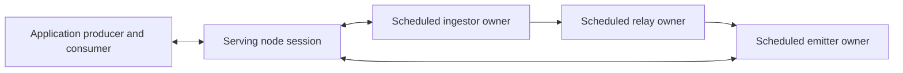
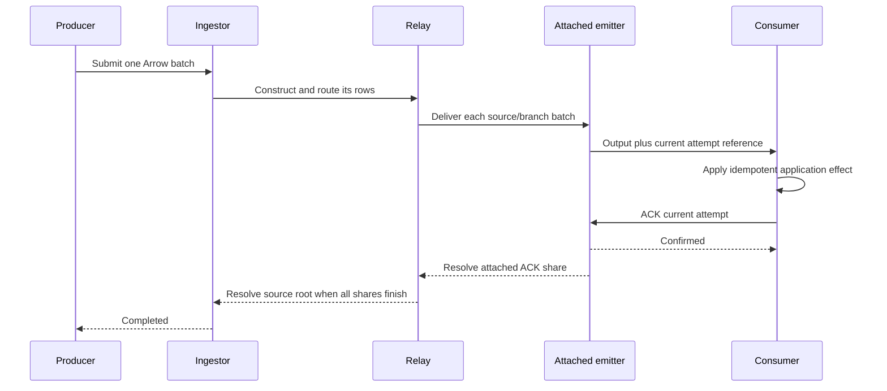

# Client Ingestors And Emitters

Authenticated applications participate in a Nervix graph through persisted, domain-owned
`FROM CLIENT` ingestors and `TO CLIENT` emitters. Producers submit native Arrow batches; consumers
receive constructed Arrow output and explicitly acknowledge, retry, or reject each delivery
attempt. An attached client-to-client path completes its input only after the application ACK.
Endpoint configuration survives a restart. Payloads, attachments, delivery attempts and ACK state
are volatile, so applications own replayable input and idempotent effects.

The native endpoints, automatic restoration, shared C binding, and Rust/Python paced drivers are
implemented. This chapter connects their delivered contracts. The following chapters remain the
owners of their respective rules:

| Contract | Authoritative documentation |
| --- | --- |
| Source syntax, admission and source outcomes | [Ingestors](./ingestors.md#client-ingestors) |
| Sink syntax, construction, batching and graph ACK boundary | [Emitters](./emitters.md#client-emitters) |
| Public attachments, subscriptions and clock observation | [Sessions](./sessions.md) |
| Rust handles and shared binding | [Rust Client Library](./client-library.md#producers) and the [Client Implementation Manual](./client-implementation-manual.md#using-the-shared-binding) |
| FlatBuffers, transport, correlation, cancellation and restoration | [Client Session Protocol](./client-session-protocol.md#producers) and the [Client Implementation Manual](./client-implementation-manual.md#producers) |
| Model validation, typed revision construction and installation | [Execution Plans](./execution-plans.md) |
| Native source/sink composition and the common emitter host | [Connector Contract](./connector-contract.md#source-boundary) |
| Authenticated forwarding and cross-node failures | [Cluster Interconnect](./interconnect.md#client-producer-links) |
| Failure classification and safe diagnostic content | [Errors And Diagnostics](./errors-and-diagnostics.md) |
| Generation, execution snapshots, timestamp admission and deadlines | [Domain Clock](./domain-clock.md) |
| Mutable owners, publication, credit and attempt synchronization | [Data-Plane Concurrency](./data-plane-concurrency.md) |
| Typed identities, absence and validation boundaries | [Typed States](./typed-states.md) |
| ALTER scopes, actual engagement, rollback and inspection | [Transaction Quiescence](./transaction-quiescence.md) |
| Planned drain, node shutdown and restart admission | [Shutdown And Recovery](./shutdown.md) |
| Runnable application and its command-line options | [Paced Simulation Drivers](./paced-simulation-drivers.md) |

## Ownership And Routing

The ingestor or emitter name is the attachment target. An application open neither creates a graph
node nor adds a graph edge. `CREATE CLIENT ... TYPE ...` describes an external connector connection;
native endpoints instead name an internal schema directly and use the existing session listeners.
Starting a domain needs no connected application. With no consumer, an emitter retains bounded
pending work and applies graph backpressure.

The language parses NSPL once into structured Models. The registry validates domain references,
exact schemas, sensitivity, branch declarations, construction, policies and capabilities. Pure
decisions lower those validated inputs into native source and sink plans in one execution revision.
The data plane executes plans without reading Models or reparsing executable NSPL.

| Layer | Responsibility on this path |
| --- | --- |
| Vocabulary | Schemas, domain generations, endpoint contracts, typed attachment/delivery identities, limits and outcomes |
| Language | Current `CLIENT` grammar, semantic Models, canonical rendering and composed completion |
| Decisions | Validate the candidate graph and produce typed source, route, sink and message-error plans |
| Data plane | One ingestor endpoint/admission owner; concrete branch route tasks; relay ownership; emitter host and competing-consumer attempt owner |
| Control plane | Commit configuration, install revisions, establish generations, coordinate scoped holds and ownership handoff |
| Edges | Authenticate sessions, reserve attachment capacity, correlate requests, route control/data and forward to the scheduled owner |
| Application client | Retain desired handles and pending results, process output concurrently, decide replay and maintain application identities |

A native gRPC session may enter through any live node. That serving node routes each open to the
endpoint's scheduled execution; producer, relay and emitter owners may all be different nodes.
The console's binary WebSocket uses the same endpoint operations and FlatBuffers contract, but
console sessions are served by the leader. Public endpoint scenarios exercise both transports.
The Rust library and its shared C binding connect through native gRPC; the console's ordinary
inspection flow does not open a consumer or claim output.



Client graph nodes bind no additional port. Session listeners belong to every live node and remain
independent of placement and leadership. Native payloads and their ACKs follow the data plane;
administrative commands retain their leader routing. A healthy native attachment continues through
a leader change that leaves its execution owner and session intact. A console leader change ends
the WebSocket session and is a session gap.

### Concrete Branches And Forwarding

Each ingestor has one scheduled execution and a shared source ACK window. Its routes construct
outgoing branch keys. A producer cannot choose a relay, inject a branch key as transport metadata,
or create another execution by connecting again. Route buffering and downstream execution remain
local to each concrete branch. Unbranched work has an absent branch key.

An emitter consumes all its configured source branches. Collection, flush, prepared payloads and
ACK windows remain separate for each source relay and concrete branch. Equal keys from different
source relays never merge. Consumers receive the constructed schema plus a source-relay name,
optional opaque branch fingerprint, member count, execution snapshot, delivery identity and attempt
reference. The fingerprint exposes no branch-key values. Copy a required branch value into a schema
field earlier in the graph and export that field explicitly.

Remote producers use a shared, authenticated relay-class duplex link per serving/owning node pair.
Before admitting a forwarded batch, the owner takes a source-window slot and sends `Admitting`.
The serving node records possible admission and answers `Clear`; only then may the owner dispatch
the batch. This costs one additional link round trip. If the owner or link is lost, the serving
node can truthfully report batches it never cleared as `NotAdmitted(ProducerEnded)`. Cleared,
unresolved batches become `OutcomeUnknown(OwnerLost)`. Losing the serving node instead leaves
every sent batch without an outcome uncertain to the application as `SessionLost`.

A remote consumer has its own authenticated relay-class duplex stream. The owner sends attempt
metadata and IPC bytes in ordered chunks of at most 1 MiB; the serving node checks the announced
length and reassembles one delivery before answering the application read. Settlement and heartbeat
writes proceed beside response reads. Both forwarding forms use two-second idle heartbeats and a
ten-second peer-silence limit. The [Interconnect](./interconnect.md#client-consumer-streams) owns
setup budgets, peer identity, quotas and link-ending semantics.

## Configure A Native Graph

This complete graph accepts application events, constructs a branch per tenant and exports the
declared output. It requires a running Nervix cluster and authenticated session credentials;
there is no external broker, queue, codec, resource upload or connector client to provision.
The `private_note` value is deliberately exported through explicit leakage.

Save the block as `application.nspl`. The model definitions form one transaction. The CLI commands
below create the domain, select it with `--domain`, load the graph, then start it in separate phases.

```nspl
BEGIN;
CREATE SCHEMA application_event (
  event_id STRING,
  tenant STRING,
  value I64,
  private_note STRING SENSITIVE
);
CREATE SCHEMA application_output (
  event_id STRING,
  tenant STRING,
  value I64,
  private_note STRING
);
CREATE SCHEMA tenant_key (tenant STRING);
CREATE BRANCH by_tenant SCHEMA tenant_key TTL 10m;
CREATE RELAY application_events
  SCHEMA application_event BRANCHED BY by_tenant CAPACITY 16;

CREATE INGESTOR submit_events
  FROM CLIENT SCHEMA application_event
    MODE ACK PARALLEL MAX 8 ACK TIMEOUT 30s
      RETRY POLICY BACKOFF 100ms MAX 2s
    ON QUIESCE SUSPEND
  TIMESTAMP NOW
  TO application_events
    INHERIT ALL
    BRANCHED BY by_tenant SET tenant = input.tenant
    FLUSH EACH 10ms MAX BATCH SIZE 1MiB
    ON MESSAGE ERROR LOG
  ON GENERAL ERROR LOG;

CREATE ATTACHED EMITTER receive_events
  FROM application_events
  TO CLIENT SCHEMA application_output
    MODE ACK PARALLEL MAX 4 ACK TIMEOUT 30s
      RETRY POLICY BACKOFF 100ms MAX 2s
  INHERIT event_id, tenant, value
  SET private_note = leak_sensitive(input.private_note)
  BATCH MAX MESSAGES 256 MAX SIZE 256KiB
  FLUSH EACH 10ms MAX BATCH SIZE 1MiB
  ON MESSAGE ERROR LOG
  ON GENERAL ERROR LOG;
COMMIT;
```

Load it through the [CLI](./client-tools-cli.md), using the cluster's actual credentials and server
address when they differ from these examples:

```bash
nervix-cli --server http://127.0.0.1:47391 --username default \
  --password "$NERVIX_PASSWORD" --command "CREATE UNPACED DOMAIN application;"
nervix-cli --domain application --command "$(cat application.nspl)"
nervix-cli --domain application --command "START;"
nervix-cli --domain application --command "SHOW CREATE INGESTOR submit_events;"
nervix-cli --domain application --command "DESCRIBE EMITTER receive_events;"
```

Open `application.receive_events` with exactly `application_output`'s fields, start its read/process/
ACK loop, then open `application.submit_events` with exactly `application_event`'s fields and submit
Arrow batches. Request, for example, eight batches and 1 MiB of credit for each handle. A single
application runs the consumer loop concurrently with producer outcome waits. Waiting for attached
producer completion before consuming its output waits on the application's own ACK.
The [library examples](./client-library.md#producers) show the operations; the
[paced drivers below](#run-the-paced-drivers) supply complete executable programs.



### Construction, State And Error Policies

The source schema describes input before construction; the sink schema describes output after
construction. Transforming routes start empty, use permitted `INHERIT` and ordered `SET`, and
initialize every required output. Optional fields finalize as typed nulls. Filters and route
predicates retain their ordinary scopes. Client sources have no header or connector-metadata
scope; client sinks have no codec, header invocation or direct `VALUES` mode.

Sensitivity is part of the public schema contract. Exporting a sensitive value requires explicit
`leak_sensitive(...)` or permitted inheritance with `LEAK SENSITIVE`, even if the declared output
field is sensitive. Client output carries the deliberately exported value; relay-subscription
masking belongs to the observation interface. [Expression Functions](./filter-map-functions.md)
owns conversion and leakage semantics.

Ingestors cannot read materialized state. Emitters can declare ordered, node-wide dependencies
after their source list and before `TO`. Each dependency names a materialized relay in the same
domain with the exact branch declaration of every source. For example, the following additional
configuration runs in the `application` graph above, selected with `--domain application`. Its
typed default works before a branch has materialized state; another source may later populate
`tenant_limits`.

```nspl
BEGIN;
CREATE SCHEMA tenant_limit (maximum I64);
CREATE RELAY tenant_limits
  SCHEMA tenant_limit BRANCHED BY by_tenant
  WITH MATERIALIZED STATE LAST BY TIMESTAMP;
CREATE ATTACHED EMITTER receive_bounded_events
  FROM application_events
  USING MATERIALIZED STATE tenant_limits DEFAULT { maximum = 1000 }
  TO CLIENT SCHEMA application_output
    MODE ACK SEQUENTIAL ACK TIMEOUT 30s
      RETRY POLICY BACKOFF 100ms MAX 2s
  INHERIT event_id, tenant, value
  SET private_note = leak_sensitive(input.private_note)
  WHERE input.value <= relay_state.tenant_limits.maximum
  BATCH MAX MESSAGES 256 MAX SIZE 256KiB
  FLUSH IMMEDIATE
  ON MESSAGE ERROR LOG
  ON GENERAL ERROR LOG;
COMMIT;
```

Open a consumer of `receive_bounded_events` before sending more input: this second attached
emitter is an independent fan-out share. `DEFAULT` binds a complete typed constant record when
state is absent. `REQUIRED SKIP` resolves missing-state input successfully; `REQUIRED WAIT` retains
it in memory, holds its ACK and applies backpressure. Dependencies resolve in written order and
restart from the first declaration after a wait. They never scan other branches. Whole-branch
eviction ends its suspended work. [Runtime Nodes](./processors.md#materialized-relay-state) and
[Relay](./relay.md#materialized-state) own the complete state contract.

Every client emitter requires both `BATCH MAX MESSAGES <1..65536> MAX SIZE <bytes>` and an explicit
`FLUSH`. `BATCH` bounds the encoded IPC stream; `FLUSH ... MAX BATCH SIZE` bounds logical Arrow
value, offset and validity bytes, excluding spare buffer capacity. `FLUSH EACH` is branch-local
domain time. `FLUSH IMMEDIATE` is the physical 100 microsecond minimum batching window, with the
normal forced-flush exceptions; it is not a guarantee of one-row output. Optional input collection
has its own per-source/per-branch logical cadence. Each ingestor route also requires `FLUSH` and
`ON MESSAGE ERROR`; general errors remain node-wide.

A malformed native input is refused as a whole before any row enters the graph. After admission,
row errors follow their route policy and do not make the batch an atomic transaction. On an
ingestor route, `IGNORE` acknowledges the failed row, `LOG` negatively acknowledges it, and
`SEND TO` acknowledges it once its constructed error record is published to the error relay.
An attached error emitter is therefore outside that source ACK chain. Error records use the
ordinary typed code, operation, affected fields, reference, occurrence time and non-sensitive
message. Ingestor error targets are unbranched; other error targets preserve the failed execution's
exact branch. Error construction never recursively invokes the same policy.

## Native Batches And Public APIs

A producer payload is one canonical Arrow IPC stream: schema message, exactly one record batch
and end-of-stream marker, uncompressed, with no dictionary or extension encoding and no field
metadata. Every column is present, in declared order, with Nervix's exact Arrow representation,
nullability and valid array lengths, nesting and buffer ranges. Sensitivity flags are compared
through the opened field description rather than invented Arrow metadata. A one-row payload is
still a batch. There is no inference, coercion, numeric widening, timestamp parsing or partial
admission to make a mismatched stream fit.

The output is likewise one canonical stream of the announced output schema. The client checks its
row count against the delivery's member count. DATETIME uses the existing Unix-nanosecond Arrow
representation; strings, bytes and lists retain their exact representations and typed nulls.
Read the [schema mapping](./schemas-and-codecs.md) and
[manual rules P-3 and E-3](./client-implementation-manual.md#producers) before writing IPC with
another language's Arrow tools. The generic wire crate carries opaque IPC bytes and does not
require Arrow for an observation-only client.

### Rust Handles

Opens name an explicit domain, endpoint, exact ordered `SchemaField` list and positive
`ClientProducerLimits` or `ClientConsumerLimits`. They run outside transactions, validate committed
running execution and reserve usable credit before success. The description includes schema,
START generation, endpoint contract, attachment, policies, credit and batch limits. A later `USE`
does not retarget a handle. Typed refusals leave no attachment or reservation.

| Rust operation | Meaning and ownership |
| --- | --- |
| `Client::open_ingestor` | Open a producer of a committed client ingestor |
| `Producer::batch` / `ProducerBatch::from_record_batch` | Validate and write canonical IPC with the optional `arrow` feature |
| `ProducerBatch::from_arrow_ipc` | Retain a stream written by application Arrow tooling |
| `Producer::send` | Submit and wait for a terminal source outcome |
| `Producer::submit` / `Producer::rejoin` | Retain a submission, then join its outcome without resending |
| `pending_submissions` / `release` | Inspect retained identities/results or release interest; unresolved credit remains owned until its outcome resolves |
| `Client::subscribe_emitter` | Open one competing worker of an emitter |
| `EmitterConsumer::next_batch` | Read one attempt; abandoned reads remain retrievable by the next read of that attachment |
| `EmitterDelivery::record_batch` | Decode native output with the optional `arrow` feature; decoding is not ACK |
| `ack` / `retry` / `reject` | Settle the attempt and inspect the typed confirmation |
| Handle `description` / `connection` | Inspect the pinned contract and active/interrupted/restoring/reopen-required/closed state |
| Producer `admission` / `end` | Inspect the newest admission state and terminal or explicit-reopen reason |
| Handle `close` / drop | Fence restoration and release the attachment; dropping unfinished output does not acknowledge it |

The client exchange keeps reading transport frames while the application waits for credit or
performs work. Cancellation of `send` or `rejoin` leaves bounded pending submission state
inspectable. Rejoining retrieves the original result. Closing proceeds from its own task even if
the caller stops waiting. The [Rust Client Library](./client-library.md#emitter-consumers) owns
the supported signatures, errors and examples.

### Shared C Binding And Buffer Lifetimes

C, C++, Python, Java and Ruby hosts use the existing Rust binding through
[`nervix_client.h`](https://github.com/nervix-io/nervix/blob/main/crates/client-ffi/include/nervix_client.h).
It forwards to the same Rust handles and recovery owner. Its blocking calls belong on application
threads, never a thread driving a Tokio runtime. Native data access is bulk column access or
canonical IPC, without per-value language callbacks or row-map payloads.

| Binding operation | Buffer and reference contract |
| --- | --- |
| `nx_fields_add` / `nx_fields_element` | Describe every field and list level, nullability and sensitivity; opens copy the description |
| `nx_session_open_ingestor` / `nx_session_subscribe_emitter` | Open with explicit domain, fields and credit; read a typed refusal through `nx_error_open_refusal` |
| `nx_batch_builder_states`, `offsets`, `fixed`, `varlen` | Copy supplied column buffers before returning; the host may immediately reuse or free them |
| `nx_producer_submit` / `nx_producer_submit_ipc` | Retain immutable IPC under a returned submission identity; IPC submission copies the host's bytes |
| `nx_producer_pending` / `rejoin` / `release` | List identities, take a terminal outcome and return credit, or release interest without cancelling effects |
| `nx_consumer_next` | Return one retained `nx_delivery`; cancelled/expired reads remain with the consumer |
| `nx_delivery_ipc` / `nx_delivery_batch` | Borrow IPC without copying; decode/cache the batch on first access and return a batch reference |
| `nx_batch_states`, `offsets`, `fixed`, `varlen` | Read column levels in bulk; strings and bytes use pointer plus length and may contain NUL |
| `nx_delivery_ack` / `retry` / `reject` | Settle through the delivering attachment and await the server's settlement result |
| Delivery/batch retain and release | Keep borrowed views alive; releasing storage never settles a delivery |
| `nx_producer_close`, `nx_consumer_close`, handle free | End attachments and fence late restoration; an abandoned close continues cleanup |

A field list or builder is used from one thread at a time. Producers, consumers, deliveries and
batches support the header's concurrent-use contract; delivery and batch references may be released
on any thread. Each retained reference must be released exactly once. No borrowed pointer outlives
the reference it was read from. Producer, consumer and delivery handles keep their session alive
until released; retaining bytes does not retain the right to ACK an ended attempt.

A cancelled or expired C submission wait before the producer holds the batch submits nothing.
After an identity was returned, cancelled/expired `nx_producer_rejoin` keeps that submission and
its result with the producer: join it again. A cancelled or expired settlement may already have
settled the attempt. Repeating it reads its retained result or a stale reference; it cannot undo
the application's effect. [Manual B-12 through B-16](./client-implementation-manual.md#using-the-shared-binding)
states these requirements, and the
[conformance ledger](https://github.com/nervix-io/nervix/blob/main/tests/client-conformance-ledger.md)
records the host probes and their limits.

## Completion, Attempts And Replay

One submitted batch owns one ordinary source acknowledgement root. It receives exactly one
terminal outcome:

| Outcome | Established fact | Application action |
| --- | --- | --- |
| `NotAdmitted` | No row of this attempt entered the graph | Only `Suspended` and `Busy` retry automatically on declared physical backoff; other causes require an application decision |
| `Completed` | Its source root resolved successfully under the configured graph policies | Retire input according to those policies and the application's durability requirements |
| `ProcessingFailed` | Admitted ACK work failed as rejected or timed out; some effects may have happened | Retain input and reconcile or deliberately replay with idempotent effects |
| `OutcomeUnknown` | A terminal processing result cannot be established after possible admission/interruption | Preserve the event identity and input; never infer non-admission or silently resend |

`Completed` is precise about the graph's source root. Filtered rows, `REQUIRED SKIP`, explicit
error handling and detached boundaries can resolve it without external delivery of the original
row. Each acknowledging connector retains its own success boundary. Source ACK timeout measures
physical acknowledgement inactivity; downstream progress/keepalives can extend the wait. A timed-out
source result does not cancel admitted work, which may still finish afterwards.

Consumers of one emitter compete fairly for available work. One attempt belongs to one worker;
another worker receives it only after revocation. Consecutive batches of one branch may go to
different consumers. Sequential mode permits one unresolved batch per source relay/concrete
branch. Parallel mode permits up to its declared count on that stream across the whole pool and
allows effects and ACKs to complete out of order. Attaching more workers multiplies neither
window. Separate emitters from the same relay provide independent fan-out, each with its own ACK
share. There is no total order across sources or branches, or worker affinity.

Producers share the ingestor's single source window. A temporarily refused batch is sent again
after backoff behind batches sent in the meantime.
Several outstanding submissions can therefore produce output in a different order from their
first sends. Keep one producer batch outstanding when that order is required.

Reading, decoding, queuing or transporting output is not ACK. `ack` awaits `Confirmed`; `retry`
retains work on declared physical backoff; `reject` follows the emitter's message-error policy for
every member. Rejection reasons are nonempty, at most 1024 UTF-8 bytes and non-sensitive. The
application settles the entire batch. If it applied only some rows before failure, redelivery can
repeat every row.

Retry, ACK timeout and consumer loss revoke the current reference before reassignment. The
original IPC bytes, members, delivery identity and execution snapshot remain frozen while that
emitter execution retains the batch; a replacement attempt has a fresh reference. Late ACKs
cannot resolve a replacement. Repeated ACK is idempotent only while its bounded result remains;
released or revoked references expire. Revocation cannot undo an application effect.
Lost confirmation is `SettlementUnknown` in Rust or `NX_ERROR_UNCERTAIN` through the binding.

With `ATTACHED`, application ACK remains in the upstream chain. With `DETACHED`, upstream resolves
at the normal earlier detach boundary, while the emitter still retains output, retries and
applies local backpressure. The latter cannot establish that the application applied an effect.
For production replay, persist an application outbox before submitting and atomically deduplicate
or reconcile effects using stable event identifiers. A live delivery identity helps with attempt
redelivery, but is not a durable event ID across owner loss or a new submission. Nervix provides
no durable producer-result journal, consumer cursor, late-subscriber replay or exactly-once
application transaction.

## Credit, Memory And Transport Progress

Positive batch and byte limits are requested at open and reserved before success. A consumer's
byte grant must hold one batch at the emitter's declared maximum. An unusable reservation is
refused immediately rather than attaching an application that cannot complete its own graph work.
Producer and consumer reservations are separate and cannot borrow from each other.

| Limit | Current bound and scope |
| --- | --- |
| Attachments | 32 producers and independently 32 consumers per session |
| Requested outstanding batch count | 1 through 1,024 per handle |
| Session credit bytes | 32 MiB for producers and independently 32 MiB for consumers; 64 MiB total reserved credit |
| Node credit bytes | 128 MiB for each direction; 256 MiB total reserved credit, charged at every serving/owning node retaining forwarded work |
| Retained emitter IPC | A separate 128 MiB node work budget, including output waiting for a consumer |
| Native batch rows | At most 65,536; emitter `BATCH` may set a smaller count |
| Session frame | 4 MiB by default, including the complete FlatBuffers envelope |
| Reassembled reply | 64 MiB by default, with each transfer part fitting the frame limit |
| Producer IPC submission | One frame; the grant's `max_batch_bytes` is the smaller of byte credit and frame payload allowance |
| Emitter IPC batch | Its declared `BATCH MAX SIZE`, at most 32 MiB, and within the consumer's grant; replies above one frame use bounded transfer parts |

These are scoped credit and retained-IPC budgets, not a bound on whole-process memory. Relay,
processor, Arrow construction, executor and transport allocations have their own bounds. Forwarded
data may be retained on both nodes and is charged there independently. Producer submission framing
reserves envelope room (currently 256 bytes); applications use the announced grant, not the nominal
4 MiB frame value. Transferable consumer replies do not enlarge the one-frame producer submission.
No data is truncated to meet a bound. Invalid/oversized input is refused before admission; an
output row that cannot fit alone follows `ON MESSAGE ERROR`.

Submitted work keeps credit through transport, graph processing and outcome observation. Reading
an output does not return its application credit; settlement or attempt revocation does. Pending
terminal results and parked reads remain bounded. A producer whose application stops observing
results stops gaining room. A consumer with no room receives no additional attempt. Fair service
operates among ready producers/consumers while respecting each stream's window.

With no eligible consumers, prepared output fills the node work budget and the emitter stops
taking more relay work. This is ordinary waiting/backpressure, not external success or a message
error. It propagates to producers through the graph's buffers and attached ACK roots. Unused ingress
credit is fenced during quiesce; an in-transit batch is admitted before the fence or refused as
not admitted, never hidden through the pause.

ACKs, producer outcomes, admission changes, lifecycle, command replies, keepalives and clock
observations have control capacity beside data. The receive loop never awaits a submission's graph
ACK. Producer submissions use their credit rather than the ordinary request-count allowance;
consumer reads occupy one of the session's 64 ordinary in-flight requests and leave the ordered
lane free. Keep that request capacity available for settlement and administration.
The SDK continues reading while application credit is exhausted.

Priority applies before handing frames to an ordered transport. Frames already handed to HTTP/2
or WebSocket remain ordered, and a peer that stops reading can stall its connection until physical
liveness ends it. Separate sessions may isolate throughput. Sending beyond producer credit is a
protocol violation: the new batch is refused without graph admission and the offending attachment
ends; preceding batches still receive their outcomes.

## Domain Time And Fencing

Data handles pin the domain's `START` generation. The optional, domain-keyed clock attachment is
a separate observation interface with its own restoration and coalescing control lane. It has no
user attachment name or generic data-stream handle. It observes committed time rather than
granting authority to set it. Tick progress can skip; clock/data events establish neither a barrier
nor a total order. Applications needing event time declare it in exported fields.

`TIMESTAMP AT <field>` preserves exact event time and uses the server's ordinary paced admission.
`TIMESTAMP NOW` samples server domain time at delivery, including after quiesce. It also passes
through admission: `SKEW` smaller than `PERIOD` can reject arrivals between reached windows.
The newest 256 reached centers bound admission; a delayed clock observation does not relax it.
Expressions for an accepted execution unit share one snapshot, and emitter retries retain it.

| Time owner | Operations |
| --- | --- |
| Domain logical time | Event admission, `FLUSH EACH`, input collection and simulation cadence |
| Physical time | ACK inactivity/timeouts, retry backoff, session/link liveness, caller/credit-wait deadlines, drain and shutdown budgets |
| Physical system batching | `FLUSH IMMEDIATE` minimum window |

Slow consumers and domain pauses do not stop time. `TIME RATE` scales logical pacing, not a socket
timeout or a drain allowance. A stopped, uninstalled or stale paced clock never becomes wall time
as a fallback. [Domain Clock](./domain-clock.md#logical-and-physical-deadlines) owns this split.

| Fence | What it prevents |
| --- | --- |
| START generation | Work or restoration silently crossing a stop/start lifetime |
| Endpoint contract and exact schema/policy/grant comparison | Automatic acceptance of changed construction, routing, schema or acknowledgement behavior |
| Scheduled execution authority and process-start catch-up proof | A restarted former owner admitting through stale recovered state |
| Session exchange, producer/consumer identity and attachment | Delayed operations reaching an attachment opened in its place |
| Stable delivery identity plus fresh attempt reference | A revoked ACK settling a new assignment |
| Exact quiesce coordination identity and lease | A stale coordinator releasing a different hold |

An open succeeds only after current routing and capacity are installed. During process-start
catch-up, an endpoint open is temporarily `EndpointUnavailable`; stale local missing/stopped state
is not exposed as terminal before the barrier. A node unable to establish the required current
open/admission authority refuses that operation. The startup proof is not a continuous quorum
lease that revokes already-admitted runtime work after every connectivity loss.

## ALTER, Failures And Restoration

Endpoint fingerprints describe their effective public contract. Ingestor fingerprints cover input,
mode, timestamps, filters, routes, errors and referenced branch declarations. Emitter fingerprints
cover their canonical contract and ordered output fields. Flush cadence is normalized out, so a
flush-only change keeps attachments and pending delivery identities. Other effective contract
changes require explicit application acceptance and a fresh open.

### Buffered Ingestor ALTER

For an alteration that pauses an ingestor and gates a shared downstream relay, the coordinator:

1. Engages an ingestor-only admission hold across the live nodes and stops new admission.
2. Force-flushes existing route work and drains admitted source ACK roots while relay gates stay
   open. Partial batches from every concrete branch can reach their acknowledging sinks.
3. Engages the full subgraph hold before releasing the intake hold. Both holds own suspension, so
   releasing intake cannot briefly reopen admission.
4. Publishes the validated replacement only after its required drain and engagement succeed, then
   releases the exact holds.

The intake and full scopes have separate authenticated coordination identities and share one
physical alteration deadline. Transaction inspection records each scope's actual engagement,
failure and release. Admitted submissions retain their original outcome and credit owners;
consumers continue processing and ACKing them beside the ordered command lane. Intake-drain
failure or full-hold rejection releases attempted holds and retains the committed contract and
attachments. No failed alteration authorizes replay of unknown input.

A cancelled wait for a durably admitted command ends only the caller's wait: execution and exact
command recovery remain cluster-owned. Coordinator abandonment instead leaves receiver-owned
release and lease cleanup responsible for its exact holds. [Transaction Quiescence](./transaction-quiescence.md#three-levels-of-impact)
owns those coordination and persisted-impact rules. The paced demonstration uses the published
buffered `FLUSH EACH 100ms` input route.

### Events And Application Decisions

| Event | Delivered boundary and recovery |
| --- | --- |
| Quiesce or memory pressure | Suspend admission, refuse unadmitted batches and keep admitted ACK work/control progressing |
| Failed ALTER or planned drain | Leave the candidate unapplied, release owned holds and retain current contracts |
| Successful contract change | Drain under the old owner; end affected attachments; validate a fresh application open against the new contract |
| Planned relocation | Stop moved intake, force-flush/drain, commit handoff and end prior bindings as relocated; matching desired handles restore with fresh attachments |
| Consumer disconnect or forwarding-stream loss | Revoke attempts; surviving owner retains unresolved bytes for reassignment after physical backoff |
| Producer disconnect | Detach; queued uncleared work is unadmitted, while admitted work may finish without a connected caller |
| Owner loss | Lose its volatile payload/ACK state; preserve truthful not-admitted versus unknown classification and rely on upstream/application replay |
| Serving-node or session loss | Interrupt handles; every sent unresolved submission is `SessionLost`; restore connectivity without resending |
| Native leader change with healthy execution/session | Continue data attachments; command recovery follows its existing leader routing |
| STOP / new START | End data attachments under the ended generation; new opens require explicit acceptance of the new generation |
| Endpoint or domain removal | End affected handles; fresh opens refuse absent targets |
| Node shutdown or forced ending | Stop intake and follow the bounded drain/terminal contract; unresolved work remains failed or unknown, never fabricated completed |
| Explicit close/drop during restoration | Fence late open and release any attachment it created; the handle cannot resurrect |

The client recovery owner retains desired producers and consumers. It can restore the same handle
with a new wire attachment only while generation, endpoint contract, fields, policies and granted
behavior still match. Temporary owner/capacity refusals retry on bounded physical backoff.
Consumer reads expose interruption before restored output; previous delivery handles never send
ACKs through the replacement exchange. Unresolved sent submissions remain unknown, and definitely
unsent submissions retain their not-admitted boundary. Changed contracts/generations require a
new application open. Clock restoration proceeds independently.

| State | Persisted or retained across an owner/process loss? |
| --- | --- |
| Domain, schemas, endpoint Models and committed schedules | Persisted control-plane configuration |
| START mapping/generation and scheduling authority | Persisted under their owning lifecycle contracts |
| Materialized/processor/guest computation state | Only the state its own architecture contract persists; it is not a client payload journal |
| Payloads, route buffers, source ACK roots and credit/result slots | In memory; no durable client recovery history |
| Consumer queues, prepared deliveries, attempt references and ACK maps | In memory; owner loss can require upstream replay |
| Application outbox, event IDs and effect deduplication | Application-owned durability, independent of endpoint restoration |

The cluster prerequisites for this delivery are resolved: recovered Raft-member endpoints now
seed authenticated gossip contact for a restarted former bootstrap leader ([Interconnect](./interconnect.md#listener-and-peer-topology),
[Shutdown](./shutdown.md#recovered-ownership-is-fenced)); a routed record reaching no runtime
consumer fails its ACK ([PR #504](https://github.com/nervix-io/nervix/pull/504)); and forwarded
record acknowledgements whose receiver stops reporting resolve negatively rather than appearing
successful ([Interconnect](./interconnect.md#record-acknowledgements-the-receiver-stops-reporting)).
These fixes underpin the completed cluster recovery prerequisites. They do not make client payloads
durable. Native owner-kill, owner-freeze and forwarding-node-kill scenarios separately verify the
client clearance, unknown-outcome and restoration boundaries.

## Run The Paced Drivers

The [Paced Simulation Drivers](./paced-simulation-drivers.md) publish the complete branched graph
and Rust/shared-binding Python programs. In a repository checkout with a running cluster, load
that graph and start its domain, then run either application:

```bash
nervix-cli --command \
  "CREATE PACED DOMAIN paced_simulation WITH PERIOD 100ms SKEW 100ms;"
nervix-cli --domain paced_simulation --command \
  "$(sed -n '/^BEGIN;/,$p' examples/paced-simulation/paced_simulation.nspl)"
nervix-cli --domain paced_simulation --command "START AT NOW TIME RATE 4.0;"
just paced-simulation --server http://127.0.0.1:47391 \
  --ticks 100 --sensors 3 --inspect-every 1s \
  --ledger /tmp/rust-input.jsonl --effects /tmp/rust-effects.jsonl
```

Alternatively, with Python 3.12 or later:

```bash
just paced-simulation-python --server http://127.0.0.1:47391 \
  --ticks 100 --sensors 3 --inspect-every 1s \
  --ledger /tmp/python-input.jsonl --effects /tmp/python-effects.jsonl
```

The file includes bootstrap and `USE` phases; the load command extracts its graph transaction
and selects the domain through the CLI. Check the printed command dispositions before starting
an application; ordinary `--command` currently prints a refusal without a nonzero exit status.
The drivers read `NERVIX_USERNAME` and `NERVIX_PASSWORD`, or explicit credential options. The
recipes build the required binary or shared library. Each application opens consumers before
submitting, uses the clock helper's projections for tick centers and admission, writes an input
ledger and applies effects by stable reading ID before ACK. `--timestamps now` selects the
comparison ingestor; `--invalid-every 3` exercises the error route. The rejection-notice consumer
is outside the original source ACK chain, so the drivers separately wait for those notices.

For a running instance, save this compatible ingestor change as `alteration.nspl`; it demonstrates
same-generation reopening with buffered input:

```nspl
BEGIN;
ALTER INGESTOR simulated_readings
  SET FROM CLIENT SCHEMA reading
    MODE ACK PARALLEL MAX 4 ACK TIMEOUT 30s
      RETRY POLICY BACKOFF 100ms MAX 2s
    ON QUIESCE SUSPEND;
COMMIT;
```

```bash
nervix-cli --domain paced_simulation --command "$(cat alteration.nspl)"
```

The drivers recheck endpoint state during clock/credit waits every 200 ms and retry an unavailable
endpoint within their existing 30-second physical open budget. They report `REOPENED` with the
same generation for accepted non-lifecycle replacements, request their configured credit again
and validate exact fields. Old pending submissions keep their original producer and credit;
replacement credit cannot retire them. Unusable schema, removed endpoint or insufficient consumer
credit is a configuration error, including after planning ends. A consumer refusal interrupts
final-outcome, rejection-notice and producer-close waits.

Only `domain_stopped` and `generation_changed` wait for another START, and
`--follow-generations` explicitly enables that continuation. `--replay` deliberately resubmits
ledger readings whose latest outcome was not completed, preserving ID/content only while their
generation and event-time window remain usable. It also covers a planned tick refused during a
contract change. No unknown input is automatically resent. Redelivery/replay can repeat output;
the example effect store deduplicates it. The files are flushed but not made durable, so a
production application must supply its own durable outbox/effect transaction.

Exit status 0 means submitted readings completed, 3 reports unresolved/not-admitted/failed readings,
2 reports configuration refusal, and 1 reports an application failure or its final wait deadline.
`SUMMARY` and the report lines show outcomes, effects, duplicates, generations, credit waits,
peak outstanding bytes and consumer membership. The driver chapter owns their complete option,
report, stopping and replay contracts.

## Inspection, Tuning And Troubleshooting

Inspecting endpoints is read-only and claims no work. Run these commands with
`nervix-cli --domain application --command '<one statement>'`, one invocation per statement,
or in a REPL that has selected the domain:

```nspl
SHOW CREATE INGESTOR submit_events;
SHOW CREATE EMITTER receive_events;
SHOW INGESTORS;
DESCRIBE INGESTOR submit_events;
DESCRIBE EMITTER receive_events;
DESCRIBE RELAY application_events;
```

The ingestor reports its schema, owner, admission, producers, forwarded producers and outstanding/
admitted batches and bytes. The emitter reports consumers, forwarding credit, retained IPC,
incomplete application batches, retries, ACKs and rejections from its scheduled owner. Metrics
use bounded domain/ingestor/emitter/outcome/cause labels, without session, delivery or event IDs.
Gauges describe current volatile state; counters retain only their owning node's documented
lifetime. They cannot prove a particular application's ACK or durable completion.
[Metrics And Observability](./metrics-and-observability.md#client-ingestors) owns the metric names
and interpretation. Transaction inspection separately exposes intake/full engagement and release.

| Symptom | Check and action |
| --- | --- |
| Open refused | Read the typed refusal: explicit domain, running endpoint kind, exact ordered fields, transaction binding and usable credit; retry only a temporary unavailable/capacity condition |
| Producer awaits credit | Observe pending outcomes, consumer presence, admitted ACK window, relay pressure and materialized `REQUIRED WAIT`; keep consuming/ACKing concurrently |
| Output waits with no consumer | Open a consumer with room for the declared maximum; use additional competing workers for processing capacity or separate emitters for copies |
| Output has no expected branch field | Export the required value through schema-backed construction; the opaque fingerprint is metadata |
| Invalid native stream | Check canonical schema, exact types/nullability, one batch, row/byte bounds, no compression/dictionaries/extensions/field metadata and valid column buffers |
| Source processing failed | Read its rejected/timeout cause and route error policy; partial effects may already exist |
| Stale ACK or uncertain settlement | Match the current attachment/attempt; reconcile idempotent effects instead of treating a replacement reference as the old one |
| Paced admission rejects rows | Inspect reached centers, generation, exact event time and skew; a clock observation cannot extend the server's window |
| ALTER cannot drain | Continue admitted outcome reads and application ACKs; inspect its actual scope/failure and shared physical deadline before accepting a replacement |
| Unknown outcome after loss | Preserve application input and ID, establish current generation/contract and deliberately reconcile/replay |

Choose producer credit for the largest canonical input and required overlap, within session/node
budgets. Choose consumer bytes to fit the declared maximum IPC stream and account for all other
handles on that session. Set `BATCH MAX SIZE` with headroom for schema/IPC overhead and unusually
large rows; `FLUSH MAX BATCH SIZE` measures a different size. A larger ACK window permits more
unresolved work and out-of-order effects; a sequential stream or one outstanding producer batch
provides its narrower order. Increasing consumers cannot exceed per-stream windows or byte budgets.
Tune logical flush/collection for latency and boundary cost, and physical ACK timeout for network
and application processing. Use independent sessions when transport contention matters. Diagnose
with endpoint state, bounded codes and counts rather than logging sensitive payloads or arbitrary
application rejection text.

## Acceptance And Evidence Boundaries

The repository's public scenarios establish the following current behavior. Runtime outlines use
one and three nodes and gRPC/WebSocket where applicable; placement-specific cases select the
production sticky scheduler. The links name executable evidence, not a claim that every failure
interleaving has been explored.

| Contract | Public acceptance source |
| --- | --- |
| Exact native input, transforming branches, shared producer window, over-credit refusal, cancelled result waits and control progress | [client_ingestors.feature](https://github.com/nervix-io/nervix/blob/main/tests/features/runtime/client_ingestors.feature) |
| Branch/source isolation, attached and detached ACKs, pooled consumers, independent emitter fan-out, retry/reject/timeout, sensitive export, oversized output and credit restoration | [client_emitters.feature](https://github.com/nervix-io/nervix/blob/main/tests/features/runtime/client_emitters.feature) |
| Real owner kill/freeze, forwarding-node kill, cleared versus uncleared batches and fresh restoration | [client_ingestor_process_faults.feature](https://github.com/nervix-io/nervix/blob/main/tests/features/cluster/client_ingestor_process_faults.feature) |
| Bulk C ABI and C/C++/Python/Java/Ruby round trip, lifetimes, deadlines, credit and session gaps | [client_conformance.feature](https://github.com/nervix-io/nervix/blob/main/tests/features/runtime/client_conformance.feature) and the [client conformance ledger](https://github.com/nervix-io/nervix/blob/main/tests/client-conformance-ledger.md) |
| Runnable Rust/Python pacing, generation separation, current-window admission, saturation, non-owner entry, clock-authority movement and deliberate replay | [paced_simulation.feature](https://github.com/nervix-io/nervix/blob/main/tests/features/runtime/paced_simulation.feature) |

The buffered ALTER outlines are named `An alteration drains buffered branches on a shared relay
before replacing its client contract` and `A rejected <failure> releases buffered client admission
and retains its committed contract`. They check shared-relay branch isolation, explicit transaction
completion, separate persisted intake/full impact attempts, successful drain and both failure
stages through gRPC/WebSocket on one/three nodes.

The paced driver outlines include:

- `The <driver> driver drains buffered routes and reopens its consumers and producer within one
  START generation on <cluster_size> nodes`.
- `The <driver> driver retains a refused tick across a producer contract change and explicitly
  replays it on <cluster_size> nodes`.
- `The <driver> driver fails clearly when reopening a <change_kind> <endpoint> on <cluster_size>
  nodes`, covering endpoint removal, schema and credit mismatch.
- `The <driver> driver reports a delayed refusal while awaiting its final outcome on
  <cluster_size> nodes`.

The conformance ledger distinguishes live shared-binding endpoint tests from independent
Go/TypeScript corpus readers. It records that ACK-confirmation loss is injected by a binding unit
test rather than timed in a live probe, and that those probes do not qualify TLS. Rust
`compile_fail` doctests are paired with compiling examples of current imports/signatures in normal
tests and CI. They qualify specific Rust API restrictions; C ABI ownership, runtime behavior and
client conformance keep their own evidence.

Registered Bolero properties run ordinary randomized/corpus checks on every PR. Sanitizer CI runs
only for a pull request carrying `fuzz`; unlabeled, scheduled and workflow-dispatch runs expect a
sanitizer skip. That skip proves no sanitizer execution or coverage. Explicit local `just fuzz`
and `just fuzz-all` remain available. [Property Testing And Fuzzing](./property-testing-and-fuzzing.md)
owns the inventory, bounded campaigns, exact replay and failure retention.

Shuttle explores interleavings of production credit, admission, attempt and close owners. Loom
addresses registered memory-ordering claims; Turmoil addresses the supported simulated-network
boundary; real-process/Chaos cases address actual crashes. Deloxide diagnoses active cycles only
among its tracked blocking locks, with async waits, atomics, network waits and Python locks outside
that observation. No one evidence form replaces the others, and native model/diagnostic coverage
is kept separate from ordinary coverage.
