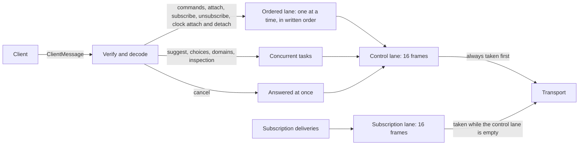
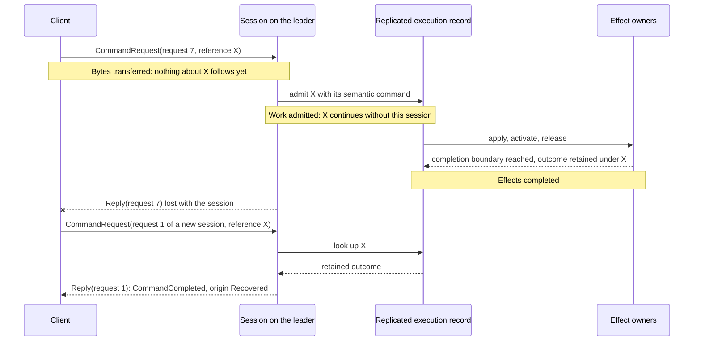
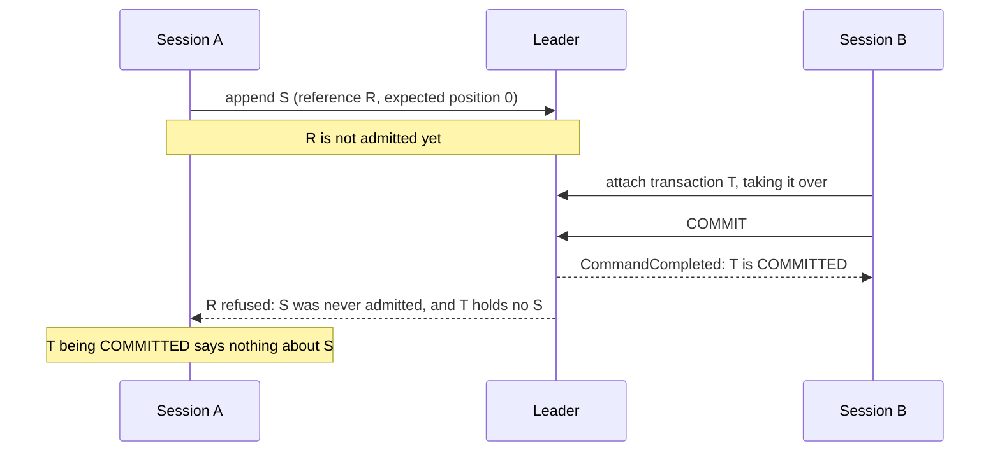
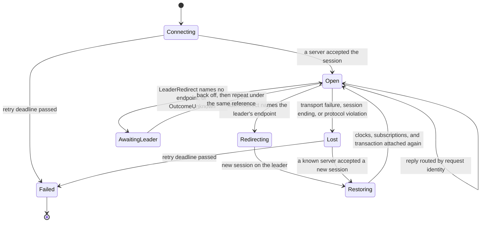
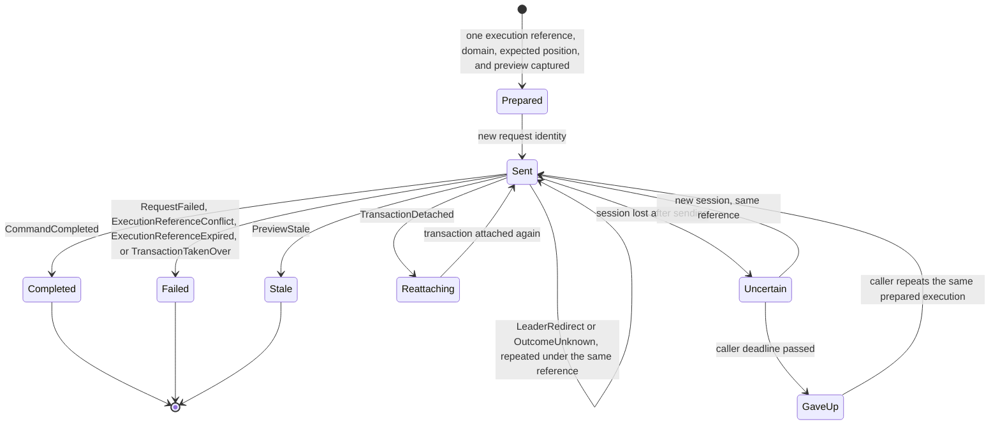
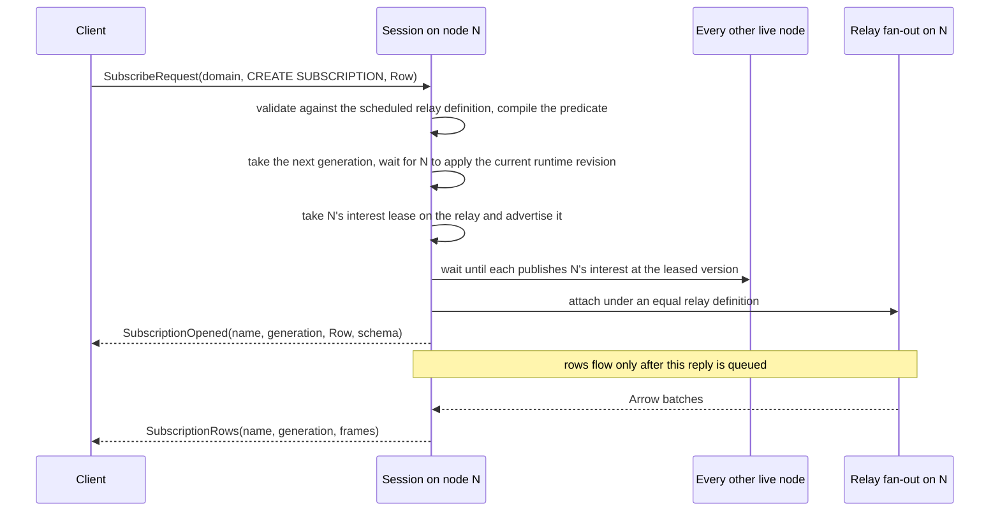

# Client Session Protocol

The client session protocol is the public boundary between a client and a Nervix node. It carries
NSPL commands and their outcomes, transaction attachment and inspection, completion and choice
lookups, domain selection and the observations that follow it, Row subscriptions, domain clock
attachments, and resource uploads. The CLI, the web console, the Rust client, every host of the
shared Rust binding, and independent implementations in other languages all speak it.

The protocol owns framing, verification, the session limits, request correlation, cancellation,
typed dispositions, the redirect to the leader, the lifecycle of a session, and delivery of the
unsolicited frames a session receives. The operation behind a request still owns what that request
means: the control plane decides what a command does and when it is complete, the transaction
planner decides what a transaction affects, the resource catalog decides when a version exists, and
the runtime decides what a relay delivers. A reply is therefore never more than the statement it
makes. Four facts stay distinct at this boundary, and a client that confuses them either repeats an
effect or reports one that did not happen:

- **Bytes transferred.** A frame reached the other side. Nothing about a request follows from it.
- **Work admitted.** The cluster durably recorded a command under its execution identity. The work
  continues whatever happens to the session that sent it.
- **Effects completed.** The command reached its completion boundary, and its terminal outcome is
  retained under that identity.
- **Waiter cancelled.** A client stopped waiting. Before admission nothing began; after admission
  the effect continues and can be recovered by its identity.

This chapter explains why the protocol behaves as it does. The [Client Implementation
Manual](./client-implementation-manual.md) states, as rules, what a client implementation must do.
Each links to the other instead of repeating it. [Command Completion](./command-completion.md) owns
the completion boundary and the retention of execution identities, [Control
Plane](./control-plane.md#replicated-nspl-transactions) owns the transaction lifecycle, [Transaction
Quiescence And Impact Inspection](./transaction-quiescence.md) owns the impact report, [Resource
Versions And Bindings](./resource-versions.md) owns the version lifecycle behind an upload, [Domain
Clock](./domain-clock.md) owns the clock a session can follow, [Errors And
Diagnostics](./errors-and-diagnostics.md) owns how typed failures become diagnostics, and [Shutdown
And Recovery](./shutdown.md) owns the phases of a node stop.

## A Boundary Separate From The Interconnect

Clients never speak the [Cluster Interconnect](./interconnect.md), and nodes never use the session
protocol to talk to each other. The two boundaries answer different questions and are built
differently:

| | Client session protocol | Cluster interconnect |
| --- | --- | --- |
| Peers | Untrusted clients acting for a registry user | Cluster nodes holding certificates from the cluster CA |
| Authentication | Basic credentials of a registry user on every call or upgrade | Mutual TLS 1.3 with one node identity URI per certificate |
| Listeners | The session gRPC listener and the console listener of every node | One interconnect listener per node |
| Encoding | FlatBuffers frames verified against one public schema | Bounded `rkyv` control archives and Arrow IPC relay bodies |
| Payload of a relay | Typed Row cells, positional against an announced schema | Arrow record batches |
| Identity of work | A request identity per session and a durable execution reference per command | Coordination identities, process epochs, and delivery identities |
| Evolution | One current schema; no version field, negotiation, or fallback | One current wire contract, fenced by a fingerprint at connection setup |

A follower does not forward a client's leader operation over the interconnect on the client's
behalf. It answers with a redirect that names the leader, and the client reconnects there, so every
leader operation arrives at the leader on a session the client itself holds. Subscriptions are the
one path that crosses both boundaries: the relay owner fans a batch out to the subscriber's node
over the interconnect, and that node encodes Row frames for its own sessions.

## Ownership By Layer

| Layer | Owner | What it owns |
| --- | --- | --- |
| Vocabulary | `nervix-models` | Execution references, domain, relay, subscription and user names, timestamps, the transaction status, preview identity and impact report, the resource description, and the observed domain clock. |
| Edges | The wire crate, `nervix-client-wire` | The FlatBuffers schema, frame verification and ownership, the session limits, the typed requests, replies, events, transfers and rows the schema describes, the display text of a row, and how frames travel in gRPC and WebSocket messages. It knows no registry, runtime, consensus, parser, Arrow, or client dispatch. |
| Edges | The session service in `nervix-server` | Authenticating a call, one session per transport connection, correlation, the ordered and concurrent lanes, cancellation against admission, typed rejections, reply encoding and transfer, the control and subscription lanes a session's frames wait in, unsolicited events, domain clock attachments, and the upload stream. |
| Edges | The Row encoder in `nervix-server` | Binding one subscription generation to the row schema it announces and writing selected Arrow rows into bounded frames. |
| Control plane | The command pipeline and transaction use cases | Durable execution identity, admission, exact recovery, domain mutation ownership, plan fencing, the transaction lifecycle, and the completion barrier. |
| Control plane | Session subscriptions | Creation and deletion, the generation each subscription opens with, its lifecycle, its filter and sampling, the delivery of one generation to its session, and the interest lease it holds on its relay. |
| Data plane | Relay subscription fan-out | The subscribers of one relay, the definition they were attached under, and ending every subscriber before a batch of another definition can reach it. |
| Edges | The Rust client, `nervix-client-core` | Connecting, TLS selection, the dispatcher that pairs replies with requests, execution identity across retries, redirect and reconnect, transaction binding and previews, desired subscriptions and their restoration, followed domain clocks, and uploads. |
| Edges | The shared binding, `nervix-client-ffi` | The C ABI through which C, C++, Python, JVM and Ruby hosts drive the Rust client's state machine, with borrowed frame access and bulk column copies. |
| Edges | The web console and the CLI | Consumers of the same protocol with bounded buffers of their own. The console speaks it over the WebSocket; the CLI uses the Rust client. |

The server is the composition root: it is the only crate that names the wire crate, the command
pipeline, and the runtime together. The wire crate names neither Arrow nor the parser, so an
implementation in another language needs only the schema. The Rust client additionally names the
language edge, which it uses to split a request into statements and to recognize the statements it
serves itself, such as `USE`; everything it knows about the cluster arrives over the protocol.

## Wire Format

### One Schema, Four Frame Roots

`crates/client-wire/schema/session.fbs` declares every shape of the public boundary, once. Four root
files name the table a frame is rooted at and the four-byte file identifier it carries:

| Root | Identifier | Direction | Carried by |
| --- | --- | --- | --- |
| `ClientMessage` | `NXCM` | Client to server | The gRPC `Exchange` stream and the console WebSocket |
| `ServerMessage` | `NXSM` | Server to client | The gRPC `Exchange` stream and the console WebSocket |
| `UploadMessage` | `NXUM` | Client to server | The gRPC `UploadResource` stream |
| `UploadReply` | `NXUR` | Server to client | The gRPC `UploadResource` stream, exactly once |

A frame is one finished FlatBuffer that carries its root's identifier and no size prefix. The
transport delimits frames, so a frame never has to describe its own length and a receiver never
parses a length that a peer chose.

A `ClientMessage` holds one request and the request identity that correlates its replies. A
`ServerMessage` holds either a `Reply` to one request or one unsolicited body: a server notice,
leadership, the domain list, the selected domain's snapshot and cluster summary, subscription rows
and the notices about them, a domain clock frame, or the ending of the session. An unsolicited body
carries no request identity and never completes a request.

### Verification Before Reading

A receiver verifies a frame once, when it takes ownership of the bytes and before it reads any
field. The frame must fit the session frame limit, hold at least a root offset and identifier, carry
the expected identifier, and pass FlatBuffers verification. Verification bounds every offset and
length, requires every `(required)` field, validates every string as UTF-8 with its terminator, and
limits nesting depth, the number of tables, and the apparent size of the traversal. The table and
traversal budgets scale with the frame being verified rather than with the limit: a frame of `n`
bytes may hold at most `n / 4` tables and may expand to at most eight times its own size, so a small
frame whose offsets alias one another cannot make a receiver walk far more than it sent.

Reading then applies the rules the verifier does not know. Every union is required, so the `NONE`
discriminant is never valid. A union discriminant or enum value the schema does not declare is
rejected, and so is an absent optional scalar that a comment requires, a zero where a comment
requires a non-zero value, an empty collection that must not be empty, a vector or string longer
than the session limits, a set that is not in canonical order, and a value the receiver's platform
cannot represent. A receiver never substitutes a default for a rejected value.

Scalars declared `= null` are optional: absent means not provided, and a present zero is a value.
The distinction carries meaning in several places. An append that expects position zero is not an
append that expects nothing, and a float cell holds its value as an optional scalar because a
defaulted field would lose the sign of a negative zero. Other scalars read as their declared
default, zero or false, when absent.

Verified bytes are immutable, and every value the wire crate hands out borrows from them, so no view
reads unverified bytes and no read verifies again. A verified frame pins the buffer it was received
in for as long as it, or any value that keeps it, is alive. The gRPC codec therefore copies a frame
smaller than 64 KiB out of the transport's read buffer, which grows to the largest message the
connection has carried, and takes a larger frame without a copy.

### Session Limits

One set of limits governs a session. The transports configure their message limits from it, so an
oversized message is refused before it is buffered, and every encoder checks each string and vector
against it before the FlatBuffers builder grows, so no Nervix encoder produces a frame that a
receiver holding the same limits rejects.

| Limit | Default | What it bounds |
| --- | ---: | --- |
| Frame | 4 MiB | One gRPC message or one WebSocket binary message. It matches the receive limit gRPC applies by default. |
| Transfer | 64 MiB | One reply reassembled from transfer parts. |
| Nesting depth | 64 | Nested tables in a frame, counting the root as the first level. The deepest structure of the schema that does not recurse, a node coverage in an execution step's affected topology inside an inspection reply, nests 13 tables; the rest is for nested list values and list field types. |
| Collection entries | 262,144 | Entries in one vector. |
| String | 64 MiB | Bytes in one string. |

Every Nervix server and client uses these defaults. The wire crate refuses a configuration whose
frame limit is outside 1 KiB to 256 MiB, whose transfer limit is below the frame limit, whose
nesting limit is outside 16 to 128, or whose string limit exceeds the transfer limit. The upper
bounds keep the verifier's budgets representable in the 32-bit address space of the browser build,
and the nesting bound caps the stack a hostile frame can make the verifier and the decoders use.

### Replies Larger Than One Frame

A reply may be larger than one frame; a rendered transaction report is the usual case. The server
encodes the complete reply once, from one read of its state, and cuts that single frame into
`TransferPart` replies. The parts of one reply share its request identity and its total size, arrive
in order with contiguous offsets starting at zero, and each carries a non-empty chunk. The client
joins them and verifies the result as a frame of its own, under the transfer limit, which must hold
a `Reply` to the same request whose body is not itself a transfer part.

A transferred reply is therefore exactly as trusted as one that fit a frame. It is never delivered
truncated, and it can never mix two reads of the server's state. Parts of one reply stay in order,
but other replies and unsolicited frames may arrive between them, which is why a client keeps one
reassembly per request identity. A reply above the transfer limit is not sent at all: the request
receives the typed rejection `ReplyTooLarge` instead. A reply that carries an impact report is
encoded on the bulk workers under the bulk memory class; when neither memory nor a worker is
available for it, the request receives `ServerBusy`, which is safe to repeat because such a reply
belongs to a request that changes nothing.

### One Current Form

The protocol has exactly one current form. Frames carry no version, a session negotiates nothing,
and neither side keeps a compatibility reader for an earlier schema. A changed shape is a
coordinated change of the server, the Rust client, the binding, the console, the conformance
clients, and the corpus in one commit. A peer built against another schema meets the ordinary
verification and reading rules: an undeclared request kind is rejected as `UnsupportedRequest`, an
undeclared enum value as `UnsupportedValue`, and a client rejects a server discriminant it does not
know rather than skipping it.

The conformance corpus in `crates/client-wire/conformance` pins the bytes the Rust encoder writes
for a set of requests, replies, and events chosen to reach what live traffic does not, such as
extreme values, nested lists, and every refusal of a domain clock attachment, together with
`corpus.report`, the reading of those bytes that every other reader must reproduce.
`just test-client-wire` checks that the checked-in bytes are exactly what the encoder writes, and
`just update-client-wire-corpus` regenerates them for review.

## Transports, Endpoints, And Authentication

Every live node runs both client listeners. Neither depends on leadership or placement, and both
close only when the node begins to stop.

### Native gRPC

Native clients reach the gRPC service `nervix.session.Session`, which serves two methods and answers
every other path with `UNIMPLEMENTED`:

| Method | Shape | Frames |
| --- | --- | --- |
| `/nervix.session.Session/Exchange` | Bidirectional stream | `ClientMessage` frames answered by `ServerMessage` frames. One call is one session. |
| `/nervix.session.Session/UploadResource` | Client stream | `UploadMessage` frames answered by exactly one `UploadReply` frame. One call is one upload. |

Each gRPC message holds exactly one frame, delimited by gRPC's own length prefix. The messages are
not protocol buffers, and no generated gRPC service code is involved: the codec hands the frame
bytes to the transport unchanged and verifies what it receives. The server speaks HTTP/2 only,
accepts no message compression, and sets gRPC's message limits to the frame limit, so a message
above it is refused before it is buffered.

The listener serves plaintext HTTP/2 on `--addr` (`NERVIX_ADDR`, default `127.0.0.1:47391`) and
advertises `--grpc-advertise-addr` (`NERVIX_GRPC_ADVERTISE_ADDR`), or the listen address when that
is unset. `--grpc-mode https` (`NERVIX_GRPC_MODE`) serves the listener over TLS on
`--grpc-https-listen-addr` instead and advertises `--grpc-https-advertise-addr`. That mode presents
the development certificate that `scripts/generate_dev_tls.sh` writes under `tls/dev` in the source
tree the server was built from; no option selects another certificate, and the Kubernetes deployment
runs the listener in plaintext mode.

### Console WebSocket

The web console reaches the same session engine over a WebSocket, `GET /console/ws` on the console
listener: `--web-console-listen-addr` (`NERVIX_WEB_CONSOLE_LISTEN_ADDR`, default `0.0.0.0:47420`),
and optionally a TLS listener, `--web-console-https-listen-addr` with `--web-console-tls-cert` and
`--web-console-tls-key`. Each binary message holds exactly one frame in either direction and nothing
else: no size prefix, never two frames, never part of one. Ping, pong, and close messages belong to
the WebSocket connection and never carry a frame.

The console session is served only by the leader. A console session on any other node is ended at
once with a `SessionEnding` whose reason is a `LeaderRedirect` naming the leader, and the console
reconnects to the leader's advertised console endpoint. A console session also ends this way when
its node stops leading, which the node checks every 250 milliseconds.

The console WebSocket carries the `Exchange` session only. It has no upload stream: the console
uploads a resource through its own HTTP path, `/console/resources/upload`, where the leader builds
the archive from the files it receives, as [Resource Versions And
Bindings](./resource-versions.md#assignment) describes.

### Authentication

Both transports authenticate a registry user with Basic credentials before any frame is read. A gRPC
call presents `authorization: Basic <base64(user:password)>` metadata, on every call, and a call
that fails authentication ends with `UNAUTHENTICATED`. The console upgrade presents the same
credentials in an `Authorization: Basic` header or, because a browser cannot set headers on a
WebSocket, as the `auth` query parameter; a failure answers `401` with a `Basic` challenge and never
upgrades. `GET /console/auth` checks credentials without opening a session. Passwords are verified
against Argon2 hashes held in consensus. After a failed attempt for a user, that user's later
attempts are paced to ten per second until one succeeds.

Authentication establishes who owns what a session does: its transaction binding, its execution
references, its subscriptions, and its uploads. It is the only access control. Every authenticated
user may run every command in every domain; ownership decides only who may attach and inspect a
transaction, and scopes execution references and upload identities to their user.

### Transport Failures

A failure of the framing ends the connection, because nothing after it can be trusted. Everything a
well-formed frame can get wrong is answered inside the session, as a typed reply to the request it
names.

| Failure | Native gRPC | Console WebSocket |
| --- | --- | --- |
| Credentials missing or wrong | `UNAUTHENTICATED` | `401`, no upgrade |
| Message above the frame limit | `OUT_OF_RANGE`, refused before buffering | Close `1009` |
| Message that is not a valid frame | `INTERNAL` | Close `1007` |
| Text message | — | Close `1003` |
| Frame without a valid request identity | `SessionEnding` with `ProtocolViolated`, then the end of the stream | The same `SessionEnding`, then a normal close |
| Session ended by the server | The end of the stream, with status `OK` | A normal close |

## Requests, Lanes, And Cancellation

### Request Identity Versus Execution Identity

Every `ClientMessage` carries a request identity: a non-zero 64-bit value the client chooses and
never reuses within the session. Every reply to that request is a `Reply` naming the same identity,
and a request receives exactly one terminal reply, delivered whole or as transfer parts. The
identity exists only to pair replies with the request waiting for them. It is scoped to one session,
which is one gRPC `Exchange` call or one WebSocket connection, and a new session starts over.

A command's execution reference is a different identity with a different purpose. It names the
command's effects durably, across retries, redirects, reconnects, leader changes, and full restarts,
and it outlives every session that carries it. A retry after a lost reply is a new request, with a
new request identity, that repeats the same execution reference. Confusing the two breaks both
guarantees: repeating a request identity cannot recover an effect, and minting a new execution
reference for a retry can apply an effect twice.

### Two Lanes

A session serves each request on one of two lanes:

- **The ordered lane** serves the requests that change the session or may change the cluster:
  commands, transaction attach, subscribe and unsubscribe, and domain clock attach and detach. They
  run one at a time in the order the client wrote them. A mutating command never overtakes the
  command written before it, and a subscription never opens before the command that created its
  relay has completed. Every command runs on this lane, including a `SHOW` or `DESCRIBE`, so within
  one session a read command waits behind a command that is waiting for its completion boundary.
- **The concurrent lane** serves the requests that only read the session: completion suggestions,
  choice lookups, listing and selecting domains, and transaction inspection. Each runs as its own
  task beside the ordered lane, from the view of the session that the ordered lane last published,
  so a long command never delays a completion, an inspection, or a domain request. Their replies can
  arrive in any order. Selecting a domain changes only which domain's observations the session
  receives.

A cancellation is on neither lane: it is answered as soon as it arrives. A session admits at most 64
requests in flight, counting both lanes. A request beyond that is refused with
`TooManyRequestsInFlight` rather than queued, which also bounds the requests waiting for the ordered
lane; nothing about the refused request was admitted. A request identity that is already in flight
is refused with `DuplicateRequestId`, and that refusal necessarily names the same identity as the
request still in flight.

Choice lookups on the concurrent lane return typed values for structured client controls. A domain
dependency selects internal schemas, branches, relays, VHOSTs, signaling protocols,
JSON/CBOR/AVRO wire schemas, or resource catalogs; a domain and relay reference select relay
fields; a domain and resource reference select completed resource versions. Wire-schema targets
have separate discriminants, so a codec cannot
mistake a JSON wire schema for a CBOR or AVRO schema with the same name. A completed-version value
is either an explicit number or `LATEST`, not a label to parse. Resource catalogs include resources
staged earlier in the attached transaction, while version choices include completed uploads only.
The cursor binds the selected candidate set and its definitions; a changed context returns
`StaleContext` instead of continuing an earlier page. [Sessions](./sessions.md#structured-choices)
owns the complete lookup contract and the server's transaction-aware resolution.

### What A Session Sends First

A session queues its frames on two bounded outbound lanes. Replies, transfer parts, session events,
domain clock frames, and the session ending wait on the control lane, which holds 16 frames.
Subscription rows and the notices about them wait on the subscription lane, which holds 16 frames
shared by every subscription of the session. The transport always takes a queued control frame first
and takes subscription frames only while the control lane is empty. A reply, including the reply to
the unsubscribe that stops a subscription, therefore never waits behind rows the client has not
read. The lanes never reorder what the transport already took: a frame handed to the transport stays
ahead of every frame queued after it.
An attached clock's tick holds one replaceable control slot per domain. Its delivery task can
overwrite the slot while the lane is full or after queueing it, until the transport takes it; a
changed clock state withdraws a superseded tick still in that slot.

Because every frame is at most the frame limit, the two lanes bound what a session holds for a
client that reads slowly. Backpressure reaches the client's requests too: a rejection or a
cancellation outcome waits for room on the control lane before the session reads the next request,
so a client that reads nothing eventually stops being read. The server has no idle or slow-client
timeout; such a session ends only with its transport.

### Cancellation

`CancelRequest` names the request identity it targets. The server answers with `CancelOutcome`:
`Requested` when the target is in flight, or `NotInFlight` when it is not. The target still receives
its own terminal reply: `RequestCancelled`, or its ordinary reply if it finished before the
cancellation took hold. The two replies can arrive in either order.

Whether a cancellation stops an effect depends on one atomic decision per request. A request admits
itself immediately before its first effect, and a cancellation that arrives first decides the
request cancelled for good. `RequestCancelled` reports which came first:

- **`BeforeAdmission`.** The request was not admitted and never will be. It has no effect.
- **`AfterAdmission`.** The request was admitted. Cancelling ends only the wait for it; its effect
  continues and is recovered by its execution reference, exactly as after a lost reply.

A command admits itself just before its durable admission or first effect. Transaction attach,
subscribe, unsubscribe, and clock requests admit themselves when the ordered lane starts serving
them, and a concurrent request never admits itself, so cancelling one always stops it. A command
cancelled after admission keeps the ordered lane until its work finishes, and an attach cancelled
after admission still binds the transaction. A cancellation never rolls back admitted work: it is
how a client stops waiting, not how it undoes a command, and undoing is a new command.

### Rejections

A request that is not served receives `RequestRejected` with a typed reason, the offending field
when there is one, and a message for display. The session keeps serving after any rejection.

| Rejection | Meaning |
| --- | --- |
| `InvalidRequest` | A field is missing, malformed, or out of range, such as an execution reference that is not one or a completion cursor inside a character. |
| `UnsupportedRequest` | The request kind is not one the server's schema declares. |
| `UnsupportedValue` | An enum value the server does not declare, including a subscription type it does not implement. |
| `DuplicateRequestId` | The request identity is already in flight in this session. |
| `TooManyRequestsInFlight` | The session already has 64 requests in flight. Nothing was admitted. |
| `ReplyTooLarge` | The complete reply cannot be encoded within the session limits, above all because it exceeds the transfer limit. |
| `ServerBusy` | The server had no memory or worker left to prepare the reply of an inspection. |

The first five refuse a request before anything about it runs. `ReplyTooLarge` and `ServerBusy`
replace a reply that could not be prepared. For a read, repeating the request reads again. For a
command, the missing reply says nothing about the command's effect, which is recovered by its
execution reference like any other lost reply.

## Command Dispositions

A command's reply is a `CommandOutcome`: the execution reference it answers, whether the outcome was
produced now or recovered from the durable record of an earlier attempt, one typed disposition, a
message for display, diagnostics with optional source spans, and, for a request of several
statements, the outcome of each statement in written order. It also carries the transaction this
session is bound to while the command was served, the operation admission when the command accepted
one operation into the transaction, and the typed inspection, WASM state, or resource description a
describing statement produced.

The disposition is the one field a client decides from; the message is for a person. Each
disposition belongs to one phase of the command and makes one statement about its effect:

| Disposition | Phase | What it establishes | What a client does |
| --- | --- | --- | --- |
| `CommandCompleted` | Finalization | The command reached its completion boundary. `already_existed` says a creating statement found its entity present and changed nothing. | Report success. |
| `RequestFailed` | Admission, execution, or finalization | The command failed definitively. Nothing further will happen under its reference. | Report the failure with its diagnostics. |
| `LeaderRedirect` | Before admission | The serving node is not the leader, and nothing was admitted there. The leader's endpoints are absent while no leader is known or discovery cannot reach it. | Reconnect to the leader, or wait for one, and repeat the command under the same reference. |
| `TransactionDetached` | Before admission | The leader holds no binding for the session's transaction, typically after a reconnect or leader change. | Attach the transaction again and repeat the command under the same reference. |
| `TransactionTakenOver` | Before admission | Another session attached this session's transaction, and nothing was admitted for this request. | Report it. Attaching the transaction again would take it back, which is the user's decision rather than a retry. |
| `OutcomeUnknown` | Admission, execution, or finalization | The command may have been admitted and its outcome is not known yet: leadership moved while it was admitted or applied (`LeadershipLost`), it is still applying (`StillApplying`), or it finished but its outcome is not yet authoritative on every live node (`NotYetAuthoritative`). | Repeat the command under the same reference until the outcome is known. Never report success or failure from this disposition. |
| `ExecutionReferenceConflict` | Before admission | The reference already identifies a different command, which differs in its owner, domain, transaction position, or content. Nothing was admitted for this request. | Treat it as a defect in the client's use of references. |
| `ExecutionReferenceExpired` | Before admission | The reference aged out of execution history. Its outcome can no longer be recovered, and the command was not executed again. | Report that the outcome is unknown; issuing the work again is a new command. |
| `PreviewStale` | Commit admission | The commit named a preview that no longer describes the transaction. Nothing was applied, and the transaction stays open. The reply names both the expected and the current preview. | Inspect the transaction again and decide whether to commit against the current preview. |

`OutcomeOrigin` distinguishes an outcome produced by this request, `Executed`, from one read back
from the durable record of an earlier attempt with the same reference, `Recovered`. A recovered
failure is the same failure: its message and diagnostics are the ones retained when it happened.

A request of several statements reports each statement's own disposition, which is one of
`CommandCompleted`, `RequestFailed`, or `LeaderRedirect`, in written order, and the command's
disposition is that of the statement that ended it. Several statements in one request always belong
to a transaction: the request begins one and appends to it, possibly committing it too, or appends
several statements to the transaction the session holds. Outside a transaction a request carries one
statement. `DESCRIBE TRANSACTION` and `SHOW TRANSACTIONS` read beside the transaction and are always
sent alone.

The leader's reference check and replicated admission return the same typed dispositions. A
reference the history no longer holds returns `ExecutionReferenceExpired`; a conflicting request
detected during replicated admission returns `ExecutionReferenceConflict` with the conflict kind.
Neither refusal admits the request. [Exact Recovery](#exact-recovery) explains the retry fence.

### Four Boundaries

The dispositions exist because a client can lose sight of a command at four different points, and
each point means something different:

A cancelled waiter is the fourth point: a `CancelRequest` that wins before admission leaves no
record of the reference at all, and one that arrives after admission ends only the wait. In every
case the same reference, sent again, finds the truth: nothing recorded admits the command now, an
applying record joins it, and a terminal record returns it.

## Exact Recovery

A client recovers a command it lost sight of by sending the same command again under the same
execution reference. The protocol makes that safe by keeping one durable record per reference and
answering every repetition from it. [Command
Completion](./command-completion.md#lifecycle-and-ownership) owns the record's lifecycle, its
retention, and the retry fence; this section describes what a client can rely on.

### What Is Recorded

Every persistent command is recorded under its reference before its first effect: model creation,
alteration, and removal, `REBIND RESOURCE`, `CREATE DOMAIN`, `ALTER DOMAIN`, `CREATE USER`,
`CREATE RESOURCE`, `START`, `STOP`, `DROP NODE`, `CORDON NODE`, `UNCORDON NODE`, `DRAIN NODE`,
`RELOCATE`, and `RESET WASM PROCESSOR ... STATE`. So is every transaction request: a request that
begins, commits, or reverts a transaction, one sent while the session is bound to a transaction, and
one that carries an expected transaction position. An ordinary request carries at most one
persistent statement; several statements in one request always form a transaction request.

Reads record nothing. `SHOW`, `DESCRIBE`, `LOOKUP`, `DESCRIBE TRANSACTION`, and `SHOW TRANSACTIONS`
accept any well-formed reference, and repeating one reads again. Uploads have an identity of their
own and are covered in [Resource Uploads](#resource-uploads).

The record binds the reference to one semantic request: the authenticated owner, the request's
domain, the expected transaction position, and a digest of what the request asks for. For an
ordinary command the digest covers the parsed statement, so a retry that differs only in whitespace
or keyword case is the same request. For a transaction request it covers the exact request text. A
new reference is admitted only when it is a UUIDv7 whose creation time lies after the cluster's
retry fence and no more than five minutes ahead of the leader's clock; a reference that fails either
check is refused before any effect.

### How A Repetition Is Answered

The leader serializes the requests that carry one reference, then consults its record:

- **No record.** The request is admitted as new, subject to the checks above.
- **Applying.** The request joins the admitted execution and waits for it. After a leader change,
  the new leader resumes every applying record on its own in its next reconciliation pass, which
  runs every 250 milliseconds, so the work completes whether or not anyone repeats it.
- **Finished.** The request returns the retained outcome once that outcome is authoritative on every
  live node. If that wait fails, the reply is `OutcomeUnknown` with cause `NotYetAuthoritative`, and
  a later repetition returns the outcome.

The first reply is itself rebuilt from the durable record, so the reply to the original attempt and
the reply to a repetition are identical except for their origin. The record keeps the disposition,
message, diagnostics, per-statement outcomes, transaction status, and operation admission. It does
not keep the typed inspection, WASM state, or resource description that a describing statement
returns, because those statements are reads and record nothing.

The same rule covers every transaction control:

- **`BEGIN`.** The new transaction's identity is fixed when the request is admitted. Repeating a
  `BEGIN` whose reply was lost returns the same transaction and binds the repeating session to it,
  instead of opening a second one.
- **Appends.** Each statement of a request is recorded under an identity derived from the request's
  reference and the statement's position in it. Repeating an append with the same reference,
  position, and text returns the admission recorded for it, without preflighting it again or
  renewing the transaction's activity; the transaction is not appended to twice.
- **`COMMIT`.** Repeating a commit joins the committing execution or returns its recorded outcome.
- **`REVERT`.** Repeating a revert of a transaction its owner already reverted succeeds again.
- **Multi-statement requests.** A request of several statements is one execution with one outcome
  per statement, and a repetition after a leader change or a full restart returns those outcomes
  without repeating any effect.

### Conflicting Reuse

A reference names one request forever. Repeating it with a different owner, domain, expected
position, or content, checked in that order, is refused as `ExecutionReferenceConflict` naming what
differed, and nothing about the new request is admitted. A session bound to a transaction other than
the one the reference was recorded against is refused as a position conflict. When two leaders race
and the replicated state machine detects the conflict after the leader's local check, the refusal
carries the same typed `ExecutionReferenceConflict` and kind.

### Bounded History And Expired Identities

The history is bounded by count, 65,536 records by default, counting applying records, finished
records, and tombstones together. When it is full a new reference is refused with an explicit
capacity failure, and admitted work is never evicted to make room. A finished record is retained for
the retry validity after the command finished, 15 minutes by default, and then reclaimed; an
applying record is never reclaimed. Reclamation advances a durable, monotonic retry fence first, so
a reclaimed reference, repeated at any later time, fails the admission check and never starts its
effect again. The refusal is `ExecutionReferenceExpired` whether the history still holds a
tombstone or only the retry fence. The outcome of the original attempt can no longer be recovered.

### Why Aggregate State Proves Nothing

A client that lost the reply to an append, or to a commit, might be tempted to look at the
transaction instead: if it is `COMMITTED` and its operation count moved, the append must have been
in it. That inference is false. Another session can attach the transaction, commit it without the
outstanding append, and leave the same counts. Finishing a transaction clears its queued statements,
so an append that was never admitted cannot match anything afterwards, and the only witness of what
happened to a particular request is the record of its own reference. A client therefore reports an
append or a commit only from the outcome recorded for that exact request.

## Domain Mutation Ownership And Plan Fencing

Exact recovery answers "did this command happen"; ownership and fencing answer "could anything else
have changed the domain under it". Both are control-plane contracts, and a client observes them only
through the outcomes they produce.

### One Owner Per Domain

A command that changes a domain acquires the domain's mutation lease when it is admitted, and a
transaction acquires it when its commit is admitted. The lease is replicated state. It names its
owner, a command's execution reference or a transaction's identity, and carries a recovery fence:
the log position of the entry that acquired it. Every write to the domain's replicated state, its
definition, schedule, and lifecycle, must present exactly the lease currently held. A write that
presents none while a lease is held, a different one, or one from a superseded acquisition is
refused, and so are automatic schedule changes and clock-authority updates while any lease is held.
The command or transaction releases the lease when it finishes, whatever its outcome.

Because the lease lives in replicated state rather than in a leader's memory, it survives leadership
changes and restarts. A new leader resumes the applying record, or the committing transaction, that
holds the lease and continues under it; a deposed leader can no longer propose, and a stale
acquisition fails on its fence. A second mutation of the same domain is therefore refused at once,
with a failure that names the owner, rather than queued behind the first, while mutations of other
domains proceed in parallel. A client that receives such a refusal decides whether to send the
command again once the owner has finished.

### Plans Apply Only To What They Planned

A command or commit is planned from one captured set of inputs: the domain's state, its resources
and completed versions, its schedule, and cluster membership, voters, and cordons. The replicated
state machine applies the plan only if those inputs are still equal to what was captured, and
refuses it otherwise, naming the input that changed. Eligibility that lives outside consensus,
liveness and incarnations, is checked again by the leader immediately before it publishes. A plan
can therefore never publish a candidate derived from one schedule over a newer one: a `RELOCATE`
planned before a schedule revision fails rather than overwrite that revision.

What happens after such a refusal depends on who owns the plan. An ordinary command applies through
a frozen internal attempt; when its captured inputs change before its effect is recorded, it keeps
the failed attempt and starts a new attempt derived from the current revision under the same
execution reference, so its caller sees one outcome. An explicit transaction freezes its plan when
`COMMIT` is admitted: stale inputs at admission leave the transaction `OPEN`, and a step whose
inputs changed after admission fails the transaction with the applied prefix preserved, rather than
being replanned against state the client never reviewed. [Transaction Quiescence And Impact
Inspection](./transaction-quiescence.md#coherent-preview-and-guarded-commit) defines the frozen plan
and the preview it is checked against.

## Transactions Over The Protocol

A transaction is replicated control-plane state; its binding to a session is not. [Control
Plane](./control-plane.md#replicated-nspl-transactions) owns the lifecycle, the eligible statements,
and the limits, and [Transaction Quiescence And Impact Inspection](./transaction-quiescence.md) owns
planning, previews, and reports. This section describes how a transaction travels over the protocol.

**Opening.** `BEGIN` is an ordinary `CommandRequest` for the selected domain, which must already
exist, and every later request of the transaction names that domain. The outcome's
`TransactionStatus` carries the transaction's identity, domain, state, and accepted and applied
operation counts; the identity is the durable handle a client keeps. One request may also begin the
transaction, append to it, and commit it at once.

**Appending.** Each append carries the position it expects: the number of operations the transaction
had accepted, as the client last learned it. A statement accepted into the transaction returns
`TransactionOperationAdmission` with its one-based operation number and the whole-transaction
preview identity after it. An append that is refused leaves the transaction and its position
unchanged, so the client corrects it and appends again. Other sessions keep seeing committed
configuration until the commit.

**Binding, attach, and takeover.** The session that begins a transaction is bound to it. The binding
is soft state in the leader's memory: it routes commands, and it is gone after a leader change or
when the session ends. A session binds an existing transaction with `AttachTransactionRequest`,
which the leader grants only to the transaction's owner; the reply is `TransactionAttached` with the
current status, `TransactionAlreadyFinished` with the final status and aggregate outcome while its
tombstone is retained, or a failure for an identity that is unknown or retained no longer. A leader
that holds no binding for the session's transaction answers the session's next transaction request
with `TransactionDetached`, and the client attaches again and repeats the request under the same
reference. Attaching from a second session takes the binding over, and the displaced session's next
transaction request receives `TransactionTakenOver` before anything is admitted. While a session
holds a transaction, the server refuses the requests that belong to the session rather than the
transaction, subscribe and unsubscribe and domain clock attach and detach, and the Rust client and
the console refuse `USE` and `LIST DOMAINS` themselves.

**Committing.** `COMMIT` may name the preview identity the client reviewed: the transaction
identity, its accepted position, and the fingerprint of its planning basis, taken from the last
append's admission or from inspecting the attached transaction. If that preview no longer describes
the transaction, the commit is refused with `PreviewStale` naming the expected and the current
identity, nothing applies, and the transaction stays open and bound. A preview fences only a commit
of a transaction that the same request did not itself begin or append to, because such a request has
already moved the transaction past what the client reviewed. A commit that is admitted runs its
frozen plan step by step; each step is atomic, and a failed step leaves the applied prefix in place
rather than rolling back the transaction. A commit's outcome arrives only when the final step is
usable on every live node, and a client waits through `COMMITTING` for the outcome recorded under
the commit's own reference.

**Inactivity and retention.** An `OPEN` transaction expires once it has been inactive for its idle
timeout, 15 minutes by default, whether or not a session is bound to it. Attaching it, appending to
it, and a commit's admission or failure renew that deadline; an open connection, a bound session,
and reads of the transaction do not. The deadline is a durable UTC instant, so time the cluster
spends stopped counts toward it, and an overdue transaction expires once the cluster runs again. A
`COMMITTING` transaction never expires. A finished transaction remains as a tombstone, 15 minutes by
default, during which attach and inspection report its outcome; afterwards its identity is unknown.

**Ending a session.** A session that ends uncleanly, through a transport failure, a node stop, or
the server ending it, only releases its binding; the transaction stays open for attach until it
expires. A session that the client closes cleanly, with no request in flight, reverts the open
transaction it is bound to on the leader, which is how an interactive client that exits discards its
unfinished work. Neither ending affects admitted work: an append already admitted stays admitted,
and a `COMMITTING` transaction continues without its client.

**Read consistency.** A read, such as `SHOW`, `DESCRIBE`, or `LOOKUP`, is served by the node the
session is on from its locally applied replicated state; it is not a linearizable read. Once a
command completes, its effect is applied on every live node, so a read issued afterwards through any
node observes it. Completion for a session bound to a transaction resolves against the committed
configuration with the session's own queued statements applied, while every other session sees
committed configuration alone. Inspecting a transaction reads it without changing its binding,
domain, activity, or queue position.

## Leader Discovery, Redirect, And Reconnect

### What A Session Is Told

Every session receives `LeadershipObserved` first and `DomainsObserved` second, and each again
whenever it changes; the serving node checks leadership every 250 milliseconds. Leadership is one of
three states: the serving node leads, a remote node leads, with whichever of its endpoints discovery
has established, or no leader is known. Selecting a domain with `SelectDomainRequest` opts the
session into that domain's observations as well: a `ClusterObserved` summary and a
`DomainSnapshotObserved` carrying the domain's live graph as a JSON document and its declared
entities, at once and then every 500 milliseconds. A session that selects no domain receives
neither. Server notices report runtime and control-plane errors and cluster events as text for
display. A session that falls behind the node's notice bus skips the notices it missed; the node
logs how many.

There is no separate discovery request. A client learns where the leader is from these observations
and from the redirects in its replies. Endpoints come from the cluster's discovery, which carries
each node's advertised gRPC and console URLs. A redirect never guesses: while no leader is known it
names none, and while discovery has not established a leader's endpoint the redirect names the
leader without it.

### Which Requests Need The Leader

The node a session is on serves completion and choice lookups, listing and selecting domains,
subscriptions, domain clock attachments, and the reads its locally applied state can answer:
`SHOW CLUSTER STATUS`, `SHOW TRANSACTIONS`, `SHOW CREATE`, `SHOW UDFS`, `SHOW PLACEMENTS`,
`SHOW RELAY MATERIALIZED STATE`, `LOOKUP`, and the `DESCRIBE` statements of domains, resources,
endpoints, lookups, placements, UDFs, relocations, relays, ingestors, junctions, deduplicators,
reingestors, correlators, reorderers, window processors, WASM processors, and emitters. Every other
statement needs the leader, and so do every transaction request, transaction attach and inspection,
and uploads. A follower answers them with `LeaderRedirect` before anything is admitted, and the
client reconnects to the leader and repeats the request. Because persistent commands and
transactions only ever run on the leader, a follower holds no execution state a client could lose.

The console session is the exception: the web console is served only by the leader. A console
session on any other node, and a console session whose node stops leading, is ended with a
`SessionEnding` that names the leader, and the console reconnects to the leader's console endpoint.

### Deadlines And Cancellation

The server imposes no deadline on a request's wait and no idle timeout on a session, and neither
transport sends keepalives; a connection is judged dead by its transport or by the client's own
deadline. A client deadline bounds only the client's wait. It never cancels admitted work, and
[Command Completion](./command-completion.md#disconnects-deadlines-and-recovery) owns what the work
does meanwhile. A client that gives up on an uncertain command keeps its execution reference and can
recover the outcome later, within the retry validity.

The Rust client bounds each connection attempt by `connect_timeout` (10 seconds by default), each
request by `request_timeout` (120 seconds), and each public call, including all of its retries and
redirects, by `retry_timeout` (120 seconds). Without keepalives, a request that outlives
`request_timeout` is the client's only sign that its session may be dead, so it ends every request
still waiting on that session, and the next request opens a new one. While an election converges it
retries with a delay that starts at 100 milliseconds and doubles up to one second. When a call's
deadline passes before a command's outcome is known, and the command may have been admitted, the
call fails as uncertain and names the execution reference. The Rust client, the CLI, and the console
never send `CancelRequest`: a caller that stops waiting only drops its waiter, and the reply, when
it comes, is discarded.

For native Rust sessions, the client loads a Hickory resolver during setup or uses one its owner
provided. It resolves the hostname of each selected server, seed, and redirect on a new connection
attempt, preserving the advertised URI's authority and TLS name. Tonic's connection timeout spans
DNS, address attempts, and TLS. A lookup takes at most 30 seconds when no shorter connection
deadline cancels it. Failed resolution is a connection failure under the same bounded reconnect
policy. Server-internal sessions to a peer's session service reuse the node's loaded resolver.
Browser WebSocket and fetch resolution remains owned by the browser.

### Reconnecting A Session

A lost session takes everything session-scoped with it. The Rust client rebuilds it in a fixed
order. Domain clock attachments and subscriptions come before the transaction, because a session
that holds a transaction refuses both, and the transaction comes before any command that belongs to
it:

1. It opens a new session against the servers it knows: its configured seeds, then at most 32
   endpoints it learned from redirects and leadership observations, oldest first, then the server it
   was using, with the same backoff as an election.
2. It attaches every domain clock it followed.
3. It publishes the new session to its callers and ends the old one, reporting an interruption for
   every subscription and clock the old session held.
4. It opens again every subscription the server had acknowledged, each as a new generation.
5. It attaches its transaction before it repeats any command that belongs to it.

Only then does it repeat outstanding commands, each under its original execution reference and, for
an append, its original expected position.

A command moves through its own states within that session state machine:

## Row Subscriptions

A subscription is a read-only view of one relay, owned by the session that opened it. Its rows
travel from the relay owner to the subscriber's node as Arrow batches, and from there to the client
as typed Row frames. [Sessions](./sessions.md#subscription-lifecycle) owns the NSPL form and what a
user sees; this section explains the protocol and data path behind it.

### Opening A Subscription

`SubscribeRequest` names the domain, carries exactly one `CREATE SUBSCRIPTION` statement, and
selects the subscription type. The statement carries the subscription's name, relay, `BLOCKING` or
`DROPPING` delivery, sample rate, and `WHERE` predicate; the server parses it once and compiles the
predicate Model directly. The type is required, and `Row`, the only type, must be named: a request
that omits it is refused rather than defaulted, and a value the server does not support is refused
as `UnsupportedValue` rather than replaced by another encoding. A subscription's type never changes.

Opening runs on the session's ordered lane:

A refusal at any step releases everything taken before it, and the name stays free. The generation
is a per-session counter that starts at 1, so a handle, the name together with its generation, is
unique within its session only; a generation taken by a request that then failed is simply skipped.
The visibility wait is what makes the reply meaningful: by the time a client reads
`SubscriptionOpened`, every live node already routes the relay's batches to the subscriber's node,
and an advertisement left over from before an earlier withdrawal cannot satisfy it.

The reply carries the schema and precedes every row. Delivery is held back until the reply is queued
on the control lane, which the transport always serves first. When the reply cannot be queued,
because the request was cancelled, the session ended, or the reply did not fit the session limits,
the generation is abandoned before it delivers anything, so a client never receives rows it has no
schema for. Batches the relay published during the opening are not delivered.

### Encoding From Arrow Columns

The subscriber's node encodes Row frames directly from the Arrow batch it received. It validates the
batch against the announced definition once, then writes each selected cell from its typed column
into the FlatBuffers builder; no JSON object, map of fields, or intermediate row is built. Every
NSPL type has exactly one cell type, `DATETIME` travels as signed nanoseconds, floats keep their
exact bits, and `BYTES` travels as raw octets. A sensitive field is written as `RedactedCell` in
every row, whether or not it held a value, so the frame reveals neither the value nor its nullness.
A null in a nullable field is `NullCell`; a list element is never null or redacted.

A frame holds rows of one concrete branch. Its branch key is written once per frame, with sensitive
key fields redacted, and is absent exactly when the relay is unbranched. The encoder groups the
selected rows of a relay batch into runs of adjacent rows with the same branch key, so interleaved
branches produce one frame per run.

A frame holds at most 256 rows and at most the frame limit in bytes. When a row does not fit the
frame being built, that frame is finished and the row starts the next one. A row that does not fit
an empty frame cannot be delivered at all; the encoder then reports every selected row of that relay
batch as skipped with cause `EncodingFailed`, and the subscription stays open. Each subscription
encodes its own frames, so two subscriptions to one relay never share a frame.

### Selection, Sampling, And Delivery

Each row passes the subscription's predicate, then its sampling, then its delivery mode:

- **Predicate.** The `WHERE` expression is an ordinary `BOOL` expression over the relay record. A
  row is selected only where it is true, so a null result does not select it and is not reported.
  When a predicate is present, each relay batch takes one domain-time snapshot on the subscriber's
  node, so every row and every volatile function of the batch sees the same instant. Rows whose
  evaluation fails are counted and reported once per batch as skipped with cause `FilterFailed`, and
  a batch whose domain time cannot be read is skipped whole with cause `DomainTimeUnavailable`.
- **Sampling.** `BATCH SAMPLE RATE` is applied to each selected row after the predicate, with a
  pseudo-random draw shared by every subscription on the node. A rate of 1 passes every row and a
  rate of 0 passes none.
- **`BLOCKING`.** A frame waits for room on the session's subscription lane. While it waits, the
  subscription stops taking batches, and the relay's fan-out waits for it: on the relay owner that
  holds back the relay itself, including its runtime consumers, and on another node it holds back
  that node's ordered delivery from the owner, which waits within its relay admission bounds.
- **`DROPPING`.** A frame that finds the lane full is discarded, and its rows are counted. Before
  the subscription's next rows, the session sends `SubscriptionDeliveryLost` with the count, if that
  report itself finds room; otherwise the next rows are discarded too and counted with the rest.

The subscription lane holds 16 frames shared by every subscription of the session. One slow
`BLOCKING` subscription therefore also holds back the session's other `BLOCKING` subscriptions and
makes its `DROPPING` ones drop, while replies and session events keep flowing on the control lane.

### Fan-Out Across Nodes

The relay owner is the only fan-out source. It delivers each admitted batch to its local
subscriptions, to every node that advertises interest in the relay, and to its runtime consumers. It
encodes one Arrow body for the whole subscription fan-out and shares it across nodes; a node that
also hosts a runtime consumer of the relay receives the batch once, for that consumer, and its
subscriptions piggyback on that delivery. Each batch reaches a subscription at most once. Delivery
to a node is ordered per branch; batches of different branches may arrive in a different order than
the owner published them. The subscription copy carries no acknowledgements, so a subscriber never
holds back a source's acknowledgement beyond the time its `BLOCKING` backpressure takes.

### Generations, Endings, And Cleanup

Every frame about a subscription carries its handle. A name reused after deletion, or after the
server ended its generation, opens a new generation, and the protocol never lets a frame about one
generation be taken for another. That fence matters: the `SubscriptionEnded` of an earlier
generation can still be queued when the same name is opened again, and because replies travel ahead
of queued subscription frames, it can reach the client after the new generation's opening reply.

The server ends a generation with `SubscriptionEnded`, its last frame, in two cases. `RelayChanged`
means the relay was redefined, so the schema the subscription announced no longer describes its
rows: a payload field's name, position, type, nullability, or sensitivity changed, the relay became
branched or unbranched, or its branch or branch key schema changed. `RelayRemoved` means the relay,
or its domain, no longer exists. The relay fan-out ends every subscriber before a batch of another
definition can reach it, so no row of a redefined relay is ever read against the earlier schema.
Stopping and starting the domain, a rebuild that keeps the definition, a capacity or
materialized-state change, and an ownership move keep the subscription delivering.

Deleting a subscription, or ending its session, withdraws it at once, even while its client reads
nothing: the frames it still has queued are discarded, it stops waiting on the lane, it releases its
relay receiver and its interest lease, and only then is the reply to the deletion queued. Nothing
about the deleted generation follows that reply. A node advertises interest in a relay exactly while
at least one of its subscriptions holds a lease on it, and every lease is released exactly once.

### Gaps

A subscription is a live view. It keeps no offsets, is not persisted, and replays nothing. The
protocol reports the losses the server knows of and states which ones it cannot report:

| Loss | Reported to the client |
| --- | --- |
| Rows a `DROPPING` subscription discarded | `SubscriptionDeliveryLost` before its next rows. A count still outstanding when the generation ends, or when no further rows follow, is not reported. |
| Rows whose predicate failed | `SubscriptionRowsSkipped` with `FilterFailed` |
| A batch without domain time | `SubscriptionRowsSkipped` with `DomainTimeUnavailable` |
| A batch with a row too large for a frame | `SubscriptionRowsSkipped` with `EncodingFailed` for every selected row of the batch |
| Batches published while the subscription was opening | Not reported; they precede the subscription |
| Batches lost in transit while relay ownership moves or a node-to-node delivery fails | Not reported; the nodes log them |
| The session itself | Not reported by the server, whose session is gone; the Rust client reports an interruption |

### Restoration And Bounded Consumers

Nothing on the server restores a subscription. A client that wants one to outlive its session opens
it again on the next session, which is a new generation with a new schema announcement, and must
treat the time between as a gap. The Rust client does this for every subscription it holds that the
server acknowledged, and fences its restoration by generation: a late reply for an attempt the
caller has since cancelled is followed by a deletion before the name can be reused, and rows of a
generation the client no longer holds are ignored. Each subscription moves through `Creating`,
`Active`, `Interrupted`, `Restoring`, `DeliveryFailed`, `Closing`, and `DeletionFailed`:

```mermaid
stateDiagram-v2
    [*] --> Creating: subscribe
    Creating --> Active: opening reply
    Creating --> [*]: refused
    Creating --> Interrupted: session lost after the server opened it
    Active --> Interrupted: session lost
    Interrupted --> Restoring: next session
    Restoring --> Active: opening reply for a new generation
    Restoring --> Interrupted: refused or session lost; retried
    Active --> DeliveryFailed: the client's event queue overflowed
    Active --> Closing: unsubscribe
    Interrupted --> Closing: unsubscribe
    DeliveryFailed --> Closing: unsubscribe
    Closing --> [*]: deleted, or the session ended
    Closing --> DeletionFailed: deletion refused
    DeletionFailed --> Closing: unsubscribe again
    DeletionFailed --> [*]: the session ended
```

A consumer must stay bounded however fast rows arrive, and must never let an unread event hold back
a reply. The Rust client holds at most 128 subscription events and 8 MiB across all subscriptions,
and at most 32 events and 2 MiB for one subscription. An event that does not fit drops that
subscription's queued events, reports a consumer overflow, and marks the subscription
`DeliveryFailed`; the reader that routes replies never waits. Because one subscription may hold only
2 MiB, a single Row frame above 2 MiB, which the server may send, overflows it at once. The CLI
bounds its terminal output to 128 lines and 1 MiB, cuts a line above 8 KiB, and reports how many
lines it omitted. The web console keeps at most 256 lines and 256 KiB per REPL and per subscription
tab, and marks where it omitted earlier lines.

## Domain Clock Attachment

A session can follow the clock of a domain. `ATTACH DOMAIN CLOCK;` and `DETACH DOMAIN CLOCK;` reach
the server as `AttachDomainClockRequest` and `DetachDomainClockRequest` naming the active domain,
and the reply to an attach carries the `START` generation and the clock as the serving node has it
installed. [Sessions](./sessions.md#domain-clock-attachment) owns the public contract and [Domain
Clock](./domain-clock.md#session-observation) owns how an installation and accepted progress become
observations; this section places the attachment in the protocol.

An attachment is not a subscription, and the protocol keeps the two apart end to end. It reads no
relay, takes no interest lease, and has no name or generation of its own: it is keyed by its domain,
so a session follows each domain clock at most once, and every frame about it names the domain. Its
frames travel on the control lane rather than the subscription lane. Attach and detach run on the
ordered lane, in order with the session's commands. The attach reply is queued before delivery
starts, so its state precedes every frame. If the node already holds a tick of that installed
generation, its newest tick is the first frame after the reply. Each changed installation arrives
as `DomainClockObserved` before any tick of its generation. A committed unassigned authority
produces uninstalled and then the same mapping on reassignment; a direct authority move retains the
mapping and produces no state frame.

`DomainClockTicked` carries the domain, generation, nonzero tick id, logical boundary, the
authority's UTC observation, and the serving node's logical reading from a clock snapshot taken
when the frame is built. The three timestamps use signed Unix nanoseconds. The serving reading lets
a client anchor itself even when its local UTC differs from the cluster's. The runtime publishes
only accepted progress, fenced by generation and authority; a late attachment reads the newest
accepted tick without waiting for another one. Tick ids can skip when the authority coalesces
missed periods or a slow client's pending tick is replaced.

A state frame waits for room on the control lane, and changes published meanwhile collapse into
the newest installation. A tick occupies one replaceable slot per attached domain, including while
the control lane is full, so a slow client never accumulates a tick backlog. Delivery withdraws a
pending tick when state changes and rechecks installation before selecting another. Detach stops
delivery before its reply is queued, so nothing about the domain follows that reply. When the
serving node no longer has the domain, `DomainClockAttachmentEnded` with reason `DomainRemoved` is
the last frame about the attachment.

Every node serves attachments from its own installation, which it derives from the same committed
revision as every other node, and from progress it already accepted, so an attachment adds no
interconnect traffic and survives nothing: it ends silently with its session. The Rust client
attaches every clock it followed again on its next session, clears its previous tick, and reports
the gap as an interruption. The web console does not follow domain clocks, and the shared binding
does not expose them. Both requests are refused while the session holds a transaction, like every
other session-local request.

The CLI's `domain-clock` subcommand uses the Rust client's typed attach reply and clock event
stream. It prints the reply and then the same state, tick, interruption, and end lines as its REPL,
including the fresh state after the client restores an attachment. Ctrl-C sends a detach request
before the process exits; an attach refusal exits nonzero with its typed reason.

## Resource Uploads

A resource archive travels on its own gRPC call, `UploadResource`, beside the session rather than
inside it. The client streams one `UploadStart` frame, then the archive as `UploadChunk` frames in
order, and half-closes the stream; the server answers with exactly one `UploadReply`. The start
names the domain, the declared resource, the upload identity, and the exact size of the archive, and
each chunk is non-empty and fits one frame. There is no manifest, digest, or finish frame: the
leader hashes the archive as it stages it and verifies everything else when it installs it. The
console WebSocket carries no upload stream.

An upload is identified by its upload identity, not by an execution reference. The identity is
chosen by the client, at most 128 bytes of ASCII letters, digits, `-`, `_`, and `.`, and is durable
under the key of the authenticated user, the domain, and the resource. The first complete body
admitted under a key binds it to that archive's digest and takes the next version number of the
resource. Repeating the same identity with the same archive joins the installation or reports its
recorded outcome, with the same version, and the reply's origin says whether this call installed it
(`Executed`) or found it recorded (`Recovered`). The same identity with another archive fails as
`InstallationFailed` with a message naming the conflict and, when the leader finds the identity
recorded, the version it already holds. Upload identities never expire. Because the digest is
computed from the body, recovering an uncertain upload means sending the whole archive again; the
protocol has no request that asks for an upload's outcome without it.

Uploads are leader operations. A follower reads the start frame, answers `LeaderRedirect`, and reads
no chunk. The leader refuses what a stream gets wrong with a typed failure:

| Failure | Meaning |
| --- | --- |
| `InvalidStream` | The stream did not begin with exactly one valid start followed only by chunks. |
| `ResourceNotDeclared` | The domain declares no resource of that name. |
| `SizeMismatch` | The chunks add up to more or fewer bytes than the start declared. |
| `QuotaExceeded` | The declared or received size exceeds the archive quota. |
| `InstallationFailed` | The archive could not be staged or installed, its identity is bound to another archive, or the completed version's outcome could not be confirmed on every live node. It carries the assigned version when one was assigned, and repeating the same identity and archive returns the recorded outcome. |

A body that ends early or overruns its declaration admits nothing and leaves its identity unused, so
it can be sent again. Once the complete body is admitted, installation belongs to the cluster: it
continues when the uploading connection closes, a new leader resumes it, and `ResourceInstalled`
arrives only after every live node incarnation has verified and installed the same digest. If
leadership moves while the upload installs, the reply is a `LeaderRedirect`, and repeating the same
identity and archive on the new leader recovers the recorded outcome. [Resource Versions And
Bindings](./resource-versions.md#version-lifecycle) owns what admission, installation, publication,
and completion mean, and [Command Completion](./command-completion.md#effect-specific-completion)
owns the completion boundary.

Authentication gives an upload its owner and nothing more: any authenticated user may upload a
version of any resource declared in a domain, and the user scopes only the identity, so two users
who choose the same identity string upload two versions.

## Node Stop And Restart As A Client Observes Them

[Shutdown And Recovery](./shutdown.md) owns the phases of a node stop. This section describes what a
client sees at each ending and what it recovers.

**Graceful stop.** When a node begins to stop, it closes admission on its session gRPC and console
listeners and ends the sessions they carry. Every request a session had not yet admitted is decided
cancelled before admission and never begins an effect. Work that was admitted keeps running and no
reply follows for it: a transaction commit continues, and the node waits for it until its shutdown
deadline. Subscriptions and domain clock attachments stop with their session, and an upload stream
still waiting for its client ends at once. A console session receives `SessionEnding` with reason
`ServerShuttingDown` after the control frames it had already queued, then a normal close. A gRPC
connection is cut when admission closes, so a native client sees its stream fail, as after any
transport loss, rather than the ending frame. Either way the client reconnects to another node and
repeats each outstanding command under its execution reference, which joins the admitted work or
returns its retained outcome.

**Forced ending.** A repeated signal, an expired shutdown deadline, `SIGKILL`, or a crash ends the
connection without warning. A command whose reply was not received may or may not have been
admitted, and the client cannot tell which from the connection. It repeats the command under the
same execution reference on whichever node now leads. If the command was admitted, the new leader
resumes it from its durable progress, and the repetition joins it or returns its retained outcome
with origin `Recovered`; if it was not, the repetition admits it for the first time.

**Leadership change.** A gRPC session on the former leader receives `LeadershipObserved` naming the
new leader, or no leader during an election, and its next leader operation is redirected. A command
that leadership moved under returns `OutcomeUnknown` with cause `LeadershipLost`, and repeating it
on the new leader recovers its outcome. A console session on the former leader ends with a
`SessionEnding` that names the new leader, and the console reconnects there.

**Full restart.** When every node stops and restarts from its own storage, the cluster reopens its
committed state, including every retained execution record, transaction, and upload record.
Repeating an execution reference admitted before the restart returns its retained outcome without
repeating its effect, a `COMMITTING` transaction resumes from its recorded step, and an open
transaction whose inactivity deadline passed while the cluster was down expires once it runs again.
Nothing a session held survives.

| Fact | Where it lives | After a failover or a full restart |
| --- | --- | --- |
| Execution record: admitted command, progress, terminal outcome, retry fence | Consensus | Retained; repeating the reference recovers it |
| Transaction: owner, domain, state, operations, previews, commit progress, inactivity deadline, tombstone | Consensus | Retained; attaching the identity recovers it |
| Domain mutation lease | Consensus | Retained by the command or transaction that holds it |
| Upload record: identity, digest, version, outcome | Consensus | Retained without expiry; repeating the identity recovers it |
| Session, request identities, admission decisions, queued frames | The serving process | Gone; a new session starts with new request identities |
| Transaction binding | The leader's memory | Gone; the client attaches the transaction again |
| Selected domain and its observations | The session | Gone; the client selects the domain again |
| Subscriptions, generations, interest leases, queued rows | The session and its node | Gone; rows in transit are lost, and a restored subscription is a new generation |
| Domain clock attachments | The session | Gone; the client attaches again and receives the clock as it is then |
| Waiters, transfer reassembly, previews, desired subscriptions, followed clocks | The client | Kept by the Rust client across reconnects; lost if the client process ends |

A subscription therefore always has a gap across the loss of its session. The server cannot report
that gap, because the session that would carry the report is the one that was lost. The Rust client
reports it instead, as an interruption of every subscription and clock the lost session held, before
it restores them.

## Bindings For Other Hosts

A host language reaches the protocol in one of two ways. It loads the shared Rust binding,
`nervix-client-ffi`, whose C ABI is `crates/client-ffi/include/nervix_client.h`, or it implements
the protocol itself from the schema. The binding is the supported path for C, C++, Python, JVM, and
Ruby hosts. It drives the Rust client's own state machine, so request correlation, leader redirects,
reconnection, execution identity across retries, and desired-subscription restoration are decided
once, in the library, and a host never retries, reroutes, or reinterprets an outcome on its own. A
separate SDK per language would have to reimplement each of those decisions and be qualified again.

The binding's lifecycle follows from that choice:

- **Handles.** A host opens a session with `nx_session_connect` and releases it with
  `nx_session_free`; outcomes and events read from a session stay valid after it is freed. Every
  object a function hands out is owned by the caller and has exactly one release function, and a
  borrowed pointer stays valid only until the object it was read from is released.
- **Execution identity.** `nx_session_prepare` captures one command and its durable execution
  reference before anything is sent. `nx_session_execute` runs it, and running the same prepared
  execution again after an uncertain, cancelled, or timed-out call recovers the command's outcome
  instead of running it twice. Every failure of `nx_session_execute` names that reference.
- **Threads.** Each session runs on a runtime of its own, with two threads the library owns. The
  library never calls host code, so no host function ever runs on a library thread. Every blocking
  call runs on the calling thread until it completes, fails, or is cancelled, and a session may be
  used from several threads at once; commands of one session still run one at a time. A call made
  from a thread that is itself driving a Tokio runtime cannot block on the library's runtime and
  aborts the process, so a Rust host calls the binding from a blocking thread.
- **Cancellation and deadlines.** Every blocking call takes an optional `nx_cancel`. A token
  triggered from any thread makes the call return `NX_ERROR_CANCELLED`, and a token created with a
  deadline makes it return `NX_ERROR_DEADLINE` once the deadline passes. Cancelling a wait never
  rolls back admitted work.
- **Bulk access.** A Row event keeps the verified frame it was decoded from, after checking the
  batch against its subscription's schema. `nx_event_frame` borrows that frame without copying it, a
  column accessor copies one whole column into caller-provided memory in one call, and
  `nx_event_cell_varlen` borrows one string or bytes value. Events are reference counted:
  `nx_event_retain` adds a reference, and the event and its frame are freed with the last
  `nx_event_release`, from any thread.
- **Typed failures.** A failing call returns an `nx_error` whose kind separates an invalid argument,
  a failed connection, a failed session, an uncertain outcome that carries the execution reference,
  a server refusal, a deadline, a cancellation, a protocol violation, a type mismatch, and a session
  that ended.

The binding connects with the Rust client's default options. It exposes no seeds, timeouts, or
certificate authority, so it reaches a node over plaintext and connects to it directly. It exposes
commands, completion, subscriptions and their events, and bulk row access, but not the typed
transaction status, inspection, choice lookups, notices, leadership, or the followed domain clock: a
host can execute `ATTACH DOMAIN CLOCK;`, and the library attaches again after a reconnect, but the
host cannot read the clock or its changes. Its column accessors cover scalar, string, and bytes
fields; a list field reports whether it is fixed-length or variable, and its values are read from
the borrowed frame with generated code.

Independent implementations exist as qualification clients rather than supported SDKs. The Go client
speaks native gRPC with `flatc --go` output and `google.golang.org/grpc`, and the TypeScript client
speaks the console WebSocket with `flatc --ts` output, unchanged under Node.js and Bun. They
correlate replies by request identity, follow a leader redirect with the same execution reference,
and fail rather than report success when an outcome is unknown. Neither restores subscriptions or
domain clock attachments after reconnection; that recovery belongs to the Rust client and, through
it, to every binding host. The FlatBuffers runtimes for Go and TypeScript have no verifier, so those
clients check each frame's identifier and every union discriminant and required value they read, and
the Rust verifier remains the only full structural verification. [Conformance
Evidence](./client-implementation-manual.md#conformance-evidence) lists the probes, the runtimes
they cover, and how to run them.

## Measured Costs

The protocol's costs were measured against the accepted FlatBuffers Row form and recorded, with
their raw results and reproduction commands, in `tests/client-wire-16-performance.md` and
`tests/evidence/client-wire-16`. The figures below summarize that record. They were taken on a
shared host with a release server and a debug measurement harness, so they show where the cost of
each stage lies and bound regressions. They are not throughput guarantees, and the record does not
attribute a difference between two of its runs to the protocol unless it says so.

**Construction and verification.** The server writes each Arrow column value directly into
FlatBuffers tables, with no record-shaped JSON object, map of fields, or intermediate row. A frame
is verified once, and every later read borrows from it:

| Workload | Rows / frames / wire bytes | Arrow to wire p50 | Verify p50 | Borrowed full scan p50 | Owning every cell p50 |
| --- | ---: | ---: | ---: | ---: | ---: |
| One row per frame, alternating branches | 100 / 100 / 131,192 | 112 µs | 52 µs | 7 µs | 15 µs |
| Narrow rows in one batch | 1,024 / 4 / 135,896 | 415 µs | 250 µs | 47 µs | 91 µs |
| Wide rows with strings, bytes, nulls, and redaction | 100 / 1 / 124,576 | 271 µs | 132 µs | 28 µs | 50 µs |
| Large batch | 4,096 / 16 / 4,672,376 | 2,441 µs | 1,263 µs | 393 µs | 873 µs |
| Rows of 16 KiB, limited by frame bytes | 256 / 2 / 4,224,416 | 332 µs | 134 µs | 25 µs | 160 µs |
| Every fourth row selected | 256 / 1 / 33,968 | 100 µs | 58 µs | 25 µs | 20 µs |

Verification and borrowed reads allocate nothing; reading one cell per frame takes about 0.2 µs.
Owning every cell of 1,024 narrow rows allocates about 172 KB, and rendering them as the JSON text
the CLI and console display allocates about 724 KB, with escaped field names computed once per batch
rather than once per row.

**Copies and retained buffers.** Variable-length values are copied once, into the builder, and the
finished buffer becomes the queued frame without another copy. The gRPC sender copies a frame into
its output buffer, about 77 µs for the 4.67 MB large batch. The gRPC receiver copies a frame below
64 KiB into an allocation of its own and shares the receive buffer of a larger one. A WebSocket
message must be owned, so the console transport copies a frame once more, about 79 µs for the same
batch. The 256-row and frame-byte limits keep a frame from growing into an unbounded buffer: the
large batch held 8.38 MB of live allocation for 4.67 MB of frames, the byte-limited batch 4.28 MB
for 4.22 MB, and live allocation returned to its baseline once the frames were released.

**End to end.** The record repeats the workload of the original Protobuf baseline. In its last run,
on a clean commit, the release server answered a native command in 2.9 ms at p50 and 3.9 ms at p99,
delivered a typed HTTP input to a Row subscriber in 23.6 ms and 28.9 ms, served a live graph
snapshot on the console WebSocket in 176 µs and 397 µs, and completed a one-file upload in 15.0 ms
and 15.6 ms. Of the command time, about 2.1 ms at p50 is preparation in the debug client, dominated
by its statement parser, and about 1.0 ms is the prepared request and its reply. Control commands
sent while a subscriber was paused or draining slowly completed in 4.5 ms and 4.9 ms at p50, because
replies take the control lane ahead of queued rows. The median command request and response were 176
and 1,640 bytes, and a one-row subscription frame 1,320 bytes.

**Transport and bindings.** Opening a session on one node took about 2 to 4 ms over plaintext and 4
to 5 ms over TLS; the per-command difference between the two did not stay stable across runs.
Through the C ABI, borrowing a verified frame takes about 60 to 70 ns, retaining and releasing an
event 80 to 90 ns, and copying the states, fixed-width values, or variable-length values of a
100-row column into caller buffers 64 to 122 µs. Through CPython and `ctypes`, each call costs about
0.6 to 6 µs, which is why a host reads a batch column by column rather than value by value.

The record also sets regression alarms derived from the Protobuf baseline: a p99 of 6.5 ms and a
1,900-byte response for a command, 90 ms and 1,500 bytes for a typed Row delivery, 3.6 ms and 4,600
bytes for a graph snapshot, and 75 ms and 200 bytes for an upload acknowledgement. They are
qualification thresholds, not promises.

## Guarantees And Non-Guarantees

The protocol guarantees:

- **Correlation.** A reply completes exactly the request whose identity it names, in whatever order
  replies arrive, and never a request of another session.
- **Bounded, verified frames.** Every frame fits the session limits and is verified before it is
  read. A reply larger than a frame arrives whole or not at all.
- **One outcome per identity.** Repeating a command under the execution reference that admitted it
  joins the admitted execution or returns its retained outcome. It never applies the effect a second
  time, and a reference whose record was reclaimed is refused rather than run again.
- **Exact proof.** The outcome of an append or a commit comes only from the record of that exact
  request, never from the state of the transaction as a whole.
- **Written order.** The requests that change a session run in the order the client wrote them.
- **Responsive control.** Replies and session events are never queued behind subscription rows, and
  a command waiting for its completion boundary delays no concurrent request.
- **Typed rows.** A Row frame carries every value with its declared type and nullability, withholds
  every sensitive value, and names its concrete branch. Its schema precedes it, and no row of a
  redefined relay reaches a subscription announced under the earlier definition.
- **Named losses.** A subscription reports the rows the server skipped, the rows a `DROPPING`
  subscription discarded before its next rows, and its end. The Rust client and its bindings also
  report the loss of the session a subscription lived on.

It does not provide:

- **Exactly-once delivery.** A subscription is a live view with at-most-once delivery per admitted
  batch. Rows in transit can be lost without a report while relay ownership moves or a node-to-node
  delivery fails, and a source may redeliver a record that the graph then passes again.
- **Automatic rollback.** A failed transaction keeps the applied prefix of its execution steps, and
  a cancelled waiter keeps its admitted effect. Undoing either is a new command.
- **Durable subscription replay.** Subscriptions keep no offsets and are not persisted. A restored
  subscription starts with the rows that arrive after it opens again.
- **A required Arrow client library.** Rows arrive as typed FlatBuffers cells; a client needs only
  code generated from the schema.
- **Columnar subscriptions.** `SubscriptionType` has one value, `Row`. A server refuses a type it
  does not declare as `UnsupportedValue` and never substitutes another encoding.
- **A durable session.** A session, its request identities, its selected domain, its subscriptions,
  its domain clock attachments, and its transaction binding end with the connection. Only execution
  records, transactions, and upload records outlive it.
- **Liveness detection.** Neither transport sends keepalives, and the server has no idle timeout. A
  client that needs to detect a half-open connection bounds its own waits.
- **Authorization.** Every authenticated user may run every command in every domain.

## Observability

The protocol makes a client's view of its own work explicit rather than inferred:

- **Correlation.** Every reply names the request identity it answers, and every command outcome
  names its execution reference. A client that logs both can pair a reply with the request it sent
  and with every later attempt of the same command. The CLI prints the execution reference of a
  command whose outcome is unknown, so an operator can see what a later retry will recover.
- **Dispositions and origin.** A command outcome states its disposition, and whether it was executed
  now or recovered from the durable record. `OutcomeUnknown` names its cause, a conflict names what
  differed, and a stale preview names both identities.
- **Transactions.** `SHOW TRANSACTIONS` lists live transactions and retained tombstones with their
  owner, domain, state, pending count, progress, age, and idle time, from any node.
  `DESCRIBE TRANSACTION` reads one transaction's full impact report; see [Transaction Quiescence And
  Impact Inspection](./transaction-quiescence.md#observing-a-transaction).
- **Subscriptions.** A client learns of its own losses from `SubscriptionDeliveryLost`,
  `SubscriptionRowsSkipped`, and `SubscriptionEnded`, and the Rust client reports a lost session as
  an interruption of each subscription. Each node exports `nervix_session_subscriptions`, the number
  of subscription leases it holds per relay, and `nervix_session_subscription_dropped_rows_total`,
  the rows its `DROPPING` subscriptions discarded, both labeled by `domain` and `relay`; see
  [Metrics And Observability](./metrics-and-observability.md#raw-metrics). Skipped rows are reported
  only to the client.
- **Leadership.** `LeadershipObserved` tells every session which node leads and where to reach it,
  and `SHOW CLUSTER STATUS` shows each node's availability.

The server keeps its own records at the levels the logging contract assigns. Listener startup is
logged at `info`. A reply replaced by a rejection, a reply the session ended before it could queue,
a subscription notice or loss report that does not fit a frame, and domain clock attach, detach, and
end are logged at `debug`. A session that falls behind the notice bus, an event or snapshot that
does not fit a frame, a failed revert at a clean close, and a failed remote subscription dispatch
are logged at `warn`. Session opening and closing, individual requests, and rows are not logged, and
no log line carries a payload value. The server exports no metric for sessions, requests,
rejections, or authentication attempts; a client that needs them measures them itself.
