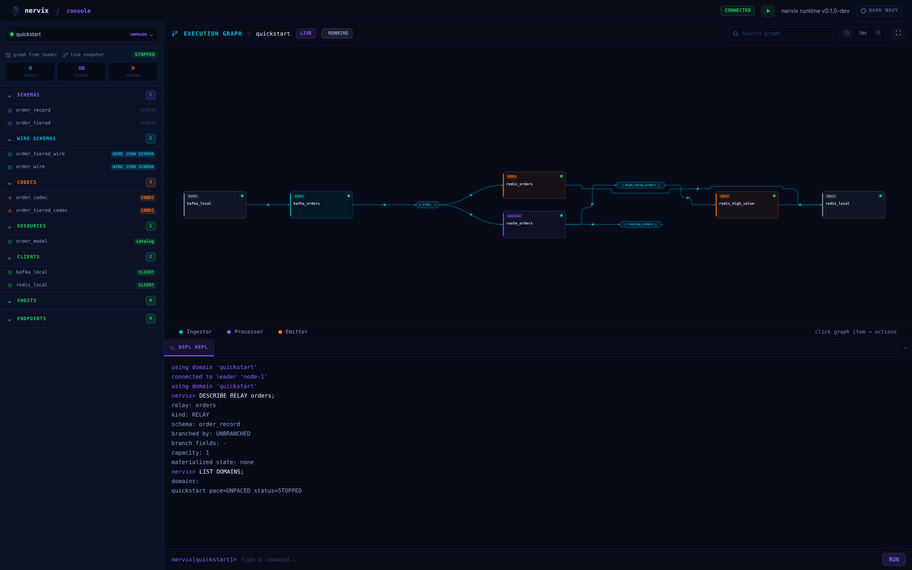
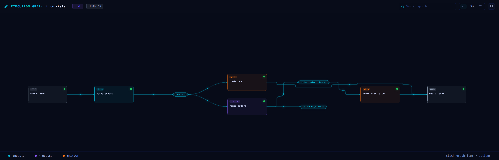
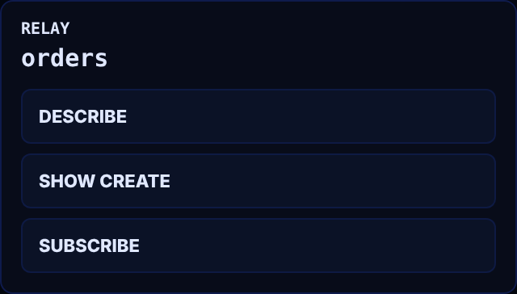
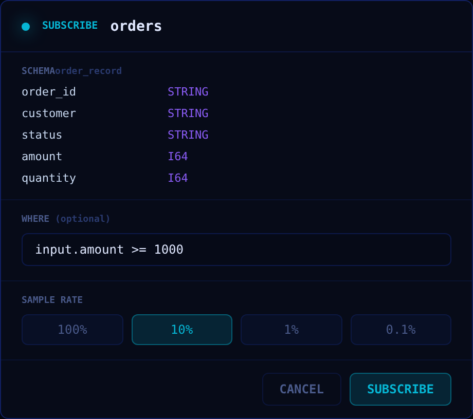
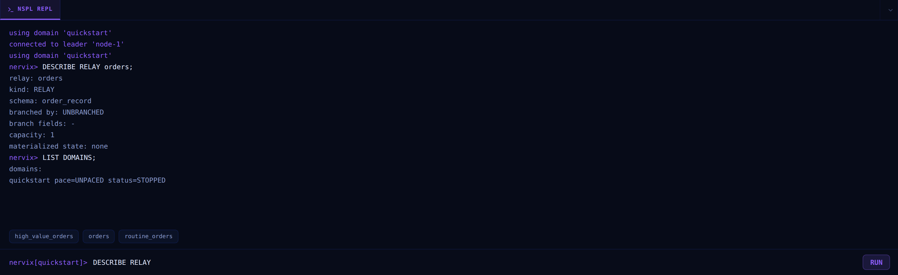
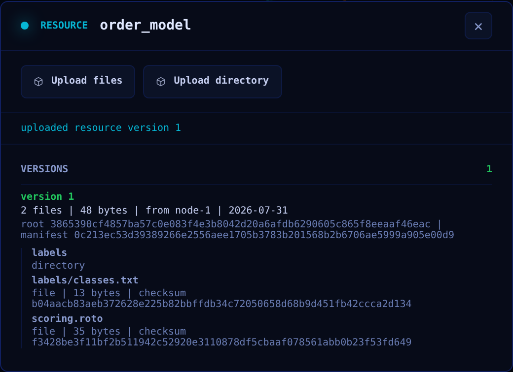

# Web Console

Every Nervix node serves a browser console. It combines a live drawing of the running execution
graph with an NSPL command line, so the same session can be used to read a graph and to change it.



## Opening The Console

The console is served by the node itself; nothing extra is deployed. It listens on `0.0.0.0:47420`
by default and is served under `/console/`, with `/` and `/console` redirecting there:

```text
http://127.0.0.1:47420/console/
```

Change the address with `--web-console-listen-addr` or `NERVIX_WEB_CONSOLE_LISTEN_ADDR`. The
published ports differ by installation method: see [Docker](installation-docker.md) and
[Kubernetes Operator](installation-kubernetes.md).

Any node works. Opening the console on a follower is supported — the follower proxies the session
to the current leader and reports which node it reached:

```text
connected to leader 'node-2'
```

## Signing In

Without credentials in the URL the console shows a login form for a registry user. Two other forms
are accepted, which is what automation and bookmarks use:

- an `Authorization: Basic <base64(user:password)>` request header
- an `?auth=<base64(user:password)>` query parameter

The query parameter puts credentials into browser history and server access logs, so prefer the
login form or the header for anything but a local cluster.

## Layout

The console is one screen with three regions:

- the **sidebar** on the left: the domain selector, live throughput for the selected domain, and
  the domain's entities grouped by kind — schemas, wire schemas, codecs, resources, clients,
  vhosts, and endpoints
- the **execution graph** in the upper right
- the **REPL** below it, which also hosts any relay subscriptions you open

The top bar carries the websocket connection state, the domain lifecycle button, and the theme
picker.

Sidebar entries are counted per kind and each group collapses. Selecting an endpoint runs its
`DESCRIBE` in the REPL; selecting a resource does the same and opens its version dialog.

## The Execution Graph



The graph is redrawn from snapshots the leader pushes twice a second. It shows external clients,
ingestors, processors, relays, and emitters, connected in the direction records flow. Node colour
follows the legend — ingestor, processor, emitter — and relays are drawn as labelled ports between
them, with a bar per buffer quantile and the p50/p90/p99 depths on hover.

When traffic is flowing, each edge carries its own rate: messages per second, bytes per second, and
batches per second, with a pulse travelling along the edge. Branch groups are drawn as a stacked
outline around the part of the graph that runs per branch; clicking one opens its key schema and
active branch count.

The toolbar controls framing. Search highlights matching items and brings them into view; the zoom
buttons step between 70% and 160%, and `Ctrl`/`Cmd` with the scroll wheel ranges from 25% to 300%;
the fullscreen button expands the graph over the whole window. Dragging pans.

A domain with no installed graph shows `NO ACTIVE DATAFLOW GRAPH` instead.

### Item Actions



Clicking any node or relay opens its action menu. Each action types the corresponding statement
into the REPL and runs it, so the console never does anything you could not have typed:

- **DESCRIBE** — the runtime view of the item, where the item has a `DESCRIBE` form
- **SHOW CREATE** — the NSPL that declares it
- **SUBSCRIBE** — relays only; opens the subscription dialog described below

### Node Health

Nodes are drawn with their runtime status. A node whose external connection has failed is marked in
error, and an ingestor or emitter waiting to reconnect shows a countdown to its next attempt.
Hovering a node reveals the underlying reason. Metrics for alerting belong in the observability
endpoint rather than here — see
[Metrics And Observability](metrics-and-observability.md#observability-server).

## Subscribing To A Relay



The subscription dialog builds a read-only session subscription against a relay. The relay's schema
is listed field by field; clicking a field inserts an `input.<field>` reference into the `WHERE`
box, so a filter can be written without retyping field names. A sample rate of 100%, 10%, 1%, or
0.1% limits how many arriving batches are delivered.

The subscription opens as a tab beside the REPL and streams records into it. Closing the tab ends
the subscription. Subscriptions are read-only views: they cannot construct, inherit, or produce
side effects. See [Sessions](sessions.md).

## The NSPL REPL



The REPL accepts the same NSPL as the command line client, including the client-local statements
`USE`, `LIST DOMAINS`, `BEGIN`, `COMMIT`, `REVERT`, and the subscription statements. The prompt
shows the active domain, and marks an open transaction the same way the terminal client does:

```text
nervix[quickstart]>
nervix[quickstart tx]>
```

`Tab` cycles through completions offered by the server for the current cursor position. `ArrowUp`
and `ArrowDown` walk the session's command history, `Ctrl`/`Cmd` with `Enter` submits, and `clear`
empties the scrollback.

## Uploading Resources



Selecting a resource in the sidebar opens its version list. Files or a whole directory can be
uploaded from the browser as a new version, which is then replicated across the cluster. Version
contents and how nodes consume them are covered in [Resources](resources.md).

## Domain Lifecycle

The sidebar's domain selector switches the console between domains; the top bar shows the selected
domain's state and runs `START;` or `STOP;` for it. Both statements appear in the REPL as if you
had typed them. See [Start And Stop](domains-and-time.md#start-and-stop).

## Themes

Four themes are available from the top bar: **Dark navy** (the default), **Pure dark**, **D0ZNPP**,
and **Light**.
