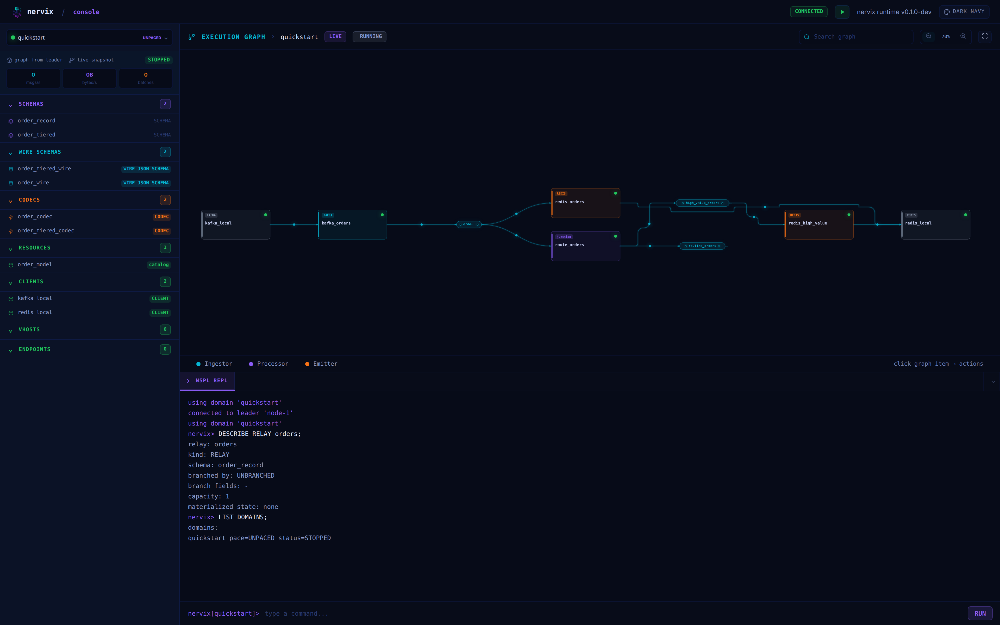
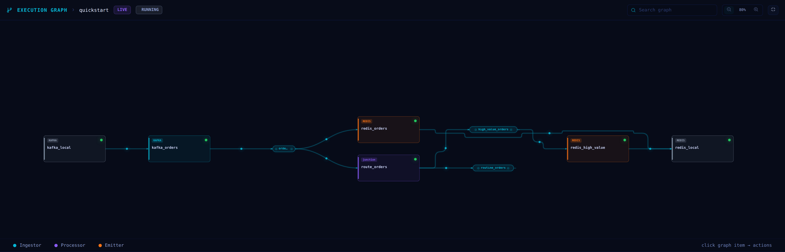
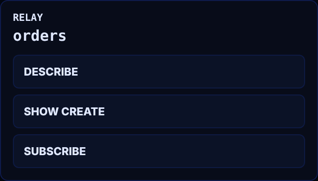
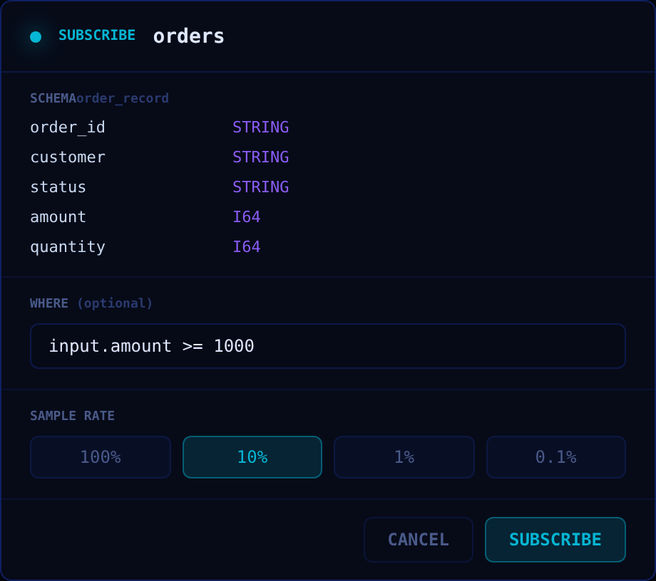
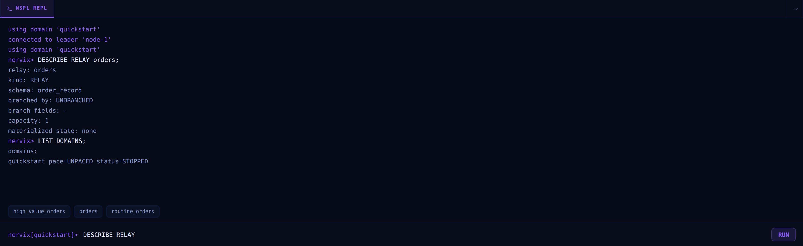
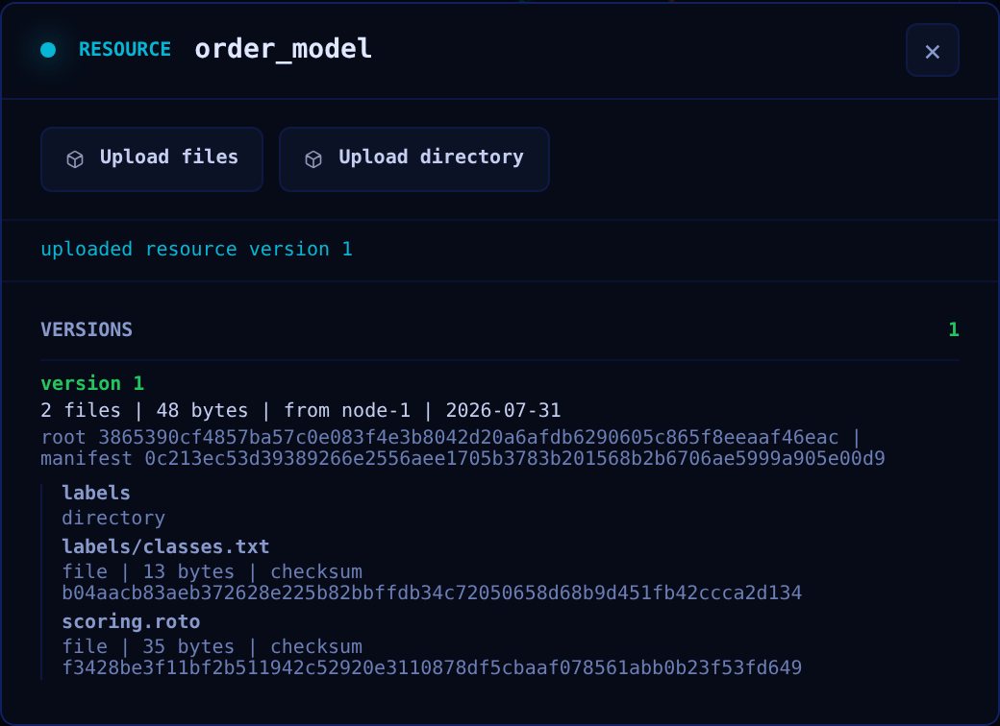

# Web Console

Every Nervix node serves a browser console. It combines a live drawing of the running execution
graph with an NSPL command line, so the same session can be used to read a graph and to change it.



## Opening The Console

The console is served by the node itself; nothing extra is deployed. It listens on `0.0.0.0:47420`
by default and is served under `/console/`, with `/` and `/console` redirecting there:

```text
http://127.0.0.1:47420/console/
```

Change the address with `--web-console-listen-addr` or `NERVIX_WEB_CONSOLE_LISTEN_ADDR`. The
published ports differ by installation method: see [Docker](installation-docker.md) and
[Kubernetes Operator](installation-kubernetes.md).

Any node works. Opening the console on a follower is supported — the console follows the leader
redirect, reconnects there, and reports which node it reached:

```text
connected to leader 'node-2'
```

## Signing In

Without credentials in the URL the console shows a login form for a registry user. Two other forms
are accepted, which is what automation and bookmarks use:

- an `Authorization: Basic <base64(user:password)>` request header
- an `?auth=<base64(user:password)>` query parameter

The query parameter puts credentials into browser history and server access logs, so prefer the
login form or the header for anything but a local cluster.

## Layout

The console is one screen with three regions:

- the **sidebar** on the left: the domain selector, live throughput for the selected domain, and
  the domain's entities grouped by kind — schemas, wire schemas, codecs, resources, clients,
  vhosts, and endpoints
- the **execution graph** in the upper right
- the **REPL** below it, which also hosts any relay subscriptions you open

The top bar carries the websocket connection state, the global **Create** menu, the domain
lifecycle button, and the theme picker.

Sidebar entries are counted per kind and each group collapses. Selecting an endpoint runs its
`DESCRIBE` in the REPL; selecting a resource does the same and opens its version dialog.
The **Cluster** footer stays independent of the selected domain: it reports the number of running
domains, non-relay graph nodes, and relays across the current cluster graph.

## Creating Domains, Users, And Resources

The top bar's **Create** menu opens keyboard-accessible forms for domains, users, and resource
catalogs. The resource group in the sidebar also provides a contextual create action. A form keeps
its unfinished draft when it closes, restores focus to the action that opened it, reports
validation and server failures inline, and shows the canonical NSPL statement before submission.
The domain form supports paced and unpaced clocks, period and skew for a paced clock, placement
policy, and `IF NOT EXISTS`. User and resource forms support their corresponding names and the
same creation modifier.

Pace and placement are typed choices supplied by the session server. They are searchable and
paged independently, and the placement lookup carries the selected pace as a typed dependency.
Loading, no-match, stale-context, and lookup-failure states remain distinct. An edit, dialog close,
or replacement session makes an older reply ineligible to change the form.

A resource draft captures the selected domain the first time it opens. If the console later
selects another domain, reopening the retained draft keeps its captured scope and offers **Use
current domain** as an explicit change. Domain and user creation are cluster scoped. Passwords are
sent in the canonical command but appear as eight asterisks in both the preview and REPL; the
cleartext value is never added to terminal history.

Submitting uses the same durable command path as the REPL. The form therefore keeps the command's
execution reference through redirects and reconnects, uses the attached transaction's expected
position, and reports **Editing**, **Submitting**, **Queued until reconnect**, **Queued in
transaction**, **Completed**, or **Failed** from the correlated outcome. A queued transaction
operation is not presented as externally complete. A successful standalone resource create opens
the existing resource version dialog, where upload identity and completion continue to be owned by
the upload workflow.

## The Execution Graph



The graph is redrawn from snapshots the leader pushes twice a second. It shows external clients,
ingestors, processors, relays, and emitters, connected in the direction records flow.

Records always travel from left to right. Items sit in columns ordered by how far a record has
travelled, and every item appears to the right of everything that feeds it. Relays get columns of
their own between the processing columns, drawn as labelled capsules with a bar per buffer quantile
and the p50/p90/p99 depths on hover, so a relay reads as the port its producers converge on and its
consumers fan out from. A pipeline with no branching or fan-out is drawn as a single straight line.

Edges run horizontally and vertically with rounded corners, through gutters kept clear of the
items, so no edge ever passes under a node, a capsule, or a label. Each edge leaves and arrives at
its own attachment point, so a node with several outputs fans out visibly rather than from one
spot. Two relations between the same pair of items stay two edges: a node that both reads a
relay's records and looks up its materialized state draws one edge of each style, side by side.
Edge style carries meaning:

- **solid** — records flowing
- **dashed, error tint** — a route's `ON MESSAGE ERROR` destination
- **dashed, warning tint** — a correlator's `ON TIMEOUT` destination; a correlator's two inputs are
  labelled `LEFT` and `RIGHT`
- **dotted, hollow arrow** — a materialized-state dependency, including the relay a generator reads
  with `USING MATERIALIZED STATE`. State is looked up rather than delivered, so these edges carry
  no rate

A graph that feeds back on itself — a reingestor writing a relay that reaches it again — draws that
one edge as a marked return path above the items it spans, so backwards travel is never mistaken
for forward flow. Disconnected parts of a graph are stacked as separate bands.

When traffic is flowing, each edge carries its own rate, with the full messages, bytes, and batches
per second on hover, and a pulse travelling along the edge. Where a node declares several routes to
the same relay they are drawn as one edge, and hovering reports how many routes it stands for.

Branch groups are drawn as a tinted region with a stacked outline around the part of the graph that
runs per branch, containing exactly the items that run per branch and nothing else. Regions of
different branches never touch, even where they share a column. The region is
headed with the branch name, its key fields, and how many branch instances are currently live; the
outline thickens with that count. The ingestors and reingestors that construct the branch, and the
emitters and reingestors that collapse it, sit on the region's border rather than inside it.
Clicking the header opens the branch's key schema and its live instances.

The toolbar controls framing. Search highlights matching items, dims the rest, and brings the
matches into view; the zoom buttons step in tens and `Ctrl`/`Cmd` with the scroll wheel is
continuous, both between 25% and 300%; **FIT** frames the whole graph, which is also the view you
start with; the fullscreen button expands the graph over the whole window. Dragging pans. The
graph moves only when the topology changes, and never because traffic changed.

The header carries the domain's lifecycle state — `RUNNING`, `PAUSED`, or `STOPPED` — and the state
of the feed: `LIVE` while snapshots arrive, `STALE` when they stop, and `OFFLINE` when the session
is disconnected. A stopped domain still draws its whole graph, with no rates and no pulses.

A domain with no installed graph shows `NO ACTIVE DATAFLOW GRAPH` instead.

### Item Actions



Clicking any node or relay opens its action menu. Each action types the corresponding statement
into the REPL and runs it, so the console never does anything you could not have typed:

- **DESCRIBE** — the runtime view of the item, where the item has a `DESCRIBE` form
- **SHOW CREATE** — the NSPL that declares it
- **SUBSCRIBE** — relays only; opens the subscription dialog described below

### Node Health

Nodes are drawn with their runtime status. A node whose external connection has failed is marked in
error, and an ingestor or emitter waiting to reconnect shows a countdown to its next attempt.
Hovering a node reveals the underlying reason. Metrics for alerting belong in the observability
endpoint rather than here — see
[Metrics And Observability](metrics-and-observability.md#observability-server).

## Subscribing To A Relay



The subscription dialog builds a read-only session subscription against a relay. The relay's schema
is listed field by field; clicking a field inserts an `input.<field>` reference into the `WHERE`
box, so a filter can be written without retyping field names. A sample rate of 100%, 10%, 1%, or
0.1% limits how many arriving batches are delivered.

The subscription opens as a tab beside the REPL and streams records into it. Closing the tab ends
the subscription. Subscriptions are read-only views: they cannot construct, inherit, or produce
side effects. See [Sessions](sessions.md).

## The NSPL REPL



The REPL accepts the same NSPL as the command line client, including the client-local statements
`USE`, `LIST DOMAINS`, `BEGIN`, `COMMIT`, `REVERT`, and the subscription statements. The prompt
shows the active domain, and marks an open transaction the same way the terminal client does:

```text
nervix[quickstart]>
nervix[quickstart tx]>
nervix[quickstart committing]>
```

The console sends a statement whether or not a domain is selected, and the server decides whether
it needs one: `SHOW CLUSTER STATUS` or `CREATE DOMAIN` runs with no domain selected, while a
statement that acts on a domain fails with `no active domain selected`.

`BEGIN` requires a selected domain that already exists and binds the transaction to it. The
console follows the transaction's domain, so attaching switches the domain selector to it.
`DESCRIBE TRANSACTION` prints the open transaction's impact report between queued statements, and
with an id it reads another transaction of the same user while the prompt, domain selector, and
attached transaction stay as they were. See
[NSPL Overview](nspl-overview.md) for its forms and output.

Every persistent command keeps one execution reference while the browser waits, reconnects, or
follows leadership. The transaction id and status are replicated. If the WebSocket closes
unexpectedly or leadership changes, the console reconnects and attaches that id before resuming a
pending command. Each append is matched by its reference and expected position, and an outstanding
commit remains pending through `COMMITTING` until its exact terminal result. A
second session can attach the same owner's transaction and take it over; the displaced console
then gets an explicit takeover error. A clean console session close reverts an open transaction,
while an accepted commit continues on the leader without the browser. See
[Replicated NSPL Transactions](control-plane.md#replicated-nspl-transactions).

`Tab` cycles through completions offered by the server for the current cursor position. `ArrowUp`
and `ArrowDown` walk the session's command history, `Ctrl`/`Cmd` with `Enter` submits, and `clear`
empties the scrollback.

Accepting a candidate replaces its exact source range, including the rest of a word after the
cursor, while preserving surrounding text. The list shows one bounded page at a time; use **MORE
SUGGESTIONS** to fetch the next page. The console shows a message when the selected domain or
transaction context is missing or stale, or when the candidate lookup fails. An empty list with
no message means there are no matches.

## Inspecting a transaction


Select **Transaction · Inspect** in the top bar while a transaction is active. The inspector reads
the typed impact report without attaching another transaction or changing the session domain.
Use **Discover transactions** to list retained transactions in the REPL, then enter a transaction
ID to inspect one. A `DESCRIBE TRANSACTION` command also opens its typed result in the inspector;
the REPL still prints the server's text or JSON rendering.

The outline groups accepted operations by their execution steps. Selecting an operation shows
its own planned contribution; selecting its step shows the effective pause and effects of the
atomic step. **Whole transaction** shows the union of the steps. Switch between **Before**,
**Changes**, and **After** without moving graph items, or between **Planned** and **Actual** to
review recorded progress. Search frames matching names and kinds; **FIT**, zoom, and drag control
the viewport. Select a node or relation for its before/after presence, roles, and contributing
operation numbers. The **Relations** list offers labeled buttons for keyboard selection of graph
edges, including parallel data and materialized-state paths. Role marks and the resource card
shape supplement the graph colors.

The summary names the transaction, domain, state, accepted and applied counts, completeness,
freshness, aggregate quiesce level, planning basis, relocations, rebuilds, and state resets.
An incomplete report shows its diagnostics. A stale preview must be refreshed before retrying
`COMMIT`. The console sends the inspected whole-transaction preview identity with `COMMIT`, even
when an operation is selected. Inspecting another transaction leaves the attached transaction's
commit basis intact. Retained reports keep their own graph geometry when the live execution graph
changes.

The inspector receives the same complete typed report as the Rust client and CLI. It does not
silently omit nodes, edges, operations, or steps from a large retained report; search, focus, and
the outline change what is visible in the viewport without narrowing the result that was read.

## Uploading Resources



The sidebar shows each resource's highest completed version, such as `v2`, or `catalog` while no
upload has completed. Selecting a resource opens its version list, read from the typed description
that `DESCRIBE RESOURCE` returns beside the text the REPL prints: every version with each file and
directory under its exact path, and under each version the models bound to it, listed by kind and
name, or `none`.

Files or a whole directory can be uploaded from the browser as a new version of that resource in
the selected domain. The successful upload result arrives after every current live node has
verified and installed the version. An upload moves no binding: models keep the version they pin
until [`REBIND RESOURCE`](resources.md#rebinding-existing-models) moves them. Version contents and
how nodes consume them are covered in [Resources](resources.md).

## Domain Lifecycle

The sidebar's domain selector switches the console between domains; the top bar shows the selected
domain's state and runs `START;` or `STOP;` for it. Both statements appear in the REPL as if you
had typed them. See [Start And Stop](domains-and-time.md#start-and-stop).

## Themes

Four themes are available from the top bar: **Dark navy** (the default), **Pure dark**, **D0ZNPP**,
and **Light**.
