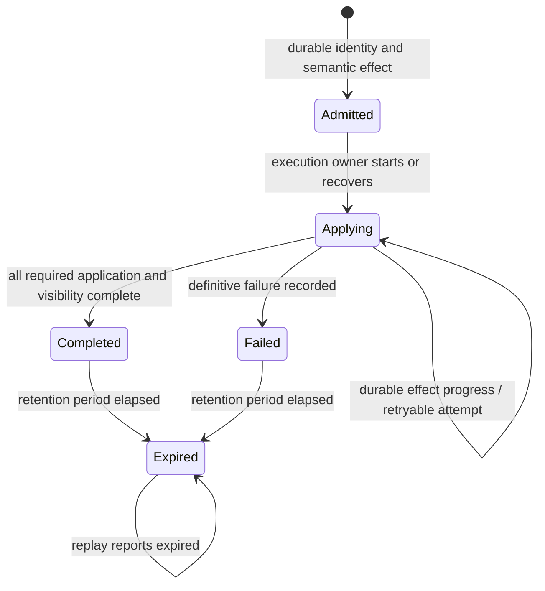
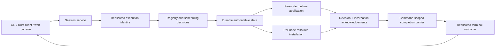
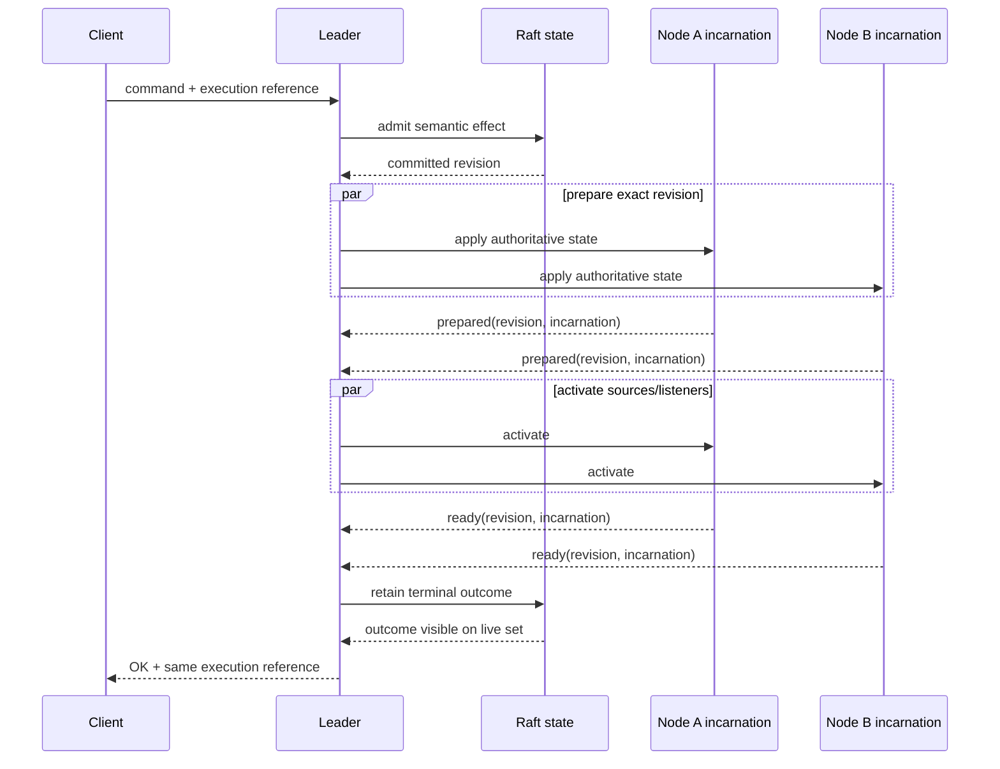
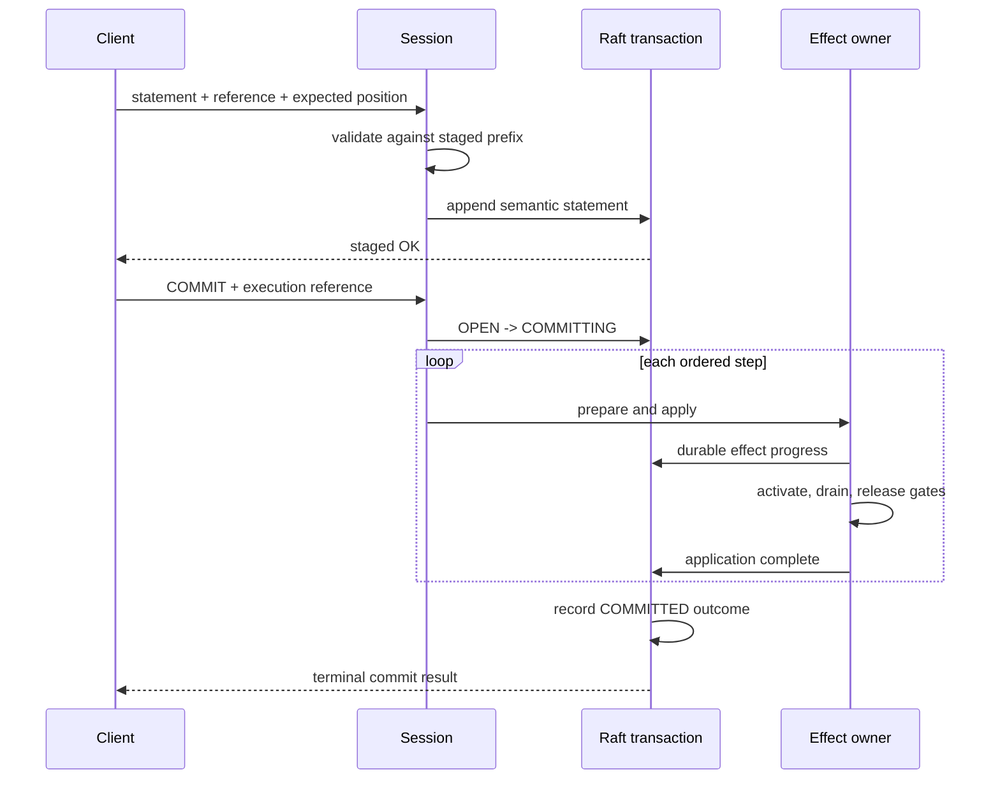
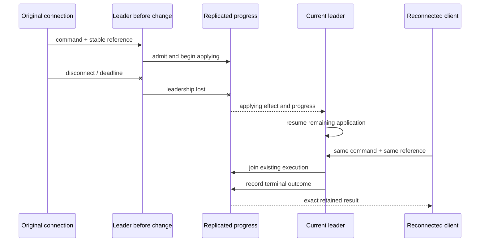

# Command Completion

Nervix treats a successful NSPL administrative response as a completion boundary. When a command
returns `OK`, its declared effect is durable, applied, and usable through every current live node
that participates in that effect. A caller can issue the dependent command immediately through
another session or node. Runtime data flow, subscription delivery, connector acknowledgements, and
timer-driven work continue asynchronously under their own contracts.

A command can therefore remain pending while Nervix validates configuration, replicates control
state, distributes resources, prepares runtimes, starts sources, drains old ownership, releases
entity gates, and makes the final outcome visible. Transport loss only detaches the waiter after
admission. The cluster continues the work and retains its terminal result for at least 15 minutes.

## Lifecycle and ownership

Every persistent ordinary command carries an execution reference. The reference is scoped to its
authenticated owner and selected domain and is permanently bound to one semantic request while its
record remains present. Reusing it with changed content, credentials, owner, or domain fails.
Repeating the same request joins the applying execution or returns the retained terminal result.
An expired reference remains a tombstone and cannot start a new effect.

Resource uploads use the same rule with a domain-owned upload identity and the verified archive
digest. Transaction appends additionally carry their expected queue position. This makes a replay
an exact append check rather than a request to append another copy.

The control plane owns command identity, durable effect progress, terminal outcomes, and recovery.
The registry and scheduling decisions validate and produce authoritative state. Each runtime owner
reports preparation and readiness for the exact revision it applied. Gossip carries acknowledgements
with the process incarnation, so a restarted process cannot inherit its predecessor's readiness.
Sessions and clients route requests and wait; they do not decide completion.

Commands in different domains and independent resource uploads have separate execution ownership.
Conflicting work in one domain uses that domain's alteration or handoff ownership. Reads, health,
subscription delivery, and transport control frames continue while a command waits.

`REBIND RESOURCE` completes only after its entire selected model set has been validated, committed,
and activated under this same barrier. The successful response is therefore the boundary at which
every selected usage observes the new pinned version. A validation or activation failure cannot
report a partially rebound set.

## All-live-node barriers

A completion barrier continuously derives the required set from current effective live membership.
It keys each member by node name and process incarnation. A node joining while the effect is still
applying joins the required set. A process restarting under the same name must apply the effect in
its new incarnation. A node leaves the set only through the cluster's actual availability policy;
a stale observation or one failed probe does not waive its work.

Runtime activation has two explicit phases. First, every required node applies the authoritative
models, schedules, clocks, resource bindings, and stopped or running lifecycle state and reports
`prepared` for that revision. Only after the preparation barrier may running-domain sources and
listeners start. Each node then reports `ready`, and success waits for the readiness barrier. This
prevents a source from publishing into a peer that still has the preceding graph.

Revision progress is cumulative. If a newer runtime revision arrives while a node is waiting at
either barrier, that node applies the newer coherent state instead of waiting to finish the older
revision first. Preparing or becoming ready at the newer revision also completes every earlier
revision for that process incarnation. This lets a newly admitted process catch up to the current
state without forming a cycle with peers that entered adjacent revision barriers before it joined.

The barrier targets the command's authoritative revision and required effect. Later changes in an
unrelated domain do not move that target. Local observations never repair state as a side effect;
recovery and application owners perform repair before declaring readiness.

## Transactions

`BEGIN` creates an `OPEN` transaction for one existing selected domain. A queueable statement is
validated by planning the ordered candidate formed by the existing prefix, then durably appended
with its request reference, expected position, and admitted result. The plan uses one captured set
of relevant control-plane inputs and the exact execution-step segmentation used at commit. Queue
success means validation and staging only. It does not replace a live graph, start or stop a domain,
install a resource, or engage a runtime gate. Other sessions continue to see the committed
configuration. Retrying the exact append returns the retained admitted result without touching the
transaction.

`COMMIT` changes the transaction to `COMMITTING`, refreshes the ordered plan from a new coherent
snapshot, and applies its ordered steps. Consecutive model mutations are one step; lifecycle,
domain, and resource statements each end a model run and form their own step. Durable effect
progress and completed application are separate records. A step whose authoritative write is
committed remains applying until activation, handoff, drain, source readiness, lifecycle work, and
command-owned gate release are complete. Only then can the next step advance. The transaction
becomes `COMMITTED` after the final application record and terminal visibility barrier.

A leadership change resumes a `COMMITTING` transaction from its recorded applying step. It does not
repeat a completed effect or advance past an incompletely applied effect. A reconnecting commit
waiter attaches to the transaction and continues waiting for that terminal result. A definitive
failure records one `FAILED` outcome, the failing step, and the committed prefix.

## Effect-specific completion

Domain, user, resource-catalog, model, and lookup creation waits for authoritative visibility.
Stopped domains and empty graphs still apply their definitions on every live node. Hash-map lookup
creation also waits for local resource loading and index construction, so its first `LOOKUP` may be
issued immediately after success. A malformed source resource fails the creating command.

Model creation, alteration, and removal waits for the classified quiescence and activation work.
Dynamic changes preserve live execution, entity changes drain only affected entities, and topology
changes pause and drain the domain. Success follows schedule application, ownership handoff, runtime
readiness, and gate release. A no-op reapplies the current required state before returning.

`START` waits until every listener and assigned source has completed its startup boundary. `STOP`
waits for remote source and listener teardown, including when it stops the cluster's last running
domain. Paced-domain clock authority is part of the same revision. TLS-changing model effects wait
for every affected listener to install the configuration. Each node installs the TLS VHOSTs of a
runtime revision before it reports that revision prepared, and the command then confirms the
installation on every live process incarnation. A failed installation fails the command. A batch
that did not pause is rolled back by the same record that stores the failure, and the command waits
until every listener presents the restored certificates; a paused batch keeps its committed models
like any other activation failure.

An upload is complete after the entire declared body is admitted, its archive and manifest verify,
and the exact digest is atomically installed on every live node incarnation. A complete admitted
upload continues after caller disconnect. An interrupted partial body has not admitted an effect
and may be retransmitted with its identity. The final result reports one assigned version and the
same upload identity. Resource descriptions expose current per-incarnation installation diagnostics
for observation, rather than serving as an extra completion step.

Cordon and uncordon wait for the eligibility change to become authoritative. Drain and relocation
wait for ownership transfer, destination activation, source drain, and handoff release. Node removal
waits for membership and all resulting schedules to become authoritative and usable.

## Disconnects, deadlines, and recovery

The gRPC and WebSocket transport loops keep control frames, server events, subscription delivery,
and close detection moving while an ordered command worker waits. Disconnecting either transport
drops its binding and waiter. Service-owned command, commit, and fully admitted upload tasks keep
running.

A caller deadline limits that caller's wait. It does not cancel admitted work or create a terminal
failure. Clients preserve the same reference through redirects, reconnects, and uncertain transport
outcomes. An expired reference produces an explicit result and never causes automatic re-execution
under a new identity.

The public behavior is specified in
[NSPL command completion](https://github.com/nervix-io/nervix/blob/main/docs/specifications/nspl-command-completion.md).
The corresponding public scenario inventory is maintained in the repository's command-completion
acceptance ledger.
