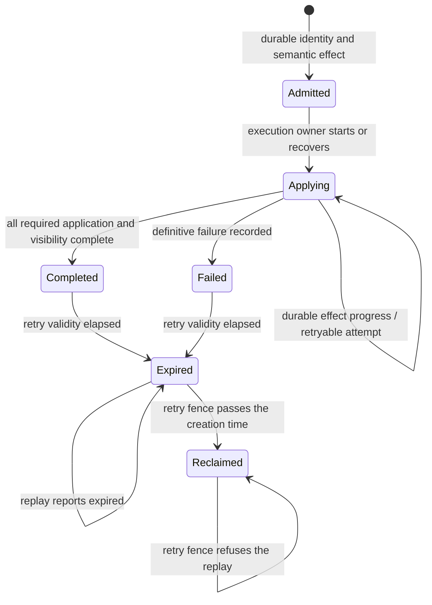
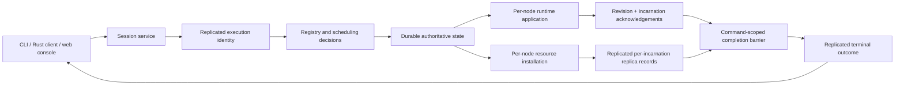
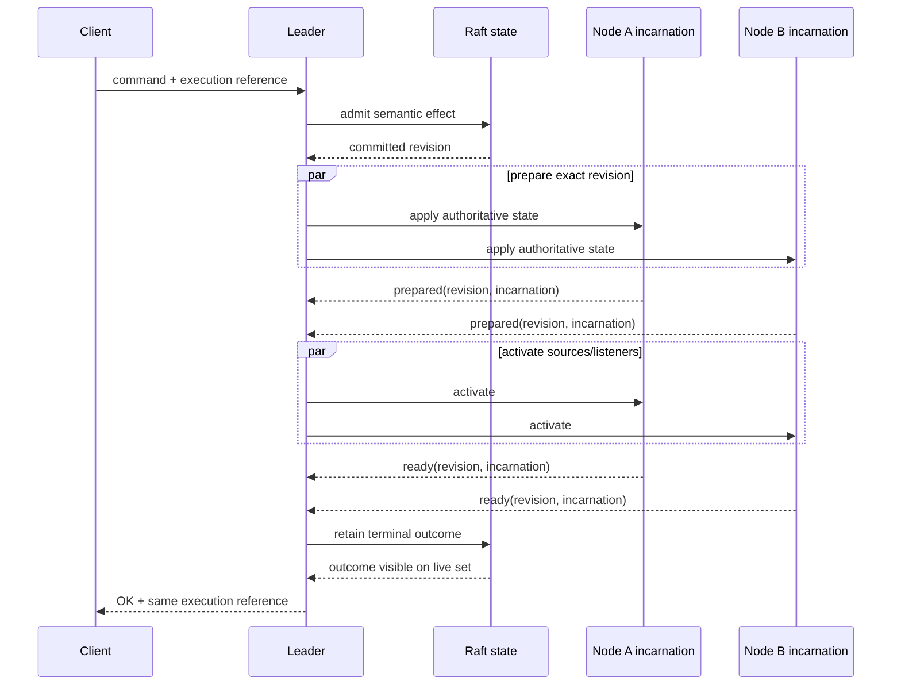
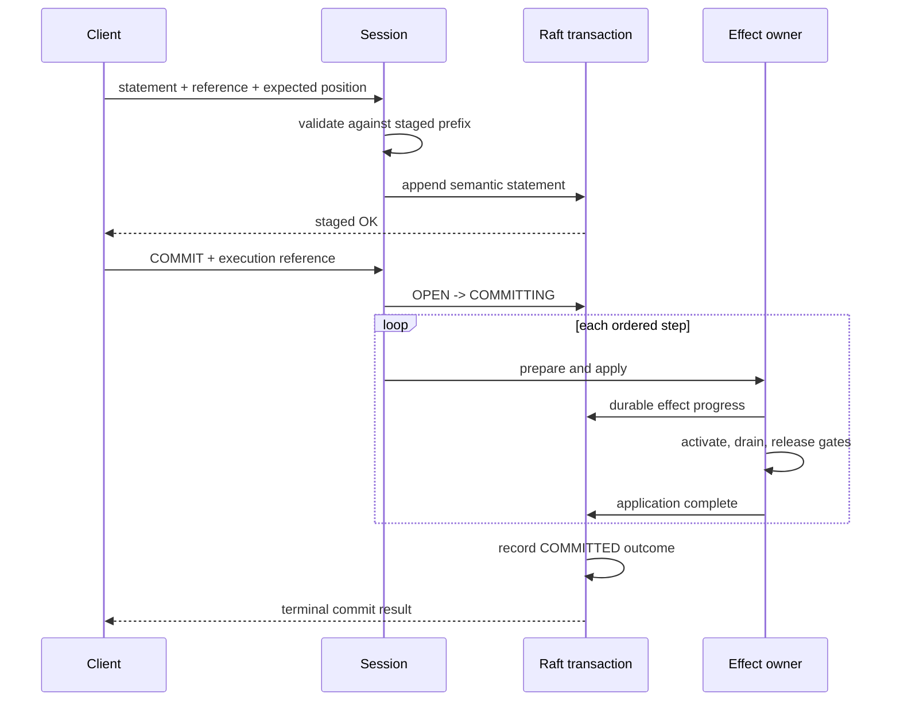
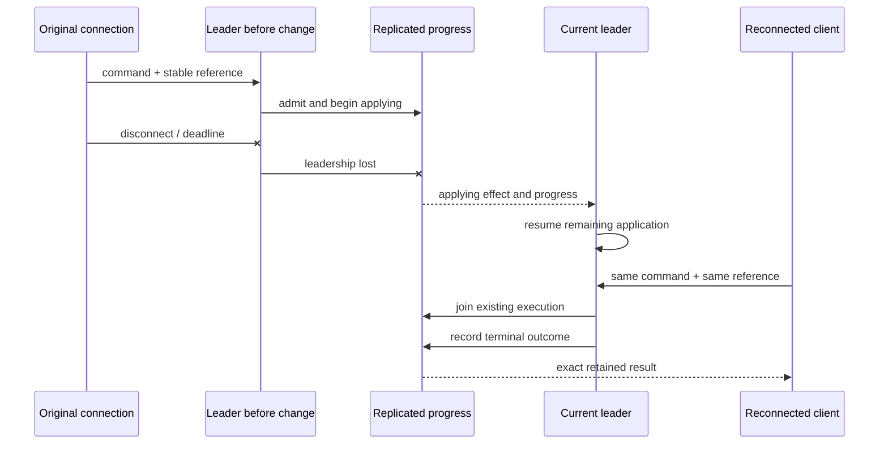

# Command Completion

Nervix treats a successful NSPL administrative response as a completion boundary. When a command
returns `OK`, its declared effect is durable, applied, and usable through every current live node
that participates in that effect. A caller can issue the dependent command immediately through
another session or node. Runtime data flow, subscription delivery, connector acknowledgements, and
timer-driven work continue asynchronously under their own contracts.

A command can therefore remain pending while Nervix validates configuration, replicates control
state, distributes resources, prepares runtimes, starts sources, drains old ownership, releases
entity gates, and makes the final outcome visible. Transport loss only detaches the waiter after
admission. The cluster continues the work and retains its terminal result for the command retry
validity, 15 minutes by default.

## Lifecycle and ownership

Every persistent ordinary command carries an execution reference. The reference is a UUIDv7, and
its embedded creation time bounds how long the request may be retried. The reference is scoped to
its authenticated owner and selected domain and is bound to one semantic request while its record
remains present. Reusing it with changed content, credentials, owner, or domain fails. Repeating
the same request joins the applying execution or returns the retained terminal result.

A new reference is admitted only when its creation time lies after the cluster's retry fence and
no more than five minutes ahead of the leader's clock. The fence trails the leader's clock by the
retry validity. It is part of the replicated state and never moves back, so restart, leader change,
and snapshot installation all preserve it. A reference without a UUIDv7 creation time, one created
at or before the fence, and one created too far ahead are refused before any effect.

An applying execution never expires. A terminal result is retained for the retry validity after the
command finishes. The record then shrinks to a tombstone holding only the reference, and the
tombstone is removed once the fence passes the reference's creation time. From then on the fence
refuses the reference by itself, so a reclaimed reference returns the typed
`ExecutionReferenceExpired` disposition and never starts its effect again. A conflicting reference
found during replicated admission returns `ExecutionReferenceConflict` with the kind that differed.
Report retention is a separate contract: a transaction's report follows
the transaction tombstone retention, so inspection can still read it after its command reference
has expired, and a report that inspection no longer knows does not make its reference executable.

Finalization accepts a terminal command result. An `OutcomeUnknown`, leader redirect, or detached
transaction leaves the execution applying and preserves the disposition and diagnostics for its
current waiter. Reconciliation and repetition under the same reference resume that execution;
an interrupted attempt never supplies a definitive failure for the execution ledger.

The retained history is bounded. Once it holds as many applying, finished, and expired executions as
its capacity allows, a new reference is refused with an explicit capacity error. Admitted work is
never evicted to make room, and repeating an admitted request still joins it or returns its
retained result.

| Setting | Environment variable | Default |
| --- | --- | --- |
| `--command-retry-validity` | `NERVIX_COMMAND_RETRY_VALIDITY` | `15m` |
| `--command-execution-capacity` | `NERVIX_COMMAND_EXECUTION_CAPACITY` | `65536` |

An ordinary configuration command applies through a frozen internal transaction attempt. If its
captured planning inputs change before the effect is recorded, the command retains that failed
attempt and starts a revision-derived attempt under the same execution reference. An explicit
transaction remains frozen after `COMMIT` admission and reports the conflict instead of replanning.

Resource uploads follow the same replay rule with an upload identity instead. It is scoped to the
user, domain, and resource, bound to the verified archive digest, and retained without expiry; see
[Resource Versions And Bindings](./resource-versions.md#assignment). Transaction appends
additionally carry their expected queue position. This makes a replay an exact append check rather
than a request to append another copy.

```mermaid
stateDiagram-v2
    [*] --> Admitted: durable identity and semantic effect
    Admitted --> Applying: execution owner starts or recovers
    Applying --> Applying: durable effect progress / retryable attempt
    Applying --> Completed: all required application and visibility complete
    Applying --> Failed: definitive failure recorded
    Completed --> Expired: retry validity elapsed
    Failed --> Expired: retry validity elapsed
    Expired --> Expired: replay reports expired
    Expired --> Reclaimed: retry fence passes the creation time
    Reclaimed --> Reclaimed: retry fence refuses the replay
```

The control plane owns command identity, durable effect progress, terminal outcomes, and recovery.
The registry and scheduling decisions validate and produce authoritative state. Each runtime owner
reports preparation and readiness for the exact revision it applied. Gossip carries acknowledgements
with the process incarnation, so a restarted process cannot inherit its predecessor's readiness.
Sessions and clients route requests and wait; they do not decide completion.

```mermaid
flowchart LR
    Client[CLI / Rust client / web console] --> Session[Session service]
    Session --> Identity[Replicated execution identity]
    Identity --> Decision[Registry and scheduling decisions]
    Decision --> Raft[Durable authoritative state]
    Raft --> Runtime[Per-node runtime application]
    Raft --> Resources[Per-node resource installation]
    Runtime --> Gossip[Revision + incarnation acknowledgements]
    Resources --> Replicas[Replicated per-incarnation replica records]
    Gossip --> Barrier[Command-scoped completion barrier]
    Replicas --> Barrier
    Barrier --> Outcome[Replicated terminal outcome]
    Outcome --> Client
```

Commands in different domains and independent resource uploads have separate execution ownership.
Conflicting work in one domain uses that domain's alteration or handoff ownership. Other sessions,
health, subscription delivery, and transport control frames continue while a command waits, and so
do the waiting session's completion, choice, domain, and inspection requests. That session's later
commands wait for it, because a session runs its commands in order; see [Requests, Lanes, And
Cancellation](./client-session-protocol.md#requests-lanes-and-cancellation).

`REBIND RESOURCE` completes only after its entire selected model set has been validated, committed,
and activated under this same barrier. The successful response is therefore the boundary at which
every selected usage observes the new pinned version. A validation or activation failure cannot
report a partially rebound set. [Resource Versions And Bindings](./resource-versions.md#rebinding)
defines the rebinding contract.

`BACKUP` uses the same durable execution reference and retained outcome. Its success means the
archive was assembled from each domain's own applied revision, verified, and retained on the leader under that
reference, and its outcome carries the archive's size, digest, and per-domain revisions. The
execution reference is also the key the client downloads the archive by. Its request binding
includes the original selected domain, scope, resource inclusion and capture options. The client's
local archive destination is excluded from this binding, so recovery may choose another file or
stdout. A bounded client wait can end while the command remains applying; the original reference
recovers that work without admitting a second backup. Repeating the reference returns the recorded
outcome, and the client downloads the archive again while it is retained,
which lasts until a download collects it or the reference's retry validity ends. See
[Backup And Restore](./backup-and-restore.md#downloading-the-archive).

`RESTORE` uses the same durable execution reference and retained outcome, and its request identity
includes the size and BLAKE3 digest of the archive the client streams with it, so the same
reference with another archive is a different request. The leader admits a restore only after the
archive verified and the whole restore planned, and records every step the restore applies in the
restore's execution as the step's effect commits. Its success means every step applied: the users,
each domain created stopped, its resource versions completed under their archived numbers on every
live node, its models applied, and its complete compatible state set durably published on every
target node. A failure names the step, and the steps before it stay applied. An unfinished domain
retains a replicated start gate even after failure releases the execution's mutation lease.
Retrying the reference while the restore applies on the leader returns `OutcomeUnknown` with the
`StillApplying` cause at once, and after it finished returns the recorded outcome with the typed
restore report. Only the leader the archive was streamed to holds it, so a new leader resumes an
applying restore from its first step not recorded when a retry streams the archive again, and ends
it as failed once the reference's retry validity passes without one. See
[Backup And Restore](./backup-and-restore.md#retries-disconnects-and-leader-changes).

`RESET WASM PROCESSOR ... STATE` uses the same durable execution reference and retained outcome.
The ordered transaction records the reset as an effect even though it changes no Model. Success
waits for the selected guest-state generation to be durable and its replacement execution usable.
Retrying an admitted reference resumes or reads the original outcome; an expired reference cannot
start another destructive reset. See [Coordinated Reset](./wasm-state.md#coordinated-reset).

## All-live-node barriers

A completion barrier continuously derives the required set from the current leader's effective
application-health view. Followers request that view through an authenticated management operation
and accept it only while their Raft leader and term still match the response. If the leader or its
view cannot be confirmed, they keep waiting. Every node also requires its own current incarnation
to finish locally. The set keys each member by node name and process incarnation. A node joining
while the effect is still applying joins the required set. A process restarting under the same name
must apply the effect in its new incarnation. A node leaves the set only when the leader's
availability policy retires it; a stale observation or one failed probe does not waive its work.
This shared view lets a connected follower finish control commands even when its own health probes
still see another follower that the leader has already retired. The retired process catches up on
reconnection before it can participate again.

Runtime activation has two explicit phases. First, every required node applies the authoritative
models, schedules, clocks, resource bindings, and stopped or running lifecycle state and reports
`prepared` for that revision. Only after the preparation barrier may running-domain sources and
listeners start. Each node then reports `ready`, and success waits for the readiness barrier. This
prevents a source from publishing into a peer that still has the preceding graph.

Revision progress is cumulative. If a newer runtime revision arrives while a node is waiting at
either barrier, that node applies the newer coherent state instead of waiting to finish the older
revision first. Preparing or becoming ready at the newer revision also completes every earlier
revision for that process incarnation. This lets a newly admitted process catch up to the current
state without forming a cycle with peers that entered adjacent revision barriers before it joined.

```mermaid
sequenceDiagram
    participant C as Client
    participant L as Leader
    participant R as Raft state
    participant A as Node A incarnation
    participant B as Node B incarnation
    C->>L: command + execution reference
    L->>R: admit semantic effect
    R-->>L: committed revision
    par prepare exact revision
        L->>A: apply authoritative state
        L->>B: apply authoritative state
    end
    A-->>L: prepared(revision, incarnation)
    B-->>L: prepared(revision, incarnation)
    par activate sources/listeners
        L->>A: activate
        L->>B: activate
    end
    A-->>L: ready(revision, incarnation)
    B-->>L: ready(revision, incarnation)
    L->>R: retain terminal outcome
    R-->>L: outcome visible on live set
    L-->>C: OK + same execution reference
```

The barrier targets the command's authoritative revision and required effect. Later changes in an
unrelated domain do not move that target. Local observations never repair state as a side effect;
recovery and application owners perform repair before declaring readiness.

## Transactions

[Transaction Quiescence And Impact Inspection](./transaction-quiescence.md) defines the frozen
step plan, required and actual pause scopes, applying progress, and historical report. This chapter
defines when each authoritative effect and its runtime application finish.

`BEGIN` creates an `OPEN` transaction for one existing selected domain. A queueable statement is
validated by planning the ordered candidate formed by the existing prefix, then durably appended
with its request reference, expected position, admitted result, stable operation metadata, and
identified preview revision. The plan uses one captured set of relevant control-plane inputs and the
exact execution-step segmentation used at commit. Queue success means validation and staging only.
It does not replace a live graph, start or stop a domain, install a resource, or engage a runtime
gate. Other sessions continue to see the committed configuration. Retrying the exact append returns
the retained admitted result and preview without touching the transaction.

`COMMIT` first computes a side-effect-free complete preview from replicated content and a new
coherent snapshot. Its admission validates the identified basis and atomically freezes the report,
ordered plan, and captured inputs before changing the transaction to `COMMITTING`. A commit may name
the identity it expects to apply, which a client obtains from an accepted append or from inspecting
the transaction. A stale basis leaves the transaction `OPEN` and returns a typed refusal naming both
the expected and the current identity, so the caller can decide again against the transaction as it
is. That refusal is part of the recorded outcome, so recovering the same request by its reference
still names both identities rather than only reporting that the commit failed. Reading a transaction through inspection is itself side-effect-free: it changes no binding,
domain, activity time, or queue position. `DESCRIBE TRANSACTION` is such a read, so it records no
execution: repeating the request under the same reference reads the transaction again rather than
returning a retained result, and it completes as soon as the report is read. Consecutive model mutations are one frozen step;
lifecycle, domain, and resource statements each end a model run and form their own step. Durable
effect progress changes the retained step from unattempted to applying, while completed application
records applied or failed separately. A step whose authoritative write is committed remains applying
until activation, handoff, drain, source readiness, lifecycle work, and command-owned gate release
are complete. Only then can the next step advance. The transaction becomes `COMMITTED` after the
final application record and terminal visibility barrier.

For a transaction containing a WASM state reset, the frozen preview describes the planned reset
effect, while the retained actual step separately records quiescence engagement and whether
application completed. `DESCRIBE TRANSACTION` renders those same typed facts in text or JSON; an
uncertain engagement remains uncertain on inspection. `DESCRIBE WASM PROCESSOR` is a separate
read-only observation of the current scheduled lifetime and owner checkpoint progress. Its client
outcome carries the typed state inspection beside the text message, and reading it does not advance
checkpoint durability or change a retained command outcome. `FORMAT JSON` renders that same typed
state inspection as JSON while retaining it in the client outcome.

```mermaid
sequenceDiagram
    participant C as Client
    participant S as Session
    participant R as Raft transaction
    participant E as Effect owner
    C->>S: statement + reference + expected position
    S->>S: validate against staged prefix
    S->>R: append semantic statement
    R-->>C: staged OK
    C->>S: COMMIT + execution reference
    S->>R: OPEN -> COMMITTING
    loop each ordered step
        S->>E: prepare and apply
        E->>R: durable effect progress
        E->>E: activate, drain, release gates
        E->>R: application complete
    end
    R->>R: record COMMITTED outcome
    R-->>C: terminal commit result
```

A leadership change resumes a `COMMITTING` transaction from its recorded applying step and frozen
plan. It does not replan, repeat a completed effect, or advance past an incompletely applied effect.
A reconnecting commit waiter attaches to the transaction and continues waiting for that terminal
result. A definitive failure records one `FAILED` outcome, the failing step, and the committed
prefix. The final operation and topology report remains with the transaction tombstone until the
configured retention boundary.

## Effect-specific completion

Domain, user, resource-catalog, model, and lookup creation waits for authoritative visibility.
Stopped domains and empty graphs still apply their definitions on every live node. Hash-map lookup
creation also waits for local resource loading and index construction, so its first `LOOKUP` may be
issued immediately after success. A malformed source resource fails the creating command.

Model creation, alteration, and removal waits for the classified quiescence and activation work.
Dynamic changes preserve live execution, entity changes drain only affected entities, and topology
changes pause and drain the domain. Success follows schedule application, ownership handoff, runtime
readiness, and gate release. A no-op reapplies the current required state before returning.

`START` waits until every listener and assigned source has completed its startup boundary. `STOP`
waits for remote source and listener teardown, including when it stops the cluster's last running
domain. Paced-domain clock authority is part of the same revision. TLS-changing model effects wait
for every affected listener to install the configuration. Each node installs the TLS VHOSTs of a
runtime revision before it reports that revision prepared, and the command then confirms the
installation on every live process incarnation. A failed installation fails the command. A batch
that did not pause is rolled back by the same record that stores the failure, and the command waits
until every listener presents the restored certificates; a paused batch keeps its committed models
like any other activation failure. See
[The `DYNAMIC` TLS Refresh](./resource-versions.md#the-dynamic-tls-refresh) for what the listener
presents and when.

An upload is complete after the entire declared body is admitted, its archive and manifest verify,
and the exact digest is atomically installed on every live node incarnation. A complete admitted
upload continues after caller disconnect. An interrupted partial body has not admitted an effect
and may be retransmitted with its identity. The final result reports one assigned version and the
same upload identity. Resource descriptions expose current per-incarnation installation diagnostics
for observation, rather than serving as an extra completion step.
[Resource Versions And Bindings](./resource-versions.md#version-lifecycle) defines how the live
set is derived, how nodes that join while an upload applies are included, and what a completed
version may be bound to.

Cordon and uncordon wait for the eligibility change to become authoritative. Drain and relocation
wait for ownership transfer, destination activation, source drain, and handoff release. Node removal
waits for membership and all resulting schedules to become authoritative and usable.

## Disconnects, deadlines, and recovery

The gRPC and WebSocket transport loops keep control frames, server events, subscription delivery,
and close detection moving while an ordered command worker waits. Disconnecting either transport
ends the session's waiters. An unclean end releases the session's transaction binding, and a clean
close with no request in flight reverts the open transaction bound to it. Service-owned command,
commit, and fully admitted upload tasks keep running. [Client Session
Protocol](./client-session-protocol.md) defines how a client recovers each of them by its identity.

```mermaid
sequenceDiagram
    participant C1 as Original connection
    participant S1 as Leader before change
    participant R as Replicated progress
    participant S2 as Current leader
    participant C2 as Reconnected client
    C1->>S1: command + stable reference
    S1->>R: admit and begin applying
    C1-xS1: disconnect / deadline
    S1-xR: leadership lost
    R-->>S2: applying effect and progress
    S2->>S2: resume remaining application
    C2->>S2: same command + same reference
    S2->>R: join existing execution
    S2->>R: record terminal outcome
    R-->>C2: exact retained result
```

A caller deadline limits that caller's wait. It does not cancel admitted work or create a terminal
failure. Clients preserve the same reference through redirects, reconnects, and uncertain transport
outcomes. An expired reference produces an explicit result and never causes automatic re-execution
under a new identity.

The public behavior is specified in
[NSPL command completion](https://github.com/nervix-io/nervix/blob/main/docs/specifications/nspl-command-completion.md).
The corresponding public scenario inventory is maintained in the repository's command-completion
acceptance ledger.
