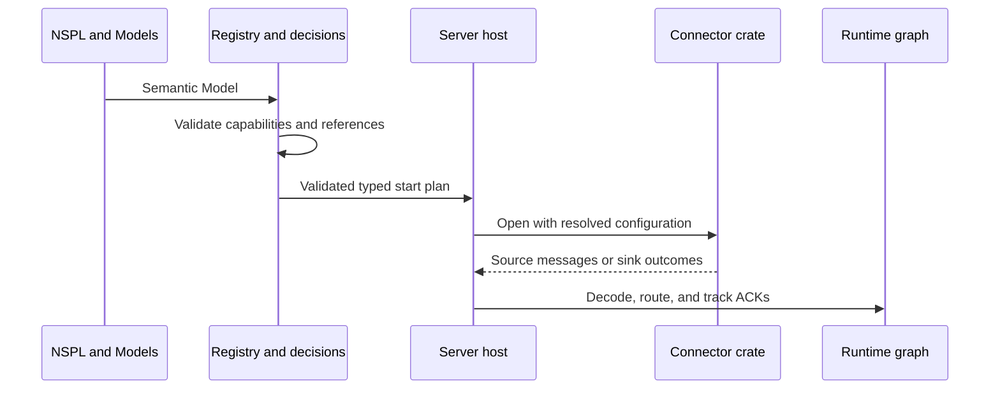
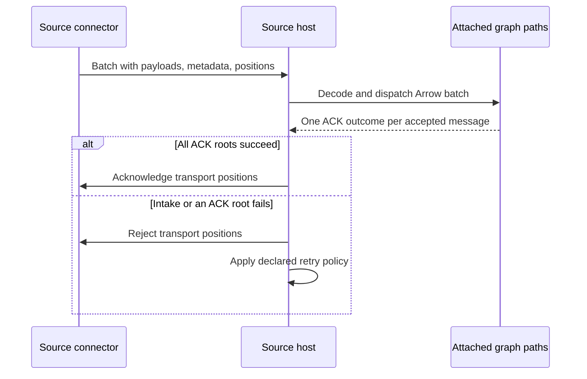
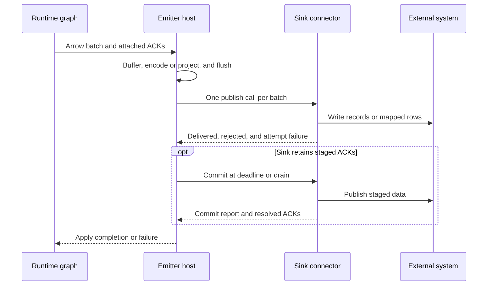

# Connector Crates And The Connector Contract

An external integration meets Nervix at a data-plane boundary. The [ingestor](./ingestors.md)
and [emitter](./emitters.md) manuals define its NSPL surface and delivery options. This chapter
defines who owns the work after validation: the shared connector contract, each integration's
transport, and the host that drives it. [Data Plane](./data-plane.md) describes what happens to
the resulting Arrow batches inside the graph.

## Ownership and dependency direction

| Layer | Responsibility |
| --- | --- |
| Vocabulary and registry | Define and validate source capabilities, schemas, delivery modes, header availability, branches, and references before activation. The registry names no connector crate. |
| Decision and composition | Convert a validated Model into a typed source or sink start plan once. The server is the composition root and the only crate that names every integration. It resolves client resource mounts before opening a connector. |
| `nervix-connector` | Define source and sink operations, typed boundary values, and opaque host services. It knows neither a driver nor graph execution state. |
| `nervix-connector-*` | Own one integration's driver, connection and configuration interpretation, transport headers, protocol acknowledgements, and per-record results. A crate implements the source contract, the sink contract, or both. |
| Host data plane | Own tasks, intake and Arrow decoding, branch routing, ACK trees, quiesce, buffering, retry and flush scheduling, metrics, events, and drain. It executes typed plans; it does not parse NSPL or read a Model during data-plane execution. |

The contract may name shared vocabulary types, Arrow, the async and error facilities needed by its
boundary, and configuration helpers for TLS, HTTP clients, service URLs, resource mounts, and
physical time. It must not name the registry, runtime, relays, branches, schedules, or a driver.
An integration crate may depend on the contract, vocabulary, Arrow, and its own driver stack. It
must not depend on the server, another integration crate, or runtime collectors. Driver libraries
belong in that integration's manifest, with test-harness dependencies kept separately. A
connector receives resolved configuration and a typed plan, not graph routing authority. The
exception among sources is the node's own HTTP/HTTPS endpoint: it has no external driver and lives
in the server, but uses the same source lifecycle and host intake.

## Source boundary

A source plan combines connector-specific settings, validated capabilities, and the host's ACK
policy. Capabilities state whether header reads are available, which typed metadata scope exists,
whether quiesce is supported, the nonzero instance count, and the supported acknowledgement mode.
The source owns `open`, `suspend`, `resume`, `close`, the next broker batch or scheduled poll, and
the meaning of acknowledging or rejecting its own position. A broker message lends its payload,
headers, typed metadata, and transport position to the host. Positions remain connector-owned;
the host never interprets one as a graph identity.

The metadata boundary has distinct header, Kafka, and Syslog scopes. Kafka carries topic,
partition, offset, and headers; Syslog carries the peer address. Transport headers are visited
from the borrowed message in arrival order. The host copies them only when quiesce buffering or a
WebSocket session must retain them after the source message ends. Header support and each
system's mapping are explicit: HTTP endpoint and polling headers, WebSocket upgrade headers,
Kafka record headers, NATS headers, Pulsar properties, RabbitMQ AMQP headers, and SQS attributes
retain their connector-specific semantics. Other source families do not offer header reads.
`read_header` and `read_headers` are validated against those capabilities; header values do not
travel through relays unless an ingestor writes them into schema-backed fields. See
[Header Context](./ingestors.md#header-context) for the exact expression behavior.
The session completion resolver uses the same vocabulary source capability before the full
ingestor is parsed, so it offers those functions only for sources that can read headers. Its
emitter `INVOKE` completion similarly uses the vocabulary sink capability to offer `write_header`
only for sinks that can write headers. Runtime validation remains authoritative.

The host runs three source loop families, with a listener using the broker loop:

| Family | Host behavior | Source behavior |
| --- | --- | --- |
| Broker and listener | Open instances, manage readiness and quiesce, request batches, decode and dispatch, wait for ACK roots when configured, then acknowledge or reject positions and pace retry. | Subscribe, receive, expose transport positions and metadata, and perform transport ACK or rejection. Syslog is a listener with no broker ACK. |
| Paced | Bind and wait on the domain cadence, hand the scheduled instant to one poll, admit its returned messages without broker ACKs, and report poll failures. | HTTP and Prometheus perform one transport poll; they do not bind a domain clock or choose the cadence. |
| Request scoped | Bind endpoint routes to request intake, admit and dispatch each request there, replay retained quiesce work, then unbind on close. | The endpoint source has no polling transport or broker position. |

For broker sources, `None` admits without an ACK root; `Sequential` requests one message and
waits for its ACK tree; `Parallel` requests up to the declared in-flight limit within its batch
timeout. The host waits for every accepted message's ACK outcome before acknowledging the batch's
transport positions. A failed or timed-out ACK rejects the positions and retries according to the
source's delivery policy. A transport without an acknowledged delivery mode has no redelivery
guarantee from Nervix. The sequence below shows an acknowledged broker policy. The precise
source-specific effects and NSPL modes are in
[Ingestors](./ingestors.md) and [Shutdown And Recovery](./shutdown.md#connector-contracts).

## Sink boundary

The host prepares one batch for either of two sink contracts. A **record sink** receives
codec-encoded keys, payloads, headers, optional ordering groups, timestamps, and host positions.
A **row sink** receives host-projected Arrow columns, target columns, selected rows, and bounded
chunks; it encodes its external representation from those columns. The host evaluates `VALUES`
once per batch and excludes rows with mapping errors before calling a row sink. It retains ACKs
by position, so no runtime ACK map enters the connector. Each publish is one call per batch,
never a virtual call per row.

An ordering group exists only where the sink plan declares one; today that is the SQS
`FIFO GROUP`. The host compiles the declaration, evaluates it once per filtered source batch, and
carries the result beside the batch: the batch's branch key for `FROM BRANCH`, or a string column
for an expression, whose null rows keep the reason they have no group. It selects that column
through the rows the emitter's route keeps, so each record keeps the group of its own input row. A
record without a group is rejected by the host under the emitter's message error policy and never
reaches the connector, which receives each remaining record's group already evaluated. An emitter
whose plan declares no group carries nothing beside its batches.

Each connector classifies definite delivery and rejection per record, and may report one
infrastructure failure for the attempt. The host applies those outcomes to the corresponding ACK
roots and error policy. The emitter task owns its buffer, maximum batch size, flush cadence,
retry schedule, fault injection, stop deadline, and metrics. The connector owns the external
operation and its completion point. A receiver-requested delay can extend, but cannot shorten,
the host's retry backoff. `finish` lets a transport empty a client-side queue within the remaining
stop deadline; Kafka uses it. A sink may keep its client after a publish failure when reopening it
would discard staged work or a persistent session.

For a sink that stages writes, the lifecycle exposes a domain or physical commit deadline,
staged-message count, pending ACKs, and a commit operation. The host includes that deadline in
the emitter wake and forces a commit during drain. It keeps retained ACKs alive during commit and
retry, and reports sent metrics only after the commit reports publication. A failed commit retries
on the emitter's declared backoff until it succeeds or the stop deadline ends the attempt. See
[ACK Semantics And Effective Delivery](./emitters.md#ack-semantics-and-effective-delivery) for
the user-visible delivery consequences.

## Integration-specific boundaries

- **Kafka source.** The driver inspects topic partitions and reads or commits Kafka offsets.
  With `OFFSET BY DOMAIN`, the host supplies typed access to replicated next-offset state and a
  committed partition schedule. The leader observes partition topology and commits assignments;
  executing sources follow that schedule. Offset snapshots can lag a crash, so this mode remains
  at least once. [Kafka ingestion](./ingestors.md#kafka) defines the recovery details.
- **Iceberg sink.** It stages Arrow data locally, prepares data files, and publishes a catalog
  update on its explicit commit cadence or maximum size. Staging does not complete an ACK;
  successful catalog commit does. The sink retains ACKs and its client while a failed commit is
  retried. [Iceberg emission](./emitters.md#iceberg) defines the external commit and duplicate
  limits.
- **Pooled sinks.** The connector owns the driver's pool and borrowed connection. The host owns
  the lease on the node's named client and the runtime wait while no connection is available.
  [Database client pools](./database-client-pools.md) defines the bounds.
- **Listening entities.** A configured server-side listening port is bound on every live Nervix
  node, independent of leadership and placement. This includes Syslog and server endpoint
  listeners. The host owns their lifecycle across joins, restarts, elections, and shutdown;
  their transport implementations remain in their owning integration or server edge.
- **WebSocket signaling.** The WebSocket crate owns the compiled signaling engine shared by
  client sources and server endpoint sessions. Its send, wait, and accept-data steps govern when
  frames become payload; the host still owns intake and routing. This compilation currently
  consumes a signaling-protocol Model at startup. This is an existing boundary defect to remove;
  it does not give source or sink execution permission to parse NSPL or route graph records.

## Failure and observation

An ingestor opens all source instances before registration, so a failed source start leaves no
running ingestor. A sink initialization failure is reported as an emitter initialization error;
the emitter remains unavailable and retries opening on its configured backoff. Invalid settings
and missing external topics, queues, tables, namespaces, or other required entities surface as
start errors: Nervix does not create them as a side effect. During execution, read and publish
failures are classified separately from definitive record rejections. The host reports transient
status and events, retries infrastructure failures, and preserves the configured message and
general error policies. A commit failure keeps staged ACKs pending and visible until retry or
drain failure; it never turns staging into success. A forced ending loses in-memory batches and
ACK state, leaving external redelivery to each source's contract.

The host owns ingestor and emitter metric updates, transient status, and runtime events. Source
open, resume, suspend, and close transitions have lifecycle logs; publish, retry, and commit
failures carry connector identity without sensitive payload values. For metric names and
`DESCRIBE` fields, use [Metrics And Observability](./metrics-and-observability.md). The
[Ingestors](./ingestors.md) and [Emitters](./emitters.md) manuals document connector-specific
status and delivery output; [Shutdown And Recovery](./shutdown.md#connector-contracts) owns the
drain boundary. This chapter does not redefine those output formats.

## Adding an integration

1. Define its vocabulary Model and capabilities, then add NSPL grammar and completion for the
   public statement form. Keep external driver configuration raw only where pass-through is its
   intentional contract.
2. Validate schema, reference, branch, header, quiesce, delivery, and external contract rules in
   the registry. Convert the validated Model into one typed start-plan variant before execution.
3. Add one crate under `crates/connectors/` with its ownership header, driver dependencies, and
   source or sink contract implementation. Add its composition mapping in the server; do not
   teach the contract or registry about the driver.
4. Add unit coverage for transport behavior and feature scenarios through NSPL, including
   three-node execution and failure paths. Confirm the crate boundary and run the repository's
   validation and connector tests.
5. Update the [Ingestors](./ingestors.md) or [Emitters](./emitters.md) manual, relevant client and
   metric documentation, and the [NSPL skill](https://github.com/nervix-io/nervix/blob/main/.agents/skills/nspl/SKILL.md) routing when its
   user-facing guidance changes. Regenerate the book.

The connector split was functionally qualified across 46 integration feature files and 359
scenarios, including three-node examples, in [Connectors 14's evidence](https://app.clickup.com/t/86bc21vve).
That evidence supports the current source and sink behavior; it does not claim throughput parity.
Its Kafka A/B measurements found lower bounded-pressure rates and a separate 16-partition commit
failure that require owner investigation. An integration must preserve its own transport and
delivery semantics rather than assuming a generic envelope or exactly-once external outcome.
