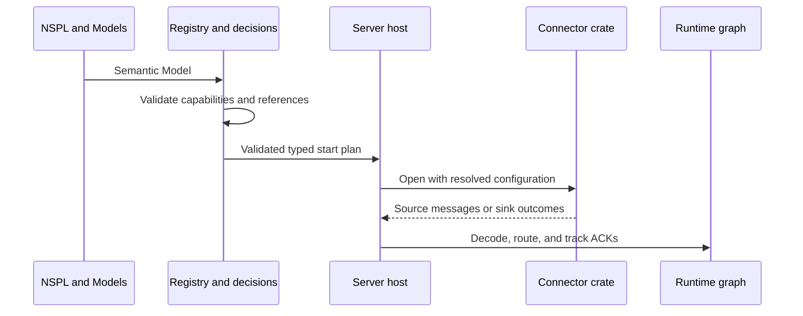
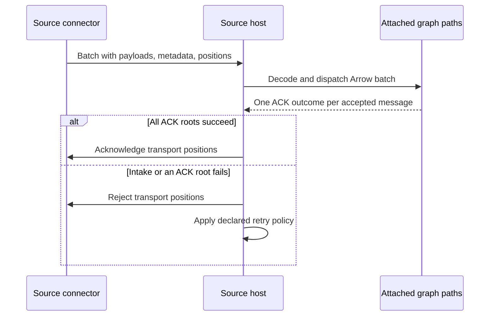
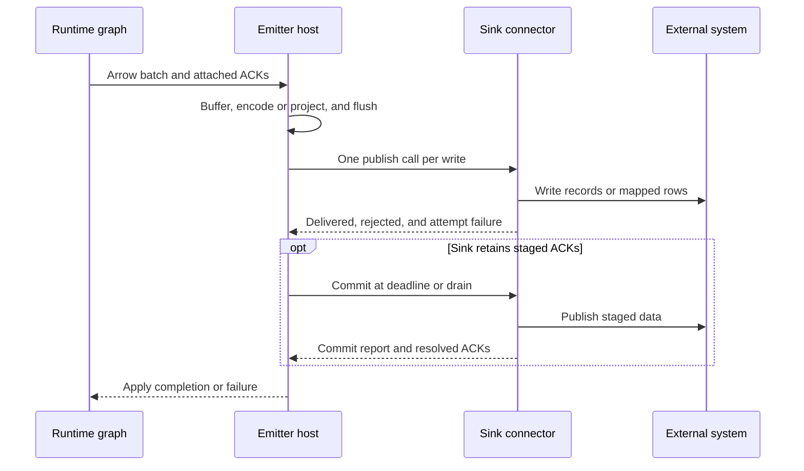

# Connector Crates And The Connector Contract

An external integration meets Nervix at a data-plane boundary. The [ingestor](./ingestors.md)
and [emitter](./emitters.md) manuals define its NSPL surface and delivery options. This chapter
defines who owns the work after validation: the shared connector contract, each integration's
transport, and the host that drives it. [Data Plane](./data-plane.md) describes what happens to
the resulting Arrow batches inside the graph.

## Ownership and dependency direction

| Layer | Responsibility |
| --- | --- |
| Vocabulary and registry | Define and validate source capabilities, schemas, delivery modes, header availability, branches, and references before activation. The registry names no connector crate. |
| Decision and composition | Convert a validated Model into a typed source or sink start plan once. The registry decides every ingestor's source plan together with its codec and lowered routes, validating the source name, kind, client and route identities as one decision. The server is the composition root and the only crate that names every integration. It resolves client resource mounts before opening a connector. |
| `nervix-connector` | Define source and sink operations, typed boundary values, and opaque host services. It knows neither a driver nor graph execution state. |
| `nervix-connector-*` | Own one integration's driver, connection and configuration interpretation, transport headers, protocol acknowledgements, and per-record results. A crate implements the source contract, the sink contract, or both. |
| Host data plane | Own tasks, intake and Arrow decoding, branch routing, ACK trees, quiesce, buffering, retry and flush scheduling, metrics, events, and drain. It executes typed plans; it does not parse NSPL or read a Model during data-plane execution. |

The contract may name shared vocabulary types, Arrow, the async and error facilities needed by its
boundary, and configuration helpers for TLS, HTTP clients, service URLs, resource mounts, and
physical time. It must not name the registry, runtime, relays, branches, schedules, or a driver.
An integration crate may depend on the contract, vocabulary, Arrow, and its own driver stack. It
must not depend on the server, another integration crate, or runtime collectors. Driver libraries
belong in that integration's manifest, with test-harness dependencies kept separately. A
connector receives resolved configuration and a typed plan, not graph routing authority. Two
sources have no external driver and live in the server. The node's own HTTP/HTTPS endpoint uses the
same source lifecycle and host intake. A client source admits the batches applications submit
through their sessions; it has no connector crate, because the session protocol is its transport,
and its host is the client ingestor endpoint described under
[Integration-specific boundaries](#integration-specific-boundaries).

### DNS for HTTP and Iceberg

The node loads and validates one `nervix-dns` resolver at startup. Composition passes its handle
into the HTTP polling and Prometheus source plans and into the HTTP request, Sentry, OTEL HTTP, and
Iceberg sink plans. The shared `HttpClientConfig` installs it on every Nervix-owned Reqwest 0.13
HTTP client. Iceberg REST uses a separate Reqwest 0.12 client with that same resolver. Iceberg
object storage uses OpenDAL 0.57 with a configured Reqwest 0.13 client installed through
`HttpClientLayer`; the layer also supplies HTTP calls made by OpenDAL's credential providers through
its accessor info.
The Reqwest 0.12 client receives an explicit AWS-LC rustls configuration with bundled trust
roots, including in an isolated Iceberg connector build.
The three Iceberg backends keep their S3, GCS, and Azure property mappings, URL-derived bucket or
container, timeout and retry layers, and commit boundary. The standalone OpenDAL S3
`detect_region` helper constructs its own client, but Nervix does not call it; S3 operator
construction requires its configured region or the driver's environment policy.

No migrated client constructs Reqwest's default Hickory resolver. That default could choose a
public name server if reading system DNS configuration failed. A bad node resolver configuration
therefore fails node startup, while a lookup failure reaches the existing source or sink failure
path. Request URLs, HTTP authority, proxy behavior, TLS verification, custom trust and identity,
and connection pools remain with the HTTP client. The request timeout includes DNS resolution,
connection setup, TLS and response handling; the resolver's own 30 second ceiling only bounds
clients without a shorter request timeout. DNS failures use the host's existing retry policy and
do not create application-level probes or acknowledgements.

### DNS for RabbitMQ

Composition also passes the node resolver into every RabbitMQ source plan and sink configuration.
The connector reads the client's `addr` as an AMQP URI and takes its host from the URL grammar,
because Lapin's own grammar substitutes `localhost` for an IPv6 literal host. Every connection resolves that host again through the node resolver: a sink's start, its
reopening after a failed publish, and each source instance's resume. A literal IPv4 or IPv6 address
is its own answer. The connector tries the answers in resolution order, each within an equal share
of what remains of a 30 second budget, and for `amqps` completes the TLS handshake within what is
left. The handshake verifies the broker certificate against the host `addr` names, whichever of its
addresses was dialled, trusting the platform roots and the client's `tls_ca_file`. The connector
then hands the established transport to Lapin through `Connection::connector`. Lapin's own
reconnection stays off, so it asks that hook for a transport exactly once and runs the AMQP
handshake over it. The AMQP handshake still has no deadline of its own, and the URI's
`connection_timeout` query parameter has no effect.

Lapin's `hickory-dns` feature is deliberately not selected. It resolves through one process-wide
async-rs resolver built on first use from the host's `/etc/resolv.conf`, which ignores the node's
resolver configuration, hosts snapshot, lookup budget and concurrency bound. That resolver also
keeps name-server connections whose tasks ran on the Tokio runtime of its first lookup, so a later
runtime inherits connections of one that may have stopped. `just validate-dns-dependencies` keeps
the feature off in the isolated RabbitMQ connector and in the server, and checks that Lapin's TLS
stays on AWS-LC.

A failed connection is a `RabbitMqConnectError`. A lookup failure keeps its `DnsLookupFailure`, and
unreachable addresses, a failed or overdue TLS handshake, and a failed AMQP handshake are their
own variants. A source reports the failure as a resume failure and retries on its declared
`RETRY POLICY`. A sink reports an invalid address or CA file as a configuration failure and every
other connection failure as an initialization failure, and the emitter host reopens it on its
backoff. Neither path acknowledges undelivered data: a source that cannot connect holds no
delivery, and a sink that cannot connect confirms nothing, so the input stays unacknowledged until
a later connection delivers it. A connection that fails before its AMQP handshake has started no
Lapin thread, and a failed handshake ends that thread and closes the socket. An established
connection is not closed because its host's answer changed or expired; the next connection uses
the new answer.

### DNS for ClickHouse and SQS

Composition passes the node resolver into every ClickHouse sink configuration and into every SQS
source plan and sink configuration. Both connectors keep their driver's HTTP client and hand the
resolver to it at the driver's own DNS hook, so every new connection resolves its host again while
the request URL, its authority, the TLS server name and the signing inputs remain what the client
configured. `nervix-dns` implements both hooks on the node resolver: Hyper's resolver service for
`hyper-util`'s `HttpConnector`, and Smithy's `ResolveDns`.

A ClickHouse client builds `HttpConnector` over the node resolver in both of its forms. Without TLS
entries it is the plain HTTP client the driver would build for itself in this build, which has no
driver TLS feature: an `https` address fails its request, and the connector keeps the driver's
60-second TCP keepalive and 2-second pool idle timeout. With `tls_ca_file` or client identity
entries the same connector is wrapped in the AWS-LC rustls configuration those entries build,
trusting the bundled WebPKI roots, the platform's native roots and the configured CA, and serving
`http` or `https` addresses. Hyper
dials a literal IPv4 or IPv6 host without asking the resolver, tries a name's answers in order, and
applies the URL's port or its scheme's default. The connector's `timeout_ms` bounds the send and the
response of an insert, and the connection and its lookup run inside that response wait.

An SQS client installs a Smithy HTTP client whose connector resolves through the node resolver
with `build_with_resolver`. Without `tls_ca_file` the client is the SDK's default HTTPS client with
that resolver: AWS-LC, the platform's native roots, and a proxy taken from `HTTP_PROXY`,
`HTTPS_PROXY` and `NO_PROXY`, whose host the node resolver resolves while the proxy resolves the
service. With `tls_ca_file` it trusts that CA alone and uses no proxy, as before. The SDK signs each
request with SigV4 for the configured endpoint before the connector resolves its host, so the
signature, the `Host` header and the certificate check all name that host, whichever address
accepted the connection. The SDK's default 3.1-second connect timeout, and the operation and
attempt timeouts a sink's `timeout_ms` sets, include the lookup. The client names static
credentials and its region, so `aws-config` never consults the default credential or region chains
that could reach IMDS, ECS, STS or SSO over HTTP. It still builds its SSO token chain, which SQS
never asks for a token because it signs with SigV4; the loader receives the same HTTP client, so
that chain would use the node resolver too.

Both hooks give a lookup at most 30 seconds, like the Reqwest hooks; the client's own deadline
cancels it sooner, and a lookup cut short that way fails as that deadline's timeout rather than as a
lookup failure. A lookup failure reaches the connector as a cause of the driver's connection
error, where the connector finds the typed `DnsLookupError` and keeps it as the context beneath its
existing failure: a ClickHouse publish failure, an SQS sink start or publish failure, and an SQS
source open, read or acknowledgement failure. The report's message names the host and the lookup
failure. Any other failure to reach the service, including a certificate that does not name the
configured host, is described by every cause of the driver's connection error, which describes the
connection and never a record; a service's own response keeps its existing description. None of
these failures rejects a record or acknowledges input. The host retries each on its declared
backoff. An SQS sink keeps the SDK's own retries disabled, while an SQS source keeps the SDK's
standard retry mode, which makes up to three attempts at a request whose connection failed, lookup
failures included, before the source reports the failure. Pooled connections stay open when their
host's answer changes or expires; the next connection resolves again.

```mermaid
sequenceDiagram
    participant NSPL as NSPL and Models
    participant Registry as Registry and decisions
    participant Host as Server host
    participant Driver as Connector crate
    participant Graph as Runtime graph
    NSPL->>Registry: Semantic Model
    Registry->>Registry: Validate capabilities and references
    Registry->>Host: Validated typed start plan
    Host->>Driver: Open with resolved configuration
    Driver-->>Host: Source messages or sink outcomes
    Host->>Graph: Decode, route, and track ACKs
```

## Source boundary

Each domain revision installs its ingestor plans with its schedule. Building a domain, swapping or
relocating an ingestor, starting the ingestors a runtime revision leaves missing, and placing Kafka
domain offsets all read those same plans; none of them reads the ingestor's Model. Starting an
ingestor binds its codec, node filter, routes and branched entrypoints against the installed domain
surfaces and parses its declared acknowledgement before any connector instance opens, so a start
that fails leaves nothing running.

A source plan combines connector-specific settings, validated capabilities, and the host's ACK
policy. Capabilities state whether header reads are available, which typed metadata scope exists,
whether quiesce is supported, the nonzero instance count, and the supported acknowledgement mode.
The source owns `open`, `suspend`, `resume`, `close`, the next broker batch or scheduled poll, and
the meaning of acknowledging or rejecting its own position. A broker message lends its payload,
headers, typed metadata, and transport position to the host. Positions remain connector-owned;
the host never interprets one as a graph identity.

A client source's plan is not a connector plan: it carries the input schema, its compiled form, the
producer policy of window, ACK timeout, and retry backoff, and the endpoint contract digest producers
attach to. It declares no header or metadata scope and supports only `SUSPEND`.

The metadata boundary has distinct header, Kafka, and Syslog scopes. Kafka carries topic,
partition, offset, and headers; Syslog carries the peer address. Transport headers are visited
from the borrowed message in arrival order. The host copies them only when quiesce buffering or a
WebSocket session must retain them after the source message ends. Header support and each
system's mapping are explicit: HTTP endpoint and polling headers, WebSocket upgrade headers,
Kafka record headers, NATS headers, Pulsar properties, RabbitMQ AMQP headers, and SQS attributes
retain their connector-specific semantics. Other source families do not offer header reads.
`read_header` and `read_headers` are validated against those capabilities; header values do not
travel through relays unless an ingestor writes them into schema-backed fields. See
[Header Context](./ingestors.md#header-context) for the exact expression behavior.
The session completion resolver uses the same vocabulary source capability before the full
ingestor is parsed, so it offers those functions only for sources that can read headers. Its
emitter `INVOKE` completion similarly uses the vocabulary sink capability to offer `write_header`
only for sinks that can write headers. Runtime validation remains authoritative.

The source host decodes consecutive payloads into one ingest group's Arrow builders. For a
schemaful JSON codec, that group also owns mutable payload scratch and simd-json parser buffers;
the connector continues lending immutable payload bytes, and the host reuses its storage until the
group closes. Compiled field keys direct borrowed JSON values into typed columns without a serde
tree or an intermediate row representation. A rejected payload abandons only the partial Arrow row
it started, preserving the accepted rows and transport positions around it.

The host runs three source loop families, with a listener using the broker loop:

| Family | Host behavior | Source behavior |
| --- | --- | --- |
| Broker and listener | Open instances, manage readiness and quiesce, request batches, decode and dispatch, wait for ACK roots when configured, then acknowledge or reject positions and pace retry. | Subscribe, receive, expose transport positions and metadata, and perform transport ACK or rejection. Syslog is a listener with no broker ACK. |
| Paced | Bind and wait on the domain cadence, hand the scheduled instant to one poll, admit its returned messages without broker ACKs, and report poll failures. | HTTP and Prometheus perform one transport poll; they do not bind a domain clock or choose the cadence. |
| Request scoped | Bind endpoint routes to request intake, admit and dispatch each request there, replay retained quiesce work, then unbind on close. | The endpoint source has no polling transport or broker position. |
| Client batches | Keep the producers of one client ingestor, admit their batches one at a time through one admission worker per execution, give each admitted batch one ACK root, and answer each batch with its outcome. | There is no source connector: producers submit Arrow IPC batches through the session protocol. |

For broker sources, `None` admits without an ACK root; `Sequential` requests one message and
waits for its ACK tree; `Parallel` requests up to the declared in-flight limit within its batch
timeout. The host waits for every accepted message's ACK outcome before acknowledging the batch's
transport positions. A failed or timed-out ACK rejects the positions and retries according to the
source's delivery policy. If rejection itself fails, the host retains those positions, suspends
the source, and reestablishes its assignment. It retries the same rejection before polling any
later batch or committing a later position. A transport without an acknowledged delivery mode has
no redelivery guarantee from Nervix. The sequence below shows an acknowledged broker policy. The
precise source-specific effects and NSPL modes are in
[Ingestors](./ingestors.md) and [Shutdown And Recovery](./shutdown.md#connector-contracts).

```mermaid
sequenceDiagram
    participant Source as Source connector
    participant Host as Source host
    participant Graph as Attached graph paths
    Source->>Host: Batch with payloads, metadata, positions
    Host->>Graph: Decode and dispatch Arrow batch
    Graph-->>Host: One ACK outcome per accepted message
    alt All ACK roots succeed
        Host->>Source: Acknowledge transport positions
    else Intake or an ACK root fails
        Host->>Source: Reject transport positions
        Host->>Host: Apply declared retry policy
    end
```

## Sink boundary

Each committed domain schedule becomes one complete typed execution revision before it reaches the
host. That revision carries placement, entrypoint and emitter plans, and the exact ownership-handoff
fingerprint of the committed schedule. It decides one typed emitter execution plan per scheduled
emitter before publishing the domain execution. The plan resolves its sink clients and codec,
retains its ordered source relay edges and lowered source predicates, and lowers its route, HTTP
request fields, SQS ordering group and the mappings of row and row request sinks. It also converts
OTEL resource literals and the Iceberg commit cadence and size into connector values. Initial startup,
reassignment and an entity swap use that same plan. A swap publishes new source and remote
consumer edges from the new plan; it does not reconstruct the emitter from a Model in the host.
The host resolves resource mounts and binds the lowered VM programs to installed schemas and UDFs
when it starts the task. A retry reopens the sink with the same typed configuration.

The host prepares one write for one of four sink contracts. A **record sink** receives
codec-encoded keys, payloads, headers, optional ordering groups, timestamps, and the identity the
host assigned each record of the write. A **row sink** receives a run of host-projected Arrow
carriers of one source relay and concrete branch, the target columns their mapped columns are
written to, and each carrier's selected rows, execution time and, for a sink that retains them,
acknowledgements; it encodes its external representation from those columns. A **row request
sink** receives the same projected columns one carrier at a time and prepares requests from them
once: each prepared request is the exact bytes the connector will send and the source positions of
the rows it carries. The host retains every prepared request and hands it back, under an identity
it assigns for the write, until the connector answers for it. An **HTTP request sink** receives
prepared requests: each carries the identity the host assigned it, the validated method, the target
normalized on the client's origin, the application headers after case-insensitive replacement, and
the exact body bytes the codec produced or no body at all. The host evaluates `VALUES` once per
batch and excludes rows with mapping errors before calling a row sink or a row request sink. It
retains the ACKs of the source rows every record, mapped row or request carries, so no runtime ACK
map enters the connector. Each publish is one call per write, never a virtual call per row.

The host compiles a row or row request sink's `VALUES` projection before opening that sink. A failed VM
inference or compilation retains its typed VM report under the domain and emitter context, then
the sink-initialization context. The emitter follows its existing initialization retry policy;
the connector never receives a partially compiled mapping.

The ClickHouse row sink uses the shared columnar JSON writer for `JSONEachRow`. It prepares typed
column readers and string escape masks once for each carrier of a write, then writes each selected
row in mapping order without building per-row JSON values. It selects the writer's octet encoding
for binary columns, so a `String` column stores a `BYTES` value's own octets rather than base64
text. It keeps the host's request cadence and per-record outcomes.

An ordering group exists only where the sink plan declares one; today that is the SQS
`FIFO GROUP`. The host binds the lowered declaration, evaluates it once per filtered source batch, and
carries the result beside the batch: the batch's branch key for `FROM BRANCH`, or a string column
for an expression, whose null rows keep the reason they have no group. It selects that column
through the rows the emitter's route keeps, so each record keeps the group of its own input row. A
record without a group is rejected by the host under the emitter's message error policy and never
reaches the connector, which receives each remaining record's group already evaluated. An emitter
whose plan declares no group carries nothing beside its batches.

Each connector classifies definite delivery and rejection per record, and may report one
infrastructure failure for the attempt. A record sink answers for a record under the identity the
host gave it, and a row sink answers for a mapped row under that row's source position. A row
request sink refuses a mapped row under its position while it prepares requests, and answers for a
prepared request under the identity the host gave it. The host checks a record or request sink's
answers against the write before applying any of them: an answer for a record the write did not
carry, or a second answer for one record, breaks the contract and fails the attempt without a
retry. A record left unanswered without a reported failure leaves the attempt unresolved, and the
host retries it, because nothing says that record was not written. It checks a row request sink's
preparation the same way before it retains anything: every row it handed over must be a member of
exactly one request or refused, every request must carry a row, and every member must follow the
members of the requests before it in source order, so the retained requests are sent in the order
the connector prepared them. A preparation that breaks any of these fails the attempt without a
retry and retains nothing, because the same connector would prepare the same rows the same way
again. The host
applies the answers to the corresponding ACK roots and error policy. The emitter task owns its buffer, maximum batch size, flush cadence,
retry schedule, fault injection, stop deadline, and metrics. The connector owns the external
operation and its completion point. A receiver-requested delay, which a connector attaches to the
attempt's failure, can extend, but cannot shorten, the host's retry backoff; the backoff sequence
advances as it would without it. The host ignores a delay whose end its monotonic clock cannot
represent, so the backoff alone decides that wait. `finish` lets a transport empty a client-side
queue within the remaining stop deadline; Kafka uses it. A sink may keep its client after a
publish failure when reopening it would discard staged work or a persistent session.

The task loop keeps the connector state, buffer, retry schedule, backoff, and reconnect decision in
one mutable owner. Force flushes, cadence or retry wakes, and input-triggered publishes all apply one
outcome transition: success clears retry state and records sent metrics, a retryable failure defers
the owned work and decides whether to reconnect, and a terminal failure routes every still-owned
source batch through the emitter's message error policy. Stop requests retain their separate
deadline-bounded final flush and transport finish, and a stopped interaction performs its final
drain before the loop exits.

When that policy sends a failed emitter record to a DLQ, the host executes the message-error SET
program bound during domain installation or replacement. The prepared route retains the input and
optional attempted codec-record schemas, the source branch, relay target and flush cadence. The
connector receives no error-record Model or VM program and makes no DLQ routing decision.

Terminal node or domain teardown is a different boundary from a successful stop request. After
its drain budget ends, it cancels an emitter task even when the connector is waiting for an
external answer. The host drops that task's prepared payloads and unresolved ACK guards without
turning the cancellation into a delivered response or a record-specific message error. The
source's acknowledgement and recovery contract then decides whether the record returns. An
entity-pause swap uses the stop request instead and cannot install the replacement until its old
task drains successfully.

For a record sink using the emitter `BATCH` clause, the host selects rows from successive
Arc-backed Arrow carriers released by one flush. It retains each carrier's source relay, exact
branch key, execution time and original batch and row position. The host prepares members in
arrival order and seals a payload when the source relay, branch, key, ordered headers, ordering
group or codec container metadata changes. The codec encodes each candidate under `MAX SIZE`, and
the host subdivides a candidate that does not fit; Arrow memory accounting still belongs to
`FLUSH`. The connector sees one encoded record per completed payload and answers for it under the
record's identity, without learning which rows the payload carries.

The connector owns the destination's own limit on each record, whether the record carries one row
or a whole batch payload, because only the connector knows what it writes around the payload.
Where it can learn that limit it measures the complete message and rejects a record that cannot
fit before writing it, with a reason naming the size and the limit, so the rejection follows the
message error policy instead of failing the transport: the MQTT sink measures the `PUBLISH` packet
against the Maximum Packet Size of the broker's latest `CONNACK` and the largest packet MQTT can
express, the SQS sink counts attributes and the FIFO group against 256 KiB, and the Kafka producer,
the NATS client and the Pulsar client check `message.max.bytes`, `max_payload` and the
`maxMessageSize` of the connection's `CommandConnected` with the key, headers or message metadata
they write. A limit the connector cannot learn stays with the destination, and the destination's own
answer decides the outcome. A Pulsar broker answers a message above a topic's own `maxMessageSize`
policy with `NotAllowedError`, a definitive rejection of that message. RabbitMQ never tells a client
its `max_message_size`, but its refusal of a larger body closes the channel with the limit named,
so the RabbitMQ sink rejects the first message of the write the broker had not answered whose body
exceeds that limit, with the same kind of reason, and writes the messages the broker discarded
behind it again on a new channel. Anything else a destination reports when a message exceeds its
limit is classified like any other publish failure.

Syslog sends a completed codec payload as one transport frame. Its UDP writer rejects a frame above
65,507 bytes, octet-counted TCP and TLS reject a count needing more than ten digits, and
non-transparent TCP rejects one containing LF. The Sentry writer accepts one
JSON event per envelope and checks the final event after default fields are added against the
1 MB decompressed event limit. Both classify a definite local refusal as a record rejection;
their transport and service failures retain their existing retry boundaries.

The host owns that membership. It keeps every payload it offers the sink, with its exact bytes,
key, headers, ordering group and member positions, in the emitter buffer beside the batches the
members came from, and marks the members prepared so that no later attempt packs them again. A
confirmation delivers every member at the completion point `MODE` selects. A rejection routes every
member through `ON MESSAGE ERROR` with the sink's one error reference, each member keeping its own
execution time, branch and acknowledgement. A payload the attempt left unanswered, because the sink
failed or its outcome is unknown, stays retained unchanged. The next attempt, whether a retry, a
force flush or a drain, writes it again byte for byte with the same members, ahead of any payload
packed after it, and never writes a payload the sink already confirmed or rejected. The retry
schedule keeps the members' acknowledgements alive while they wait, and the buffer counts them as
work the node still holds until they resolve. The retained payloads live with the buffer rather
than the connector, so reopening a connector between attempts keeps them; only a failure that ends
the attempt for good releases them, and their members then follow the error policy with every other
unresolved row. A row sink names every member itself, so its retry writes only the rows it left
unresolved; MongoDB's per-document results shrink a retried bulk write this way.

A row sink divides its own writes, because only the connector can measure what it sends. The
host projects each buffered carrier once and hands the sink every run of successive carriers of
one source relay and concrete branch in one call, so a write never spans relays or branches. The
typed plan passes the emitter's `BATCH` limits to the connector, which narrows them to what its
destination takes in one request and divides the run by one rule the contract crate owns:
candidates in packing order of at most the row limit, a candidate whose exact measured size exceeds
the byte limit halved and measured again with the rest returned to the front, and a single row that
still exceeds it rejected alone. A row over `MAX SIZE` is a `validation` error of the `encode`
operation; a row within it that the destination could never take is the destination's `external`
rejection of the row. Every request answers for the rows it carried, and a failed request leaves its
rows and every later request's unresolved for the host to retry, so a retry packs the same rows into
the same requests again.

The database sinks divide the whole run. ClickHouse measures the `JSONEachRow` body of an insert,
each row's line encoded once and sent as a slice of one buffer. Postgres measures the one `unnest`
statement every insert of the write executes and the text arrays it binds, exactly as the driver
encodes them, and never lets that size exceed the largest protocol message the server reads, which
bounds the Bind message that carries the arrays. MySQL measures each multi-row statement and every
value's binary-protocol encoding, and narrows the row limit to the rows whose placeholders fit the
65,535 one statement binds. MongoDB measures each inserted document with the `_id` the driver
prepends, or each upsert's filter and update documents, and rejects a row whose document exceeds
the server's 16 MiB document limit before any write, because the driver would refuse the whole write
for it. A record-specific failure of a multi-row SQL write is isolated by writing its rows one at a
time; a Postgres cardinality violation, which is how `ON CONFLICT DO UPDATE` refuses one insert that
carries a key twice, is isolated the same way. MongoDB answers per document, so it needs no
isolation pass.

Iceberg is a row sink that stages each carrier of the run as its own file, which its commit
publishes.

OTEL is a row request sink, which the host hands one carrier per preparation. Without `BATCH` it
prepares the successfully mapped rows of the carrier as one Export request. With `BATCH`, its typed
plan passes the emitter's limits to the connector, which divides the successful positions by the
same rule, measuring the exact uncompressed protobuf Export request, including resource and scope,
before optional gzip or transport framing; a record whose request alone exceeds `MAX SIZE` is
refused while preparing, as a `validation` error of the `encode` operation. The connector converts
each row once and samples the log records' `observed_time_unix_nano` from actual UTC once per
preparation, then encodes each request once.

The retained boundary is that encoding: the exact protobuf bytes of the Export request and the
positions of the rows it carries, kept in the emitter buffer beside the batch payloads and HTTP
requests other sinks retain. It is the quantity `MAX SIZE` measures and the message the receiver
decodes. Gzip and the gRPC or HTTP framing are applied to it on every attempt; both are
deterministic functions of those bytes and of the client configuration, which cannot change while
the emitter runs, so an attempt compresses the retained bytes exactly as the one before it did.
Keeping compressed or framed bytes instead would tie the retained request to one transport
attempt, and the gRPC client compresses a message itself. Over gRPC the connector sends the retained
bytes through a pass-through codec rather than re-encoding a message.

The host hands the retained requests to the connector in the order they were prepared, ahead of any
request prepared after them. An accepted request delivers every row it carries, a request the
receiver refuses rejects every row it carries with one shared error reference, and neither is sent
again. A request whose outcome the connector did not learn stays retained with its bytes and rows,
and so does every request after it in that write. The next attempt, whether a retry, a force flush
or a drain, sends it byte for byte, observed timestamps included, through whichever connector the
emitter holds by then; the host reopens an OTEL connector after a failed publish, which is why the
retained request lives with the buffer. Its rows are never mapped, converted or regrouped again.
A receiver's `partial_success` still acknowledges the whole request with a warning, because OTLP
does not identify the rejected members.

An OTLP/gRPC export whose receiver never answered is retried: tonic reports a request timeout, a
connection lost before the answer, or an answer it cannot read as a status carrying the local
failure as its source, which no status a receiver sends has. An answered status is classified by
its code: `INVALID_ARGUMENT` refuses the request, `RESOURCE_EXHAUSTED` and the codes the OTLP
specification lists as retryable — `CANCELLED`, `DEADLINE_EXCEEDED`, `ABORTED`, `OUT_OF_RANGE`,
`UNAVAILABLE` and `DATA_LOSS` — are retried no sooner than the receiver's `RetryInfo`, and any other
code fails the attempt as a configuration the endpoint cannot accept. OTLP/HTTP retries a
connection failure, a timeout, a lost response, and HTTP `429` or `5xx`, refuses on `400`, and fails
on any other status.

An HTTP emitter's request fields are the host's, not the connector's. When the emitter admits a
batch, the host evaluates one compiled program over each record's original input, its finalized
codec record and the batch's materialized state, only for the rows route `WHERE` kept: `METHOD` and
`PATH` are written into a write-only request namespace, and each `write_header` invocation is
evaluated in written order. It validates each row's method, then its target on the client's
origin, then each header write, rejects a row at the first field that fails, and buffers the rest
with the fields they were admitted with, beside their Arrow rows, together with their original
source records and the batch's materialized state, which the message error of a later rejection
reads. The request-field program must compile before the sink starts; a compile failure keeps the
VM cause beneath the host's emitter context. When a flush releases a row, the host encodes its body
and retains the request, as a prepared payload with that one member, in the
same buffer that retains batch payloads. Every attempt hands the connector the retained requests
unchanged, ahead of any request prepared after them, so a retry repeats the request the destination
may already hold. One connector publish call awaits at most one request across the emitter
execution's served sources and branches. It sends them in their handed-over order, each on a
fresh HTTP/1.1 connection using the node resolver and the shared rustls trust and client-identity
configuration. The connection closes after final headers; no unread body can be reused. Its one
physical `timeout_ms` spans DNS, connect, TLS, send, interim headers and complete final headers.
The connector sends no startup probe, follows no redirect, stores no response cookie, answers no
authentication challenge with another request, and has no independent retry policy. The host
alone schedules another application attempt.

The transport generates `Host`, `Connection: close` and, for a present body,
`Content-Length`. It does not add `Accept-Encoding` or `Content-Type`. Application header writes
can supply `Accept`, content type, authorization and cookie values. Without an application
`Accept`, the transport adds `Accept: */*`.

Each interim and final response header block is checked for at most 128 fields and 64 KiB of name
and value bytes; invalid final framing fails before the status is classified. Complete valid final
`2xx` headers deliver one request, without awaiting or interpreting its body. `408`, `425`, `429`,
`5xx`, `401`, `403`, `407` and transport or header failures end the attempt with the current and
later requests unresolved; the authentication statuses retain a distinct infrastructure reason.
Other `3xx`/`4xx` and `101` reject their one request with a structured external message error,
then publication continues with the next request. The host applies delivered and rejected
members, branches and acknowledgements and keeps unresolved prepared bytes for retry.

When the final head of a retryable or authentication status carries exactly one `Retry-After`
field, the connector reads it as RFC 9110 `delay-seconds`, whole digits only, or as an HTTP date
in IMF-fixdate, RFC 850 or asctime form. It compares a date with actual UTC, read through the
contract's physical-time owner as the response arrives, and a date already past asks for no delay.
It attaches the resulting delay to the attempt's failure as the receiver-requested delay. Two such
fields, any other text, a number beyond 64 bits, a date after 2262, or a delay that would end after
2262 attach nothing, and neither does an interim head or a delivered or rejected request. The host
waits for the longer of this delay and its backoff on its monotonic clock, so the domain's
`TIME RATE` never shortens it.

For a sink that stages writes, the lifecycle exposes a domain or physical commit deadline,
staged-message count, pending ACKs, and a commit operation. The host includes that deadline in
the emitter wake and forces a commit during drain. It keeps retained ACKs alive during commit and
retry, and reports sent metrics only after the commit reports publication. A failed commit retries
on the emitter's declared backoff until it succeeds or the stop deadline ends the attempt. See
[ACK Semantics And Effective Delivery](./emitters.md#ack-semantics-and-effective-delivery) for
the user-visible delivery consequences.

```mermaid
sequenceDiagram
    participant Graph as Runtime graph
    participant Host as Emitter host
    participant Sink as Sink connector
    participant External as External system
    Graph->>Host: Arrow batch and attached ACKs
    Host->>Host: Buffer, encode or project, and flush
    Host->>Sink: One publish call per write
    Sink->>External: Write records or mapped rows
    Sink-->>Host: Delivered, rejected, and attempt failure
    opt Sink retains staged ACKs
        Host->>Sink: Commit at deadline or drain
        Sink->>External: Publish staged data
        Sink-->>Host: Commit report and resolved ACKs
    end
    Host-->>Graph: Apply completion or failure
```

## Integration-specific boundaries

- **Kafka source.** The driver inspects topic partitions and reads or commits Kafka offsets.
  With `OFFSET BY DOMAIN`, the host supplies typed access to replicated next-offset state and a
  committed partition schedule. The leader observes partition topology and commits assignments;
  executing sources follow that schedule. Offset snapshots can lag a crash, so this mode remains
  at least once. [Kafka ingestion](./ingestors.md#kafka) defines the recovery details.
- **Pulsar client.** The Pulsar source and sink build on Nervix's fork of `pulsar-rs`,
  `nervix-io/pulsar-rs`, because the released crate discards `CommandConnected`. The fork keeps each
  connection's announced `maxMessageSize`, refuses a message whose serialized metadata and payload
  exceed it before writing it, as the Java client does, and resolves a send the broker answers with
  `SendError` with that error's server code and reason. The broker itself only closes the
  connection on a frame larger than the maximum plus 10 KiB of framing, which would fail every
  other message in flight on it.
- **Iceberg sink.** It stages Arrow data locally, prepares data files, and publishes a catalog
  update on its explicit commit cadence or maximum size. Staging does not complete an ACK;
  successful catalog commit does. The sink retains ACKs and its client while a failed commit is
  retried. [Iceberg emission](./emitters.md#iceberg) defines the external commit and duplicate
  limits.
- **RabbitMQ sink.** The broker answers no `NO_ACK` message itself, so the sink ends a `NO_ACK`
  write with one round trip on its channel, which the broker answers only after it has taken every
  message written before it, and the answer delivers the write; a write costs that one round trip,
  not one per message. A broker that closes the channel names its reason, and Lapin hands it only
  to what was waiting on the channel at that moment, so the sink reads the reason from its
  connection's events, once for every channel it loses. The size refusal leaves the connection
  open, and the sink opens its next channel on it; a message the broker had not confirmed ahead of
  the refused one may be in its queue, so the attempt then fails for the host's retry. Any other
  loss is an infrastructure failure, and the host reopens the sink. [RabbitMQ
  emission](./emitters.md#rabbitmq) defines the public behavior.
- **Client source.** Each client ingestor a node executes has one endpoint task that outlives
  a single execution of the ingestor. It owns the attached producers, the batches each queued,
  their round-robin admission into the execution's one acknowledgement window, and every batch's
  outcome. The execution's admission worker validates a batch as one canonical Arrow IPC stream of
  the input schema, tracks a new ACK root with the ingestor's drain accounting, reads the quiesce
  state, and only then dispatches the batch through the ingestor's filter and routes, so a quiesce
  either counts the batch or refuses it with nothing dispatched. The batch's outcome is its ACK
  root's resolution under the declared ACK timeout, which counts time without acknowledgement
  progress. An alteration that keeps the endpoint contract finds the same producers attached once
  the new execution is installed; a changed contract, a new domain generation, removal,
  relocation, and shutdown end them with the reason that applies.
  [Ingestors](./ingestors.md#client-ingestors) defines the public behavior.
- **Pooled sinks.** The connector owns the driver's pool and borrowed connection. The host owns
  the lease on the node's named client and the runtime wait while no connection is available.
  [Database client pools](./database-client-pools.md) defines the bounds.
- **Listening entities.** A configured server-side listening port is bound on every live Nervix
  node, independent of leadership and placement. This includes Syslog and server endpoint
  listeners. The host owns their lifecycle across joins, restarts, elections, and shutdown;
  their transport implementations remain in their owning integration or server edge.
- **Named Syslog and WebSocket clients.** Outbound Syslog UDP, TCP and TLS senders and WebSocket
  `ws` and `wss` sources resolve through the node's asynchronous resolver for each new connection
  attempt. The node resolver owns DNS cache and TTL policy; the connectors keep their framing,
  upgrade, TLS, signaling and retry behavior. DNS and ordered address attempts share a physical
  connection budget. Syslog UDP binds a socket in each attempted address's IP family and sends to
  the first address whose socket setup succeeds. TCP and TLS senders and WebSocket clients try
  successive answers within that budget.
  TLS verifies the configured name, and a WebSocket upgrade retains its original URL authority,
  path and query. The source host cancels a pending resume when shutdown or quiesce changes its
  lifecycle state. DNS and connection failures remain infrastructure outcomes for the host to retry;
  a resolved address alone never completes a Syslog record or an input acknowledgement.
- **WebSocket signaling.** The WebSocket crate owns the compiled signaling engine shared by
  client sources and server endpoint sessions. Its send, wait, and accept-data steps govern when
  frames become payload; the host still owns intake and routing. Domain activation resolves the
  endpoint's VHOST and signaling reference first. The runtime binds the pinned protobuf resource,
  when present, and passes the protocol's typed format and connect steps to the WebSocket compiler.
  The compiler never chooses a graph route or an endpoint listener.

## Failure and observation

An ingestor opens all source instances before registration, so a failed source start leaves no
running ingestor. An invalid emitter declaration or expression fails planning before its new
execution plan is published. A sink initialization failure is reported as an emitter initialization error;
the emitter remains unavailable and retries opening on its configured backoff. Invalid settings
and missing external topics, queues, tables, namespaces, or other required entities surface as
start errors: Nervix does not create them as a side effect. During execution, read and publish
failures are classified separately from definitive record rejections. The host reports transient
status and events, retries infrastructure failures, and preserves the configured message and
general error policies. A commit failure keeps staged ACKs pending and visible until retry or
drain failure; it never turns staging into success. A forced ending loses in-memory batches and
ACK state, leaving external redelivery to each source's contract.

The host owns ingestor and emitter metric updates, transient status, and runtime events. Source
open, resume, suspend, and close transitions have lifecycle logs; publish, retry, and commit
failures carry connector identity without sensitive payload values. For metric names and
`DESCRIBE` fields, use [Metrics And Observability](./metrics-and-observability.md). A client
source's endpoint publishes its producer, outstanding, and window counts after every change and
counts every batch it answers by outcome and cause. The
[Ingestors](./ingestors.md) and [Emitters](./emitters.md) manuals document connector-specific
status and delivery output; [Shutdown And Recovery](./shutdown.md#connector-contracts) owns the
drain boundary. This chapter does not redefine those output formats.

## Adding an integration

1. Define its vocabulary Model and capabilities, then add NSPL grammar and completion for the
   public statement form. Keep external driver configuration raw only where pass-through is its
   intentional contract.
2. Validate schema, reference, branch, header, quiesce, delivery, and external contract rules in
   the registry. Convert the validated Model into one typed start-plan variant before execution;
   a source's variant belongs to the registry's ingestor planner.
3. Add one crate under `crates/connectors/` with its ownership header, driver dependencies, and
   source or sink contract implementation. Add its composition mapping in the server; do not
   teach the contract or registry about the driver.
4. Add unit coverage for transport behavior and feature scenarios through NSPL, including
   three-node execution and failure paths. Confirm the crate boundary and run the repository's
   validation and connector tests.
5. Update the [Ingestors](./ingestors.md) or [Emitters](./emitters.md) manual, relevant client and
   metric documentation, and the [NSPL skill](https://github.com/nervix-io/nervix/blob/main/.agents/skills/nspl/SKILL.md) routing when its
   user-facing guidance changes. Regenerate the book.

The connector split was functionally qualified across 46 integration feature files and 359
scenarios, including three-node examples, in [Connectors 14's evidence](https://app.clickup.com/t/86bc21vve).
That evidence supports the current source and sink behavior; it does not claim throughput parity.
Its Kafka A/B measurements found lower bounded-pressure rates and a separate 16-partition commit
failure that require owner investigation. An integration must preserve its own transport and
delivery semantics rather than assuming a generic envelope or exactly-once external outcome.
