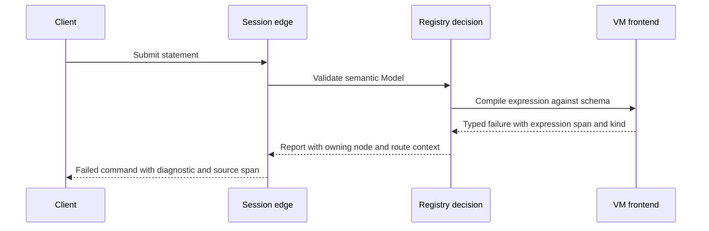
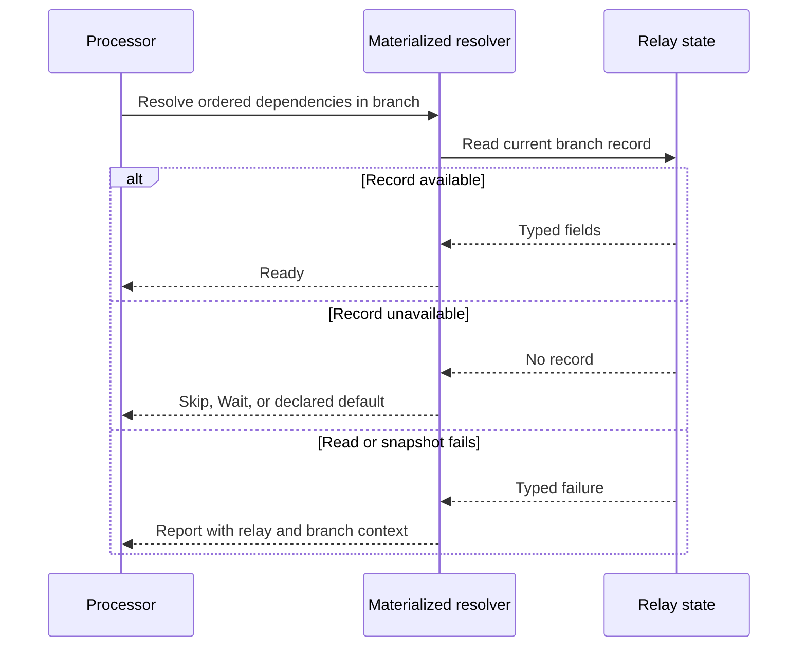
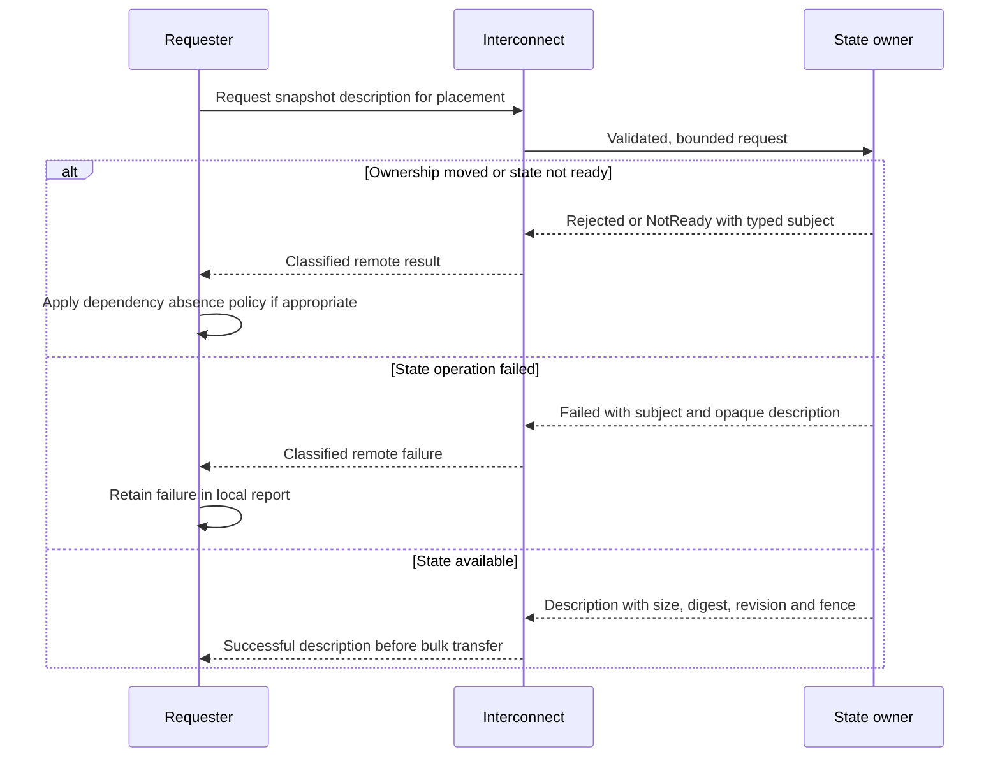

# Errors And Diagnostics

Nervix gives a failure its meaning at the boundary that can decide what went wrong. That meaning
travels through the graph as a semantic error and an `error-stack` report. A public edge renders a
diagnostic only after it has made the decision the error permits. Ordinary control outcomes, such
as waiting for materialized state or following a new leader, remain distinct from failures.

This chapter owns the error and diagnostic model across layers. [Typed States And Validation
Boundaries](./typed-states.md) explains how missing values and semantic states are represented;
[Shutdown And Recovery](./shutdown.md) owns stop and drain phases. The NSPL forms for error routes
are in [Message Errors](./processors.md#message-errors) and [Error Routes](./quickstart-error-routes.md).

## Ownership And Propagation

| Boundary | Failure meaning it owns | What its caller can decide |
| --- | --- | --- |
| Arrow record and batch layer | Schema, field, column, row, and batch construction or decoding failures | Reject a malformed batch or a field operation without inventing a replacement value. |
| Expression VM frontend and runtime bridge | Invalid expression scopes, types, sensitivity, compiled program inputs, and evaluation failures | Refuse a model during validation, or classify an affected row or batch during execution. [VM Functions](./vm-functions.md) owns execution detail. |
| Stateful processors | Branch-local deduplication, ordering, window, correlation, inference, and WASM execution or state failures | Apply the processor's message or node policy, or fail a checkpoint and its held acknowledgements. |
| Connector crates and host | Integration-specific configuration, decoding, external source and sink outcomes; host-owned routing, retry, flush, and acknowledgement failures | Separate a record rejection from a source or sink failure and follow the configured retry or acknowledgement contract. [Connector Crates And The Connector Contract](./connector-contract.md) owns those contracts. |
| Materialized state and lookups | Dependency resolution, field and schema checks, defaults, lookup evaluation, snapshot opening, and state exchange | Use a declared absence policy only for unavailable state; report a genuine failed read or invalid state. |
| Ingest grouping and relay batching | Route grouping, branch-key construction, Arrow batch assembly, relay admission, and delivery failures | Keep the affected concrete branch and fail or retry the correct in-memory attempt. |
| Registry, placement, and planning | Invalid domain models, references, capabilities, branch relationships, flush contracts, schedules, and placements | Reject the command before activating an invalid graph or refuse a relocation plan. |
| Interconnect | Authentication, framing, limits, transport, and the class and subject of a remote operation failure | Distinguish a transport failure from a peer's rejection, absence, unreadiness, or executed failure. |
| Control plane and public edges | Transaction and lifecycle results, command dispositions, session diagnostics, and HTTP response selection | Return a recoverable command outcome or an appropriate response to a client or operator. |

The owner extends its existing error type when an operation gains another failure case. A second
type for the same failure would force callers to reconcile two meanings. Fallible domain operations
return a semantic `thiserror` context inside an `error-stack` report. Each outer layer adds its
operation, node, route, branch, placement, or target as context while retaining the underlying
report. It does not format a cause into a string and then classify that text as a new failure.
Values a caller acts on belong in typed fields; display formatting happens when the result is
reported. `anyhow` remains at integration and tooling boundaries whose caller has no domain choice
to make, such as a foreign callback that only accepts a general error.

## Absence, Validation, And Planning

Materialized dependencies run in declaration order against the current branch. An available
record binds at once. A declared default supplies typed constant fields, with omitted optional
fields becoming typed nulls. `REQUIRED SKIP` drops that message; `REQUIRED WAIT` retains its batch
in memory, applies backpressure, and restarts resolution from the first dependency after progress.
These are successful *resolution outcomes*, not error reports. A missing record during an ownership
handoff may take the same declared policy when a remote description says rejected, absent, or not
ready. A transport failure or an executed remote failure does not become absence.

Schema mismatch, a repeated dependency, an invalid default expression, a missing required default
field, and a snapshot that cannot be decoded are failures. The materialized read or snapshot owner
reports them with relay and placement context; a branch-local read includes the concrete branch key.
The same key accompanies branch-local processor and relay failures, so another branch cannot be
mistaken for the failed one. Unbranched work has no branch key. [Data Plane](./data-plane.md) owns
branch execution and [Cluster Interconnect](./interconnect.md) owns snapshot exchange.

Registry validation and planning refuse invalid models before graph activation. Validation names
the owning node, the route when the rule is route-local, the operation, and relevant fields or
references. A branch mismatch in an error route, for example, identifies the source route, error
relay, and both branch declarations. A flush-based route without `FLUSH EACH` or `FLUSH IMMEDIATE`
fails validation; the registry does not supply a cadence. The current registry reports this as an
invalid-model failure naming the node and output in its diagnostic. Planning failures likewise
retain the selected entity or placement so an operator can correct the request. See [Control
Plane](./control-plane.md) for activation and [Typed States And Validation
Boundaries](./typed-states.md) for required state.

## Runtime Message Errors

A record-specific failure can become a structured message error. It carries a stable reference,
machine-readable code, operation, affected field paths, occurrence timestamp, and a non-sensitive
message. The code classifies evaluation, validation, external, or internal failure; the operation
names the work that failed. This record is the route-policy view of the failure, rather than a copy
of the internal report. The route may inspect the eligible original input, its captured
materialized-state snapshot, and an all-optional `partial_output` of construction completed before
failure. An error handler whose own construction fails does not recursively invoke itself.

`ON MESSAGE ERROR` belongs to the route and handles record-specific work. Ingestor and emitter
`ON GENERAL ERROR` handles node-wide source and sink failures. A WASM processor's node-wide `ON
GLOBAL ERROR` handles guest failures outside an individual message route. Error delivery preserves
the branch in which the operation failed; ingestor errors are unbranched. See [Runtime Node Error
Policies](./nspl-overview.md#runtime-node-error-policies), [Message
Errors](./processors.md#message-errors), and [Error Routes](./quickstart-error-routes.md) for the
public behavior and syntax.

Hot paths retain typed failure variants and row or batch error masks; they do not allocate a
formatted diagnostic for every row or batch when the variant already names the failure. Formatting
belongs at the policy or public reporting boundary. This keeps error construction from changing
the processing cadence and avoids putting source payloads in reports.

## Cross-Node And Public Boundaries

The interconnect validates and bounds the wire request before its operation handler runs. A
transport error describes connection, admission, framing, deadline, or delivery failure. A remote
control response instead preserves a typed failure *subject* and one of four classes: rejected by
the answering node, unavailable there, temporarily not ready, or executed and failed. A requester
can use class and subject for routing, retry, and recovery without parsing text. Only an executed
failure carries the answering node's opaque operator description. That text is an explicit wire
boundary for an already classified failure; it is not used to recover a new class. Runtime-state
replication and materialized-snapshot description use this envelope, and local errors retain the
remote class alongside their target and placement. [Cluster Interconnect](./interconnect.md)
defines the exchange forms, limits, deadlines, and relay acknowledgement boundaries.

At the public edge, the session maps a typed validation or execution result to a command
disposition, message, and diagnostics; a transaction's admitted and retained outcomes stay
distinct from a new execution. Parse diagnostics retain precise expected and found tokens and
source byte spans for a client to underline. Validation diagnostics attach a source span when the
relevant identifier is present in the submitted text; failures without a source location have an
unlocated diagnostic. HTTP endpoints choose their response status at the boundary according to
the request and failure category. For example, HTTP ingestion returns `202 Accepted` after
admission and `503 Service Unavailable`, with `Retry-After` when provided, when the runtime cannot
admit the payload; malformed requests and unknown paths are rejected separately. The resource
upload edge maps classified archive quota failures to `413`, invalid archives to `400`, and
unclassified store failures to `500`. [Sessions](./sessions.md) describes client command and delivery
behavior, while [Inspecting A Transaction](./control-plane.md#inspecting-a-transaction) describes
retained command outcomes and [ALTER Lock And Quiesce Classification](./control-plane.md#alter-lock-and-quiesce-classification)
describes impact inspection.

## Sensitive Data And Observability

Error variants and public diagnostics identify operation, field, entity, and placement rather than
carry sensitive payload values. Error-route metadata and hot-path logs must not reveal sensitive
input, credentials, key paths, or certificate contents. A route that deliberately copies an input
field into its ordinary output still obeys the normal explicit sensitivity rule. Operators can
correlate a stable error reference with a code and affected fields without seeing the secret.
Per-message and per-batch detail belongs at `debug` or `trace`; `info` is for lifecycle,
administration, topology, and unusual transitions. [Metrics And Observability](./metrics-and-observability.md)
defines the available metrics and their aggregation.

## Recovery, Panics, And Enforcement

Some outcomes are intentionally not propagated. `discarded` records why an already handled or
irrelevant result owes no further action. `reported` is used when the recovering call is the only
witness; it logs the failed operation at `debug`. A channel send with no receiver means shutdown
when the receiver stopped with its node, domain, or task (`means_shutdown`), or withdrawal when a
requester, session, or observer left (`means_peer_left`). If the receiver was guaranteed to remain,
its absence is a broken invariant. A watch value needed by later subscribers uses `send_replace`
so loss of current subscribers cannot leave stale state. [Shutdown And Recovery](./shutdown.md)
owns where these outcomes occur during stop and drain.

Broken internal guarantees take the explicit panic classes `assured` for a construction or platform
guarantee, `verified` for a condition checked on the current path, and `todo` for a deliberately
unimplemented path. An actually reachable failure instead becomes a typed error or a valid state
in the type. A dropped result with no stated recovery class does not establish that it was handled.

The former `result_string_errors` debt measure is now a zero-tolerance rule:
`just validate-typed-errors`, run by `just validate`, rejects `Result<_, String>` in product code
without a baseline. `just ratchet` still counts `bare_error_signatures`: a Nervix error returned
without an `error-stack` report cannot increase that debt. The ratchet also guards raw dropped
outcomes and panic sites. For a new fallible site, a reviewer asks in order: which layer decides its
meaning; whether it is an ordinary outcome, a recoverable failure, or a broken invariant; which
typed fields let the caller act; which context must cross each boundary; and which public
diagnostic or recovery class closes the path. That classification must preserve branch and
sensitivity rules, and it must not add a second form of a failure the owner already represents.
