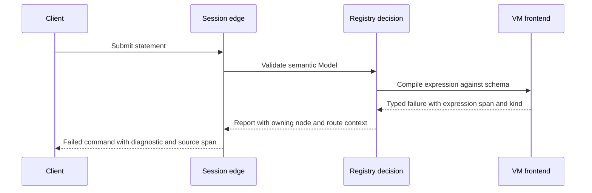
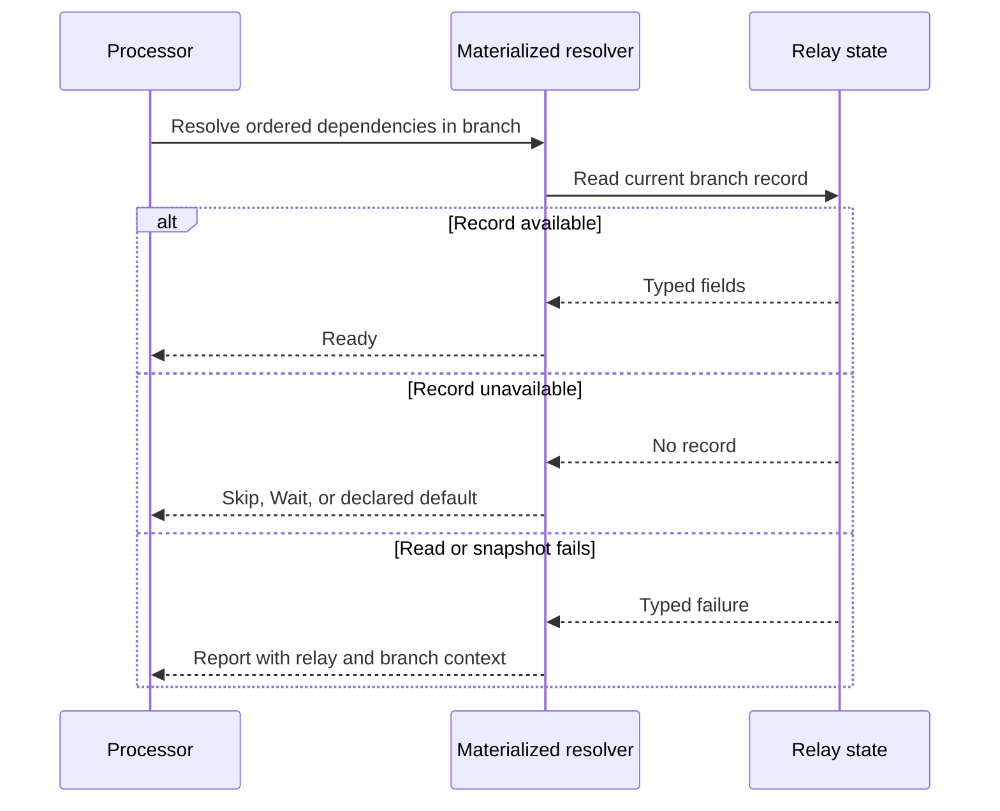
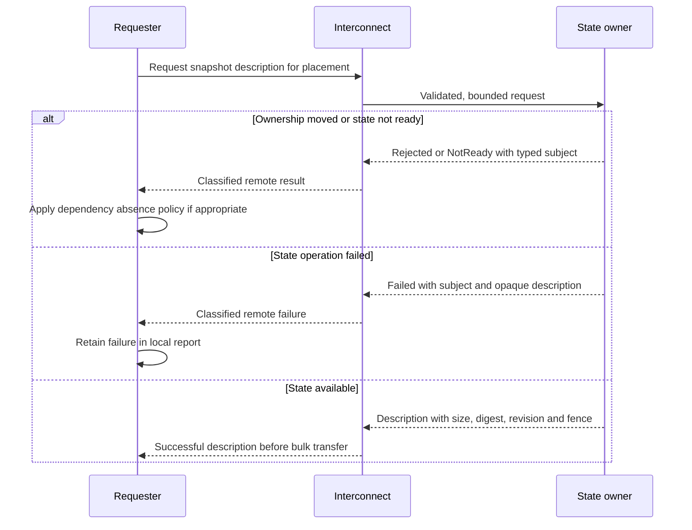

# Errors And Diagnostics

Nervix gives a failure its meaning at the boundary that can decide what went wrong. That meaning
travels through the graph as a semantic error and an `error-stack` report. A public edge renders a
diagnostic only after it has made the decision the error permits. Ordinary control outcomes, such
as waiting for materialized state or following a new leader, remain distinct from failures.
The web console applies the same distinction to structured choice lookups: an absent form
prerequisite shows a neutral hint, and stale context offers a fresh request. A failed lookup,
closed session channel, or unreadable reply appears as an alert.

This chapter owns the error and diagnostic model across layers. [Typed States And Validation
Boundaries](./typed-states.md) explains how missing values and semantic states are represented;
[Shutdown And Recovery](./shutdown.md) owns stop and drain phases. The NSPL forms for error routes
are in [Message Errors](./processors.md#message-errors) and [Error Routes](./quickstart-error-routes.md).

[Execution Plans](./execution-plans.md) describes when planning, binding, and message-error
delivery can fail during schedule application.

## Ownership And Propagation

| Boundary | Failure meaning it owns | What its caller can decide |
| --- | --- | --- |
| Vocabulary Models and the execution-graph description | Alterations the stored Model refuses; invalid placement members, inferencer tensor schemas, and upload identities; values canonical NSPL cannot spell; and execution-graph encoding or decoding | Refuse the command and keep the stored Model unchanged, or report which statement or graph could not be rendered or decoded. |
| NSPL language and formatter | Source text the lexer or parser rejects, with the stage that rejected it, the rejected text, and every diagnostic's message and byte span; statements the formatter cannot render, and formatted output that does not reparse to the statements it came from | Report the stage and underline each diagnostic in the text that was submitted, or leave a file unchanged and report the formatter defect. |
| Arrow record and batch layer | Schema, field, column, row, and batch construction or decoding failures | Reject a malformed batch or a field operation without inventing a replacement value. |
| Bounded execution | A memory charge a class could not grant (`AdmissionError`), a job refused because its class's wait queue is full, a closed pool, a job that panicked on its worker (`ExecutionError`), and a job that stopped at a `Cancelled` check because its caller stopped waiting | The job's owner maps each to its own typed outcome. A refusal judged nothing, so it stays retryable: an emitter keeps its rows, an ingested payload fails its dispatch rather than its decode and an endpoint answers it as a retryable rejection, and a credential check answers `UNAVAILABLE` rather than failing authentication. The unfolding of a payload a quiesce buffer retained is not refused at all: nothing could present it again, so it waits for a place. A panic is the job's own defect. |
| Expression VM frontend and runtime bridge | Invalid expression scopes, types, sensitivity, compiled program inputs, and evaluation failures | Refuse a model during validation, or classify an affected row or batch during execution. [VM Functions](./vm-functions.md) owns execution detail. |
| Stateful processors | Branch-local deduplication, ordering, window, correlation, inference, and WASM execution or state failures | Apply the processor's message or node policy, or fail a checkpoint and its held acknowledgements. |
| Connector crates and host | Integration-specific configuration, decoding, external source and sink outcomes; host-owned routing, retry, flush, and acknowledgement failures | Separate a record rejection from a source or sink failure and follow the configured retry or acknowledgement contract. [Connector Crates And The Connector Contract](./connector-contract.md) owns those contracts. |
| Materialized state and lookups | Dependency resolution, field and schema checks, defaults, lookup evaluation, snapshot opening, and state exchange | Use a declared absence policy only for unavailable state; report a genuine failed read or invalid state. |
| Ingest grouping and relay batching | Route grouping, branch-key construction, Arrow batch assembly, relay admission, and delivery failures | Keep the affected concrete branch and fail or retry the correct in-memory attempt. |
| Client ingestor endpoint | Whether a submitted batch is a canonical Arrow IPC stream of the input schema (`ClientBatchError`), whether the node had capacity to validate it, and how its acknowledgement root resolved | Answer the batch as not admitted with its defect or a temporary refusal, or with its terminal outcome, and end a producer with the reason its attachment ended. |
| Registry, placement, and planning | Invalid domain models, references, capabilities, branch relationships, flush contracts, schedules, and placements | Reject the command before activating an invalid graph or refuse a relocation plan. |
| Backup archive format | Records that do not encode or exceed their size limit, and archives whose structure, record headers, record values, section lengths or digests do not match what the manifest declares | Refuse to write an archive, or refuse a whole archive naming the section and the check that failed. |
| Restore planning | Archives a restore cannot apply to the cluster: the wrong scope, a domain the archive lacks or the cluster has, an archived user the cluster has under `ON EXISTING USER FAIL`, resource versions the archive does not hold consistently, and models that bind no restored version | Refuse the restore before it changes anything, naming the domain, user, resource, version, or model. |
| Interconnect | Authentication, framing, limits, transport, and the class and subject of a remote operation failure | Distinguish a transport failure from a peer's rejection, absence, unreadiness, or executed failure. |
| Control plane and public edges | Transaction and lifecycle results, command dispositions, session diagnostics, and HTTP response selection | Return a recoverable command outcome or an appropriate response to a client or operator. |

The owner extends its existing error type when an operation gains another failure case. A second
type for the same failure would force callers to reconcile two meanings. Fallible domain operations
return a semantic `thiserror` context inside an `error-stack` report. Each outer layer adds its
operation, node, route, branch, placement, or target as context while retaining the underlying
report. It does not format a cause into a string and then classify that text as a new failure.
Values a caller acts on belong in typed fields; display formatting happens when the result is
reported. `anyhow` remains at integration and tooling boundaries whose caller has no domain choice
to make, such as a foreign callback that only accepts a general error.

Codec jaq transformations are compiled during registry validation for every declared direction.
A syntax error names the codec, domain, and direction and rejects the transaction before the model
is committed. The browser keeps the draft editable so the program can be corrected and submitted
under the same name.

The visual hash-map and Roto UDF forms validate incomplete drafts before rendering canonical
NSPL. Missing resource versions, codec output fields, argument types, or source are shown as form
validation errors while the draft stays editable. After submission, lookup loading and Roto
compilation or test failures retain their server diagnostics; correcting the same draft starts a
new command without claiming the failed creation succeeded.

Junction and reingestor drafts report the input, materialized dependency, route, or assignment
whose required reference or expression is incomplete. A retained reference whose domain or
upstream choice changed is reported as a changed context and must be selected again. These are
local draft errors before canonical NSPL exists. A completed Model still passes through registry
validation, whose schema, branch, sensitivity, and graph diagnostics remain authoritative and
appear in the editable form after a rejected submission.

The expression VM returns reports for compile, batch, and runtime failures. `CompileError` keeps
its typed diagnostic code, stable code spelling, operation span, and safe message; validation adds
the model and route context without losing that cause. Roto setup returns `UdfError` reports and
Roto's VM injector returns runtime reports, so a failing Arrow operation can remain in the chain.
Jaq returns `JaqProgramError` or `JaqFormatError` reports for compilation, evaluation, and format
conversion. A codec or runtime caller retains that report under its operation context. VM row
errors remain typed values in the batch outcome and are formatted only when a message error is
reported; this conversion does not turn them into report allocations per row.

The WASM FlatBuffers decoder reports protocol failures with their verified payload cause. The Rust
guest SDK retains that report beneath its envelope or snapshot meaning, and its `Processor`
callbacks return guest-error reports. It renders a failure only when returning an ABI code or
global-error reason; rejected snapshot bytes and rejected application state keep their distinct
codes and text. The host retains a typed guest-call cause beneath the failed operation, so its
runtime caller can still distinguish a resource limit, invalid emission, and a saved-state verdict
without classifying a rendered string. Callback and checkpoint acknowledgement decisions stay the
same; [WASM State And Recovery](./wasm-state.md) owns those boundaries.

HTTP request-field compilation retains the VM report beneath the emitter's request-field context
and attaches its safe message for diagnostics; an invalid request program never starts the sink.

The node resolver's own errors belong to `nervix-dns`. A resolver configuration that cannot be
loaded is a `DnsConfigurationError`, which fails node startup beneath
`failed to load the name resolver configuration` and a native client's connection as
`ClientError::LoadDnsConfiguration`. A lookup that fails is a `DnsLookupError`: the host as the
caller wrote it and one `DnsLookupFailure`, the closed set that
[Lookup Outcomes](./name-resolution.md#lookup-outcomes) lists. A client library that resolves
through one of the resolver's hooks receives the `DnsLookupError` itself and keeps it among the
causes of its own connection error, where `DnsLookupError::find_in` recovers it. The HTTP request
sink, RabbitMQ, Syslog, WebSocket, Redis, MQTT, ClickHouse, SQS and the native session client keep
it beneath their own failure, as the paragraphs below describe. HTTP polling, Prometheus, Sentry,
OTEL and Iceberg report their failed request, export or catalog call without it, so their
diagnostics do not name the lookup failure.

The node's own trace export waits for the resolver installed by startup. Its connector's
`TraceConnectError` distinguishes a closed installation, a connection timeout, and a Hyper
connection failure retaining its `DnsLookupError` cause. Tonic and the OTLP SDK report the failed
export. The export timeout encloses DNS and TCP after resolver installation; a missing DNS
configuration still fails startup as
`AppError::LoadDnsConfiguration`. Telemetry failures have no connector retry or ACK disposition.

An HTTP request attempt that fails is an `HttpAttemptError`, owned by the HTTP sink: a timeout, a
DNS, connection, TLS, send or response-header failure, an invalid destination, or a retryable or
authentication status with its number. The sink keeps the resolver's `DnsLookupError`, the
response-header failure, or the socket or TLS error as the context beneath it, and attaches the
description of the whole chain, such as
`HTTP TLS handshake failed: invalid peer certificate: UnknownIssuer`, to its publish failure. The
emitter reports that description as its transient error and runtime event for as long as the
request stays pending, which `DESCRIBE EMITTER` shows. It names the status or the cause of the
connection and never the evaluated target, a header value, a credential or a body. A refused
request is not an attempt failure: it is a record rejection with code `external`, operation
`publish` and its numeric status.

Resource planning checks the committed lookup key and codec, generator materialized source,
output branch and route construction, and WASM guest-state generation before runtime binding.
These failures name the owning node and relevant relay, codec, or field. A missing
lookup file is rejected during candidate binding validation; malformed records remain a loader
failure when the pinned file is decoded. Neither failure silently selects another resource version.

The vocabulary's `ArchivedCountError` reports a fixed-width archived count that the receiving
target's `usize` cannot represent. Archive decoding retains it beneath the owning storage or
transport failure. Registry Model records validate their current frame signature and report
`RegistryError::InvalidModelArchive` with a recreation instruction for an unrecognized shape.
Consensus validates its complete current keyspace namespace and state encoding and reports
`StorageFailure::InvalidState` with a recreation instruction. Window snapshot decoding reports
`WindowSnapshotIssue::Header` with a recreation instruction for an invalid current frame signature.
These boundaries reject unrecognized data before its counts can be reinterpreted; none clamps,
truncates, or supplies a replacement value. See [Archived Counts](./typed-states.md#archived-counts).

Schemaful JSON parsing has one codec decode failure carrying the simd-json source. Malformed
syntax, invalid UTF-8, and invalid escapes enter through that failure; object shape, missing or
unexpected fields, nullability, exact wire types, integer ranges, datetime parsing, base64, and
nested sequence shapes keep their existing typed codec or runtime-schema failures. Diagnostics name
the codec and field when one is known and never attach the rejected payload value.

Codec compilation, decoding and encoding return `CodecError` reports. The codec context names the
codec, and the field when one is at fault, and the typed reason stays beneath it: a
`CodecContractError` for a declaration or use the wire format does not support, such as a missing
wire field or `ON INGESTION` program; a `FieldDecodeError` or `FieldEncodeError` for a value that
does not fit its field; a `SyslogDecodeError` or `SyslogEncodeError` for a syslog frame; the Arrow
builder's `RuntimeSchemaError`; or the CBOR, Avro, simd-json, protobuf or UTF-8 error that failed.
An unfolding payload keeps the report of the message that failed and names its zero-based input and
output position after it. The ingest group returns that report unchanged. A source host keeps it
beneath its intake's decode or dispatch failure and reports the whole chain, an HTTP or WebSocket
endpoint renders the whole chain in its decode notice, a lookup line keeps it beneath the line it
failed on, and an emitter keeps it beneath the record it rejects or the encoding it could not start. The rendered chain reads as the codec
diagnostic did before: `codec 'events_codec' failed to parse field 'user_id': ...` followed by the
Arrow builder's own reason. A codec that fails to compile while a domain execution is built keeps its
report in the runtime build error. A codec failure whose parser or writer error is its `#[source]`,
such as a simd-json, CBOR, Avro, protobuf, I/O, UTF-8 or timestamp error, leaves that error out of
its own message: `error-stack` records a context's source as the frame beneath it, so the rendered
chain names each cause once.

Iceberg object storage retains the Iceberg storage error contract when it installs the node's
HTTP resolver. Invalid object URLs are `DataInvalid`, and an unsupported Azure connection string
is `FeatureUnsupported`. Building the storage HTTP client or an OpenDAL operation can fail as
`Unexpected`, with the underlying error retained as its source. Those failures enter the existing
sink failure and retry path; they do not release a staged record's acknowledgement before commit.

A RabbitMQ connection that fails is a `RabbitMqConnectError`, owned by the connector's connection
module: an invalid address or CA file, a lookup failure that keeps the resolver's `DnsLookupFailure`
as a typed field, no address that accepted a connection, a failed or overdue TLS handshake, a Lapin
runtime that could not be created, or a failed AMQP handshake, each naming the broker host where one
is involved. The source keeps it beneath its connect and resume contexts, so `DESCRIBE INGESTOR`
shows the deepest cause, such as the resolver's own lookup error. The sink changes it into a
configuration failure for an invalid address or CA file and an initialization failure otherwise,
leading with the connection error's message, which `DESCRIBE EMITTER` shows. Neither attaches
credentials from the address.

Syslog emission and WebSocket-client ingestion retain DNS failures from the node resolver beneath
their existing infrastructure contexts: `SinkStartError::Initialize` while a Syslog sender opens
and `SourceError::Resume` while a WebSocket source connects or reconnects. The resolver's typed
missing-name, no-address, timeout, invalid-name or transport cause stays in the error report.
Address, TLS and WebSocket-upgrade failures remain connection outcomes. None is a record rejection,
and a DNS result by itself never marks a Syslog record delivered.

Redis command connections receive the node resolver through the driver's DNS hook. A failed
initial or later pool connection keeps the resolver's typed failure in
`RedisClientError::Resolve`; a later failure sits beneath `SinkPublishError::Publish` for the
emitter host to retry.
A Pub/Sub source resolves before opening its dedicated stream and retains `DnsLookupError` beneath
`RedisPubSubSourceError::Resolve` and `SourceError::Resume`. A refused address, failed TLS name
check or failed Redis protocol setup is also a connection failure. None rejects an input message
or changes Redis Pub/Sub's server-acceptance boundary for `PUBLISH`.

An MQTT client's event loop reports a failed or lost broker connection as an
`MqttConnectionError`, owned by the connector's connection module. The socket connector hands the
driver the resolver's `DnsLookupError` as the failure of a lookup, and the driver keeps it as the
cause of its connection error. The connector finds it there and reports
`MqttConnectionError::Resolve`, with the host and the resolver's `DnsLookupFailure` as typed fields
and the `DnsLookupError` beneath it. Any other failure keeps the driver's own description, such as
an address that refused the connection, a failed TLS handshake, including a certificate that does
not name the configured host, or a refused MQTT handshake. A source keeps the error beneath
`MqttSourceError::Connect` while it connects and `MqttSourceError::Receive` while it reads, and
those beneath `SourceError`, so `DESCRIBE INGESTOR` shows the deepest cause: the resolver's lookup
error or the driver's description. A sink's event loop records the connection error's message as
the emitter's transient error, which `DESCRIBE EMITTER` shows, and reconnects on the emitter's
retry policy. None rejects a record or acknowledges input.

ClickHouse and SQS reach the node resolver through their drivers' own DNS hooks, which hand the
driver the resolver's `DnsLookupError` as the failure of the lookup. The driver carries it as a
cause of its connection error, and the connector finds it there by type and keeps it as the context
beneath its existing infrastructure failure: `SinkPublishError::Publish` for a ClickHouse insert or
an SQS send, `SinkStartError::Initialize` while an SQS sink looks up its queue, and the
`SqsSourceError` of receiving or deleting beneath the source's `SourceError`. An SQS source looks
its queue up while its ingestor starts; the runtime keeps that failure's text, the lookup failure
included, as the reason of the ingestor's start failure rather than as a typed cause. The failure's
message names the host and the lookup failure, which `DESCRIBE EMITTER` and `DESCRIBE INGESTOR`
show. Any other failure to reach the service, such as a refused connection or a certificate that
does not name the configured host, is described by every cause of the driver's connection error,
which describes the connection and carries neither credentials nor a record; a response from the
service keeps its existing description. None is a record rejection, and none acknowledges input.

The connector helper errors for OTEL, Syslog, WebSocket signaling, Postgres, MySQL and ClickHouse
carry `error_stack::Report` from the failing operation. A caller adds context at a connector or
host ownership transition; it does not recreate the top-level error from its formatted text.
Syslog TLS material reports keep the file, certificate or rustls cause, and stream frame reports
remain beneath the connection failure. WebSocket signaling compilation and execution retain jaq,
frame encoding and transport causes. The runtime's Syslog source-plan and signaling compilation
errors keep those reports as typed fields while preserving their startup messages.

OTEL keeps a row conversion failure in the invalid-record channel and names its mapped key as the
affected field. A lower OTEL value type or range error stays in the internal report until the
rejection is constructed. Database sink insert reports keep transport driver or pool causes while the
connector inspects the current typed error for definite row rejection. Postgres SQLSTATE, MySQL
SQLSTATE and code, and ClickHouse named rejection remain the same external classifications.
Database response text that could quote a bound value is discarded after extracting that safe
classification; diagnostics do not quote the row payload.

The native Rust session client loads its Hickory resolver before opening a server channel. An
unreadable or invalid resolver configuration is `ClientError::LoadDnsConfiguration`, carrying the
resolver's configuration report; the shared binding classifies it as a connection failure. A
failed lookup within an initial, seed, redirect, or reconnect attempt is
`ClientError::ConnectServer`. Tonic retains `DnsLookupError` in that transport error's cause chain,
so callers can inspect its host and typed failure. The outer session retry deadline can instead
end the wait as `RetryDeadline`. Connection timeouts and TLS name failures remain connection
failures and do not become command dispositions. OTEL gRPC reports a failed lookup or
connection through its existing infrastructure export failure; the emitter host keeps the batch
and its acknowledgement under the declared retry policy. No record rejection is inferred from DNS.

Native endpoint recovery keeps failure states distinct. A lost producer submission resolves to
`ProducerOutcome::OutcomeUnknown(SessionLost)` when its frame was sent but no outcome arrived; the
client never calls that batch not admitted or replays it automatically. A consumer read crossing a
session gap returns `ClientError::ConsumerInterrupted` before any batch from the replacement
attachment. `ClientError::ConsumerReopenRequired` names a changed, stopped or removed endpoint that
needs a fresh application open; `ConsumerSessionUnavailable` means the bounded reconnect attempt
did not establish a session. A delivery from a revoked attachment returns
`DeliveryReferenceExpired` before settlement, while `SettlementUnknown` means a settlement request
may have reached the server but its answer was lost. The application must resolve such an ACK with
its own idempotency policy. None of these errors claims that a downstream effect did or did not
occur.

Before a restarted serving node has proved linearizable catch-up, both native endpoint opens use
the ordinary retryable `EndpointUnavailable` refusal. They do not report a missing or stopped
domain from that node's stale local snapshot as a terminal application error.

A Pulsar message refused for good is a `PulsarRecordError`, owned by the Pulsar sink: a message
larger than the maximum message size the broker announced, which carries the measured size of its
metadata and payload and the limit as typed fields, or a message the broker answered with
`NotAllowedError`, which carries the broker's reason. Either becomes a record rejection with code
`external` and operation `publish`. Every other failure of the client, its connection or the broker
stays an infrastructure failure of the attempt, which the emitter retries.

A RabbitMQ publish that ends with the broker closing the sink's channel is classified by the
broker's own reason, which the sink reads from its connection. A refusal of a message body larger
than `max_message_size` is a `RabbitMqRecordError`, owned by the RabbitMQ sink, which carries the
body size and the limit as typed fields and becomes a record rejection of that message with code
`external` and operation `publish`, reaching every member of a batch message. Any other close, a
lost connection, and a close whose reason never arrives fail the attempt as an infrastructure
failure, which the emitter retries on its backoff.

A backup's failures are owned where they are decided. The archive format reports an
`ArchiveWriteError` for a record that does not encode, a record above the 64 MiB record limit, a
section path a tar header cannot name, or bytes that differ from the manifest entry they were
written for, and an `ArchiveReadError` for an archive whose first entry is not the manifest, a
record with a foreign magic, kind, or format version, an invalid record value, a missing,
misplaced, unexpected, or out-of-order section, and a section whose length or digest differs from
the manifest. Each names the section path and the check as typed fields, and none carries section
bytes. The control plane's backup execution reports a `BackupError`: no configuration yet, no
selected or no existing domain, models that are not a valid graph or do not render or parse back to
themselves, a clock mapping that cannot be projected, a resource version that is missing on the
leader or differs from its catalog entry, a record that does not encode, and an archive the
staging area cannot hold. The failed command's message is `backup failed:` followed by that
error's text. A download the server does not serve is answered with a typed refusal,
`InvalidRequest`, `NotRetained`, `Expired`, `NotOwner` or `ReadFailed`, or with a redirect to the
leader, and a call without valid credentials ends with `UNAUTHENTICATED`. The client reports a
`BackupDownloadError` beneath `ClientError::BackupDownload`, which carries the backup's execution
reference: the server's refusal, a transport failure, a stalled or interrupted stream, a missing
leader or a redirect loop, frames out of order or undecodable, an archive that differs from the
backup's summary, or a local write failure. Only a transport failure, a stall, and an interrupted
stream are retried, from the archive's first byte. The C binding classifies a refusal as
`NX_ERROR_REJECTED`, a transport failure as `NX_ERROR_TRANSPORT`, a mismatched or malformed
archive as `NX_ERROR_PROTOCOL`, and a write failure as `NX_ERROR_INVALID_ARGUMENT`, and names the
execution reference so a host can run the backup again. No diagnostic of a backup includes archive
contents, password hashes, or resource bytes.

A restore's failures are owned where they are decided, in the order the restore meets them. The
restore stream refuses what its frames get wrong with a typed `RestoreUploadFailure`:
`InvalidStream`, `InvalidStatement`, `SizeMismatch`, `DigestMismatch`, `QuotaExceeded`, or
`StagingFailed`, and a call without valid credentials ends with `UNAUTHENTICATED`. The control
plane's `RestoreRefusal` then names an archive the leader could not read, one that does not verify,
with the archive format's `ArchiveReadError` beneath it, a domain whose `models.nspl` does not
parse, with the line and the parser's diagnostic, a statement that creates no model, with its
number and line, a restore that cannot apply to this cluster, and a domain whose models do not form
a valid configuration, with the transaction planner's report beneath it. Beneath a restore that
cannot apply, the decision layer's `RestorePlanError` names the domain, user, resource, version,
or model: a domain archive given to `RESTORE CLUSTER`, a domain the archive does not hold or the
cluster already has, an archived user the cluster has under `ON EXISTING USER FAIL`, a resource the
domain does not declare, a version outside its declared sequence, completed without checksums, or
without its bytes, bytes that do not match the version's root checksum, and a model that binds a
version other than a restored one by number. Each of these is reported as `restore refused:` and
its reason, and changes nothing. Once admitted, a step that fails ends the restore as
`restore failed at step '<step>':` and its reason, with the restore's report: the consensus command
that records a step refuses it with a `RestoreStepConflict` naming the step and the domain, user,
resource, or version, and a resource import or the domain's model batch keeps its own failure
beneath the step. The steps before it stay applied, and the message says so. No restore
diagnostic includes password hashes or resource bytes. The client reports an archive it cannot read
as `ClientError::ReadRestoreArchive` with the path and the I/O error kind, an empty file as
`ClientError::EmptyRestoreArchive`, a failed call as `ClientError::Restore` with its status, and a
reply that does not decode as `ClientError::InvalidRestoreReply`; an error that may hide an
admitted restore is `ClientError::UncertainCommand` with its execution reference. The C binding
classifies an unreadable or empty archive as `NX_ERROR_INVALID_ARGUMENT`, a failed call as
`NX_ERROR_TRANSPORT`, and an undecodable reply as `NX_ERROR_PROTOCOL`.

The vocabulary is the innermost owner, and its Model operations report the same way. An alteration
is applied to a copy of the stored Model, which replaces the original only when every operation
succeeds, so a refusal leaves the stored Model unchanged. Each refusal names what it refused in
typed fields: the field, input relay, route target, or materialized dependency, or the stored and
requested names when an alteration targets another Model. An input, route, or dependency operation
that junctions, deduplicators, reorderers, and reingestors share is reported in the altered
processor's own error where it is detected, so the report begins at the failure rather than at a
conversion. Canonical NSPL rendering refuses only a value the language has no spelling for: a NaN or
infinite `F64` literal, which the error carries, or a codec declaration its wire format cannot
express, such as encoding rules on `SYSLOG` or a JAQ-transformed format without a program, which the
error names by codec. The execution-graph description keeps the JSON encoder's or decoder's error
beneath its own when the public wire form cannot be written or read. It keeps a typed columnar
JSON writer error beneath a named codec encode failure. Unsupported columns and invalid string
offsets fail batch preparation with the codec name. Required nulls identify their field and row;
write failures retain their source without quoting a payload value. Registry planning keeps an
alteration's report beneath its invalid-model refusal of the named Model, and the refusal quotes the
rejection's message, so a failed `ALTER` shows the same reason the vocabulary gave. `SHOW CREATE`
answers a Model canonical NSPL cannot spell with a fixed diagnostic.

The language layer reports rejected source the same way. Lexing and parsing each create the report
at the stage that failed, and its context names that stage and holds the rejected text with every
diagnostic's message and byte span into it. A batch of statements is lexed once and each statement
is parsed from its own run of those tokens, so a diagnostic indexes the whole submitted text
wherever in the batch the rejected statement starts. The session edge turns the stage into the
failed command's `lex error` or `parse error` message and passes every span through unchanged, so a
client underlines it in the text it sent. A statement grammar that embeds an expression reports the
expression's first diagnostic at the whole embedded region, because a statement diagnostic carries
one message and one span. A caller that owns a larger operation adds its own context above the
language's report instead of copying the diagnostics into its error: splitting a client batch reports
that the batch could not be split, and the formatter reports a source that did not parse, the line
of a statement the vocabulary could not render, or a rendering defect whose output changed meaning
or no longer parses. The formatter's command line reads the language's report beneath its context
to draw each diagnostic over the whole file at its line, and writes a defect as the report's whole
chain, ending with the cause the vocabulary or the reparse gave.

```mermaid
sequenceDiagram
    participant Client
    participant Session as Session edge
    participant Registry as Registry decision
    participant VM as VM frontend
    Client->>Session: Submit statement
    Session->>Registry: Validate semantic Model
    Registry->>VM: Compile expression against schema
    VM-->>Registry: Typed failure with expression span and kind
    Registry-->>Session: Report with owning node and route context
    Session-->>Client: Failed command with diagnostic and source span
```

## Absence, Validation, And Planning

Materialized dependencies run in declaration order against the current branch. An available
record binds at once. A declared default supplies typed constant fields, with omitted optional
fields becoming typed nulls. `REQUIRED SKIP` drops that message; `REQUIRED WAIT` retains its batch
in memory, applies backpressure, and restarts resolution from the first dependency after progress.
These are successful *resolution outcomes*, not error reports. A missing record during an ownership
handoff may take the same declared policy when a remote description says rejected, absent, or not
ready. A transport failure or an executed remote failure does not become absence.

Schema mismatch, a repeated dependency, an invalid default expression, a missing required default
field, and a snapshot that cannot be decoded are failures. The materialized read or snapshot owner
reports them with relay and placement context; a branch-local read includes the concrete branch key.
The same key accompanies branch-local processor and relay failures, so another branch cannot be
mistaken for the failed one. Unbranched work has no branch key. [Data Plane](./data-plane.md) owns
branch execution and [Cluster Interconnect](./interconnect.md) owns snapshot exchange.

```mermaid
sequenceDiagram
    participant Processor
    participant Resolver as Materialized resolver
    participant State as Relay state
    Processor->>Resolver: Resolve ordered dependencies in branch
    Resolver->>State: Read current branch record
    alt Record available
        State-->>Resolver: Typed fields
        Resolver-->>Processor: Ready
    else Record unavailable
        State-->>Resolver: No record
        Resolver-->>Processor: Skip, Wait, or declared default
    else Read or snapshot fails
        State-->>Resolver: Typed failure
        Resolver-->>Processor: Report with relay and branch context
    end
```

Registry validation and planning refuse invalid models before graph activation. Validation names
the owning node, the route when the rule is route-local, the operation, and relevant fields or
references. A branch mismatch in an error route, for example, identifies the source route, error
relay, and both branch declarations. A flush-based route without `FLUSH EACH` or `FLUSH IMMEDIATE`
fails validation; the registry does not supply a cadence. The current registry reports this as an
invalid-model failure naming the node and output in its diagnostic. Planning failures likewise
retain the selected entity or placement so an operator can correct the request. See [Control
Plane](./control-plane.md) for activation and [Typed States And Validation
Boundaries](./typed-states.md) for required state.

Visual schema, branch, relay, and subscription editors report incomplete names, fields, types,
modes, references, branching, capacities, instance limits, filters and sample rates before
submitting, while retaining the editable draft. Once a completed branch command reaches the
registry, the registry remains the owner of branch key validation: a schema containing `BYTES`,
even under a collection type, returns the branch, domain and field in its diagnostic. The console
presents that command failure inline and does not replace it with a local guess or silently change
the selected schema. A subscription filter is parsed locally only to confirm that it is an
expression. The server compiles it against the relay's schema when it creates the subscription, and
its refusal of an unknown field or scope, a type mismatch, a relay that no longer exists, or an open
transaction is the subscription's failure, shown inline without opening a tab.

Domain activation has typed failures for a relay or codec missing its schema, a codec missing its
wire definition, a relay missing its branch or carrying an invalid branch TTL, and an endpoint
missing its VHOST or signaling protocol. The report identifies the owning relay, codec, or
endpoint and the missing reference. The control plane builds activation, resources, entrypoints,
emitters, processors, message-error routes, placement and the ownership fingerprint as one typed
revision before runtime installation. A planning failure leaves the previously applied schedule as
the predecessor for a retry; runtime installation adds domain context and never selects a fallback
configuration.

Ingestor and reingestor planning has typed failures for an ingestor whose source is missing or
resolves to another kind or name, a missing codec, a route or input relay missing from the domain,
a route whose declared branch is not the branch of its relay, reingestor inputs whose schemas
differ, a node without inputs or routes, and a filter, route or branch construction that cannot be
lowered. The report names the ingestor or reingestor, the route or input relay where the contract
is route-local, and the operation. Binding the lowered programs on a node has its own typed
failures: a relay or branch schema the node has not instantiated, a program that does not compile
against the node's schemas, lookups, state and UDFs, and a route or input the node cannot prepare.
The last carries the runtime planning failure beneath it, such as a relay without its registry or
an unparseable flush or collection cadence, rather than restating it. Runtime installation adds
domain context to either report, and an ingestor that fails to start while its domain execution is
built records that report as its transient error.

Starting an ingestor on a node returns an `IngestorStartError` report. An ingestor already running,
a domain execution or codec the node has not instantiated, and a binding failure beneath the
binding context are start failures of their own. Every failure to compose or open the source is
`IngestorStartError::Initialize`, naming the ingestor and its domain, with the cause beneath it: a
`SourceStartError` for a missing node resolver, signaling protocol or endpoint, Kafka `DOMAIN`
offsets this node does not own, or a delivery-mode duration that does not parse, or else the report
of the client configuration, connector plan, source instance or domain cadence that failed. A
runtime caller that still returns `RuntimeError` keeps the whole report in
`RuntimeError::IngestorStart`, whose message is the report's chain, such as
`failed to initialize ingestor 'syslog_source' in domain 'edge': invalid Syslog client config key
'framing': UDP does not use stream framing`. That message is what the failed command and the
ingestor's transient status show.

Emitter execution planning has typed failures for missing source relays or codecs, an unresolved
or mismatched client, unsupported publishing mode, an invalid source predicate or route, invalid
HTTP request fields or SQS ordering group, empty or invalid row mappings, nonliteral OTEL resource
attributes, and invalid Iceberg commit settings. Each report names the emitter and, for a source
predicate, its relay. The decision fails before a new emitter plan or remote consumer edge is
published. Binding a valid plan against installed schemas and UDFs may still fail during startup;
opening an external sink may fail independently and follows the emitter's retry policy.

Node startup validates execution memory limits before admitting any work. A Commands budget must
hold both the bounded resident replication window and one bounded normalized command-state write;
the larger requirement controls admission. Arithmetic that cannot represent either requirement is
a typed execution-configuration failure. A budget below the selected requirement names the memory
class, operation, configured budget, and required bytes, so the node fails startup with an
actionable diagnostic instead of discovering insufficient storage capacity while applying a
transaction.

## Runtime Message Errors

A record-specific failure can become a structured message error. It carries a stable reference,
machine-readable code, operation, affected field paths, occurrence timestamp, and a non-sensitive
message. The code classifies evaluation, validation, external, or internal failure; the operation
names the work that failed. This record is the route-policy view of the failure, rather than a copy
of the internal report. The route may inspect the eligible original input, its captured
materialized-state snapshot, and an all-optional `partial_output` of construction completed before
failure. An error handler whose own construction fails does not recursively invoke itself.

Paced ingest admission reports a rejected event timestamp as a message error with code
`validation` and operation `admit`. A null declared timestamp has the same classification and
names its field. The host keeps the rejected row's source metadata and ACK attached while each
output route applies its message-error policy. Accepted rows from the same decoded group continue
through their normal routes.

Before a domain execution or replacement becomes active, the registry selects each DLQ route and
resolves its source, partial-output and destination schemas, branch declarations and flush
contract, then lowers its ordered SET assignments. The runtime binds that program, lookups, state
and UDFs once for that installed revision. Missing inputs, codecs or relays fail planning;
missing runtime relay services, invalid flush settings or a failed VM compilation fail binding
with the owning node and DLQ relay. A failed record uses the installed plan and never reads the
scheduled Model or compiles its handler. If unavailable, it reports the delivery failure and does
not acknowledge the source record. Replacing a buffered route starts a task for the new bound plan and
drains the earlier task, preserving the earlier task's pending acknowledgements.

A batch payload's rejection becomes one message error per member, each a copy of the sink's
structured error: the members share its reference, so an operator can see that they failed
together, while each keeps its own occurrence time and branch. A prepared row request's rejection,
such as an OTEL Export request the receiver refused, does the same for every row the request
carried. A sink answer that breaks the write contract, by naming a record the write did not carry
or answering twice for one, is not a message error of any member. Neither is a row request sink's
preparation that breaks its contract: one that answers for a row the write did not hand over,
answers twice for a row, prepares rows out of source order, prepares a request that carries no row,
or leaves a handed-over row unanswered. Either fails the attempt without a retry as the typed
emitter error that names the violation, the preparation keeps nothing, and the emitter's unresolved
rows then follow `ON MESSAGE ERROR` as a failed publish.

The Sentry sink rejects a final serialized event above its decompressed event limit before sending
the envelope. The Syslog sink rejects a UDP datagram above its payload limit, a stream frame whose
octet count needs more than ten digits, or an LF-bearing non-transparent TCP frame before writing.
A row sink — ClickHouse, Postgres, MySQL or MongoDB — and a batching OTEL sink, which prepares
its requests from mapped rows, measure each request they would send. If halving still leaves one
row whose own request exceeds `MAX SIZE`, that row receives a `validation` message error of the
`encode` operation naming the measured size and the limit, such as
`Postgres insert of one row measures 1219 bytes, above MAX SIZE 600B`, and the other rows are sent
in bounded requests. A row within `MAX SIZE` that its destination could never
accept is the destination's `external` rejection of the `publish` operation, named with the
destination's limit: a Postgres insert above the largest protocol message the server reads, or a
MongoDB document above its 16 MiB document limit, which is rejected before the write that would
carry it. A SQL write that fails for a reason specific to its rows is written again one row at a
time, and each row the destination still refuses receives an `external` `publish` error with the
destination's reason. That includes a violated MySQL `CHECK` constraint, which the server reports
under the generic SQLSTATE `HY000`, and a Postgres cardinality violation, which is how
`ON CONFLICT DO UPDATE` refuses one insert that carries a key twice. An OTLP receiver's
`partial_success` has no member identities, so it acknowledges the entire request and emits a
warning instead of inventing per-record rejections. An OTLP/gRPC export the receiver never answered
— a timeout, a lost connection, an unreadable answer — is an infrastructure failure the host
retries, whatever code tonic reports for it. An answered status other than `INVALID_ARGUMENT`,
`RESOURCE_EXHAUSTED` or a code the OTLP specification lists as retryable is a misconfiguration
failure, which the host does not retry.

An HTTP emitter rejects a record at the first request field that fails, in the order it evaluates
them: `METHOD`, `PATH`, and then each header write. A failed expression keeps the `evaluation`
code and an invalid value has the `validation` code. Method and path failures report the `publish`
operation and name their request field, `method` or `path`, beside the fields the expression reads;
a header write reports `invoke` with its zero-based invocation position. A body the codec cannot
encode rejects its record with the `encode` operation when a flush releases it. The message names
the emitter and the violated rule and never quotes the evaluated value. An admitted request keeps
its original source record and the materialized state its batch was admitted with until it
completes, so every rejection of it after admission gives the handler the same input, state and
attempted codec record that a request-field failure does.

An HTTP endpoint's complete final `2xx` headers deliver the record. Other `3xx`/`4xx` statuses,
except `401`, `403`, `407`, `408`, `425` and `429`, reject only their record with code `external`
and operation `publish`; `101` has the same outcome. The rejection message includes the numeric
status but no evaluated destination, headers or body. The exception statuses and `5xx` keep the
request pending as infrastructure failures; `401`, `403` and `407` name authentication or
authorization in their typed cause. DNS, connection, TLS, timeout, malformed or oversized response
headers, invalid final framing and loss before complete final headers are infrastructure failures
as well. The connector reports them without a request URL or sensitive response value. The emitter
host owns their retry schedule and keeps the prepared request and ACK lease while they are pending.
A valid `Retry-After` on a retained status can only lengthen that schedule: it never turns a
delivered or rejected record into a retry, and an invalid one is ignored rather than reported.

`ON MESSAGE ERROR` belongs to the route and handles record-specific work. Ingestor and emitter
`ON GENERAL ERROR` handles node-wide source and sink failures. A WASM processor's node-wide `ON
GLOBAL ERROR` handles guest failures outside an individual message route. Error delivery preserves
the branch in which the operation failed; ingestor errors are unbranched. See [Runtime Node Error
Policies](./nspl-overview.md#runtime-node-error-policies), [Message
Errors](./processors.md#message-errors), and [Error Routes](./quickstart-error-routes.md) for the
public behavior and syntax.

Hot paths retain typed failure variants and row or batch error masks; they do not allocate a
formatted diagnostic for every row or batch when the variant already names the failure. Formatting
belongs at the policy or public reporting boundary. This keeps error construction from changing
the processing cadence and avoids putting source payloads in reports.

## Cross-Node And Public Boundaries

The interconnect validates and bounds the wire request before its operation handler runs. A
transport error describes connection, admission, framing, deadline, or delivery failure. A remote
control response instead preserves a typed failure *subject* and one of four classes: rejected by
the answering node, unavailable there, temporarily not ready, or executed and failed. A requester
can use class and subject for routing, retry, and recovery without parsing text. Only an executed
failure carries the answering node's opaque operator description. That text is an explicit wire
boundary for an already classified failure; it is not used to recover a new class. Runtime-state
replication, a replica's branch checkpoint listing included, and materialized-snapshot description
use this envelope, and local errors retain the remote class alongside their target and placement. A
listing that arrives but names a branch key that does not decode is a failure of its own, distinct
from a failed request. [Cluster Interconnect](./interconnect.md)
defines the exchange forms, limits, deadlines, and relay acknowledgement boundaries. A record
acknowledgement lost between two nodes becomes an ordinary negative acknowledgement: the node that
forwarded it fails it once the receiver has reported nothing about it for fifteen seconds, with a
reason that names the silent receiver, and the source retries the record as it retries any failed
acknowledgement; see
[Record Acknowledgements The Receiver Stops Reporting](./interconnect.md#record-acknowledgements-the-receiver-stops-reporting).
Local interconnect transport, typed request, and streaming-handler failures carry reports through
their callers. A layer that changes the failure's meaning adds context to the existing report, so
the caller can still inspect the transport or producer cause. The HTTP/2 and rkyv boundary sends
the classified remote result or its rejection text, rather than serializing the local cause chain.

```mermaid
sequenceDiagram
    participant Requester
    participant Wire as Interconnect
    participant Owner as State owner
    Requester->>Wire: Request snapshot description for placement
    Wire->>Owner: Validated, bounded request
    alt Ownership moved or state not ready
        Owner-->>Wire: Rejected or NotReady with typed subject
        Wire-->>Requester: Classified remote result
        Requester->>Requester: Apply dependency absence policy if appropriate
    else State operation failed
        Owner-->>Wire: Failed with subject and opaque description
        Wire-->>Requester: Classified remote failure
        Requester->>Requester: Retain failure in local report
    else State available
        Owner-->>Wire: Description with size, digest, revision and fence
        Wire-->>Requester: Successful description before bulk transfer
    end
```

At the public edge, the session maps a typed validation or execution result to a command
disposition, message, and diagnostics; a transaction's admitted and retained outcomes stay
distinct from a new execution. Replicated admission preserves an expired execution reference and
the kind of a conflicting reference as typed consensus conflicts. The session returns
`ExecutionReferenceExpired` or `ExecutionReferenceConflict` from those variants, including when a
leader change lets the replicated check discover the conflict after the leader's local check. A
client never has to classify those refusals from message text. Consensus reports also keep Raft
leadership, fatal storage, and other write failures distinct through the control plane. A
transaction mutation refusal crosses the Raft response as its exact typed outcome and becomes a
new report on the proposing node; the client still receives the same disposition and
acknowledgement semantics. [Command
Dispositions](./client-session-protocol.md#command-dispositions) defines each disposition, the phase
that produces it, and what a client may conclude from it, and typed request rejections are covered
in [Rejections](./client-session-protocol.md#rejections). `DESCRIBE TRANSACTION` and
`SHOW TRANSACTIONS` read beside an attached transaction only as separate requests; combining either read with another statement
returns a session planning diagnostic before anything enters the queue. An incomplete impact
report carries its planning diagnostics and cannot supply a commit preview. A stale preview is a
recoverable command disposition that applies no effects and tells the client to refresh its
inspection before retrying `COMMIT`. [Transaction Quiescence And Impact
Inspection](./transaction-quiescence.md) defines the planned and actual report outcomes these
diagnostics describe. Parse diagnostics retain precise expected and found tokens and byte spans
into the submitted source for a client to underline, whichever statement of a batch was
rejected. Validation diagnostics attach a source span when the
relevant identifier is present in the submitted text; failures without a source location have an
unlocated diagnostic. HTTP endpoints choose their response status at the boundary according to
the request and failure category. For example, HTTP ingestion returns `202 Accepted` after
admission and `503 Service Unavailable`, with `Retry-After` when provided, when the runtime cannot
admit the payload; malformed requests and unknown paths are rejected separately. The resource
upload edge maps classified archive quota failures to `413`, invalid archives to `400`, and
unclassified store failures to `500`. [Sessions](./sessions.md) describes client command and delivery
behavior, while [Inspecting A Transaction](./control-plane.md#inspecting-a-transaction) describes
retained command outcomes and [ALTER Lock And Quiesce Classification](./control-plane.md#alter-lock-and-quiesce-classification)
describes impact inspection.

A domain clock attachment answers with its own typed disposition rather than a command disposition,
and every refusal names the domain it concerns. An attach is `Attached` with the observed clock,
`AlreadyAttached` when the session already follows that domain's clock, `DomainNotFound` when the
committed domains the serving node installed hold no such domain, or `Failed` when the request could
not run; a detach is `Detached`, `NotAttached` when the session does not follow that clock, or
`Failed`. A node that is still starting answers an attach only once it has installed the committed
domains, so `DomainNotFound` never reflects a restart. While the session holds a transaction, both
fail with the session-local refusal that other session-scoped statements receive. The server ends
an attachment with a frame whose typed reason is
`DomainRemoved`, and the Rust client reports a lost session as an interruption of each clock it
follows before it attaches again. An attach the new session refuses or leaves unanswered is not an
error of any call: the Rust client reports it as a typed restoration failure carrying the refusal's
message and the wait before it tries again, and reports a refused subscription reopening the same
way. Each disposition's message is display text for a client that prints it; a client decides from
the variant. The Rust client's `execute` turns any disposition but `Attached` or `Detached` into a
`Failed` command outcome carrying that message, and its clock helper reports a stopped or
uninstalled clock, or a projection outside the timestamp range, as a typed `DomainClockReadError`.
See [Domain Clock Attachment](./sessions.md#domain-clock-attachment).

A Rust client subscribe or unsubscribe runs on a task of its own, so that an attempt its caller
stops waiting for still completes. Its caller rebuilds the typed session failure from that task's
report, and recovers the session and sends the request again exactly as for any other call; only a
failure a new session cannot remedy is returned, as `ClientError::SubscriptionOperation` carrying
the report.

The shared C binding converts a clock-event wait's `error_stack::Report<ClientError>` at its
reporting boundary. It classifies the typed current context as an `NX_ERROR_*` kind and retains
the report's contextual message. A cancelled or expired wait returns `NX_ERROR_CANCELLED` or
`NX_ERROR_DEADLINE` without writing an event handle. Clock accessors return `NX_ERROR_TYPE` when
the event kind or installation state lacks a requested field and leave outputs untouched;
generation, state, and end-reason accessors require a non-null output pointer. The projections of
an `nx_domain_clock` convert the Rust client's `error_stack::Report<DomainClockReadError>` the same
way: a stopped or uninstalled clock is `NX_ERROR_TYPE`, because it holds no logical time to read,
and arithmetic outside the timestamp range is `NX_ERROR_INVALID_ARGUMENT`, because the instant the
host passed is out of range for that clock. An attach refusal is not an error of the call: it
completes with `NX_DISPOSITION_FAILED` and the server's message, and `nx_session_domain_clock`
reports whether the session follows the clock afterwards.

The CLI's `domain-clock` subcommand classifies attach refusals from those variants. A missing
domain and an already attached clock have distinct typed CLI errors; other attach and detach
refusals retain the server's message. It exits nonzero for a refusal. Transport or session failures
while attaching, reading events, or detaching retain their underlying report beneath the CLI
operation that failed.

The web console shows an automatic attach refusal in the clock panel and event log without
retrying it. If its bounded request hand-off refuses a clock request before the session sends it,
the console reports that local refusal in the event log; an automatic attach also leaves the panel
in the refused state until the selected domain or connection changes.

A producer answers with typed values rather than command dispositions. A refused open carries a
`ClientProducerRefusal`, every submitted batch one `ClientSubmissionOutcome`, and an ended producer
one `ClientProducerEndReason`; see [Producers](./client-session-protocol.md#producers). The outcome
classes are the failure classification for a batch, and a client decides from them alone:
`NotAdmitted` guarantees that no row entered the graph, `ProcessingFailed` reports an admitted batch
whose acknowledgement failed and may have had effects, and `OutcomeUnknown` reports a batch whose
effects cannot be established. An invalid batch names one `ClientBatchDefect`; its message and the
detail of a processing failure are bounded to 1 KiB, never quote a payload value, and are display
text only. A temporary refusal, `Suspended` or `Busy`, is an ordinary outcome that a producer
resends on its declared backoff, not a failure. A node that cannot reserve memory or a worker to
validate a batch answers `Busy` rather than holding the batch, and a batch that fails after it was
dispatched resolves its acknowledgement root negatively, which the producer receives as
`ProcessingFailed` with `Rejected`.

A consumer open is either `Opened` or a typed `EmitterOpenRefusal` for the domain, emitter kind,
schema, execution availability or capacity. A settlement is an ordinary typed outcome:
`Confirmed`, `StaleReference`, `WrongConsumer`, `InvalidReason`, or `ConsumerEnded`. It is never
inferred from a timeout or from reading a batch. A bounded application rejection reason is
treated as non-sensitive display text and applies the emitter route's message error policy to
each member. IPC encoding failures and an output row above the declared byte limit follow that
policy, without quoting the row. Owner or forwarder loss revokes the attempt; the delivery remains
volatile, and a client must not interpret a lost ACK reply as successful processing.

If a paced clock cannot convert one period through its rate, the authority can still emit its
already-due first tick. Scheduling a later tick then reports a rate-conversion or cadence error and
stops production. A next-boundary overflow reports its own clock arithmetic error. None of these
cases emits an early tick or silently clamps the interval.

## Sensitive Data And Observability

Error variants and public diagnostics identify operation, field, entity, and placement rather than
carry sensitive payload values. Error-route metadata and hot-path logs must not reveal sensitive
input, credentials, key paths, or certificate contents. A route that deliberately copies an input
field into its ordinary output still obeys the normal explicit sensitivity rule. Operators can
correlate a stable error reference with a code and affected fields without seeing the secret.
Per-message and per-batch detail belongs at `debug` or `trace`; `info` is for lifecycle,
administration, topology, and unusual transitions. [Metrics And Observability](./metrics-and-observability.md)
defines the available metrics and their aggregation.

## Recovery, Panics, And Enforcement

The compiler synchronization gate owns typed tooling failures for invalid source contracts,
conflicting findings and incomplete compiler passes. `ContractProblem` retains the specific
argument, kind or missing contract coordinate inside an `error-stack` report until the Rust
diagnostic boundary formats it. Reports preserve source location, resolved receiver/operation,
owner and compiled configuration context. Missing or stale analysis fails rather than becoming a
zero debt count. These are repository validation errors and add no runtime failure variants.
[Data-Plane Concurrency](data-plane-concurrency.md) owns the gate's coverage and synchronization policy.

Some outcomes are intentionally not propagated. `discarded` records why an already handled or
irrelevant result owes no further action. `reported` is used when the recovering call is the only
witness; it logs the failed operation at `debug`. A channel send with no receiver means shutdown
when the receiver stopped with its node, domain, or task (`means_shutdown`), or withdrawal when a
requester, session, or observer left (`means_peer_left`). If the receiver was guaranteed to remain,
its absence is a broken invariant. A watch value needed by later subscribers uses `send_replace`
so loss of current subscribers cannot leave stale state. [Shutdown And Recovery](./shutdown.md)
owns where these outcomes occur during stop and drain.

Broken internal guarantees take the explicit panic classes `assured` for a construction or platform
guarantee, `verified` for a condition checked on the current path, and `todo` for a deliberately
unimplemented path. An actually reachable failure instead becomes a typed error or a valid state
in the type. A dependency that panics on input a caller can supply is such a failure too: its owner
refuses that input with a typed error before the dependency reads it, and that guarded read is the
only way the rest of Nervix reaches the dependency. The vocabulary's duration parser,
`parse_duration_text`, refuses text whose spans would overflow `humantime`'s duration arithmetic
with `DurationTextError::TooLong`, and every reader of duration text uses it: NSPL literals, Model
settings, window aggregate arguments, node command-line options and their environment variables,
benchmark settings and test harnesses. Clippy rejects a direct call to `humantime::parse_duration`
and any use of `humantime::Duration`, whose text conversion reads through the same parser.
`DurationTextError` describes only the reason, `humantime`'s own for malformed text or
`it is longer than a duration can be`, so each owner keeps its diagnostic around it: the setting,
the text it could not read, then that reason. An owner with a typed error of its own, such as the
command line, an ingestor's start, the activation, entrypoint, runtime and emitter plans, and the
WebSockets signaling compiler, also keeps the `DurationTextError` beneath it. A node given such a
value on its command line or in an environment variable names the option and the reason and exits
with status 2 before it starts. A dropped result with no stated recovery class does not establish
that it was handled.

The former `result_string_errors` debt measure is now a zero-tolerance rule:
`just validate-typed-errors`, run by `just validate`, rejects `Result<_, String>` in product code
without a baseline. `just ratchet` still counts `bare_error_signatures`: a Nervix error returned
without an `error-stack` report cannot increase that debt, including a locally owned error nested
in a `Future` output or `Stream` item callback contract. The ratchet also guards raw dropped
outcomes and panic sites. For a new fallible site, a reviewer asks in order: which layer decides its
meaning; whether it is an ordinary outcome, a recoverable failure, or a broken invariant; which
typed fields let the caller act; which context must cross each boundary; and which public
diagnostic or recovery class closes the path. That classification must preserve branch and
sensitivity rules, and it must not add a second form of a failure the owner already represents.

The isolated architecture compiler emits ordinary Rust tool diagnostics:
`nervix::sync_acquisition`, `nervix::lifecycle_call`, `nervix::unknown_effect` and
`nervix::invalid_contract`. Source contracts and narrow reason-bearing expectations own the
architectural classification. Invalid contracts, unfulfilled or widened expectations, incomplete
compiler reports and changed inputs fail the repository command; they are tooling failures, with
no runtime error or public protocol disposition. The diagnostic gate rejects unresolved Nervix
warnings too. [Data-Plane Concurrency](./data-plane-concurrency.md#diagnostics-and-reviewed-exceptions)
states the rule boundary and the claims the compiler does not make.

## Connector Status Observation

Each source or sink publishes its safe transient error and optional retry together. Repeated healthy
operations read the retained status without writing it; a transition clears an active failure.
Reporting a different error without selecting a new retry preserves the active retry. DESCRIBE
renders error, backoff and remaining wait from one immutable observation. A failed record obtains
its prepared message-error route from its task's retained routing publication and preserves that
plan while its VM program and delivery execute.
