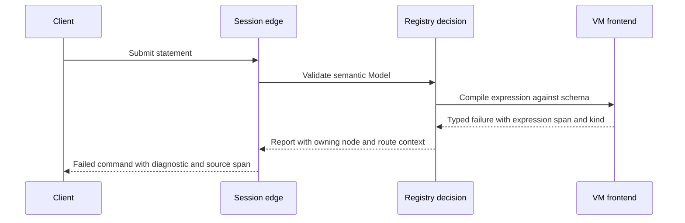
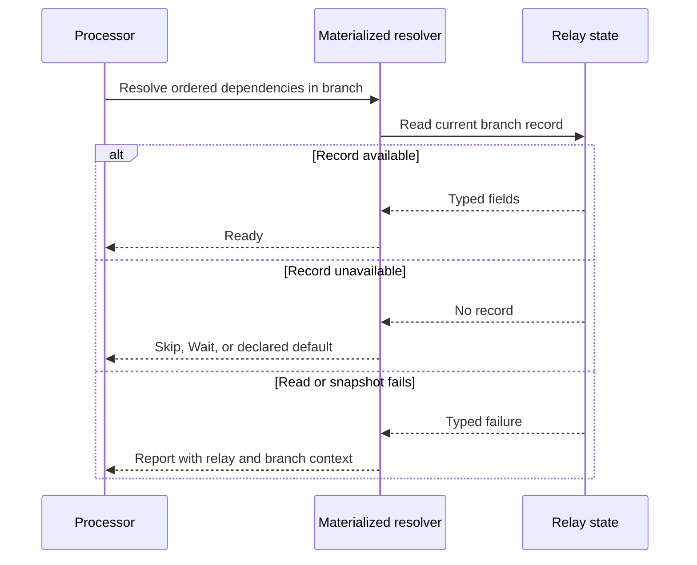
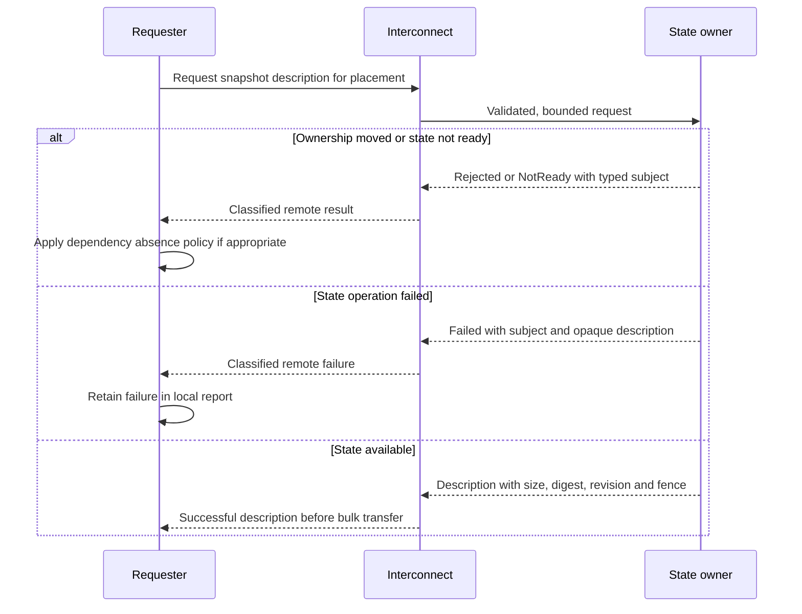

# Errors And Diagnostics

Nervix gives a failure its meaning at the boundary that can decide what went wrong. That meaning
travels through the graph as a semantic error and an `error-stack` report. A public edge renders a
diagnostic only after it has made the decision the error permits. Ordinary control outcomes, such
as waiting for materialized state or following a new leader, remain distinct from failures.
The web console applies the same distinction to structured choice lookups: an absent form
prerequisite shows a neutral hint, and stale context offers a fresh request. A failed lookup,
closed session channel, or unreadable reply appears as an alert.

This chapter owns the error and diagnostic model across layers: who gives a failure its meaning,
how a report is created, enriched, inspected and rendered, which outcomes are not failures, where a
report ends at a fixed wire, ABI or stored shape, what a diagnostic may say, and how the rules are
enforced. It names the error types of every layer. The contract a failure belongs to stays with the
chapter that owns its subsystem:

| Subject | Owning chapter |
| --- | --- |
| Missing values, distinct semantic states and the boundary that validates them | [Typed States And Validation Boundaries](./typed-states.md#validation-and-failure-boundaries) |
| Row and batch errors of the expression VM, and each function's error contract | [VM Functions](./vm-functions.md#row-errors-and-batch-errors) and [Expression Functions](./filter-map-functions.md#errors) |
| Guest result codes, rejected saved state and failed checkpoints | [WASM State And Recovery](./wasm-state.md#rejected-state-recovery) and [Rust WASM Guest SDK](./wasm-guest-sdk.md#error-handling) |
| Source and sink failures, per-record outcomes, retry and acknowledgement | [Connector Crates And The Connector Contract](./connector-contract.md#failure-and-observation) |
| Lookup outcomes and which caller owns a failed lookup | [Name Resolution](./name-resolution.md#failure-ownership) |
| Exchange forms, remote failure classes on the wire and relay acknowledgements | [Cluster Interconnect](./interconnect.md#failure-ownership-and-persistence) |
| Durable appends, uncertain writes and a failed consensus store | [Consensus Storage And Replication](./consensus-storage-and-replication.md#appended-batches) |
| Planning, binding and message-error delivery while a schedule is applied | [Execution Plans](./execution-plans.md#failures-guarantees-and-limits) |
| Branch-local execution and acknowledgement tracking | [Data Plane](./data-plane.md) and [Data-Plane Concurrency](./data-plane-concurrency.md) |
| Command dispositions, typed rejections and exact recovery | [Client Session Protocol](./client-session-protocol.md#command-dispositions) |
| Planned and actual transaction impact diagnostics | [Transaction Quiescence And Impact Inspection](./transaction-quiescence.md) |
| Stop and drain phases, and the outcomes a stopping node drops | [Shutdown And Recovery](./shutdown.md) |

The NSPL forms for error routes are in [Message Errors](./processors.md#message-errors) and
[Error Routes](./quickstart-error-routes.md).

## The Report Model

### A Failure Has One Owner

A fallible operation returns `error_stack::Result<T, E>`: a semantic `thiserror` context inside an
`error-stack` report. `E` belongs to the module that decides what the failure means, and the
report around it carries every cause and context the failure gathered on its way to the caller.
The owner extends its existing error type when an operation gains another failure case. A second
type for the same failure would force callers to reconcile two meanings. Values a caller acts on
belong in typed fields, such as a domain, a node, a relay, a revision, or a limit and the size
measured against it; display formatting happens when the result is reported.

### Creating A Report And Adding Context

The owner creates the report where it detects the failure, with `Report::new` over its own
context. An error a library returned enters the same way: `change_context` on the library's result
makes that error the first context of a new report and puts the owner's context above it. Each
outer layer that changes what the failure means then adds its own context with `change_context`,
naming its operation, node, route, branch, placement, or target, and keeps the report it received.
It does not format a cause into a string and then classify that text as a new failure, and it does
not replace the report by a clone of its current context.

A context describes its own failure once:

- It names its own operation and identity and leaves its cause to the frame beneath. `error-stack`
  records the `#[source]` chain of the error a report is created from as frames of their own, so a
  context that also printed its source would name the cause twice in the rendered chain. A context
  with a `#[source]` therefore leaves the source's wording to the next frame.
- It does not repeat an identity a context above it states. The node error policy names the node,
  so the contexts beneath it do not, and a node that declares a setting names itself above the
  setting's error.
- It carries no payload value. [Sensitive Data And Observability](#sensitive-data-and-observability)
  states what a context may name.

A source recorded that way is a frame of text: the rendered chain shows it, and a caller cannot
find it by type. A cause a caller must classify therefore stays a typed context of the report, or a
typed field of the context above it, as the resolver's `DnsLookupFailure` is of a RabbitMQ or MQTT
connection error.

Attachments are not contexts, and the rendered chain does not show them. A printable attachment
carries the description a connector or a task gives its own failure, and one reader uses it: an
emitter shows the first printable attachment of a failure as its transient error, and only without
one the outermost context. A typed attachment carries a value for one consumer, as a sink attaches
the retry delay its receiver stated for the emitter host to read. Neither replaces a context: a
caller decides from contexts and typed fields.

Two failures of one operation stay one report. When a model alteration fails after its domain
paused and resuming the domain fails too, the resume's report is added beside the alteration's and
one context is placed above both, so a caller still finds a leadership loss in either branch. A
report cannot be copied. A failure that reaches several routes or input batches is therefore
reported once, with the union of their acknowledgements, as one runtime event.

### Deciding From A Report

A caller decides from typed data and never from rendered text. Most decisions read the report's
current context. A few look for a typed context beneath it, or call the lookup the cause's owner
provides.

| Caller | Typed data it reads | Decision |
| --- | --- | --- |
| Rust client | `ClientError` as the current context | Recover the session and send the request again, report an uncertain command or upload, or return the failure |
| Shared C binding | `ClientError` as the current context, and the `BackupDownloadError` beneath a failed download | The `NX_ERROR_*` kind of the failure |
| Session edge | `ConsensusError::LeadershipLost` as the current context of a proposal report | A leader redirect in place of a failed command |
| Transaction application | `RuntimeError`'s revision preparation and readiness timeouts as the current context | Apply the cluster state again and retry, in place of failing the transaction |
| Session transaction binding | `SessionTransactionBindingError` as the current context | The `TransactionTakenOver` or `TransactionDetached` disposition |
| Postgres, MySQL and ClickHouse sinks | The driver's SQLSTATE, code or named rejection in the current context | Whether the destination refused rows for good or the attempt failed as infrastructure |
| Connectors that resolve through a driver's DNS hook | `DnsLookupError::find_in` over the causes the driver wraps around the lookup | Keep the typed lookup failure beneath the connection failure |
| Emitter host | The retry delay a sink attached to its publish failure | Lengthen the retry schedule to the delay the receiver stated |
| WASM runtime | The saved-state verdict of the guest-call failure, an invalid emission, or an exhausted execution limit | The stage the failure is reported under, whether rejected-state recovery starts, and whether the instance is discarded |
| Restore conversion | An execution admission or staging refusal among the report's contexts | Release what the conversion holds and convert again within its wait for room |

### Outcomes That Are Not Reports

An ordinary outcome is a typed value, never an error report. Waiting for or skipping a message
whose materialized state is unavailable, following a new leader, a temporary `Busy` or `Suspended`
refusal a producer resends, a settlement's `StaleReference`, a domain clock attachment's
`AlreadyAttached` and every command disposition are results their caller branches on. Each section
below says which outcomes of its boundary are ordinary.

A failure of one row or one record is a typed value in its batch's outcome too. The expression VM
returns the row errors of a batch beside its result, each a `SideError` with its reason and
expression span. A sink answers a write with the records it delivered, the records it rejected,
each with a structured message error, and at most one infrastructure failure of the attempt, which
is a report; a record in neither list stays unresolved. Branch construction keeps the outcome of
each row. None of these builds a report or formats a message per row: the typed value becomes a
structured message error only where a route's policy reports it, and hot paths do not allocate a
formatted diagnostic when the variant already names the failure. A source poll is the exception
that carries reports: it returns the report of each record it could not read beside the messages
it could, so the rest of one external response continues through intake.

### Fixed Outcome Boundaries

A report is local to the process that created it. Where a failure crosses a wire, an ABI, a stored
record or a public protocol, the shape on the other side is fixed, and the report is projected
into it exactly where that shape is constructed. That construction is the one place a report's
current context is cloned or its chain rendered into a field;
[Guarantees And Limits](#guarantees-and-limits) lists the contexts that still copy a cause as text.

| Boundary | Fixed shape | What crosses | Where a report resumes |
| --- | --- | --- | --- |
| Replicated transaction mutation | The Raft response's `TransactionMutationError` | The state machine's typed refusal, cloned from the report's current context when the response is built | The proposer creates a new report from the typed refusal |
| Consensus append stream | The stream's wire records | A matching, conflicting or higher-vote answer, or the request error | The leader hands Raft an unreachable-peer error that names the target and the reason |
| Interconnect remote operation | The failure's class and subject, with the answering node's description for an executed failure only | The classified result; the local chain is not serialized | The requester keeps the class beside its own target and placement context |
| Remote relay payload refused before admission | The refusal's reason text | The rendered chain | The forwarding node receives the reason as text |
| WASM guest ABI | An integer result code, and the reason on the global-error channel | The code of the guest error's current context, or the rendered chain as the reason of a guest failure | The host creates a guest-call report that holds the code or the reason |
| Structured message error | The record's reference, code, operation, affected fields, time and message | The typed reason that selects the code and a non-sensitive message | The error route receives the record, never the report |
| Session command | The command's disposition, message and diagnostics | The disposition from typed data, and the rendered chain as the message | The client receives a value; the Rust client reports its own failures |
| gRPC and HTTP edges | A status | The status the failure's class selects; a refused credential check names only the refusal | A client classifies the status |
| Shared C binding | The `NX_ERROR_*` kind and a message | The kind from the current context and the rendered chain as the message | The host language raises its own error |

### Foreign Interfaces

A foreign trait that accepts only a standard error receives one that holds the whole report, never
a clone of the report's current context. The DNS hooks hand Hyper, Reqwest, Smithy, MQTT and Redis
a `DnsLookupReport`, and the owner's own lookup, `DnsLookupError::find_in`, recovers the typed
failure from the causes the library wraps around it. The node's command-line value parsers return a
refusal that displays the whole chain, because clap prints only the plain `Display` of the error a
parser returns. The consensus store hands OpenRaft's storage traits an I/O error that holds its
`StorageFailure`. `anyhow` remains at integration and tooling boundaries whose caller has no domain
choice to make: the gossip library's transport traits, whose methods return its result type, and
the benchmark load generator.

### Rendering

A report's plain `Display` is its current context alone. Its alternate form, `{error:#}`, is every
context from the outermost to the cause, joined by `: `, as in `failed to start domain 'edge':
failed to apply runtime revision 7: failed to build domain execution for 'edge': failed to load
lookup 'zips': ...`. Runtime reporting renders every context in the report it receives, using
alternate `Display` (`{error:#}`), including report-bearing tracing fields. A failed command's
message, a runtime event, a negative acknowledgement's reason, a domain's instantiation error, the
CLI's text and JSON reports and the C binding's error message are that chain.

Reports remain typed until these reporting decisions; sensitivity rules continue to apply to every
context. A boundary renders a failure once and reuses the text: a failed dead-letter dispatch
renders its report once and uses that chain in both its runtime event and its negative
acknowledgement. Clock arithmetic and attachment, source cadence and lifecycle, Kafka partition
inspection, relay dispatch and acknowledgement delivery, and state checkpoint publication and
replica catch-up preserve their causes at those boundaries. Nested message-error construction
reports retain the VM or Arrow cause.

Three renderings are not the whole chain, each by its owner's decision. An ingestor's transient
status shows the most specific cause of a source failure, because the connector contract's own
context names only the operation that failed. An emitter's transient status shows the description
its sink attached, which for the HTTP sink is the description of the whole chain. A failed
consensus proposal's message is its context followed by the storage or Raft error beneath it. A
node and the benchmark command return their report from `main`, so the process that exits with it
prints the report's debug form: every context, with its attachments.

```mermaid
sequenceDiagram
    participant Client
    participant Session as Session edge
    participant Registry as Registry decision
    participant VM as VM frontend
    Client->>Session: Submit statement
    Session->>Registry: Validate semantic Model
    Registry->>VM: Compile expression against schema
    VM-->>Registry: Typed failure with expression span and kind
    Registry-->>Session: Report with owning node and route context
    Session-->>Client: Failed command with diagnostic and source span
```

## Ownership And Propagation

### Layers

Dependencies point inward, and so does error ownership: a layer names the errors of the layers
inside it and adds context above them, and no inner layer knows how an outer one reports. The
subsections after the boundary table follow this order.

| Layer | Error owners | What their callers receive |
| --- | --- | --- |
| Primitives | Modeled adapters keep the error types of the library they stand in for, such as the watch channel's `RecvError` and `SendError` | The library's own error shape, never a report |
| Vocabulary | Model alteration errors, `CanonicalNsplError`, `ArchivedCountError`, `DurationTextError` and the name and value errors of the shared types | A report that names the Model, field or value refused, with nothing above it yet |
| Language | `ParseFromSourceError` for the lexer and parser, `FormatError` for the formatter | A report whose context holds the stage, the rejected text and every diagnostic's byte span |
| Engines and infrastructure | The VM's `CompileError`, `RuntimeError` and row errors; `UdfError`; `JaqProgramError` and `JaqFormatError`; `CodecError`; the WASM `ProtocolError`, `GuestError` and `WasmGuestError`; the connector contract's `SourceError`, `SinkStartError` and `SinkPublishError` above each connector's own errors; `ConsensusError` and `StorageFailure`; the interconnect's `TransportError`, `RequestError` and `RemoteOperationFailure`; `DnsConfigurationError` and `DnsLookupError`; `AdmissionError` and `ExecutionError`; `ArchiveWriteError` and `ArchiveReadError` | A report, a typed per-row or per-record outcome, or a typed class of a remote result. An engine decides nothing about the graph, so its errors name no node policy |
| Decisions | `RegistryError`, `RelocationPlanError`, `RestorePlanError` and `TransactionPlanningError` | A report that names the node, route, operation and fields of the refused model or plan |
| Data plane | `RuntimeError` above `ExecutionBuildError`; `IngestorStartError`, `EmitterStartError` and `GeneratorError`; `PlannedGeneralError`, `RouteOutputError`, `RelayProcessorError` and the other node contexts; `RuntimePersistenceError` | A report for the node's policy, with the acknowledgements of the work that failed, or a structured message error for a route |
| Control plane | `AppError`, `DomainAlterError`, `BackupError`, `RestoreRefusal` and the transaction and lifecycle errors | A report the session edge turns into a command result |
| Edges | The session service's `GrpcAuthenticationError`, `SessionTransactionBindingError` and `SnapshotEncodingError`; `ClientError`; the CLI's and the benchmark command's own contexts | A command disposition, a status, an `NX_ERROR_*` kind, or the rendered chain |

### Boundaries

| Boundary | Failure meaning it owns | What its caller can decide |
| --- | --- | --- |
| Vocabulary Models and the execution-graph description | Alterations the stored Model refuses; invalid placement members, inferencer tensor schemas, and upload identities; values canonical NSPL cannot spell; and execution-graph encoding or decoding | Refuse the command and keep the stored Model unchanged, or report which statement or graph could not be rendered or decoded. |
| NSPL language and formatter | Source text the lexer or parser rejects, with the stage that rejected it, the rejected text, and every diagnostic's message and byte span; statements the formatter cannot render, and formatted output that does not reparse to the statements it came from | Report the stage and underline each diagnostic in the text that was submitted, or leave a file unchanged and report the formatter defect. |
| Arrow record and batch layer | Schema, field, column, row, and batch construction or decoding failures | Reject a malformed batch or a field operation without inventing a replacement value. |
| Bounded execution | A memory charge a class could not grant (`AdmissionError`), a job refused because its class's wait queue is full, a closed pool, a job that panicked on its worker (`ExecutionError`), and a job that stopped at a `Cancelled` check because its caller stopped waiting | The job's owner maps each to its own typed outcome. A refusal judged nothing, so it stays retryable: an emitter keeps its rows, an ingested payload fails its dispatch rather than its decode and an endpoint answers it as a retryable rejection, a credential check answers `UNAVAILABLE` rather than failing authentication, and a restore's deduplicator or window conversion releases what it holds and converts the refused window section or keyspace again, within a 30-second wait for room, rather than reporting archived state of another shape. The unfolding of a payload a quiesce buffer retained, or of a poll a paced source handed over, is not refused at all: nothing could present it again, so it waits for a place. The job that admits one key group into a keyspace a restore is converting waits for a place too, because the keys admitted so far could be presented again only by converting the keyspace from its first group. So does a payload a source handed over without an acknowledgement, when its transport survives a held loop; any other such payload is refused, reported as an ingestor error and counted in `nervix_ingestor_unfolding_refused_total`. A panic is the job's own defect. |
| Expression VM frontend and runtime bridge | Invalid expression scopes, types, sensitivity, compiled program inputs, and evaluation failures | Refuse a model during validation, or classify an affected row or batch during execution. [VM Functions](./vm-functions.md) owns execution detail. |
| Stateful processors | Branch-local deduplication, ordering, window, correlation, inference, and WASM execution or state failures, and a processor task's restore of the branches its lifecycle checkpoint names (`ProcessorBranchTaskError`) | Apply the processor's message or node policy, or fail a checkpoint and its held acknowledgements. A restore that fails installs no branch and stays pending: the task retries it after a backoff, holds its input, and refuses a lifecycle checkpoint or guest-state reset with `BranchesUnrestored` until an attempt succeeds. [Shutdown And Recovery](./shutdown.md#restoring-processor-branches) owns that sequence. |
| Connector crates and host | Integration-specific configuration, decoding, external source and sink outcomes; host-owned routing, retry, flush, and acknowledgement failures | Separate a record rejection from a source or sink failure and follow the configured retry or acknowledgement contract. [Connector Crates And The Connector Contract](./connector-contract.md) owns those contracts. |
| Materialized state and lookups | Dependency resolution, field and schema checks, defaults, lookup evaluation, snapshot opening, and state exchange | Use a declared absence policy only for unavailable state; report a genuine failed read or invalid state. |
| Ingest grouping and relay batching | Route grouping, branch-key construction, Arrow batch assembly, relay admission, and delivery failures | Keep the affected concrete branch and fail or retry the correct in-memory attempt. |
| Client ingestor endpoint | Whether a submitted batch is a canonical Arrow IPC stream of the input schema (`ClientBatchError`), whether the node had capacity to validate it, and how its acknowledgement root resolved | Answer the batch as not admitted with its defect or a temporary refusal, or with its terminal outcome, and end a producer with the reason its attachment ended. |
| Registry, placement, and planning | Invalid domain models, references, capabilities, branch relationships, flush contracts, schedules, and placements | Reject the command before activating an invalid graph or refuse a relocation plan. |
| Runtime installation | A committed revision this node cannot plan or apply, a domain execution it cannot build or change (`RuntimeError::BuildDomainExecution` above the `ExecutionBuildError` step that failed), and ingestors that do not start once their revision is prepared | Keep the previously applied schedule as the predecessor for a retry, and report the whole chain with the failed command, the domain's instantiation error and the runtime event. |
| Backup archive format | Records that do not encode or exceed their size limit, and archives whose structure, record headers, record values, section lengths or digests do not match what the manifest declares | Refuse to write an archive, or refuse a whole archive naming the section and the check that failed. |
| Restore planning | Archives a restore cannot apply to the cluster: the wrong scope, a domain the archive lacks or the cluster has, an archived user the cluster has under `ON EXISTING USER FAIL`, resource versions the archive does not hold consistently, models that bind no restored version, and archived branch keys that are not keys of the branching their restored entity declares | Refuse the restore before it changes anything, naming the domain, user, resource, version, or model, or the archive section, entry, entity, branch and field of the key. |
| Interconnect | Authentication, framing, limits, transport, and the class and subject of a remote operation failure | Distinguish a transport failure from a peer's rejection, absence, unreadiness, or executed failure. |
| Deadlock detector and diagnostic run | A detector that cannot be installed or is installed twice (`InstallError`), a diagnostic run that cannot install it or record its starting evidence (`DiagnosticError`), and evidence that does not encode, decode, fit its bounds, write or read (`EvidenceError`) | Refuse to start a diagnostic process, or refuse a whole evidence file naming the check that failed. A deadlock finding is not one of these errors: it is a diagnostic result that ends the process with its own status. |
| Native client and its edges | A call that could not connect, was refused or cancelled, was answered outside the protocol, or lost its session (`ClientError`), above the transport status, the codec's report, a local archive's I/O error, or the failure that left a command or upload uncertain | Retry, recover the session, recover an uncertain command or upload by its reference or identity, or display the whole chain; the CLI and the C binding classify from the current context. |
| Control plane and public edges | Transaction and lifecycle results, command dispositions, session diagnostics, and HTTP response selection | Return a recoverable command outcome or an appropriate response to a client or operator. |

### Vocabulary Models

The vocabulary is the innermost owner, and its Model operations report the same way. An alteration
is applied to a copy of the stored Model, which replaces the original only when every operation
succeeds, so a refusal leaves the stored Model unchanged. Each refusal names what it refused in
typed fields: the field, input relay, route target, or materialized dependency, or the stored and
requested names when an alteration targets another Model. An input, route, or dependency operation
that junctions, deduplicators, reorderers, and reingestors share is reported in the altered
processor's own error where it is detected, so the report begins at the failure rather than at a
conversion. Canonical NSPL rendering refuses only a value the language has no spelling for: a NaN or
infinite `F64` literal, which the error carries, or a codec declaration its wire format cannot
express, such as encoding rules on `SYSLOG` or a JAQ-transformed format without a program, which the
error names by codec. The execution-graph description keeps the JSON encoder's or decoder's error
beneath its own when the public wire form cannot be written or read. It keeps a typed columnar
JSON writer error beneath a named codec encode failure. Unsupported columns and invalid string
offsets fail batch preparation with the codec name. Required nulls identify their field and row;
write failures retain their source without quoting a payload value. Registry planning keeps an
alteration's report beneath its invalid-model refusal of the named Model, and the refusal quotes the
rejection's message, so a failed `ALTER` shows the same reason the vocabulary gave. `SHOW CREATE`
answers a Model canonical NSPL cannot spell with a fixed diagnostic.

### NSPL Language And Formatter

The language layer reports rejected source the same way. Lexing and parsing each create the report
at the stage that failed, and its context names that stage and holds the rejected text with every
diagnostic's message and byte span into it. A batch of statements is lexed once and each statement
is parsed from its own run of those tokens, so a diagnostic indexes the whole submitted text
wherever in the batch the rejected statement starts. The session edge turns the stage into the
failed command's `lex error` or `parse error` message and passes every span through unchanged, so a
client underlines it in the text it sent. A statement grammar reads an expression it embeds from
the statement's own tokens, with the grammar a standalone expression uses, for as long as that
grammar can go on, and its next clause begins where the expression ends. Where the expression
cannot begin at all, the diagnostic expects the placeholder the clause names, such as
`where_expression`. Where the expression goes on with a token and then fails, the statement reports
the expression grammar's first diagnostic at the tokens of the statement where it failed, with the
message the standalone reader gives the same text. Where a complete expression is followed by a token
no clause of the statement expects, the statement reports that token with its own expectations. An
expression's diagnostic carries no expectations of the expression grammar, so completion inside an
unfinished expression offers nothing rather than guessing at expression syntax. A caller that owns
a larger operation adds its own context above the
language's report instead of copying the diagnostics into its error: splitting a client batch reports
that the batch could not be split, and the formatter reports a source that did not parse, the line
of a statement the vocabulary could not render, or a rendering defect whose output changed meaning
or no longer parses. The formatter's command line reads the language's report beneath its context
to draw each diagnostic over the whole file at its line, and writes a defect as the report's whole
chain, ending with the cause the vocabulary or the reparse gave.

### Expression VM, UDFs And Jaq

The expression VM returns reports for compile, batch, and runtime failures. `CompileError` keeps
its typed diagnostic code, stable code spelling, operation span, and safe message; validation adds
the model and route context without losing that cause. Roto setup returns `UdfError` reports and
Roto's VM injector returns runtime reports, so a failing Arrow operation can remain in the chain.
Jaq returns `JaqProgramError` or `JaqFormatError` reports for compilation, evaluation, and format
conversion. A codec or runtime caller retains that report under its operation context. VM row
errors remain typed values in the batch outcome and are formatted only when a message error is
reported; this conversion does not turn them into report allocations per row.

A compile failure fails validation or binding as a report. An evaluation failure of one row is a
row error in the batch's outcome, which the route's `ON MESSAGE ERROR` policy receives as a message
error with the `evaluation` code, and only a failure of the batch as a whole is a runtime report.
[Row Errors And Batch Errors](./vm-functions.md#row-errors-and-batch-errors) owns which failure is
which.

Binding a lowered program on a node returns a `RuntimeVmCompileError` report that names the
program and its node: a filter, a FILTER-MAP route, an output branch construction, a WASM output
construction or its refused `INVOKE`, and a generator output. The lowering, `LOOKUP_HASH_MAP`,
materialized-state binding or VM compile failure stays beneath it. The binding names no domain;
its caller adds that context above it, as the processor plan, the entrypoint binding, and an
emitter's or generator's start do.

### WASM Guests

The WASM FlatBuffers decoder reports protocol failures with their verified payload cause. It checks
the complete header length before reading the identifier; a truncated header returns the typed
length or identifier error even when its size prefix matches the received bytes. The Rust
guest SDK retains that report beneath its envelope or snapshot meaning, and its `Processor`
callbacks return guest-error reports. It renders a failure only when returning an ABI code or
global-error reason; rejected snapshot bytes and rejected application state keep their distinct
codes and text. The host retains a typed guest-call cause beneath the failed operation, so its
runtime caller can still distinguish a resource limit, invalid emission, and a saved-state verdict
without classifying a rendered string. Callback and checkpoint acknowledgement decisions stay the
same; [WASM State And Recovery](./wasm-state.md) owns those boundaries.

A guest export answers the host with an integer, and the SDK renders a guest report only there. A
guest's own failure puts the rendered chain on the global-error channel, latches the instance's
error state and returns the error-state code; a panic latches the same state with the panic's
reason. Any other guest error returns the code of its current context: an invalid size, an access
out of bounds, an uninitialized guest, an Arrow IPC failure or an envelope protocol violation. A
saved state the guest refuses returns one of two codes of its own, for snapshot bytes it cannot
decode and for application state it rejects, and reports its reason on the same channel without
latching, because the host discards an instance whose restore failed. The host turns each answer
into a typed guest-call cause: the code of an export, a global-error reason, a trap, exhausted fuel,
an exceeded memory limit or an invalid emission. [Rejected-State
Recovery](./wasm-state.md#rejected-state-recovery) owns what the host does with each verdict, and
[Error Handling](./wasm-guest-sdk.md#error-handling) what a guest author returns.

Ownership preparation of a stopped WASM domain carries its validated durable checkpoint inventory
without guest execution. A stopped clock is ordinary passive state, not a missing-checkpoint
failure or a reason to reset guest state. Guest restore failures are classified when the running
revision restores the save under the active clock at `START`.

### Codecs And Ingress

Codec compilation, decoding and encoding return `CodecError` reports. The codec context names the
codec, and the field when one is at fault, and the typed reason stays beneath it: a
`CodecContractError` for a declaration or use the wire format does not support, such as a missing
wire field or `ON INGESTION` program; a `FieldDecodeError` or `FieldEncodeError` for a value that
does not fit its field; a `SyslogDecodeError` or `SyslogEncodeError` for a syslog frame; the Arrow
builder's `RuntimeSchemaError`; or the CBOR, Avro, simd-json, protobuf or UTF-8 error that failed.
An unfolding payload keeps the report of the message that failed and names its zero-based input and
output position after it. The ingest group returns that report unchanged. A source host keeps it
beneath its intake's decode or dispatch failure and reports the whole chain, an HTTP or WebSocket
endpoint renders the whole chain in its decode notice, a lookup line keeps it beneath the line it
failed on, and an emitter keeps it beneath the record it rejects or the encoding it could not start. The rendered chain reads as the codec
diagnostic did before: `codec 'events_codec' failed to parse field 'user_id': ...` followed by the
Arrow builder's own reason. A codec that fails to compile while a domain execution is built keeps its
report beneath `RuntimeError::BuildDomainExecution`, which names the domain. A codec failure whose
parser or writer error is its `#[source]`,
such as a simd-json, CBOR, Avro, protobuf, I/O, UTF-8 or timestamp error, leaves that error out of
its own message: `error-stack` records a context's source as the frame beneath it, so the rendered
chain names each cause once.

Schemaful JSON parsing has one codec decode failure carrying the simd-json source. Malformed
syntax, invalid UTF-8, and invalid escapes enter through that failure; object shape, missing or
unexpected fields, nullability, exact wire types, integer ranges, datetime parsing, base64, and
nested sequence shapes keep their existing typed codec or runtime-schema failures. Diagnostics name
the codec and field when one is known and never attach the rejected payload value.

Codec jaq transformations are compiled during registry validation for every declared direction.
A syntax error names the codec, domain, and direction and rejects the transaction before the model
is committed. The browser keeps the draft editable so the program can be corrected and submitted
under the same name.

An endpoint that decodes a payload but cannot dispatch or flush its ingest group uses the same
rendered report chain in its runtime event and log. A temporary unfolding admission refusal logs
its report chain while preserving the endpoint's retryable refusal outcome.

### Stored Shapes And Archives

The vocabulary's `ArchivedCountError` reports a fixed-width archived count that the receiving
target's `usize` cannot represent. Archive decoding retains it beneath the owning storage or
transport failure. Registry Model records validate their current frame signature and report
`RegistryError::InvalidModelArchive` with a recreation instruction for an unrecognized shape. A
record's key holds its domain, Model kind and name exactly as a commit encodes them; a key spelling
a name another way or holding bytes after its encoding is `RegistryError::DecodeKey`, so no stored
record is read as another Model. Consensus validates its complete current keyspace namespace and
state encoding and reports `StorageFailure::InvalidState` with a recreation instruction. Window snapshot decoding reports
`WindowSnapshotIssue::Header` with a recreation instruction for an invalid current frame signature.
These boundaries reject unrecognized data before its counts can be reinterpreted; none clamps,
truncates, or supplies a replacement value. See [Archived Counts](./typed-states.md#archived-counts).

An rkyv archive can pass shape validation and still contain a value that its vocabulary decoder
refuses, including a typed name, size limit, reference, or range inside a list. The owning boundary
reports its existing decode failure with the value's cause. The decoder drops values it has already
read and releases any partially read list or fixed array, boxed value, or shared pointer allocation
before returning that failure; it neither publishes a partial value nor retains memory for a
refused archive.

### Runtime State Storage

Runtime state storage keeps the cause of each failure beneath its `RuntimePersistenceError`. Opening
the store keeps the storage engine's error beneath its keyspace, read, write or synchronization
failure. An encoding or decoding failure keeps the serializer's error, or the `StoredStateIssue` the
stored bytes have, such as a key without its domain separator or a restore whose staged inventory
differs, beneath `EncodeState` or `DecodeState`, so the rendered chain still reads `failed to decode
runtime state: runtime state key has no domain separator`. A memory or storage refusal while a
materialized relay's restored snapshot is opened is a storage admission or execution failure, never
a decoding failure. A caller keeps the storage report beneath its own context:
`RuntimeStateOperationError::Persistence` for a replica's installation or a snapshot task,
`OwnershipHandoffError::Persistence` for a handoff, and the domain build's `ExecutionBuildError`
step, which names the node and the state kind, for a state assignment.

Native Kafka stream conversion retains the rkyv validation failure beneath `DecodeState` and the
placement-qualified `StateReplicationError::Capture`. A cancelled conversion keeps `Cancelled` at
that same boundary without publishing the candidate table. Installation refused after an assignment
changes retains `StateAuthorityError` beneath `RuntimeStateOperationError::Authority` and that
placement-qualified capture context, so a caller can distinguish malformed bytes from lost
authority.

### Name Resolution

The node resolver's own errors belong to `nervix-dns`. A resolver configuration that cannot be
loaded is a `DnsConfigurationError`, which fails node startup beneath
`failed to load the name resolver configuration` and a native client's connection as
`ClientError::LoadDnsConfiguration`. A lookup that fails is a `DnsLookupError`: the host as the
caller wrote it and one `DnsLookupFailure`, the closed set that
[Lookup Outcomes](./name-resolution.md#lookup-outcomes) lists. A client library that resolves
through one of the resolver's hooks receives the `DnsLookupError` itself and keeps it among the
causes of its own connection error, where `DnsLookupError::find_in` recovers it. The HTTP request
sink, RabbitMQ, Syslog, WebSocket, Redis, MQTT, ClickHouse, SQS and the native session client keep
it beneath their own failure, as the paragraphs below describe. HTTP polling, Prometheus, Sentry,
OTEL and Iceberg report their failed request, export or catalog call without it, so their
diagnostics do not name the lookup failure.

During cluster startup, a node that has recovered Raft peer endpoints logs a failed lookup of its
configured bootstrap host at `warn` and continues with the recovered seeds. A node without recovered
peer endpoints keeps the lookup error beneath `AppError::StartCluster`, because it needs the
configured bootstrap host for first contact. A failed lookup of the node's own advertised endpoint
also fails startup.

The node's own trace export waits for the resolver installed by startup. Its connector's
`TraceConnectError` distinguishes a closed installation, a connection timeout, and a Hyper
connection failure retaining its `DnsLookupError` cause. Tonic and the OTLP SDK report the failed
export. The export timeout encloses DNS and TCP after resolver installation; a missing DNS
configuration still fails startup as
`AppError::LoadDnsConfiguration`. Telemetry failures have no connector retry or ACK disposition.

### Connectors

A connector reports through the contract's own contexts and keeps its integration's error beneath
them. `SourceError` names the connector and the operation that failed: opening, reading,
acknowledging, rejecting, suspending, resuming or closing. `SinkStartError` separates an invalid
configuration and a missing external entity from a failed initialization. `SinkPublishError`
separates a failed publish, finish or commit, which the host retries on its backoff, from a
misconfiguration, which it does not retry. A record the destination refuses for good is none of
these errors: it is a rejection in the write's per-record outcome, with the structured message
error the route's policy receives.
[Failure and observation](./connector-contract.md#failure-and-observation) owns the contract, and
the paragraphs below record what each integration keeps beneath it.

The connector helper errors for OTEL, Syslog, WebSocket signaling, Postgres, MySQL and ClickHouse
carry `error_stack::Report` from the failing operation. A caller adds context at a connector or
host ownership transition; it does not recreate the top-level error from its formatted text.
Syslog TLS material reports keep the file, certificate or rustls cause, and stream frame reports
remain beneath the connection failure. WebSocket signaling compilation and execution retain jaq,
frame encoding and transport causes. The runtime's Syslog source-plan and signaling compilation
errors keep those reports as typed fields while preserving their startup messages.

An HTTP request attempt that fails is an `HttpAttemptError`, owned by the HTTP sink: a timeout, a
DNS, connection, TLS, send or response-header failure, an invalid destination, or a retryable or
authentication status with its number. The sink keeps the resolver's `DnsLookupError`, the
response-header failure, or the socket or TLS error as the context beneath it, and attaches the
description of the whole chain, such as
`HTTP TLS handshake failed: invalid peer certificate: UnknownIssuer`, to its publish failure. The
emitter reports that description as its transient error and runtime event for as long as the
request stays pending, which `DESCRIBE EMITTER` shows. It names the status or the cause of the
connection and never the evaluated target, a header value, a credential or a body. A refused
request is not an attempt failure: it is a record rejection with code `external`, operation
`publish` and its numeric status.

HTTP request-field compilation retains the VM report beneath the emitter's request-field context
and attaches its safe message for diagnostics; an invalid request program never starts the sink.

Iceberg object storage retains the Iceberg storage error contract when it installs the node's
HTTP resolver. Invalid object URLs are `DataInvalid`, and an unsupported Azure connection string
is `FeatureUnsupported`. Building the storage HTTP client or an OpenDAL operation can fail as
`Unexpected`, with the underlying error retained as its source. Those failures enter the existing
sink failure and retry path; they do not release a staged record's acknowledgement before commit.

A RabbitMQ connection that fails is a `RabbitMqConnectError`, owned by the connector's connection
module: an invalid address or CA file, a lookup failure that keeps the resolver's `DnsLookupFailure`
as a typed field, no address that accepted a connection, a failed or overdue TLS handshake, a Lapin
runtime that could not be created, or a failed AMQP handshake, each naming the broker host where one
is involved. The source keeps it beneath its connect and resume contexts, so `DESCRIBE INGESTOR`
shows the deepest cause, such as the resolver's own lookup error. The sink changes it into a
configuration failure for an invalid address or CA file and an initialization failure otherwise,
leading with the connection error's message, which `DESCRIBE EMITTER` shows. Neither attaches
credentials from the address.

A RabbitMQ publish that ends with the broker closing the sink's channel is classified by the
broker's own reason, which the sink reads from its connection. A refusal of a message body larger
than `max_message_size` is a `RabbitMqRecordError`, owned by the RabbitMQ sink, which carries the
body size and the limit as typed fields and becomes a record rejection of that message with code
`external` and operation `publish`, reaching every member of a batch message. Any other close, a
lost connection, and a close whose reason never arrives fail the attempt as an infrastructure
failure, which the emitter retries on its backoff.

Syslog emission and WebSocket-client ingestion retain DNS failures from the node resolver beneath
their existing infrastructure contexts: `SinkStartError::Initialize` while a Syslog sender opens
and `SourceError::Resume` while a WebSocket source connects or reconnects. The resolver's typed
missing-name, no-address, timeout, invalid-name or transport cause stays in the error report.
Address, TLS and WebSocket-upgrade failures remain connection outcomes. None is a record rejection,
and a DNS result by itself never marks a Syslog record delivered.

Redis command connections receive the node resolver through the driver's DNS hook. A failed
initial or later pool connection keeps the resolver's typed failure in
`RedisClientError::Resolve`; a later failure sits beneath `SinkPublishError::Publish` for the
emitter host to retry.
A Pub/Sub source resolves before opening its dedicated stream and retains `DnsLookupError` beneath
`RedisPubSubSourceError::Resolve` and `SourceError::Resume`. A refused address, failed TLS name
check or failed Redis protocol setup is also a connection failure. None rejects an input message
or changes Redis Pub/Sub's server-acceptance boundary for `PUBLISH`.

An MQTT client's event loop reports a failed or lost broker connection as an
`MqttConnectionError`, owned by the connector's connection module. The socket connector hands the
driver the resolver's `DnsLookupError` as the failure of a lookup, and the driver keeps it as the
cause of its connection error. The connector finds it there and reports
`MqttConnectionError::Resolve`, with the host and the resolver's `DnsLookupFailure` as typed fields
and the `DnsLookupError` beneath it. Any other failure keeps the driver's own description, such as
an address that refused the connection, a failed TLS handshake, including a certificate that does
not name the configured host, or a refused MQTT handshake. A source keeps the error beneath
`MqttSourceError::Connect` while it connects and `MqttSourceError::Receive` while it reads, and
those beneath `SourceError`, so `DESCRIBE INGESTOR` shows the deepest cause: the resolver's lookup
error or the driver's description. A sink's event loop records the connection error's message as
the emitter's transient error, which `DESCRIBE EMITTER` shows, and reconnects on the emitter's
retry policy. None rejects a record or acknowledges input.

ClickHouse and SQS reach the node resolver through their drivers' own DNS hooks, which hand the
driver the resolver's `DnsLookupError` as the failure of the lookup. The driver carries it as a
cause of its connection error, and the connector finds it there by type and keeps it as the context
beneath its existing infrastructure failure: `SinkPublishError::Publish` for a ClickHouse insert or
an SQS send, `SinkStartError::Initialize` while an SQS sink looks up its queue, and the
`SqsSourceError` of receiving or deleting beneath the source's `SourceError`. An SQS source looks
its queue up while its ingestor starts; the runtime keeps that failure's text, the lookup failure
included, as the reason of the ingestor's start failure rather than as a typed cause. The failure's
message names the host and the lookup failure, which `DESCRIBE EMITTER` and `DESCRIBE INGESTOR`
show. Any other failure to reach the service, such as a refused connection or a certificate that
does not name the configured host, is described by every cause of the driver's connection error,
which describes the connection and carries neither credentials nor a record; a response from the
service keeps its existing description. None is a record rejection, and none acknowledges input.

OTEL keeps a row conversion failure in the invalid-record channel and names its mapped key as the
affected field. A lower OTEL value type or range error stays in the internal report until the
rejection is constructed. Database sink insert reports keep transport driver or pool causes while the
connector inspects the current typed error for definite row rejection. Postgres SQLSTATE, MySQL
SQLSTATE and code, and ClickHouse named rejection remain the same external classifications.
Database response text that could quote a bound value is discarded after extracting that safe
classification; diagnostics do not quote the row payload.

A Pulsar message refused for good is a `PulsarRecordError`, owned by the Pulsar sink: a message
larger than the maximum message size the broker announced, which carries the measured size of its
metadata and payload and the limit as typed fields, or a message the broker answered with
`NotAllowedError`, which carries the broker's reason. Either becomes a record rejection with code
`external` and operation `publish`. Every other failure of the client, its connection or the broker
stays an infrastructure failure of the attempt, which the emitter retries.

### Connector Status Observation

Each source or sink publishes its safe transient error and optional retry together. Repeated healthy
operations read the retained status without writing it; a transition clears an active failure.
Reporting a different error without selecting a new retry preserves the active retry. DESCRIBE
renders error, backoff and remaining wait from one immutable observation. A failed record obtains
its prepared message-error route from its task's retained routing publication and preserves that
plan while its VM program and delivery execute.

### Console Drafts

The visual hash-map and Roto UDF forms validate incomplete drafts before rendering canonical
NSPL. Missing resource versions, codec output fields, argument types, or source are shown as form
validation errors while the draft stays editable. After submission, lookup loading and Roto
compilation or test failures retain their server diagnostics; correcting the same draft starts a
new command without claiming the failed creation succeeded.

Junction and reingestor drafts report the input, materialized dependency, route, or assignment
whose required reference or expression is incomplete. A retained reference whose domain or
upstream choice changed is reported as a changed context and must be selected again. These are
local draft errors before canonical NSPL exists. A completed Model still passes through registry
validation, whose schema, branch, sensitivity, and graph diagnostics remain authoritative and
appear in the editable form after a rejected submission.

## Absence, Validation, And Planning

### Materialized Dependencies

Materialized dependencies run in declaration order against the current branch. An available
record binds at once. A declared default supplies typed constant fields, with omitted optional
fields becoming typed nulls. `REQUIRED SKIP` drops that message; `REQUIRED WAIT` retains its batch
in memory, applies backpressure, and restarts resolution from the first dependency after progress.
These are successful *resolution outcomes*, not error reports. A missing record during an ownership
handoff may take the same declared policy when a remote description says rejected, absent, or not
ready. A transport failure or an executed remote failure does not become absence.

Schema mismatch, a repeated dependency, an invalid default expression, a missing required default
field, and a snapshot that cannot be decoded are failures. The materialized read or snapshot owner
reports them with relay and placement context, and the branch-local processor that resolved the
dependency names its concrete branch. Branch-local processor and relay failures name their branch
the same way, so another branch cannot be mistaken for the failed one. A failure names a concrete
branch by the fingerprint of its key, as described under
[Sensitive Data And Observability](#sensitive-data-and-observability), and unbranched work as
`unbranched`. [Data Plane](./data-plane.md) owns branch execution and
[Cluster Interconnect](./interconnect.md) owns snapshot exchange.

The materialized installation owner refuses a lower snapshot revision with
`RuntimeStateOperationError::MaterializedSnapshotRevision { received, current }`, a snapshot from an
earlier branch lifecycle with `MaterializedSnapshotBranchGeneration { received, current }`, and one
sealed under a superseded ownership fence with `MaterializedSnapshotFence { received, current }`,
preserving both values in each diagnostic. It checks these before publishing any restored row,
alongside assignment validation. An assignment that no longer grants the installation fails as
`RuntimeStateOperationError::Authority` with the assignment's `StateAuthorityError` beneath, and the
snapshot exchange keeps the refusal beneath its own install failure. A cached snapshot from another
assignment is rebuilt under the current fence rather than reported as current; a fence change during
encoding remains the snapshot owner's typed `OwnershipChanged` failure.

```mermaid
sequenceDiagram
    participant Processor
    participant Resolver as Materialized resolver
    participant State as Relay state
    Processor->>Resolver: Resolve ordered dependencies in branch
    Resolver->>State: Read current branch record
    alt Record available
        State-->>Resolver: Typed fields
        Resolver-->>Processor: Ready
    else Record unavailable
        State-->>Resolver: No record
        Resolver-->>Processor: Skip, Wait, or declared default
    else Read or snapshot fails
        State-->>Resolver: Typed failure
        Resolver-->>Processor: Report with relay and branch context
    end
```

### Registry Validation And Planning

Registry validation and planning refuse invalid models before graph activation. Validation names
the owning node, the route when the rule is route-local, the operation, and relevant fields or
references. A branch mismatch in an error route, for example, identifies the source route, error
relay, and both branch declarations. A flush-based route without `FLUSH EACH` or `FLUSH IMMEDIATE`
fails validation; the registry does not supply a cadence. The current registry reports this as an
invalid-model failure naming the node and output in its diagnostic. Planning failures likewise
retain the selected entity or placement so an operator can correct the request. A relocation the
graph cannot plan is a `RelocationPlanError` report beneath `RelocationError::Graph`: a member
that does not exist names the domain and the member, a server-listener ingestor names the ingestor,
a corridor whose `FROM`/`TO` pairs are all disconnected, a hard group whose overrides request
different strategies lists every member of that group, and an override outside the unit names its
member. The failed command renders the chain, such as `relocation plan failed: junction
'chain_distant' is not part of the relocation`. See [Control
Plane](./control-plane.md) for activation and [Typed States And Validation
Boundaries](./typed-states.md) for required state.

Visual schema, branch, relay, and subscription editors report incomplete names, fields, types,
modes, references, branching, capacities, instance limits, filters and sample rates before
submitting, while retaining the editable draft. Once a completed branch command reaches the
registry, the registry remains the owner of branch key validation: a schema containing `BYTES`,
even under a collection type, returns the branch, domain and field in its diagnostic. The console
presents that command failure inline and does not replace it with a local guess or silently change
the selected schema. A subscription filter is parsed locally only to confirm that it is an
expression. The server compiles it against the relay's schema when it creates the subscription, and
its refusal of an unknown field or scope, a type mismatch, a relay that no longer exists, or an open
transaction is the subscription's failure, shown inline without opening a tab. A predicate that does
not lower or compile is a `SubscriptionPredicateCompileError` naming the subscription, with the VM's
failure beneath, and the failed command renders the whole chain.

Domain activation has typed failures for a relay or codec missing its schema, a codec missing its
wire definition, a relay missing its branch or carrying an invalid branch TTL, and an endpoint
missing its VHOST or signaling protocol. The report identifies the owning relay, codec, or
endpoint and the missing reference. The control plane builds activation, resources, entrypoints,
emitters, processors, message-error routes, placement and the ownership fingerprint as one typed
revision before runtime installation. A planning failure leaves the previously applied schedule as
the predecessor for a retry; runtime installation adds domain context and never selects a fallback
configuration.

Resource planning checks the committed lookup key and codec, generator materialized source,
output branch and route construction, and WASM guest-state generation before runtime binding.
These failures name the owning node and relevant relay, codec, or field. A missing
lookup file is rejected during candidate binding validation; malformed records remain a loader
failure when the pinned file is decoded. Neither failure silently selects another resource version.

### Runtime Installation

Installing a domain on a node, whether it builds the domain's execution, applies a schedule delta,
swaps or reassigns nodes, or applies a dynamic update, returns a report whose top context is
`RuntimeError::BuildDomainExecution`, naming the domain. The step that failed stays beneath it as an
`ExecutionBuildError`, which names the node, relay, lookup, codec, signaling protocol or WASM
processor it concerns and keeps the step's own report beneath itself: a domain clock that does not
bind; UDFs, protobuf descriptors or a lookup that do not load; a WASM module that is not prepared;
forced recovery or prepared handoff state that does not activate; runtime state that cannot be
placed, assigned, restored, shared or purged; a relay, emitter or processor task that does not stop
or hand off its branches; processor plans, message-error routes or reingestors that do not bind or
start; an emitter flush change the running task does not apply; an execution revision without the
plan of a node it names; an installed execution that is gone; and a node whose state access its
assignment does not grant. A codec or signaling protocol that does not compile, an ingestor, emitter
or generator that does not start, and a WASM state reset the processor's task does not take,
answer or apply keep their own reports directly beneath the domain context, because those already
name what failed.

Each admitted runtime revision is applied by the session service. A committed revision that cannot
be planned against the one applied before it is `RuntimeError::PlanScheduleRevision`, with the
decision layer's report beneath. A revision this node cannot apply fails as
`RuntimeError::ApplyRevision`, naming the revision, above the runtime's report, and an ingestor of a
running domain that does not start once the revision is prepared fails as
`RuntimeError::StartIngestors` above the ingestor's start report. A failed command and the event a
session receives render the whole chain, such as `failed to start domain 'edge': failed to apply
runtime revision 7: failed to build domain execution for 'edge': failed to load lookup 'zips': ...`,
and a domain whose build failed records the same chain as its instantiation error. Revision
preparation and readiness timeouts keep variants of their own, which a transaction recognizes in
the report's top context to retry its application rather than fail it.

### Ingestors, Emitters And Generators

Ingestor and reingestor planning has typed failures for an ingestor whose source is missing or
resolves to another kind or name, a missing codec, a route or input relay missing from the domain,
a route whose declared branch is not the branch of its relay, reingestor inputs whose schemas
differ, a node without inputs or routes, and a filter, route or branch construction that cannot be
lowered. The report names the ingestor or reingestor, the route or input relay where the contract
is route-local, and the operation. Binding the lowered programs on a node has its own typed
failures: a relay or branch schema the node has not instantiated, a program that does not compile
against the node's schemas, lookups, state and UDFs, and a route or input the node cannot prepare.
The last carries the runtime planning failure beneath it, such as a relay without its registry or
an unparseable flush or collection cadence, rather than restating it. Runtime installation adds
domain context to either report, and an ingestor that fails to start while its domain execution is
built records that report as its transient error. A program that does not compile keeps the
runtime binding's `RuntimeVmCompileError` beneath the binding context, and the domain's binding
failure renders the whole chain, ending with the VM's own `CompileError`.

Starting an ingestor on a node returns an `IngestorStartError` report. An ingestor already running,
a domain execution or codec the node has not instantiated, and a binding failure beneath the
binding context are start failures of their own. Every failure to compose or open the source is
`IngestorStartError::Initialize`, naming the ingestor and its domain, with the cause beneath it: a
`SourceStartError` for a missing node resolver, signaling protocol or endpoint, Kafka `DOMAIN`
offsets this node does not own, or a delivery-mode duration that does not parse, or else the report
of the client configuration, connector plan, source instance or domain cadence that failed. The
runtime keeps the whole report beneath its own context: the domain build's
`RuntimeError::BuildDomainExecution`, or `RuntimeError::StartIngestors` when the session service
starts the ingestors of a prepared revision. The ingestor's transient status shows the start
report's chain, such as `failed to initialize ingestor 'syslog_source' in domain 'edge': invalid
Syslog client config key 'framing': UDP does not use stream framing`, and the failed command shows
the same chain beneath the contexts above it. An ingestor that recorded no start failure of its own
is not running because its domain's execution failed to build, and its transient status shows the
domain's instantiation error instead. A build attempt clears the start failures its predecessor
recorded before it can fail, so an ingestor never shows a failure a later attempt did not record.

Emitter execution planning has typed failures for missing source relays or codecs, an unresolved
or mismatched client, unsupported publishing mode, an invalid source predicate or route, invalid
HTTP request fields or SQS ordering group, empty or invalid row mappings, nonliteral OTEL resource
attributes, and invalid Iceberg commit settings. Each report names the emitter and, for a source
predicate, its relay. The decision fails before a new emitter plan or remote consumer edge is
published. Binding a valid plan against installed schemas and UDFs may still fail during startup;
opening an external sink may fail independently and follows the emitter's retry policy.

Starting an emitter on a node returns an `EmitterStartError` report. `EmitterStartError::Start`
names the emitter and its domain, and the step that failed stays beneath it: an input relay the
node has no schema or resolved branching for, a client whose configuration does not resolve, a
codec the node has not instantiated or that cannot hold a batch, a route, HTTP request fields,
ordering group or `FROM WHERE` that does not compile, with the compile failure beneath it, and an
invalid sink client configuration or input collection policy. Starting a generator returns a
`GeneratorError` report the same way: `GeneratorError::Start` names the generator and its domain
above an output relay the node has not instantiated, an output program that does not compile, a
cadence the domain clock cannot bind, an invalid output flush policy, or a source relay without a
dispatch gate. The domain build keeps either report whole beneath
`RuntimeError::BuildDomainExecution`, so a failed command renders it after the domain, such as
`failed to build domain execution for 'edge': failed to start emitter 'audit' in domain 'edge': the
route program did not compile: FILTER-MAP compile failed for 'audit': ...`.

A relay, processor, generator or emitter setting whose value does not parse is a
`NodeSettingError` naming the setting and its value, with the duration parser's error beneath it or
the byte-size parser's reason in its message. The node that declares the setting adds its own
context above it, so the setting's error does not repeat the node: `GeneratorError::FlushPolicy`
names the output relay, `EmitterStartError::CollectPolicy` the emitter's input collection, and
`MessageErrorHandlingError::FlushPolicy` the message-error route and its relay. An emitter's
`VALUES` mapping that does not compile is a `MappedValuesError` naming the sink and the emitter, with
the VM's failure beneath, under the emitter's sink initialization failure.

Stopping an emitter's task to swap it fails as a `ScheduledEmitterStopFailure`, which keeps the
task running beside a `ScheduledEmitterStopError` report: the task was unavailable, did not accept
its stop command in time, dropped its answer, did not drain before its deadline, or answered that
its drain failed, with the task's own failure beneath. The swap installs the retained task again
and fails with `ExecutionBuildError::StopEmitter` above the stop report, beneath
`RuntimeError::BuildDomainExecution`. The emitter holds the task's own description of a failed
drain as a printable attachment, which a rendered chain does not show, so `StopEmitter` carries that
description and its message ends with it. A later stop can still end the retained task.

### Node Startup

Node startup validates execution memory limits before admitting any work. A Commands budget must
hold both the bounded resident replication window and one bounded normalized command-state write;
the larger requirement controls admission. Arithmetic that cannot represent either requirement is
a typed execution-configuration failure. A budget below the selected requirement names the memory
class, operation, configured budget, and required bytes, so the node fails startup with an
actionable diagnostic instead of discovering insufficient storage capacity while applying a
transaction.

Memory-pressure watermarks are validated where the node reads its options. A low watermark that is
not below the high one, or a zero check interval, is a `MemoryPressureConfigError` carrying the
configured values beneath `AppError::InvalidMemoryPressureConfig`, so the node does not start. The
supervisor's constructor validates the same configuration beneath
`MemoryPressureError::InvalidConfig`, and an allocator sample that jemalloc refuses is
`MemoryPressureError::ReadJemalloc`, naming the control it read, the epoch, `stats.allocated` or
`stats.resident`, with jemalloc's own error beneath. A refused sample at startup fails it beneath
`AppError::InitMemoryPressureMonitor`; a refused sample while the node runs is logged with its whole
chain and the supervisor keeps its current pause state until the next sample.

Startup applies each domain's stored schedule before the node serves. A registry that cannot list
those changes fails as `AppError::ReadStartupRuntimeChanges`, a stored graph that does not plan into
an execution revision as `AppError::PlanStartupRuntime`, and a revision the runtime does not install
as `AppError::ApplyStartupRuntime`; the last two name the domain. Each keeps the registry's or the
runtime's report beneath it, so the node's exit renders the whole chain rather than the top context
of the failure.

## Runtime Message Errors

### The Message Error Record

A record-specific failure can become a structured message error. It carries a stable reference,
machine-readable code, operation, affected field paths, occurrence timestamp, and a non-sensitive
message. The code classifies evaluation, validation, external, or internal failure; the operation
names the work that failed. This record is the route-policy view of the failure, rather than a copy
of the internal report. The route may inspect the eligible original input, its captured
materialized-state snapshot, and an all-optional `partial_output` of construction completed before
failure. An error handler whose own construction fails does not recursively invoke itself.

Paced ingest admission reports a rejected event timestamp as a message error with code
`validation` and operation `admit`. A null declared timestamp has the same classification and
names its field. The host keeps the rejected row's source metadata and ACK attached while each
output route applies its message-error policy. Accepted rows from the same decoded group continue
through their normal routes.

Before a domain execution or replacement becomes active, the registry selects each DLQ route and
resolves its source, partial-output and destination schemas, branch declarations and flush
contract, then lowers its ordered SET assignments. The runtime binds that program, lookups, state
and UDFs once for that installed revision. Missing inputs, codecs or relays fail planning;
missing runtime relay services, invalid flush settings or a failed VM compilation fail binding
with the owning node and DLQ relay. A failed record uses the installed plan and never reads the
scheduled Model or compiles its handler. If unavailable, it reports the delivery failure and does
not acknowledge the source record. Binding a buffered route prepares its bounded queue; successful
running publication starts the worker once and the plan retains its exact delivery handle. A failed
record sends directly through that handle. Replacement cancels the preceding handle before
installing the new worker and drains the earlier task, preserving its pending acknowledgements.
Changing to immediate delivery or withdrawing the route also retires its buffered worker.

`ON MESSAGE ERROR` belongs to the route and handles record-specific work. Ingestor and emitter
`ON GENERAL ERROR` handles node-wide source and sink failures. A WASM processor's node-wide `ON
GLOBAL ERROR` handles guest failures outside an individual message route. Error delivery preserves
the branch in which the operation failed; ingestor errors are unbranched. See [Runtime Node Error
Policies](./nspl-overview.md#runtime-node-error-policies), [Message
Errors](./processors.md#message-errors), and [Error Routes](./quickstart-error-routes.md) for the
public behavior and syntax.

Hot paths retain typed failure variants and row or batch error masks; they do not allocate a
formatted diagnostic for every row or batch when the variant already names the failure. Formatting
belongs at the policy or public reporting boundary. This keeps error construction from changing
the processing cadence and avoids putting source payloads in reports.

### Sink And Emitter Rejections

A batch payload's rejection becomes one message error per member, each a copy of the sink's
structured error: the members share its reference, so an operator can see that they failed
together, while each keeps its own occurrence time and branch. A prepared row request's rejection,
such as an OTEL Export request the receiver refused, does the same for every row the request
carried. A sink answer that breaks the write contract, by naming a record the write did not carry
or answering twice for one, is not a message error of any member. Neither is a row request sink's
preparation that breaks its contract: one that answers for a row the write did not hand over,
answers twice for a row, prepares rows out of source order, prepares a request that carries no row,
or leaves a handed-over row unanswered. Either fails the attempt without a retry as the typed
emitter error that names the violation, the preparation keeps nothing, and the emitter's unresolved
rows then follow `ON MESSAGE ERROR` as a failed publish.

The Sentry sink rejects a final serialized event above its decompressed event limit before sending
the envelope. The Syslog sink rejects a UDP datagram above its payload limit, a stream frame whose
octet count needs more than ten digits, or an LF-bearing non-transparent TCP frame before writing.
A row sink — ClickHouse, Postgres, MySQL or MongoDB — and a batching OTEL sink, which prepares
its requests from mapped rows, measure each request they would send. If halving still leaves one
row whose own request exceeds `MAX SIZE`, that row receives a `validation` message error of the
`encode` operation naming the measured size and the limit, such as
`Postgres insert of one row measures 1219 bytes, above MAX SIZE 600B`, and the other rows are sent
in bounded requests. A row within `MAX SIZE` that its destination could never
accept is the destination's `external` rejection of the `publish` operation, named with the
destination's limit: a Postgres insert above the largest protocol message the server reads, or a
MongoDB document above its 16 MiB document limit, which is rejected before the write that would
carry it. A SQL write that fails for a reason specific to its rows is written again one row at a
time, and each row the destination still refuses receives an `external` `publish` error with the
destination's reason. That includes a violated MySQL `CHECK` constraint, which the server reports
under the generic SQLSTATE `HY000`, and a Postgres cardinality violation, which is how
`ON CONFLICT DO UPDATE` refuses one insert that carries a key twice. An OTLP receiver's
`partial_success` has no member identities, so it acknowledges the entire request and emits a
warning instead of inventing per-record rejections. An OTLP/gRPC export the receiver never answered
— a timeout, a lost connection, an unreadable answer — is an infrastructure failure the host
retries, whatever code tonic reports for it. An answered status other than `INVALID_ARGUMENT`,
`RESOURCE_EXHAUSTED` or a code the OTLP specification lists as retryable is a misconfiguration
failure, which the host does not retry.

An HTTP emitter rejects a record at the first request field that fails, in the order it evaluates
them: `METHOD`, `PATH`, and then each header write. A failed expression keeps the `evaluation`
code and an invalid value has the `validation` code. Method and path failures report the `publish`
operation and name their request field, `method` or `path`, beside the fields the expression reads;
a header write reports `invoke` with its zero-based invocation position. A body the codec cannot
encode rejects its record with the `encode` operation when a flush releases it. The message names
the emitter and the violated rule and never quotes the evaluated value. An admitted request keeps
its original source record and the materialized state its batch was admitted with until it
completes, so every rejection of it after admission gives the handler the same input, state and
attempted codec record that a request-field failure does.

An HTTP endpoint's complete final `2xx` headers deliver the record. Other `3xx`/`4xx` statuses,
except `401`, `403`, `407`, `408`, `425` and `429`, reject only their record with code `external`
and operation `publish`; `101` has the same outcome. The rejection message includes the numeric
status but no evaluated destination, headers or body. The exception statuses and `5xx` keep the
request pending as infrastructure failures; `401`, `403` and `407` name authentication or
authorization in their typed cause. DNS, connection, TLS, timeout, malformed or oversized response
headers, invalid final framing and loss before complete final headers are infrastructure failures
as well. The connector reports them without a request URL or sensitive response value. The emitter
host owns their retry schedule and keeps the prepared request and ACK lease while they are pending.
A valid `Retry-After` on a retained status can only lengthen that schedule: it never turns a
delivered or rejected record into a retry, and an invalid one is ignored rather than reported.

A batch container that cannot be produced keeps its `BatchContainerError` report in the packing
outcome until the emitter builds the message error of each member. That message error is a fixed
public outcome, so only the report's typed reason selects its code and message: the evaluation
failure beneath the reason can quote the payload it evaluated, and is not rendered.

### Whole-Batch And Node Failures

A planned batch that fails as a whole, rather than one message at a time, returns a
`PlannedGeneralError` report together with the acknowledgements of every message the batch held.
The error names the step that failed: preparing lookup inputs or the input batch, executing the
program, materializing an error input row or the successful rows, building the output batch, a row
sidecar whose count differs from the batch, a row selected outside the input, an output relay whose
schema was not prepared or does not match, an ordering group column that is missing or not
`STRING`, or the HTTP requests of the batch. It names the program by its clause, such as
`FILTER WHERE`, `FILTER-MAP` or branch construction, and the failure the step returned, such as the
VM's `RuntimeError` or a `RuntimeSchemaError`, stays beneath it. The node's general or internal
error policy renders the whole chain when it reports the failure and resolves the
acknowledgements. That report already names the node, so the planned failure does not repeat it.

Branch construction keeps the outcome of each row as a typed value. A row whose branch `SET`
recorded an error holds that `SideError`, and a row the program did not select says so; neither
builds a report or a message until the row is reported. An ingestor route reports such a row
through its `ON MESSAGE ERROR` policy with the `evaluation` code and the `set` operation. A
reingestor route fails its whole batch with a `PlannedGeneralError` naming the input row, with the
row's failure beneath it. On either kind of route, a branch field that cannot be read or is null,
and a program that writes no branch field, fail the whole batch.

A failure that ends a node's work as a whole, rather than one message of it, reaches the node's
policy as a typed `error_stack::Report`. An ingestor and an emitter apply their `ON GENERAL ERROR`
policy to such a failure, and so does a WASM processor whose guest instance cannot be created,
whose input cannot be encoded for its guest, or whose guest callback fails. Every other processor
failure, every reingestor failure and a branch dispatch task that fails are internal errors, which
always fail the acknowledgements of the work. The policy renders the report's whole chain once.
The runtime event and every negative acknowledgement carry that chain after the node's kind, its
name, the policy's class and its domain, such as
`junction 'enrich' internal error in domain 'orders': ...`, and the log entry records the chain
beside the node and domain fields. No owner formats a reason string for the policy, and the context
an owner adds does not repeat the node's name. Two contexts keep naming their node because they are
also reported without the policy: a WASM instance's lifecycle failure, which a coordinated or
guest-requested state reset reports on its own, and an ingest group's failure to hand a batch to a
branch entrypoint, which the group's flush also returns to its caller. A branch whose domain
routing can no longer be read fails the acknowledgements it was handed with that routing failure
directly, without a policy or a runtime event.
Each failure reports its owner's typed context above the cause it kept:

- `RouteOutputError`, which every node that buffers route output shares, for holding a route's
  output under its flush policy and releasing it: a domain clock that cannot be read while output
  is buffered or released, a flush deadline that cannot be started, inspected or waited for, a
  route without a flush policy, buffered output that does not concatenate, a relay without a
  branched entrypoint on the node, and a relay that refused the forwarded output. A clock that
  cannot be read while output is released fails the output of every route the node holds, as one
  report.
- `RelayProcessorError` for a relay processor's input and its own operation: collected input that
  cannot be inspected or concatenated, an unprepared `FROM WHERE` or `FILTER WHERE` program, an
  execution time that cannot be read, a `DEDUPLICATE ON` or reorderer `BY` key whose input cannot
  be built or whose expressions fail, an input batch that does not decode into messages, and output
  buffers that do not match the routes.
- `CorrelatorError`, `WindowProcessorError` and `InferencerOutputError` for the steps of a
  correlator, a window processor and an inferencer, and `WasmInstanceError` and `WasmOutputError`
  for a WASM processor's instance and the output its guest emitted. The VM, Arrow, ONNX or relay
  batch failure stays beneath. A WASM output route's FILTER-MAP reports the `PlannedGeneralError`
  step a planned batch reports, and the callback whose output did not forward is named by its kind.
- `ProcessorBranchTaskError`, `BranchEntrypointError` and `ReingestorError` for the concrete branch
  work of a processor, a branched entrypoint and a reingestor: the domain time of accepted input
  that cannot be read, a branch that cannot be instantiated, a branch task that is gone or whose
  dispatch task failed, and input a processor receives before it has restored its branches.
- `EmitterRuntimeError` for an emitter's own processing: a publish batch whose rows stopped
  agreeing, a source filter that failed for its named input relay, and a batch whose publish failed
  but which cannot be split into the messages its message-error policy decides, which keeps the
  emitter's description of the publish failure.

The relay interaction a node consumes its inputs through fails with a `RelayInteractionFailure`:
a `RelayInteractionError` report together with the acknowledgements of every batch the interaction
still held. A failure to collect names the relay, with the domain clock, deadline or concatenation
failure beneath it, and a deadline the interaction cannot resolve is its own variant. The consumer
reports the failure under its own policy. An emitter whose own wake deadline cannot be resolved
keeps its buffered work and records the failure as its transient error instead, because no
wall-clock fallback exists for a logical cadence.

A branch runtime, processor branch, generator, reingestor, emitter or relay task that stops because
it cannot bind or read its domain clock or routing snapshot, or cannot wait for one of its
deadlines, reports a runtime event that names the task and its domain and renders the whole chain
of the failure, so a stale clock generation or an unrepresentable deadline beneath the clock
failure stays visible.

An owner-delivery admission failure logs the domain, relay, branch scope and target together with
the transport report, including retained cancellation and rejection causes, before returning the
undelivered batch. This keeps admission and connection failures visible even when the batch
carries no acknowledgement, without logging branch field values.

## Cross-Node And Public Boundaries

### Interconnect

The interconnect owns three kinds of failure. `TransportError` is a connection, TLS, framing,
limit, deadline or relay delivery failure of the transport itself. `RequestError` is a typed
request that could not be admitted, encoded, delivered or answered, with the peer's own
`RemoteRequestFailure` when the peer's transport refused it. `RemoteOperationFailure` is the
answering node's classified result of an operation it received, `Rejected`, `Unavailable`,
`NotReady` or `Failed`, with a subject that is a domain, an entity, a state or a subscription
interest. [Failure Ownership And Persistence](./interconnect.md#failure-ownership-and-persistence)
owns what each means for a requester.

The interconnect validates and bounds the wire request before its operation handler runs. A
delivery correlation that has no free position reports `CorrelationCapacity`; an exhausted
generation reports `CorrelationIdentityExhausted`; failure to reserve record storage reports
`CorrelationMemory`. A receiver unable to reserve a watcher reports `RemoteAckAdmission` with its
execution admission cause, before runtime admission. These refusals judge no payload and preserve
source retry ownership. Ending a registered delivery before admission or shutting its owner down
resolves its held shares negatively once. Stale generations and registrar runs are ordinary
unmatched reports logged at `debug`, and never resolve current work.

A transport error describes connection, admission, framing, deadline, or delivery failure. A remote
control response instead preserves a typed failure *subject* and one of four classes: rejected by
the answering node, unavailable there, temporarily not ready, or executed and failed. A requester
can use class and subject for routing, retry, and recovery without parsing text. Only an executed
failure carries the answering node's opaque operator description. That text is an explicit wire
boundary for an already classified failure; it is not used to recover a new class. Runtime-state
replication, a replica's branch checkpoint listing included, and materialized-snapshot description
use this envelope, and local errors retain the remote class alongside their target and placement.
Checkpoint and branch catalog request failures keep the typed interconnect request cause beneath
that target and placement context. Their replica diagnostics render the cause chain, distinguishing
deadline, admission, connection and framing failures without retaining checkpoint payloads.
The checkpoint description carries only revision, length and digest. Its subsequent bulk fetch
retains the target and placement context on a transport, memory admission, declared-length,
truncation or digest failure; none can publish or acknowledge a partial checkpoint. An ownership
handoff destination converts the same fetch failure to a checkpoint preparation failure before
persisting or activating the candidate state. Diagnostics include the revision and lengths when
useful, never guest bytes.
Kafka offset replica catch-up uses the same typed envelope for its revision description. A
subsequent bulk stream failure remains a transport request failure, with the target, placement and
typed staging, admission, verification or native conversion cause retained beneath it. The
replica diagnostic prints that cause chain. Cancellation or failed conversion publishes no
partial table, and an assignment-token refusal keeps a delayed transfer from overwriting a
promoted owner. A commit that lacks its required replica acknowledgement still reports the
existing quorum deadline; catch-up retries do not turn that deadline into a successful commit.
A stopping node's `stopping_node_drain` request answers with outcomes of its own instead, because
its only subject is the authenticated sender: completed or failed, each with the leader's report for
the sender's log, or not the leader, which sends the sender to the leader it observes next. A node
that receives the request without leading changes nothing. If leadership is lost during a drain,
the interrupted report remains in the former leader's log and the new leader continues from the
committed schedule within the original remaining budget. This classification uses the typed
command disposition and the retained consensus leadership observation; it never interprets report
text. A failed drain while the answering node still leads remains failed. When that request fails
in transport, the drain counts as requested but unanswered:
the sender reports its drain-support phase abandoned and still clears the cordon the request may
have set; see [Topology Cases](./shutdown.md#topology-cases). A unit whose ownership handoff
cannot prepare within its share of the stopping node's drain budget appears in the leader's failed
drain report with its kind, name, former owner and typed entity-gate cause, including pending node
and work counts when quiescence timed out. Exhausting the remaining unit budget is reported as a
failed drain instead of waiting for the sender's outer timeout.

A handoff whose local admitted work cannot drain before gate engagement is ready retains a pending
engagement; lease expiry reports the runtime's typed `EntityGateOperationError::EngagementExpired`
and releases its partial intake and relay holds. The coordinator's preparation deadline bounds
its wait independently and reports the owning domain's entity-gate failure. A typed reply timeout
can retry the same handoff identity and scope within that budget; rejection and other request
failures keep their existing classification.

A listing that arrives but names a
branch key that does not decode is a failure of its own, distinct
from a failed request. A relay payload that does not decode is `RuntimeError::DecodeRemoteRelay`,
naming the domain and relay, with the `RemoteRelayDecodeError` that says what the payload got wrong
beneath it: no admission registration, a body that is not one Arrow section of the relay's schema,
metadata or acknowledgement sidecars whose row count differs from the body's, acknowledgement
registrations on a subscription fan-out, a branch key that does not decode, or rows that do not
assemble into a relay batch. The Arrow body, `BranchKeyError` or relay batch failure stays beneath
that. An Arrow body that is not one canonical IPC stream framed within its own bytes is
`ArrowBodyError::Framing`, naming the `IpcFramingDefect`: a message without its continuation
marker, a stream cut inside a message, a negative length, metadata that is not an Arrow message, a
column buffer outside its message's body, or bytes behind the end-of-stream marker. The decoder
refuses it before it allocates or reads anything from a declared length, for a relay body and for
an Arrow section of a sealed snapshot or a backup archive alike. A client batch names the same
defects as the reason of its `Malformed` defect. A stream that is framed within its bytes and
declares what Arrow's reader would panic on, a field type Nervix does not carry or a record batch
at odds with its own schema, is refused by the same scan as `ArrowBodyError::Decode`, a defect of
the body, before the reader reads it. Should the reader still panic on a body the scan admitted,
that ends its decode job, and the decoder reports it as `ArrowBodyError::Decode` too rather than
as work the node could not execute: decoding the same body again would panic again. A decoded
batch the local relay boundary refuses is the separate
`RuntimeError::DispatchRemoteRelay`. Remote payload handling returns these as `error-stack`
reports: the receiver logs the whole chain, and a payload it refused before admitting it is
answered with the chain rendered as the reason.
[Cluster Interconnect](./interconnect.md)
defines the exchange forms, limits, deadlines, and relay acknowledgement boundaries. A record
acknowledgement lost between two nodes becomes an ordinary negative acknowledgement: the node that
forwarded it fails it once the receiver has reported nothing about it for fifteen seconds, with a
reason that names the silent receiver, and the source retries the record as it retries any failed
acknowledgement; see
[Record Acknowledgements The Receiver Stops Reporting](./interconnect.md#record-acknowledgements-the-receiver-stops-reporting).
Local interconnect transport, typed request, and streaming-handler failures carry reports through
their callers. A layer that changes the failure's meaning adds context to the existing report, so
the caller can still inspect the transport or producer cause. The HTTP/2 and rkyv boundary sends
the classified remote result or its rejection text, rather than serializing the local cause chain.

```mermaid
sequenceDiagram
    participant Requester
    participant Wire as Interconnect
    participant Owner as State owner
    Requester->>Wire: Request snapshot description for placement
    Wire->>Owner: Validated, bounded request
    alt Ownership moved or state not ready
        Owner-->>Wire: Rejected or NotReady with typed subject
        Wire-->>Requester: Classified remote result
        Requester->>Requester: Apply dependency absence policy if appropriate
    else State operation failed
        Owner-->>Wire: Failed with subject and opaque description
        Wire-->>Requester: Classified remote failure
        Requester->>Requester: Retain failure in local report
    else State available
        Owner-->>Wire: Description with size, digest, revision and fence
        Wire-->>Requester: Successful description before bulk transfer
    end
```

### Replication Routing

Replication frame routing treats an absent state, an ended route or a replaced assignment as an
ordinary non-admission: it creates no state and records no replica progress. Synchronization
request admission retains the existing rejected-assignment outcome. A WASM reset lifecycle wait
reports the existing typed superseded-state failure when its retained assignment loses identity
or primary ownership, the existing replica-plan-shrunk failure when its promised boundary loses
replicas, and the existing replica-confirmation failure when its deadline expires.

### Consensus

A proposal, a linearizable read or a membership change returns a `ConsensusError` report, and its
variants are the classes a caller routes on. `LeadershipLost` carries the leader this node
observes, when it knows one. `RaftStorage` is a fatal storage error Raft reported for a write, and
`Storage` a failure of the node's own consensus store. `RaftWrite` is any other failed write,
`Conflict` a change the replicated state machine refused, and startup, transport, linearizable-read
and membership failures have variants of their own. The class of a failed write is decided once,
from the type of the Raft error: an answer that forwards to a leader is `LeadershipLost`, a fatal
storage error is `RaftStorage`, and everything else is `RaftWrite`. The Raft or I/O error stays
beneath the context as the report's cause.

The session edge reads the current context of a proposal's report. `LeadershipLost` becomes a
`NotLeader` disposition with a redirect to the observed leader when nothing of the command was
admitted, and `OutcomeUnknown` with leadership loss as its cause when leadership moved while the
command's admission was being decided or after it. Any other class fails the command with the
operation and the consensus owner's message: the context's text, followed by the storage or Raft
error beneath it for a storage or write failure.

A refusal of the replicated state machine is data every voter must agree on, so it is a typed value
in the Raft response and never a report. `ConsensusConflict` distinguishes an expired execution
reference and a conflicting one, with the kind of the conflict, from a refusal described by its
reason. `TransactionMutationError` is the refusal of a transaction mutation, such as an unknown or
finished transaction, an owner or position that does not match, a stale preview, or a lost domain
mutation fence. The state machine evaluates a mutation with reports and clones the report's current
context into the response where the response is built; the report's frames stay on the node that
evaluated it. The proposer wraps the typed refusal in a new report as
`ConsensusTransactionError::Mutation`, beside `Consensus` for a proposal that failed and
`InvalidResponse` for a response of another kind.

The durable store's own failure is a `StorageFailure`: a write beyond its admitted byte budget, a
record that does not encode, a failed database write, stored state of an unrecognized shape, a
superseded snapshot generation, and `Stopped` for every operation after a failed write, whose
message tells the operator to restart the node. [Appended
Batches](./consensus-storage-and-replication.md#appended-batches) owns what a failed write means
for the requests that waited on it.

### Commands And Sessions

At the public edge, the session maps a typed validation or execution result to a command
disposition, message, and diagnostics; a transaction's admitted and retained outcomes stay
distinct from a new execution. Replicated admission preserves an expired execution reference and
the kind of a conflicting reference as typed consensus conflicts. The session returns
`ExecutionReferenceExpired` or `ExecutionReferenceConflict` from those variants, including when a
leader change lets the replicated check discover the conflict after the leader's local check. A
client never has to classify those refusals from message text. Consensus reports also keep Raft
leadership, fatal storage, and other write failures distinct through the control plane. A
command attempt that returns `OutcomeUnknown`, a leader redirect, or `TransactionDetached`
preserves that disposition at finalization and leaves its admitted execution applying. Recovery
determines its terminal outcome under the same reference, including during reconciliation. A
transaction mutation refusal crosses the Raft response as its exact typed outcome and becomes a
new report on the proposing node; the client still receives the same disposition and
acknowledgement semantics. [Command
Dispositions](./client-session-protocol.md#command-dispositions) defines each disposition, the phase
that produces it, and what a client may conclude from it, and typed request rejections are covered
in [Rejections](./client-session-protocol.md#rejections). `DESCRIBE TRANSACTION` and
`SHOW TRANSACTIONS` read beside an attached transaction only as separate requests; combining either read with another statement
returns a session planning diagnostic before anything enters the queue. An incomplete impact
report carries its planning diagnostics and cannot supply a commit preview. A stale preview is a
recoverable command disposition that applies no effects and tells the client to refresh its
inspection before retrying `COMMIT`. [Transaction Quiescence And Impact
Inspection](./transaction-quiescence.md) defines the planned and actual report outcomes these
diagnostics describe. A buffered ingestor's intake-only drain uses the same typed entity-quiesce
timeout, naming the domain, pending node, work counts, and outstanding ACK roots. Its failure
releases the attempted hold and retains the committed endpoint contract. A failure while
releasing that intake hold keeps the typed release cause beneath the model alteration's gate
error; it cannot publish the replacement. Parse diagnostics retain precise expected and found tokens and byte spans
into the submitted source for a client to underline, whichever statement of a batch was
rejected. Validation diagnostics attach a source span when the
relevant identifier is present in the submitted text; failures without a source location have an
unlocated diagnostic. HTTP endpoints choose their response status at the boundary according to
the request and failure category. For example, HTTP ingestion returns `202 Accepted` after
admission and `503 Service Unavailable`, with `Retry-After` when provided, when the runtime cannot
admit the payload; malformed requests and unknown paths are rejected separately. The resource
upload edge maps classified archive quota failures to `413`, invalid archives to `400`, and
unclassified store failures to `500`. [Sessions](./sessions.md) describes client command and delivery
behavior, while [Inspecting A Transaction](./control-plane.md#inspecting-a-transaction) describes
retained command outcomes and [ALTER Lock And Quiesce Classification](./control-plane.md#alter-lock-and-quiesce-classification)
describes impact inspection.

The session service's own edges report the same way. A gRPC call whose credentials do not
authenticate it fails as a `GrpcAuthenticationError` report, `Required`, `Failed` or `Busy`, and the
call ends with `UNAUTHENTICATED`, or with `UNAVAILABLE` when the node could not verify the
credentials now; the status names only the refusal. A command on a transaction its session is no
longer bound to fails as a `SessionTransactionBindingError` report, whose current context selects
the `TransactionTakenOver` or `TransactionDetached` disposition and whose chain is the command's
message. A domain snapshot that cannot be encoded for a session is `SnapshotEncodingError::Graph`
or `Frame` above the graph serializer's or the frame encoder's report, and the node logs that chain
instead of sending the snapshot.

A model alteration that pauses its domain reports each step of the pause and the resume above the
report of the owner that failed: `DomainAlterError::PauseDomain` and `ResumeDomain` above the
consensus report of the domain's lifecycle change, and `StopIngestion` and `RestoreIngestion` above
the runtime's report of the cluster state it could not apply. When the alteration fails after the
pause and resuming the domain fails too, `ResumeAfterAbandonedAlter` keeps both reports beneath it,
the alteration's failure first, so a consensus leadership loss in either still answers the command
with a leader redirect. The failed command, the session's error broadcast, a backup's capture
failure and the step's impact diagnostic render the whole chain.

### Domain Clock Attachment

A domain clock attachment answers with its own typed disposition rather than a command disposition,
and every refusal names the domain it concerns. An attach is `Attached` with the observed clock,
`AlreadyAttached` when the session already follows that domain's clock, `DomainNotFound` when the
committed domains the serving node installed hold no such domain, or `Failed` when the request could
not run; a detach is `Detached`, `NotAttached` when the session does not follow that clock, or
`Failed`. A node that is still starting answers an attach only once it has installed the committed
domains, so `DomainNotFound` never reflects a restart. While the session holds a transaction, both
fail with the session-local refusal that other session-scoped statements receive. The server ends
an attachment with a frame whose typed reason is
`DomainRemoved`, and the Rust client reports a lost session as an interruption of each clock it
follows before it attaches again. An attach the new session refuses or leaves unanswered is not an
error of any call: the Rust client reports it as a typed restoration failure carrying the refusal's
message and the wait before it tries again, and reports a refused subscription reopening the same
way. Each disposition's message is display text for a client that prints it; a client decides from
the variant. The Rust client's `execute` turns any disposition but `Attached` or `Detached` into a
`Failed` command outcome carrying that message, and its clock helper reports a stopped or
uninstalled clock, or a projection outside the timestamp range, as a typed `DomainClockReadError`.
See [Domain Clock Attachment](./sessions.md#domain-clock-attachment).

The CLI's `domain-clock` subcommand classifies attach refusals from those variants. A missing
domain and an already attached clock have distinct typed CLI errors; other attach and detach
refusals retain the server's message. It exits nonzero for a refusal. Transport or session failures
while attaching, reading events, or detaching retain their underlying report beneath the CLI
operation that failed.

The web console shows an automatic attach refusal in the clock panel and event log without
retrying it. If its bounded request hand-off refuses a clock request before the session sends it,
the console reports that local refusal in the event log; an automatic attach also leaves the panel
in the refused state until the selected domain or connection changes.

If a paced clock cannot convert one period through its rate, the authority can still emit its
already-due first tick. Scheduling a later tick then reports a rate-conversion or cadence error and
stops production. A next-boundary overflow reports its own clock arithmetic error. None of these
cases emits an early tick or silently clamps the interval.

### Rust Client, CLI And C Binding

Every call of the Rust client returns an `error_stack::Report<ClientError>`. Its current context is
the failure a caller acts on, and the frames beneath keep the cause: a call's transport status, the
wire codec's report beneath `EncodeRequest`, `InvalidUploadReply` or `InvalidRestoreReply`, the
name's report beneath `InvalidResourceName`, a local archive's I/O error beneath
`BuildUploadArchive` or `ReadRestoreArchive`, a suggestion request's value report beneath
`InvalidCursor` or `InvalidCompletionPageSize`, the event queue's overflow beneath `EventOverflow`,
and the `BackupDownloadError` beneath `BackupDownload`. A failure that may hide an admitted command
or an installed upload is `UncertainCommand` or `UncertainUpload` above the failure that left the
outcome unknown. The client decides retries, session recovery and uncertainty from those typed
contexts and never from text, and a context names its own operation without repeating its
transport status, which the next frame shows. The CLI adds the operation it ran above the client's
report, `failed to connect to the server` or `the request to the server failed`; its text and JSON
failure reports, its JSON inspection errors and its event-stream notices render the whole chain. A
restoration failure the client reports as a subscription or domain clock event carries the whole
chain as its message. The shared C binding classifies a failure from the current context, a failed
backup download from the `BackupDownloadError` beneath it, and returns the whole chain as the
error's message.

A Rust client subscribe or unsubscribe runs on a task of its own, so that an attempt its caller
stops waiting for still completes. Its caller classifies that task's report by its current
context, and recovers the session and sends the request again exactly as for any other call; a
failure a new session cannot remedy is returned as that report, with its own classification.

The native Rust session client loads its Hickory resolver before opening a server channel. An
unreadable or invalid resolver configuration is `ClientError::LoadDnsConfiguration` above the
resolver's configuration report; the shared binding classifies it as a connection failure. A
failed lookup within an initial, seed, redirect, or reconnect attempt is
`ClientError::ConnectServer`. Tonic retains `DnsLookupError` in that transport error's cause chain,
so callers can inspect its host and typed failure. The outer session retry deadline can instead
end the wait as `RetryDeadline`. Connection timeouts and TLS name failures remain connection
failures and do not become command dispositions. OTEL gRPC reports a failed lookup or
connection through its existing infrastructure export failure; the emitter host keeps the batch
and its acknowledgement under the declared retry policy. No record rejection is inferred from DNS.

Native endpoint recovery keeps failure states distinct. A lost producer submission resolves to
`ProducerOutcome::OutcomeUnknown(SessionLost)` when its frame was sent but no outcome arrived; the
client never calls that batch not admitted or replays it automatically. A consumer read crossing a
session gap returns `ClientError::ConsumerInterrupted` before any batch from the replacement
attachment. `ClientError::ConsumerReopenRequired` names a changed, stopped or removed endpoint that
needs a fresh application open; `ConsumerSessionUnavailable` means the bounded reconnect attempt
did not establish a session. A delivery from a revoked attachment returns
`DeliveryReferenceExpired` before settlement, while `SettlementUnknown` means a settlement request
may have reached the server but its answer was lost. The application must resolve such an ACK with
its own idempotency policy. None of these errors claims that a downstream effect did or did not
occur.

Before a restarted serving node has proved linearizable catch-up, both native endpoint opens use
the ordinary retryable `EndpointUnavailable` refusal. They do not report a missing or stopped
domain from that node's stale local snapshot as a terminal application error.

The shared C binding converts a clock-event wait's `error_stack::Report<ClientError>` at its
reporting boundary. It classifies the typed current context as an `NX_ERROR_*` kind and retains
the report's contextual message. A cancelled or expired wait returns `NX_ERROR_CANCELLED` or
`NX_ERROR_DEADLINE` without writing an event handle. Clock accessors return `NX_ERROR_TYPE` when
the event kind or installation state lacks a requested field and leave outputs untouched;
generation, state, and end-reason accessors require a non-null output pointer. The projections of
an `nx_domain_clock` convert the Rust client's `error_stack::Report<DomainClockReadError>` the same
way: a stopped or uninstalled clock is `NX_ERROR_TYPE`, because it holds no logical time to read,
and arithmetic outside the timestamp range is `NX_ERROR_INVALID_ARGUMENT`, because the instant the
host passed is out of range for that clock. An attach refusal is not an error of the call: it
completes with `NX_DISPOSITION_FAILED` and the server's message, and `nx_session_domain_clock`
reports whether the session follows the clock afterwards.

### Producers And Consumers

A producer answers with typed values rather than command dispositions. A refused open carries a
`ClientProducerRefusal`, every submitted batch one `ClientSubmissionOutcome`, and an ended producer
one `ClientProducerEndReason`; see [Producers](./client-session-protocol.md#producers). The outcome
classes are the failure classification for a batch, and a client decides from them alone:
`NotAdmitted` guarantees that no row entered the graph, `ProcessingFailed` reports an admitted batch
whose acknowledgement failed and may have had effects, and `OutcomeUnknown` reports a batch whose
effects cannot be established. An invalid batch names one `ClientBatchDefect`; its message and the
detail of a processing failure are bounded to 1 KiB, never quote a payload value, and are display
text only. A temporary refusal, `Suspended` or `Busy`, is an ordinary outcome that a producer
resends on its declared backoff, not a failure. A node that cannot reserve memory or a worker to
validate a batch answers `Busy` rather than holding the batch, and a batch that fails after it was
dispatched resolves its acknowledgement root negatively, which the producer receives as
`ProcessingFailed` with `Rejected`.

A consumer open is either `Opened` or a typed `EmitterOpenRefusal` for the domain, emitter kind,
schema, execution availability or capacity. A settlement is an ordinary typed outcome:
`Confirmed`, `StaleReference`, `WrongConsumer`, `InvalidReason`, or `ConsumerEnded`. It is never
inferred from a timeout or from reading a batch. A bounded application rejection reason is
treated as non-sensitive display text and applies the emitter route's message error policy to
each member. IPC encoding failures and an output row above the declared byte limit follow that
policy, without quoting the row. Owner or forwarder loss revokes the attempt; the delivery remains
volatile, and a client must not interpret a lost ACK reply as successful processing.

The shared C binding converts the producers' and consumers' reports at its reporting boundary as it
converts a clock-event wait's. A refused open is `NX_ERROR_REJECTED`, and `nx_error_open_refusal`
reads its typed refusal. A batch built for another schema, or with too many rows or bytes, a
builder input that does not fill its level or is not UTF-8, and an identity the producer does not
hold are `NX_ERROR_INVALID_ARGUMENT`, and nothing is sent. A stream a host submits is not checked
before it is sent: the producer answers it with its outcome, which a submission reports as a value
rather than a failure, `NX_SUBMISSION_NOT_ADMITTED` with its batch defect for a stream that is not
the canonical one. A closed or ended producer is `NX_ERROR_CLOSED`, and a consumer read past its
close is too. `ConsumerInterrupted` is `NX_ERROR_INTERRUPTED` and `ConsumerReopenRequired` or a
producer that must be opened again is `NX_ERROR_REOPEN_REQUIRED`, read with the handle's reopen
reason; a consumer whose bounded reconnect failed is `NX_ERROR_CONNECT`. A settlement of an
expired reference is `NX_ERROR_REJECTED`, and `SettlementUnknown` is `NX_ERROR_UNCERTAIN`. A
cancelled or expired wait returns `NX_ERROR_CANCELLED` or `NX_ERROR_DEADLINE` without writing its
output. A submission cancelled that way sent nothing, and an outcome wait leaves its submission
with the producer. A read stays with the consumer, which hands its reply to the next read, and a
settlement may still have reached the server.

The [paced simulation drivers](./paced-simulation-drivers.md) classify a refused replacement
producer or consumer as a configuration error and exit with status `2`, retaining the typed
refusal or schema diagnostic. A consumer's refusal ends input planning and interrupts outstanding
outcome, rejection-notice and producer-close waits, including after planning finished: batches
whose output contract cannot be consumed cannot finish that close.
The application retains their ledger entries for an explicit `--replay`; reopening never resends
an unknown submission automatically.

## Backup And Restore

### Backup

A backup's failures are owned where they are decided. The archive format reports an
`ArchiveWriteError` for a record that does not encode, a record above the 64 MiB record limit, a
streamed record whose caller stopped it or whose destination failed, a section path a tar header
cannot name, or bytes that differ from the manifest entry they were written for, and an
`ArchiveReadError` for an archive whose first entry is not the manifest, a
record with a foreign magic, kind, or format version, an invalid record value, a missing,
misplaced, unexpected, or out-of-order section, and a section whose length or digest differs from
the manifest. Each names the section path and the check as typed fields, and none carries section
bytes. The control plane's backup execution reports a `BackupError`: no configuration yet, no
selected or no existing domain, models that are not a valid graph or do not render or parse back to
themselves, a clock mapping that cannot be projected, a resource version that is missing on the
leader or differs from its catalog entry, a record that does not encode, and an archive the
staging area cannot hold. A quiesced capture also names its domain when the mutation lease, pause,
drain, owner capture, or resume fails or times out, or when its coordinator loses the leader tenure
under which it acquired the cut. Owner capture failures are classified at the
interconnect boundary without guest bytes in the failure. A branch lifecycle or Kafka offset
section names its entity when its checkpoint does not decode, its serializer scratch or conversion
cannot be admitted to `restore_metadata`, or its record cannot be written; the failure renders every
context of its report. Stored materialized capture refuses
malformed headers, inconsistent group or row counts, oversized identity or column frames,
truncated checkpoints and failed stored chunk digests. These
typed codec/storage failures follow the same domain capture failure path without column bytes.
An owner still applying the selected revision waits within a five-second bound; a closed
applied-state authority or an expired catch-up
wait is a domain capture failure. A leadership change during that wait refuses the capture before
state is read. The failed command's message is
`backup failed:` followed by that
error's text. A download the server does not serve is answered with a typed refusal,
`InvalidRequest`, `NotRetained`, `Expired`, `NotOwner` or `ReadFailed`, or with a redirect to the
leader, and a call without valid credentials ends with `UNAUTHENTICATED`. The client reports a
`BackupDownloadError` beneath `ClientError::BackupDownload`, which carries the backup's execution
reference: the server's refusal, a transport failure, a stalled or interrupted stream, a missing
leader or a redirect loop, frames out of order or undecodable, an archive that differs from the
backup's summary, or a local write failure. An undecodable frame and a request that does not
encode keep the codec's report beneath `InvalidFrame` and `EncodeRequest`, rather than a copy of
its error in the context. Only a transport failure, a stall, and an interrupted
stream are retried, from the archive's first byte. The C binding classifies a refusal as
`NX_ERROR_REJECTED`, a transport failure as `NX_ERROR_TRANSPORT`, a mismatched or malformed
archive as `NX_ERROR_PROTOCOL`, and a write failure as `NX_ERROR_INVALID_ARGUMENT`, and names the
execution reference so a host can run the backup again. No diagnostic of a backup includes archive
contents, password hashes, or resource bytes.

The native backup command wait is bounded independently of each domain's quiesce budget and the
archive's per-frame stall bound. An exhausted command wait reports `ClientError::UncertainCommand`
with the durable reference. The CLI's JSON `BACKUP_FAILED` report includes
`error.execution_reference` for that uncertainty and for `ClientError::BackupDownload`; its text
report names `--execution-reference` as the recovery option. Reusing that reference preserves the
server's conflict, expiry and retention authority.

The CLI's delivery of a downloaded archive to standard output has failures of its own, which
follow the complete download that released the server's copy. A staged archive that could not be
read, or a write to standard output that failed, is `WRITE_FAILED`: the report keeps the typed
error and its I/O cause, and names the durable reference with the verified archive the CLI kept,
`error.archive` in JSON, as the recovery, because running the backup again cannot download a
collected archive. A staging directory that could not be removed after every byte was delivered is
`CLEANUP_FAILED`, which names the reference and the directory, `error.staging` in JSON. A staging
directory that could not be created is `WRITE_FAILED` before admission, without a reference. So is
a standard output that would discard the archive, checked before anything is staged: the null
device, and a standard output that was closed when the CLI started, which the CLI finds holding the
null device and cannot tell apart from it. A standard output the CLI could not inspect is
`WRITE_FAILED` before admission as well, with its I/O cause.

The web console owns its own typed download and restore failures. A download failure names the
server's refusal, a transport failure, a stalled or interrupted stream, a missing leader or a
redirect loop, frames out of order or undecodable, an archive that differs from the backup's
summary, or an archive the browser could not save; it retries a transport failure, a stall, an
interrupted stream and `ReadFailed` from the first byte, and reports the rest as the reason the
completed backup's archive was not downloaded, never as a failure of the backup. A restore stream
failure names an archive file the browser could not read or that is empty, a transport failure, a
stall, a missing reply, a reply that does not decode or answers another request or reference, or a
restore whose outcome stayed unknown through its repetitions, which the dialog reports naming the
execution reference. A refusal of the stream is shown as `restore refused (<failure>): <message>`,
and the restore's own outcome as the dispatcher renders any command's. The console WebSocket
transport closes a call whose client broke its framing with the codec's close code, a second
download request with `1008`, an answer that does not fit a frame with `1011`, and every call when
the node stops with `1001`.

A captured-section opening refused only for Snapshot request capacity retains its inventory and
retries within one 30-second opening deadline. The typed capacity classification determines this
retry; other request failures end the fetch. Deadline expiry remains a capture failure, and an
admitted or partially consumed response is never reopened by this admission retry.

### Restore

A restore's failures are owned where they are decided, in the order the restore meets them. The
restore stream refuses what its frames get wrong with a typed `RestoreUploadFailure`:
`InvalidStream`, `InvalidStatement`, `SizeMismatch`, `DigestMismatch`, `QuotaExceeded`, or
`StagingFailed`, and a call without valid credentials ends with `UNAUTHENTICATED`. The control
plane's `RestoreRefusal` then names an archive the leader could not read, an unavailable or
unaddressable retained preparation reservation (`MetadataAdmission`, with the executor's typed
admission failure beneath it), one that does not verify, with the archive format's
`ArchiveReadError` beneath it, a domain whose `models.nspl` does not parse, with the line and the
parser's diagnostic, a statement that creates no model, with its number and line, a restore that
cannot apply to this cluster, and a domain whose models do not form a valid configuration, with the
transaction planner's report beneath it.

`BranchKey` names the archive section, the lifecycle entry or descriptor, the entity and the domain
of an archived branch key that is not a key of the branching its restored entity declares, with
`ArchivedBranchKeyError` beneath it: a key that is no typed branch key, with the runtime's
`BranchKeyError` naming the field beneath that, a key that is unbranched where the entity runs in a
branch or concrete where it runs unbranched, a key of none of the branches an ingestor's or
reingestor's routes write, or a key that is not a key of the entity's one branch, with
`BranchKeyShapeError` naming the missing, undeclared or mistyped field and `RuntimeValueTypeError`
the declared and found types beneath it. `UndeclaredBranching` names an entity for which the
restored schedule resolves no branching, with `RestoredBranchDeclarationError` beneath it.
Installation repeats both checks before it stages any state and keeps the same chain beneath the
failed step.

Beneath a restore that cannot apply, the decision layer's `RestorePlanError` names the domain, user,
resource, version, or model: a domain archive given to `RESTORE CLUSTER`, a domain the archive does
not hold or the cluster already has, an archived user the cluster has under `ON EXISTING USER FAIL`,
a resource the domain does not declare, a version outside its declared sequence, completed without
checksums, or without its bytes, bytes that do not match the version's root checksum, and a model
that binds a version other than a restored one by number. Each of these is reported as `restore
refused:` and its reason, and changes nothing.

Materialized archive descriptors and identities reject invalid counts, names, typed branch fields,
watermark order and supported record headers before runtime installation. `RestorePlanError::MissingClock`
refuses a paced `RESUME` without its committed mapping. `RestoreRefusal::MaterializedState` names
the domain and relay when preflight conversion fails; `MaterializedRestoreError` distinguishes
invalid section lengths, identities, a record identity whose branch key is not a key of the
relay's branching (`BranchKey`, naming the section and the identity), Arrow schema or row counts,
metadata limits, admission, cancellation, framing and staging. A preflight admission refusal records no restore progress and
can be presented again; it is reported as preparation refusal without judging the archive invalid.
Native `MaterializedSnapshotError` checks framing, metadata bounds, unique keys,
counts, exact schemas and complete container consumption. Diagnostics carry typed causes and
entity identities, without payload columns or branch field values. Replica installation refuses
a revision older than its currently installed materialized revision.

Once admitted, a step that fails ends the restore as `restore failed at step '<step>':` and its
reason, with the restore's report: the consensus command that records a step refuses it with a
`RestoreStepConflict` naming the step and the domain, user, resource, or version, and a resource
import, domain model batch, or state installation keeps its own failure beneath the step. The steps
before it stay applied, and the message says so. `RestoreStateInstallationError` distinguishes an
incomplete installation that blocks starting a domain from authority that no longer permits
mutation. The runtime store reports a stale or competing published generation as
`RuntimePersistenceError::RestoreGeneration`.

Native conversion keeps its codec failure beneath `SnapshotStagingError::Encode` and the restore
step; cancellation and encoding beyond admitted disk quota discard the temporary artifact while
retaining its memory and quota until the job actually exits. `NativeEncoding` identifies the native
state kind and retains the serializer's typed cause. Staging `Create`, `Write` and `Read` also
retain the underlying I/O cause beneath a semantic context. `Window` reports the requested position
and length and the artifact's exact length without overflowing a diagnostic sum or exposing
checkpoint contents. `InvalidCheckpointChunks` covers a missing, misordered, truncated or
digest-mismatched current chunk set or a conflicting publication inventory. `RestoreRead`,
`Cancelled`, `Synchronize` and storage admission preserve their owning failure boundary.
`CheckpointPlacementTooLarge` rejects an encoding beyond the bounded storage key allowance.
`InvalidStorageFormat` requires recreation of the node state directory when the required current
format marker is missing or invalid.

`RestoreStagingQuota` carries the node's unpublished checkpoint limit, current usage and incoming
checkpoint footprint; `RestoreStagingSize` rejects an unrepresentable accounting sum. A quota
failure remains a storage failure beneath the admitted restore step and leaves its activation gate
closed.

Node-local maintenance logs admission, cancellation or storage failure and retries on its next sweep
without changing the command outcome or gate. Metrics are updated only for a completed sweep, so a
partial cancelled deletion cannot claim a completed reclamation count. Maintenance treats an absent
or inline selected header, or another selected checkpoint revision, as ordinary chunk
unreachability. Malformed chunk coordinates or bounded checkpoint headers keep their typed storage
errors. Bounded deletion may already have committed earlier batches before cancellation or a later
error; restart or the next successful sweep resumes from remaining keys. Completed reclamation
counts include unreachable active chunks as well as unpublished staging.

Staging or publication failure leaves the durable start gate in place, including a failure after the
complete generation's pointer became durable but before runtime handles were cleared. Exact
publication retry completes durability and bounded cleanup under the same authority and inventory.
Transaction planning reports a blocked `START` as `TransactionPlanningError::RestoreInstallation`,
naming the domain and restore execution before lifecycle admission. The client receives a definitive
failure.

No restore diagnostic includes password hashes or resource bytes. When a state section's entity is
absent from the restored schedule or its schema fingerprint differs, installation skips that section
and the successful command carries an unlocated warning diagnostic. The same applies to a verified
state record whose kind tag or version is unsupported. The CLI includes those warnings in text and
JSON reports.

The client reports an archive it cannot read as `ClientError::ReadRestoreArchive` with the path and
the I/O error kind, above the I/O error when the client read the file itself, an empty file as
`ClientError::EmptyRestoreArchive`, a failed call as `ClientError::Restore` with its status, and a
reply that does not decode as `ClientError::InvalidRestoreReply` above the codec's report; an error
that may hide an admitted restore is `ClientError::UncertainCommand` with its execution reference,
above the failure that left the outcome unknown. The C binding classifies an unreadable or empty
archive as `NX_ERROR_INVALID_ARGUMENT`, a failed call as `NX_ERROR_TRANSPORT`, and an undecodable
reply as `NX_ERROR_PROTOCOL`.

## Sensitive Data And Observability

Error variants and public diagnostics identify operation, field, entity, and placement rather than
carry sensitive payload values. Error-route metadata and hot-path logs must not reveal sensitive
input, credentials, key paths, or certificate contents. A route that deliberately copies an input
field into its ordinary output still obeys the normal explicit sensitivity rule. Operators can
correlate a stable error reference with a code and affected fields without seeing the secret.

### What A Diagnostic May Name

A report's contexts reach sessions as failed commands and server notices, logs as they are, and
other nodes as reasons, so every context is written as public text. Each owner applies the rule at
the point where a value could otherwise enter a diagnostic:

| Where a value could enter | What the diagnostic carries |
| --- | --- |
| A payload a codec rejects | The codec, the field when one is known, and the reason; never the rejected value |
| An expression that fails for a row | The typed row error with its code and expression span, and in a message error the affected field paths |
| A batch container that cannot be produced | The typed reason alone; the evaluation failure beneath it can quote the payload and is not rendered |
| A row a database refuses | The SQLSTATE, code or named rejection; response text that could quote a bound value is discarded |
| An HTTP request that fails or is refused | The status or the cause of the connection; never the evaluated target, a header value, a credential or a body |
| A broker address or a driver's connection error | The host and the cause of the connection failure; never the credentials of the address or a record |
| A WASM guest's saved state and a checkpoint transfer | The revision, the lengths and the digest; never guest bytes |
| A backup or a restore | The section path, the entity and the check that failed; never archive contents, password hashes, resource bytes, payload columns or branch field values |
| Credentials that do not authenticate a call | The refusal alone, in the call's status |
| A client batch's defect and the detail of a processing failure | Display text bounded to 1 KiB that quotes no payload value |
| A failure another node executed | That node's operator description, as opaque text beside an already typed class and subject |
| A concrete branch | The fingerprint of its key, as the next section describes |

A structured message error is the same rule for a route: its message is non-sensitive, and the
handler reads the failed input, its state snapshot and its partial output as typed fields under the
ordinary sensitivity rules, never as text in the error.

### Naming A Branch

A branch schema may declare key fields `SENSITIVE`, so nothing that names a concrete branch in
text renders its key's field values. Errors, runtime events, negative acknowledgement reasons and
logs name the execution a failure belongs to as `branch <fingerprint>` or `unbranched`; a log
record carries the same text in its `scope` field. One type renders that text, and a branch key has
no display form of its own, so a context that names a branch cannot print its key. The fingerprint
is the lowercase hexadecimal digest of the branch's canonical key text, the identity `DESCRIBE WASM
PROCESSOR` checkpoint lines and `DESCRIBE BACKUP` print and transaction-impact reports carry for
the same branch, so an operator matches a failure to those reports by that text. The per-branch
statistics the execution graph carries to sessions name each branch by the same fingerprint, and
per-branch metric series are keyed by it. A session subscription, which masks sensitive key fields,
is where a key's other field values are read.

The fingerprint is a plain digest of the key text, computed without a secret. It hides a key only
as far as the key's values are hard to guess: someone who can guess a sensitive key value can
compute its fingerprint and confirm the guess against a diagnostic. The rule also governs only text
that names a branch in a failure, an event, a log or a statistic. A statement or a sink that an
operator directs at branch data follows its own contract: `SHOW RELAY <relay> MATERIALIZED STATE`
prints each entry's key and payload ([Relay](./relay.md)), and an SQS emitter's `FROM BRANCH` group
is the record's branch key ([Emitters](./emitters.md)).

### Log Levels

Per-message and per-batch detail belongs at `debug` or `trace`; `info` is for lifecycle,
administration, topology, and unusual transitions. A failure the caller recovered from and is the
only witness of is recorded at `debug`. [Metrics And Observability](./metrics-and-observability.md)
defines the available metrics and their aggregation.

## Recovery, Panics, And Enforcement

### Recovery Classes

Some outcomes are intentionally not propagated. `discarded` records why an already handled or
irrelevant result owes no further action. `reported` is used when the recovering call is the only
witness; it logs the failed operation at `debug`. A channel send with no receiver means shutdown
when the receiver stopped with its node, domain, or task (`means_shutdown`), or withdrawal when a
requester, session, or observer left (`means_peer_left`). If the receiver was guaranteed to remain,
its absence is a broken invariant. A watch value needed by later subscribers uses `send_replace`
so loss of current subscribers cannot leave stale state. [Shutdown And Recovery](./shutdown.md)
owns where these outcomes occur during stop and drain.

Closing the runtime's checkpoint announcement task owner after drain cancels pending dispatches
and retry waits, then joins them before withdrawing their routes. This cancellation is an ordinary
terminal task ending; replica synchronization supplies any missed checkpoint availability hint.

### Panic Classes And Guarded Dependencies

Broken internal guarantees take the explicit panic classes `assured` for a construction or platform
guarantee, `verified` for a condition checked on the current path, and `todo` for a deliberately
unimplemented path. An actually reachable failure instead becomes a typed error or a valid state
in the type. A dependency that panics on input a caller can supply is such a failure too: its owner
refuses that input with a typed error before the dependency reads it, and that guarded read is the
only way the rest of Nervix reaches the dependency. The vocabulary's duration parser,
`parse_duration_text`, refuses text whose spans would overflow `humantime`'s duration arithmetic
with `DurationTextError::TooLong`, and every reader of duration text uses it: NSPL literals, Model
settings, window aggregate arguments, node command-line options and their environment variables,
benchmark settings and test harnesses. Clippy rejects a direct call to `humantime::parse_duration`
and any use of `humantime::Duration`, whose text conversion reads through the same parser. Arrow's
IPC stream reader trusts what a stream declares: it panics on a field type or a type parameter it
does not implement, on a list without its child, on a buffer that reaches past its message body,
on a validity bitmap shorter than the nulls it is declared to hold, on an offsets buffer that ends
inside an offset, on variadic buffer counts no field takes and on a fixed-size list too long to
count, and it allocates a message's metadata and body from their declared lengths before reading
them. Every reader of an Arrow IPC stream from outside the node, a relay body, a snapshot section,
a producer's batch or a WASM guest's generated pool, therefore first scans the stream: the
continuation markers and lengths inside the stream, the schema message first with only the field
types Nervix carries, uncompressed record batches that declare exactly the field nodes and buffers
that schema's fields take with every buffer inside its message body, and the end-of-stream marker
ending the stream, where a generated pool may instead end after its last message, as the Arrow
format allows. The scan alone opens Arrow's reader over such a stream. A stream it refuses fails
before the reader sees it: as misframed or undecodable for a relay body or a snapshot section; as
malformed, of another schema or of invalid data for a producer's batch; and as unreadable, or as
declaring a field Nervix does not carry, for a generated pool. Two readers of Arrow IPC stay
outside the scan because neither reads a stream from outside the node: the Iceberg sink reads back
the staged files the node itself wrote, inside a storage job whose panic the executor reports as a
failed commit, and the Rust client reads the deliveries a node wrote.
`DurationTextError` describes only the reason, `humantime`'s own for malformed text or
`it is longer than a duration can be`, so each owner keeps its diagnostic around it: the setting,
the text it could not read, then that reason. An owner with a typed error of its own, such as the
command line, an ingestor's start, the activation, entrypoint, runtime and emitter plans, the
WebSockets signaling compiler, and the benchmark settings, also keeps the `DurationTextError`
beneath it. The benchmark settings name the parameter and the value it could not use in
`SettingsError::InvalidParameter`, with the parser's own error, a `ByteSizeError`, or a
`ParameterValueError` beneath it: a value that is not a scalar or not a string, one beyond the
template integer range, or a flush interval that would need a run longer than any benchmark can
measure. A node given such a value on its command line or in an environment variable names the
option and the reason and exits with status 2 before it starts. A dropped result with no stated
recovery class does not establish that it was handled.

### Benchmark Tooling

The rest of the benchmark tooling returns reports too. Catalog discovery and loading name the
benchmark, the implementation and the file, and a template that does not compile or render keeps
the template engine's diagnostic beneath it once. A metrics report names the line, metric, series
or quantile it could not use, with the reason as a typed cause, such as a sample value that is not
a number or a histogram whose buckets decrease. A comparison names the run directory and the
artifact it could not load, an A/B summary the arm whose artifact failed, and topic provisioning
the topic and the partition count it waited for. The benchmark command adds the benchmark and
implementation it was running above those reports and above the client's own report of a
connection or statement, and prints the whole report when it exits with status 1; `run-all`
records each failed implementation with its chain.

### The Reported-Error Guard

Two repository checks hold the report model. Both are part of `just validate`, and CI runs them in
its validation job.

- `just validate-typed-errors` rejects `Result<_, String>` in product code, wherever it is written:
  a return type, a field, or a collected `Result`. It is a rule without a baseline, so any
  occurrence fails and names the rule.
- `just ratchet` holds `bare_error_signatures` at zero, so a signature that returns a Nervix error
  without an `error-stack` report fails it. A Nervix error is any type the repository declares
  whose name ends in `Error`.

The ratchet reads a `Result` returned directly, as the output of a `Future` or the item of a
`Stream` a callback contract names, and through a free type alias of such a `Result`; a file that
imports `error_stack::Result` writes it as a bare `Result`, which is already a report. Three shapes
return no Nervix error without a report, and it does not count them: an associated type whose trait
defines the shape, such as a wire request's response; the error types a modeled primitive adapter
declares to keep its library's interface, such as the Shuttle watch channel's mirror of Tokio's
`RecvError`, which the ratchet lists by file; and a foreign trait that accepts only a standard
error, which receives the report inside one, as [Foreign Interfaces](#foreign-interfaces)
describes. A typed per-row or per-record outcome stays in its outcome channel, and a fixed wire,
ABI or stored outcome is projected from a report only where it is constructed: the items of the
consensus append stream are the wire records it answers with.

Both checks read source text, and neither resolves a type. They scan product code: the tracked
Rust files outside test, benchmark and example directories, with comments, literals and
`#[cfg(test)]` items left out. A `Result` behind a library alias that hides its binding, such as a
boxed future or a boxed stream, and an error type whose name does not end in `Error` are outside
what the scan can see; review holds those. The compiler lints of
[Data-Plane Concurrency](./data-plane-concurrency.md#diagnostics-and-reviewed-exceptions) resolve
synchronization, not error types.

The same ratchet holds the neighbouring rules. Bare `unwrap` and `expect`, outcomes dropped with
`let _ =`, and control flow written as `Option` and `Result` combinator chains are each held at
zero, and `saturating_*` and `wrapping_*` calls are counted against a baseline that only falls. No
Clippy lint holds them: Clippy denies `as` conversions and the direct duration parser, and the
ratchet owns the rest.

### Tooling And Diagnostic Runs

The compiler synchronization gate owns typed tooling failures for invalid source contracts,
conflicting findings and incomplete compiler passes. `ContractProblem` retains the specific
argument, kind or missing contract coordinate inside an `error-stack` report until the Rust
diagnostic boundary formats it. Reports preserve source location, resolved receiver/operation,
owner and compiled configuration context. Missing or stale analysis fails rather than becoming a
zero debt count. These are repository validation errors and add no runtime failure variants.
[Data-Plane Concurrency](data-plane-concurrency.md) owns the gate's coverage and synchronization policy.

The isolated architecture compiler emits ordinary Rust tool diagnostics:
`nervix::sync_acquisition`, `nervix::lifecycle_call`, `nervix::unknown_effect` and
`nervix::invalid_contract`. Source contracts and narrow reason-bearing expectations own the
architectural classification. Invalid contracts, unfulfilled or widened expectations, incomplete
compiler reports and changed inputs fail the repository command; they are tooling failures, with
no runtime error or public protocol disposition. The diagnostic gate rejects unresolved Nervix
warnings too. [Data-Plane Concurrency](./data-plane-concurrency.md#diagnostics-and-reviewed-exceptions)
states the rule boundary and the claims the compiler does not make.

The external Chaos controller distinguishes an `observation` failure from a product recovery
failure. A degraded-link bandwidth probe that cannot establish its connection, deliver its full
payload, observe the receiver's successful exit, or retain its helper evidence reports the probe's
sender, receiver, address and port. Its adjacent probe record preserves readiness, transfer
deadline, both helpers' outcomes, received byte count and cleanup outcomes, with raw helper logs.
A timeout of the Docker client also ends the exact sender container; it does not leave a live
transfer to alter a later measurement. A failed required attempt remains evidence even after a
subsequent successful qualification. The controller's measurement budget does not extend the
product's recovery budget. [The external Chaos runner](https://github.com/nervix-io/nervix/blob/main/scripts/chaos/README.md) owns the
commands, measurement interpretation and retained artifact paths.

The end-to-end benchmark driver distinguishes fresh Kafka partition leader readiness from a
failed measurement. Before any warm-up input, its empty-topic preparation retries only the
driver's typed `NotLeaderForPartition` and `LeaderNotAvailable` metadata failures within one
thirty-second query budget per topic. A nonempty topic, another query failure, or an exhausted
budget fails preparation with the Kafka cause retained. Measured delivery and output auditing
keep their own failure boundaries and are never repeated by this preparation check.

A diagnostic node's findings retain a typed source. `WaitForGraph`/`ActiveCycle` establishes an
active tracked-lock cycle and ends the diagnostic process with status `3` after recording.
`LockOrderViolation`/`PotentialCycle` is historical order, retained as unreviewed evidence while the
operator's workload continues. It never becomes a confirmed outage merely because the history is
cyclic. Local qualification requires a correction or explicit non-overlap/shared-reader/lifecycle
proof and a retained regression reference, keeping the original cycle. Missing or truncated source
context, unreviewed potential order and active findings cannot qualify; selected exports cannot
qualify the source process by hiding another finding.

An overload identifies the handoff, order history or evidence/output retention owner. Lost context,
failed output/recording and a recording deadline are diagnostic execution failures, exit status
`4`, never a clean run. The recorder writes directly to the standard error descriptor and uses a
cancellable ten-second deadline for each finding. Expiry exits without another write, because the
same descriptor may be blocked. No error is returned to the code whose locks deadlocked. Nothing
logs protected application values or uploads artifacts. The detector callback performs bounded
handoff rather than reporting I/O; a sink panic aborts so a swallowed callback failure cannot look
clean. A tracked constructor before installation panics with a configuration failure.

`nervix-deadlock` owns `EvidenceError` and review refusals: unsupported format version, malformed or
out-of-bound current values, invalid proof, missing finding, nonpotential finding, incomplete
context, and an exclusive mode contradicting a reader proof. The ordinary local report tool
preserves these in `error_stack::Report`, exits `4` on an operation failure and `5` when valid
evidence does not qualify. Before its verdict, `qualify` prints one `evidence summary:` line of
counts: findings by kind, unreviewed and nonqualifying records, repeated deliveries of a retained
cycle, and findings lost to each overload source. A qualification without that line is a tool
failure, never a clean observation. It does not reinterpret a prior evidence shape.
[Data-Plane Concurrency](./data-plane-concurrency.md#diagnostic-deadlock-detection) owns the selections,
source correlations, deduplication, bounds, triage examples and detection gaps, including omitted
requested-read edges and the upstream dispatcher backlog. Qualification is about recorded evidence
and requires the run's completion/coverage record too. The diagnostic lane classifies each
supervised process's ending, an active cycle, a diagnostic failure, a signal, a timeout, a leftover
process, incomplete accounting, and missing, partly written or nonqualifying evidence, as one named
failure class with its own status, and reports a failed invocation's recorded active cycle as the
failure it is.

## Qualification Evidence

The rules of this chapter are held by checks of four kinds: the source guard and its own unit
tests, Cucumber scenarios through the public interface, registered Bolero properties for input a
decoder must refuse, and unit tests beside each owner.

| Guarantee | Evidence |
| --- | --- |
| The guard counts what it claims | The ratchet scanner's unit tests, run by `just test-ratchet-units`: reported and foreign errors, nested `Future` and `Stream` returns, an imported `error_stack::Result`, the library error mirrors and free `Result` aliases. The `Result<_, String>` rule's unit tests run with `just test-docs` |
| A parse or lex diagnostic locates its token in the submitted source, in any statement of a batch | `typed_error_qualification.feature`: the byte span and underlined text of a single statement, of a later statement of a batch, and of a rejected character |
| A validation failure keeps its owning model and its specific cause | `typed_error_qualification.feature`: a VM compile failure names the model and the unknown function, a message-error branch mismatch names the node and route, and a rejected alteration names the model and the refused operation and changes nothing |
| A message error keeps its concrete branch and omits sensitive input | `typed_error_qualification.feature`, with interleaved records of two branches, and `node_error_policies.feature` for the structured operation of a route filter |
| A runtime event and a failed command render the whole chain | `runtime_report_chains.feature` for a source cadence above its clock arithmetic, `lookup.feature` for a domain build above a lookup, its line and its codec, and `lookup_hash_map.feature` for one internal error of a whole batch |
| A cause appears once in a rendered chain | `inferencer.feature`: the cause of an unreadable ONNX model appears exactly once in the failed command's message |
| A branch is named by its fingerprint | `wasm_processor.feature`: the server error of a branch with a sensitive key carries the fingerprint and not the key value. The runtime's unit tests hold every branch-local context to the same rendering |
| A consensus failure keeps its class at a client mutation | `consensus_failure_reports.feature`: creating a domain or a user, cordoning and draining a node, and queueing a transaction statement each report the failure that rejected the proposal |
| A session ends with the status of its failure | `session_protocol.feature`, `authentication.feature` and `cli_session.feature` |
| The formatter reports rejected source with its stage and exit status | `nspl_format.feature` |
| Input a decoder must refuse fails with the owner's typed error and never panics | The registered Bolero targets `nspl-statement-text`, `models-duration-text`, `wasm-protocol-malformed`, `runtime-arrow-bodies-malformed`, `client-producer-batches-malformed`, `relay-wire-messages-malformed`, `client-discriminators`, `backup-malformed-records` and `consensus-state-corruption` |

Every registered Bolero property runs as an ordinary randomized and corpus test for each pull
request. The sanitizer-backed fuzz campaign over the same targets runs in CI only for a pull
request labeled `fuzz`; any other run skips it, and a skipped campaign is no fuzz evidence.
[Property Testing And Fuzzing](./property-testing-and-fuzzing.md#commands-and-enforcement) owns the
commands and the gate.

The compiler rejects nothing about an error type, so no error type has a `compile_fail` doctest.
Paired `compile_fail` and compiling doctests hold the interfaces beside a failure path instead,
such as the VM's function injection, which receives the selected rows' earlier errors together with
the domain time. The source guard, not the compiler, holds the report rule.

## Adding A Fallible Operation

A new fallible site, or a change to an existing one, answers these in order:

1. **Which layer decides its meaning.** The failure belongs to the owner that can say what went
   wrong, and that owner's existing error type gains the case. A second form of a failure the owner
   already represents is a duplicate to remove.
2. **Whether it is a failure at all.** An ordinary outcome is a typed value its caller branches on.
   A failure a caller, a payload or a configured limit can reach is a typed error. A condition that
   cannot happen is a broken invariant and takes `assured` or `verified` with the guarantee as its
   reason. A row's or a record's failure stays a typed value in its batch's outcome.
3. **Which typed fields let the caller act.** The context carries the identities and values a
   caller decides from, and no preformatted reason. It carries no payload value, and it names a
   branch by its scope.
4. **Which context must cross each boundary.** The report is created at the failure, and each layer
   that changes its meaning adds its own context above it. A context names its own operation, does
   not print its `#[source]`, and does not repeat a node or a domain that a context above it names.
5. **Where the report ends.** A fixed wire, ABI, stored or public outcome is projected from the
   report where that outcome is constructed, and the owner states which typed data selects it. A
   foreign trait receives a standard error that holds the whole report.
6. **Which diagnostic or recovery class closes the path.** A reporting boundary renders the chain
   once with `{error:#}`. A failure the caller survives states its recovery class with `discarded`,
   `reported`, `means_shutdown` or `means_peer_left`.
7. **Which evidence holds it.** A failure observable through a command, a session, an endpoint or
   a runtime event has a Cucumber scenario that asserts its message, disposition or status there. A
   decoder's rejection has its registered Bolero target. The change keeps `just validate` and
   `just ratchet` passing without raising a count.

The classification preserves branch and sensitivity rules at every step.

## Guarantees And Limits

The model guarantees:

- Every product signature that returns a Nervix error returns it inside a report, apart from the
  shapes [The Reported-Error Guard](#the-reported-error-guard) lists, and no product signature
  returns a `String` error.
- A decision is made from typed data: a current context, a typed context beneath it, a typed field,
  or the class of a remote result. No retry, redirect, acknowledgement or disposition is selected
  from rendered text.
- A projection leaves its fixed outcome as it was. NSPL diagnostics and their spans, VM error
  codes, wire and ABI results, retry and acknowledgement decisions and command dispositions do not
  depend on how many contexts a report holds.
- A failure of one row or one record costs no report and no formatted message until a policy
  reports it.
- No context, message error or log names a payload value or the field values of a branch key.

It does not guarantee:

- **A report does not cross a process.** Another node receives a class and a subject, or reason
  text; a guest receives a code; a client receives a disposition and a message. The frames stay on
  the node that created them.
- **A rendered chain is display text.** Its wording changes with any context in it. A client
  decides from dispositions, statuses and typed outcomes, and a chain is for the person reading it.
- **The guard reads text.** It does not resolve types, as its section describes.
- **A fingerprint is not a secret.** It hides a branch key only as far as the key is hard to guess.

The shipped code falls short of the model in these places:

- **Reasons that copy a cause as text.** The registry keeps a vocabulary rejection's report beneath
  its invalid-model refusal and also quotes the rejection in the refusal's reason, which is the
  text the session shows. A model alteration's rollback, backup drain timeout and entity gate
  failures, and a backup's domain capture failure and timeout, carry the failure they report as a
  reason or details string, the rendered chain or its outermost context, with no typed cause
  beneath them. The interconnect copies a cause's outermost context into the transport failure it
  places above that cause, so the rendered chain says it twice.
- **Sources printed by their context.** The interconnect's I/O, TLS and HTTP/2 transport errors
  print the source `error-stack` also records beneath them.
- **A node or a domain named twice.** An emitter's or generator's start and a processor's planning
  name their node above a VM compile failure that names it again, and a start report beneath the
  domain build names the domain again, as in `failed to build domain execution for 'edge': failed
  to start emitter 'audit' in domain 'edge': ...`.
- **Storage failures without their cause.** After the runtime state store is open, a failed read,
  write or synchronization reports its own context without the storage engine's error.
- **A formatter defect without a statement.** A verification defect the formatter cannot attribute
  to a statement is reported at line 1.
- **A literal canonical NSPL cannot spell.** A float literal too large for `F64` reads as infinity,
  which canonical rendering then refuses.
