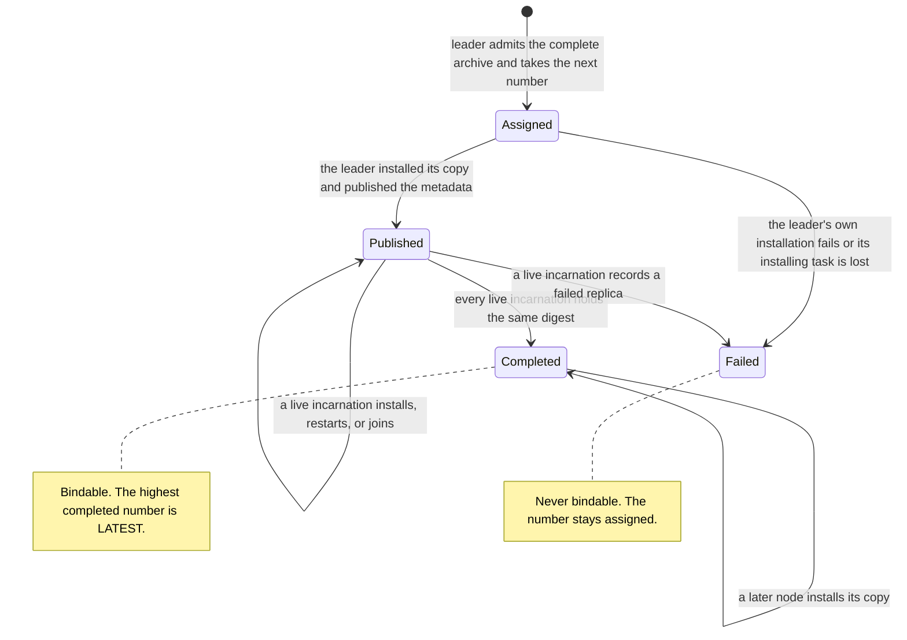
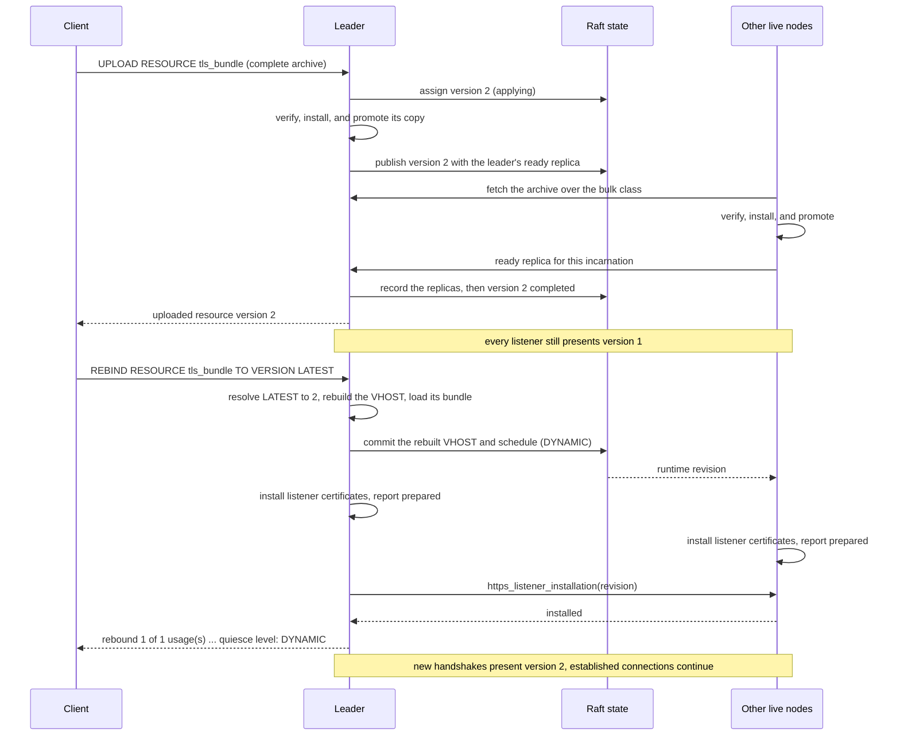

# Resource Versions And Bindings

A resource version is an immutable directory tree that the cluster verifies and installs on every
live node before anything can use it. A binding is the part of a model that selects one of those
versions: a TLS VHOST, a protobuf codec or signaling protocol, an inferencer, a WASM processor, a
hash map, or a client mount. This chapter defines the contract that joins them: who owns each piece
of state, how a version becomes usable, what each consumer loads and when, how `VERSION LATEST`
resolves, how `REBIND RESOURCE` moves bindings, and what a failure leaves behind.

The central rule is that a version change is a model change. Every stored model names the concrete
completed version it binds, and its consumers load exactly that version. An upload only adds a
version to the catalog. A running consumer moves to another version only when a validated,
classified, and atomic model mutation rebinds it.

This chapter describes the architecture. [Resources](./resources.md) owns the NSPL statements, the
upload format, the per-version limits, and examples.

## Ownership By Layer

| Layer | Owner | What it owns |
| --- | --- | --- |
| Vocabulary | Resource identities | A version is identified by its domain, resource name, and number. A statement writes `VERSION <n>` or `VERSION LATEST`; a stored model holds only a number. |
| Control plane | The resource catalog in consensus | For each domain: its declared resources and their version sequences, the metadata of every published version, upload outcomes keyed by upload identity, and one replica record per version and node process incarnation. |
| Control plane | Upload installation and replication | Admitting an upload, assigning its number, installing it on every live node, and recording its terminal outcome. |
| Engines and infrastructure | The resource store on every node | Staging an archive, verifying its digest, quotas, and manifest, and atomically promoting a complete version into its local directory. |
| Engines and infrastructure | The interconnect | Streaming a version's archive from a node that holds it to a node that does not. |
| Decisions | Registry validation and the transaction planner | Resolving `LATEST`, rejecting a version that is not completed, rebuilding the models a rebinding selects, and classifying the change into the plan a commit applies. |
| Data plane | Runtime consumers | Loading the version their execution plan names from the local store: descriptors, an inference session, a compiled module, a hash-map index, or a client mount. |
| Edges | The HTTPS listener | Presenting the certificate every TLS VHOST pins, on every live node. |

The catalog is domain-owned like every other entity. The same resource name in two domains is two
resources with independent version sequences, stored content, and replica records, and a model
resolves a resource only in its own domain.

The resource store keeps each version under `<db-path>/resources`, in one directory per domain,
resource, and version number. It installs bytes and reports what it holds. It does not know how a
version was uploaded, which node sent it, or which models use it.

Registry validation and the transaction planner decide from the catalog inputs captured with a plan:
the declared resources of the domain and its completed versions. Before a plan commits, the leader
also checks three kinds of content against its own copy of a version: a VHOST's TLS bundle must
load, a hash map's file must exist at its path, and an inferencer's ONNX model must load and match
the tensors the inferencer declares. The rest of a version's content is proven by the consumers that
load it.

A runtime consumer receives its model, and with it the pinned number, in the execution plan it is
built from. It resolves that number to a local directory and nothing else. No consumer reads the
catalog to choose a version.

The HTTPS listener runs on every live node, independent of Raft leadership and graph placement,
like every other entity that binds a configured listening port. It presents the TLS VHOSTs of the
runtime revision its node applied.

## Version Lifecycle

### Assignment

`CREATE RESOURCE` declares a resource in the selected domain and starts its version sequence at 1.
Uploads are leader operations. A client-protocol upload declares the exact size of the archive it
streams, and a follower redirects it to the leader. A web-console upload streams the selected files
to the leader, which builds the archive itself; a follower refuses it.

A number is assigned when the leader admits an upload. Once the complete body has arrived, the
leader holds the archive's digest and records the upload under its identity in one consensus
command, which takes the next number of the sequence. A body that ends early or exceeds its
declared size is not admitted, assigns nothing, and leaves its identity unused.

A number is never reused. A failed upload keeps the number it was assigned, so the completed
versions of a resource can have gaps. A sequence that reaches the largest representable number
rejects further uploads rather than wrapping.

An upload identity is scoped to the authenticated user, the domain, and the resource. Repeating an
upload with the same identity and the same archive digest continues or reports the upload already
recorded under that identity, with the number already assigned; the same identity with a different
digest is rejected as a digest conflict. An upload admitted through the client protocol keeps
installing when the uploading connection closes. The identity rules and client retries are covered
in [Resources](./resources.md#lifecycle) and
[Command Completion](./command-completion.md#lifecycle-and-ownership).

### Installing One Copy

The leader's first copy and every replica go through the same verification in the resource store:

1. The archive is staged under the archive quota and hashed with BLAKE3 as it is written, and its
   digest must match the version's root checksum, the BLAKE3 digest of the archive. An archive that
   arrived with a declared size, over the client protocol or from another node, has already been
   rejected if its length differed.
2. Entries are extracted into a staging tree. Only directories and regular files are accepted,
   every path must stay inside the version, and no path may appear twice. The extracted-byte and
   file-count quotas are checked from each entry's tar header before that entry is written.
3. The store records a manifest of every directory and file, with each file's size and checksum.
   The leader's manifest defines the version's metadata: its root and manifest checksums, file
   count, and extracted and archive byte counts. A replica must reproduce exactly the metadata the
   leader published.
4. The manifest, the extracted tree, and the archive are synchronized to disk, and the staging
   directory is renamed into place as the version's directory. An earlier copy of the same version
   in that place is removed first.

A failure at any step removes the staging tree, so a partially installed version is never visible.
Each node keeps the verified archive beside the extracted tree, which is what it serves when another
node fetches the version. The quotas and their defaults are listed in
[Resources](./resources.md#upload-format); each node enforces them itself.

### Publication And Transfer

After the leader installs its own copy, one consensus command publishes the version: it stores the
version's metadata together with the leader's ready replica record. From then on every node knows
the version and can see which nodes hold it.

Every node reconciles its store with the catalog in repeated passes, starting each pass a second
after the previous one finished. For each published version its current process incarnation has not
recorded as ready, it first reads its own store: a local copy whose manifest matches the published
metadata is recorded as ready without another transfer, which is how a restarted node reclaims what
it installed before. Otherwise the node records a pending replica, fetches the archive from a live
node whose replica is ready with the same digest, installs it through the steps above, and records a
ready or failed replica with the reason. A node fetches at most four versions at a time, and when no
live node holds a ready copy it records a failed replica. The leader accepts a replica record only
from the node that record describes.

Archives travel as streamed bulk transfers with an exact declared length, in bounded chunks under
HTTP/2 flow control, so neither end holds a whole archive in memory. An interrupted transfer is not
resumed; the next reconciliation fetches the archive again from the beginning. Cluster Interconnect
defines the bulk pool, its reserved resource streams, and the resource transfer quota in
[Traffic And Resource Isolation](./interconnect.md#traffic-and-resource-isolation), and the
streamed response and its deadlines in [Exchange Forms](./interconnect.md#exchange-forms).

### Completion

The leader completes an upload when every current live node process incarnation has recorded a
ready replica with the version's digest. It derives that set from effective live membership each
time the catalog or the membership changes, keyed by node name and process incarnation:

- A node that becomes live while the upload is applying joins the set, and the upload waits for its
  copy.
- A node that restarts under the same name is a new incarnation and must record its own ready
  replica. Its reconciliation normally does so from the copy already in its store.
- A node leaves the set only when the cluster's availability policy marks it unavailable. A missed
  probe or a stale observation does not waive its copy.

The first failed replica recorded by a live incarnation fails the upload at once, with that node's
reason. Otherwise there is no completion deadline: an upload stays applying until every incarnation
in the set has recorded a ready replica, and a caller that stops waiting does not stop it.

The leader records the outcome in consensus. A failed upload is reported as soon as that record
commits. A completed upload is reported only after the outcome is visible on every live node, and
after the leader has evaluated the live set once more, so that a node that joined while the outcome
propagated also holds the version before `UPLOAD RESOURCE` returns `uploaded resource version <n>`.
If either of those final waits fails, because visibility timed out or a live incarnation recorded a
failed replica, the command reports that failure although the version stays completed. The recorded
outcome is terminal: a failed version never becomes completed, and a completed version never fails.

If an applying upload loses the task that was installing it, because leadership moved or a console
upload's connection was aborted, the leader resumes it at its next reconciliation. An upload whose
version was never published fails with
`the admitted archive is unavailable before durable version installation`, because only the node
that admitted it held the archive. A published version keeps waiting for the live set as above.

A node that joins after completion does not change the outcome. Its reconciliation installs every
published version it does not hold from a live node that holds it, and
`DESCRIBE RESOURCE <name> VERSION <n>` shows its replica converge. Nothing else waits for that
installation. Until the node holds a version, building a domain that needs it fails on that node,
so the node does not report the runtime revision prepared, and commands that wait for every live
node wait for it. The node builds the domain again the next time it applies the cluster's runtime
state, such as after a later schedule or domain change.

### Bindable Versions And Latest

Only a completed version can be bound. An explicit `VERSION <n>` must name a completed version of
the resource in the statement's domain. An applying or failed version is rejected as
`resource '<name>@<n>' is not a completed version in domain '<domain>'`, and a number with no
upload there as `resource '<name>@<n>' does not exist in domain '<domain>'`.

`LATEST` is the highest completed version. A newer version that is still applying or has failed
never displaces it. A resource with no completed version cannot be bound through `LATEST` either:
`resource '<name>' has no completed versions in domain '<domain>'`. `DESCRIBE RESOURCE` reports the
version `LATEST` would select at that moment as `latest:`.



Nervix does not delete or expire versions. Every published version, including one that failed after
publication, stays in the catalog, and every node keeps installing each published version it lacks.

## Bindings

Seven model forms bind a resource version, and each requires a `VERSION <n>` or `VERSION LATEST`
clause. Omitting the clause is a parse error.

| Binding | What it consumes from the version | When it loads it |
| --- | --- | --- |
| `VHOST ... WITH TLS` | `tls.crt`, `tls.key`, and `ca.crt` at the version root | When a node installs the TLS VHOSTs of a runtime revision into its HTTPS listener: on every live node, for running and stopped domains |
| Protobuf `CODEC` | The `.proto` sources its configuration selects, or every `.proto` file in the version when it selects none, compiled into descriptors | When a node builds the domain's execution: on every live node, for running and stopped domains |
| Protobuf `SIGNALING PROTOCOL` | The `.proto` sources it selects the same way, compiled into the descriptors of its send and wait messages | When a node builds the execution of a running domain |
| `INFERENCER` | The ONNX model file it names | When a branch instance first flushes output; each branch instance holds its own inference session |
| `WASM PROCESSOR` | The module file it names, compiled into machine code | When a node builds the execution of a running domain or replaces the processor; a node keeps the compiled module only while the schedule assigns the processor to it as owner or replica, and each branch instantiates it when it first needs its guest |
| `HASH MAP` | The file it names, decoded line by line through its codec into an in-memory index | When a node builds the domain's execution: on every live node, whatever the schedule assigns, for running and stopped domains |
| `CLIENT ... MOUNT` | The version's content directory, linked into a temporary mount root; the connector reads the files it names from there | Whenever the client is instantiated, such as by an ingestor or emitter when it starts, or once per node for a pooled client; each client instance keeps its mount root for its lifetime |

An HTTP emitter validates its referenced client's origin, attempt timeout and paired client
certificate/key settings before its candidate graph activates. A TLS path rendered from `CLIENT
... MOUNT` still names the pinned version in the client Model; validation does not fetch a newer
version or probe the remote HTTP endpoint. Client instantiation reads the mounted CA or identity
files at the existing load boundary above.

### The Pinning Invariant

Three rules together guarantee that a consumer uses exactly the version its model names:

1. **The persisted model names the number.** Planning resolves the written form before a model is
   stored, and a stored model holds only the resulting number. The written `LATEST` is kept only in
   the transaction record of the statement that carried it, which is never planned again once that
   statement is applied.
2. **The execution plan carries it.** Schedule application builds each consumer from the scheduled
   model it runs, so the number travels with the model into every node's execution.
3. **No consumer consults the catalog.** A consumer resolves its number to a directory in the local
   store and loads it. It never asks which version is newest.

A rebuild, a restart, a failover, and a relocation all rebuild consumers from the same stored
models, so they load the same versions. Only a model mutation can change a number.

## `LATEST` Resolution

`LATEST` is resolved by the planner when a statement is applied, against the catalog inputs
captured for that plan. It never resolves at runtime.

- **A standalone statement** runs as a one-statement command transaction and resolves `LATEST`
  when it is applied. The result names each resolution:
  `resolved VERSION LATEST of resource '<resource>' to version <n> for <kind> '<name>'`.
- **A statement queued inside `BEGIN`** is planned at admission against the transaction's prefix so
  that it can be validated. That resolution is provisional and is reported as
  `provisionally resolved VERSION LATEST ...`; the queued statement keeps the written `LATEST`.
  `COMMIT` plans the whole transaction again as one preview from a fresh snapshot, and admission
  freezes that plan, so `LATEST` binds the highest version completed when the admitted preview was
  planned, which may be newer than the provisional one.
- **`REBIND RESOURCE ... TO VERSION LATEST`** follows the same timing and resolves its target once
  for the whole statement. Its summary line marks the resolved target with `(latest)`.

The captured inputs include the domain's declared resources and all of its completed versions, and
they are compared with the current catalog twice: by the leader just before it applies a step, and
again at the replicated apply boundary. An upload that completes in the domain in between, for any
of its resources, makes the plan stale. The step is then rejected as
`domain '<domain>' resource inputs changed` before any model is committed. The leader's check runs
before anything pauses; a rejection at the replicated boundary first releases the pause, gates, and
handoff the step had engaged and rolls back the leader's local registry.

What follows depends on who owns the plan. An ordinary command retains that failed attempt and
starts another attempt, derived from the newer revision, under the same execution reference, so it
plans again and `LATEST` binds the version that completed. An explicit transaction is frozen from
`COMMIT` admission onwards: a basis that is already stale at admission leaves the transaction `OPEN`
with a refreshed identity; the Rust client requires an inspection of the attached transaction
before retrying against that identity. A conflict found after admission ends the
transaction instead of replanning it.

Either way, a plan never commits a `LATEST` it resolved against an older catalog.
[Control Plane](./control-plane.md#replicated-nspl-transactions) defines preview identity,
admission, and the frozen plan.

## Rebinding

`REBIND RESOURCE` is a model mutation. It changes the version the selected models bind and nothing
else: it does not touch the catalog, and every other field of each model stays as written.

### Selection And Validation

The planner resolves the statement against the part of the transaction that precedes it, so it
sees models that earlier statements of the same transaction create or drop.

1. The resource must be declared in the domain, or the statement fails with
   `resource '<name>' does not exist`.
2. The target resolves to one completed version exactly as a binding does: an explicit number must
   be completed, and `LATEST` selects the highest completed version.
3. Without `FOR`, the selection is every model in the domain that binds the resource. With `FOR`,
   it is exactly the listed members. Each member must exist
   (`<KIND> '<name>' does not exist in domain '<domain>'`) and bind the resource
   (`<KIND> '<name>' does not bind resource '<resource>'`). A repeated member is a parse error.
   Written order has no effect.
4. The planner rebuilds each selected model with the target number. A usage that already binds the
   target contributes no change and is reported as `unchanged`.
5. The rebuilt models pass the same checks as `CREATE`: registry validation of the complete
   candidate graph, and the leader's content checks for each changed VHOST, hash map, inferencer,
   and WASM processor against the target version. One failing model rejects the whole statement, and
   the error names it, for example `INFERENCER '<name>' binding validation failed in domain '<domain>': ...`.

A rejection at any of these steps happens before any effect: no model is stored, nothing pauses,
and every usage keeps its version.

A WASM processor's module is compiled before the statement can commit, because activating a module
binding also replaces the guest state of every branch: a module discovered to be uncompilable
afterwards has already invalidated the state its predecessor saved. The compiled module the check
produces is the one activation installs, so nothing is compiled twice.

The remaining content that only a consumer can prove is proven when the nodes build the consumers
from the committed models: the protobuf sources a codec or signaling protocol compiles, and every
line of a hash-map file. A client mount only needs the version's directory; the connector
reads the files it names when it uses them. A version that fails during activation fails the
command after its models were committed, as described in
[Failure Semantics And Recovery](#failure-semantics-and-recovery). A stopped domain builds only its
codecs and hash maps, so an unusable version bound by one of its other consumers surfaces when the
domain starts.

### Classification And State Effects

The rebuilt models are classified like any other model change, and the statement runs at the
highest level among the usages it changes:

| Usage | Level | State effect |
| --- | --- | --- |
| `VHOST` TLS | `DYNAMIC` | Every node's HTTPS listener installs the new certificate. No execution node pauses or restarts. |
| Protobuf `CODEC`, `SIGNALING PROTOCOL` | `DOMAIN_PAUSE` | The domain pauses and rebuilds with descriptors compiled from the new version. |
| `HASH MAP` | `DOMAIN_PAUSE` | The domain pauses and every live node builds the index of the new version before the command succeeds. |
| `CLIENT` mount | `DOMAIN_PAUSE` | The domain pauses and rebuilds; its ingestors and emitters instantiate their clients with a mount of the new version. |
| `INFERENCER` | `ENTITY_PAUSE` | The inferencer and its downstream pause. The replacement's branch instances load new inference sessions from the new model file. |
| `WASM PROCESSOR` | `ENTITY_PAUSE` | The processor and its downstream pause, and each branch is flushed. Every branch starts a new guest-state generation, so the replacement instances, created from the new module, initialize without guest state. The candidate module is compiled before the statement commits. |

[Control Plane](./control-plane.md#alter-lock-and-quiesce-classification) defines what each level
pauses and drains. A rebinding in a stopped domain has no running work to pause, so it runs and
reports `DYNAMIC`. A stopped domain still keeps its codecs compiled and its hash maps loaded on
every node, and its VHOSTs in every listener, so those move to the new version before the command
returns; signaling protocols, inferencers, WASM processors, and client mounts load it when the
domain starts. A WASM processor's new guest-state generations are published with the rebinding
even while the domain is stopped, so the processor starts without guest state.

The shared impact report records the rebinding as one operation. It contributes one rebinding
reason, carrying the previous and the target number, for every selected usage, including unchanged
ones, and the changes, pauses, activations, and state resets it causes are attributed to that
operation.

### Activation, Atomicity, And Rollback

All changed models are committed together with the resulting schedule in one step, under the
domain's alteration lock, after the quiesce their level requires. Activation then follows the
ordinary model-change path: each consumer is rebuilt or refreshed from the committed models, and the
command completes only when every live node has applied the revision, every live node's listener
has installed the certificates of an affected VHOST, and every gate the step engaged is released.
The successful response is the boundary at which every selected usage uses the new version; see
[Command Completion](./command-completion.md#lifecycle-and-ownership).

The models of a rebinding are committed all together or not at all. A failure after commit follows
the rule for any model step:

- An HTTPS listener failure in a step that did not pause, such as one that moves only VHOSTs, rolls
  the step back in the same consensus entry that records the failure: the previous models and
  schedule are restored, and the command waits until every listener presents the restored
  certificates before it reports the failure.
- Every other activation failure, and a listener failure in a step that paused, keeps the committed
  models. The step releases any pause it engaged and reports the failure, like any other model
  change whose activation fails.

### Transactions And No-Ops

`REBIND RESOURCE` is ordinary transaction content. Inside `BEGIN`, it joins the consecutive model
run it is written in, so a transaction can create a model and rebind it, or rebind several
resources, as one atomic step, and the run is classified as a whole. Its target and selection are
provisional at admission and are planned again in the preview that `COMMIT` admits and freezes.

A rebinding that changes no usage, because every selected usage already binds the target or the
resource has no usages at all, writes no model. On its own it reports `DYNAMIC` and lists every
selected usage as `unchanged`:

```text
rebound 0 of 1 usage(s) of resource 'lookup_bundle' to version 2
quiesce level: DYNAMIC
- kind=hash_map name=lookup_by_id from=2 to=2 unchanged
```

### Certificate Rotation

Rotating a VHOST certificate combines both halves of the contract: an upload that changes nothing,
followed by a rebinding that moves the VHOST.



## Uploads Change Nothing That Runs

An upload is a catalog operation. It adds one version and ends with that version installed on every
live node, and it refreshes nothing. Catalog changes do not advance the runtime revision that nodes
apply, so no listener, compiled descriptor, index, session, module, or mount is rebuilt because a
version completed, and no binding follows an upload. `DESCRIBE RESOURCE` shows the new `latest:`,
while every model keeps the number it pins.

This keeps two concerns apart. An upload proves that the bytes arrived intact everywhere; whether
they are usable is a property of the model that binds them. A version whose content no consumer can
use, such as a malformed TLS bundle, completes like any other upload, and every existing binding
keeps its version. The problem is reported only when a statement binds that version: the leader's
content checks reject it before any effect, for example with
`invalid TLS resource for VHOST '<name>' in domain '<domain>' from '<resource>@<version>': no certificates found in TLS CA certificate`,
and content that only a consumer proves fails the statement's activation. TLS failures identify
the certificate, private key, or CA certificate by kind without exposing its filesystem path or
material in the command result or server log.

## The `DYNAMIC` TLS Refresh

Every node's HTTPS listener presents the TLS VHOSTs of every domain in the runtime revision that
node applied, including domains that are stopped, because a stopped domain keeps its schedule. For
each TLS VHOST the listener loads the pinned version's certificate chain and private key and
presents them to clients whose SNI names one of the VHOST's hostnames. The certificate must be valid
for every one of those hostnames; the leader's content check does not compare them, so a
certificate that does not name a hostname fails at installation. `ca.crt` must parse, but the
listener neither presents it nor asks clients for a certificate. Until a node has installed its
first revision after it starts, and whenever no TLS VHOST exists, its listener has no certificates
and refuses TLS connections.

A node installs the listener certificates of a runtime revision before it reports that revision
prepared. The installation replaces, in one step, the configuration that new connections handshake
with:

- Established connections keep the session they negotiated and are not interrupted.
- New handshakes present the new certificates.
- A revision whose set of TLS VHOSTs is unchanged keeps the configuration already presented.
- The configuration is built from every TLS VHOST at once, so a bundle that the node cannot load,
  in any domain, fails the whole installation on that node.
- Each revision is attempted once. A failed installation leaves the previous certificates in place,
  is recorded with its reason for that revision, and is attempted again at the next revision.

A command that creates, changes, or drops a VHOST confirms the installation on every live process
incarnation through the `https_listener_installation` management request described in
[Cluster Interconnect](./interconnect.md#https-listener-installation). A failed installation on
any node fails the command with
`failed to install the HTTPS listener TLS configuration on node '<node>'`. When the step did not
pause, as for a version-only change, the creation or removal of a VHOST, or any VHOST change in a
stopped domain, that failure rolls the step back as described above: the error states that the model
batch was rolled back, and every listener presents the restored certificates before the command
returns.

Of the changes to an existing VHOST, only a move to another version of the resource it already
binds is `DYNAMIC`; creating or dropping a VHOST is `DYNAMIC` as well. Endpoint routing reads a
VHOST's hostnames but not its certificate, so a version move is applied as a dynamic schedule
update: a running domain's buffered work is force-flushed, but no execution node pauses, restarts,
or is rebuilt. Changing hostnames, adding or removing `WITH TLS`, and binding another resource
change the VHOST's configuration rather than only its certificate. They stay `DOMAIN_PAUSE`, like
the other configuration entities whose consumers read them when the domain is built, and the domain
rebuilds around the new model. Every listener still installs the resulting certificates before such
a command succeeds.

## Guarantees And Limits

The contract provides six guarantees:

1. **A running consumer uses exactly the version its model names.** The number is stored in the
   model, carried in the execution plan, and loaded from the local store.
2. **A version change is a validated, classified, atomic model change.** It is planned from one
   captured snapshot, validated like a `CREATE` of the rebuilt models, classified at the level of
   the usages it changes, and committed for every selected usage or for none.
3. **An upload changes nothing that is running.** It adds a version to the catalog and installs it,
   and no consumer reloads because of it.
4. **Only completed versions bind.** `CREATE` and `REBIND RESOURCE` accept a version only after its
   upload completed on every live node incarnation, and `LATEST` means the highest completed
   version.
5. **Rebuild, restart, failover, and relocation cannot move a binding.** They rebuild consumers from
   the stored models, which name the same numbers.
6. **Rebinding never crosses domains.** A rebinding resolves the resource, its versions, and its
   usages in the selected domain only.

Nervix does not provide:

- **Guest state carried across WASM module versions.** A generation of guest state belongs to the
  module binding it was published for. A model change that binds a processor to another resource,
  version, or module file, such as a rebinding, starts a new generation for every branch in the same
  schedule publication, so no checkpoint saved under the previous module can attach to the new one
  and every branch starts without guest state. A rebinding that leaves the processor's version
  unchanged keeps its state. See [State Generations](./wasm-processor-guests.md#state-generations)
  and [Rebinding And Rollback](./wasm-state.md#rebinding-and-rollback).
- **Version deletion or retention.** Versions accumulate in the catalog and in every node's store.
  Plan storage for every version ever uploaded.

## Failure Semantics And Recovery

| Failure | Outcome |
| --- | --- |
| A statement binds a missing, applying, or failed version, uses `LATEST` with no completed version, names an unknown resource, or lists a missing or non-binding `FOR` member | The statement is rejected before any effect. No model is stored, nothing pauses, and every usage keeps its version. |
| A VHOST's TLS bundle does not load, a hash map's file is missing, an ONNX model does not match its inferencer, or a WASM module does not compile | The leader's content checks reject the statement before any effect. |
| An upload completes in the domain between capture and apply | The step is rejected as stale before any model is committed, and whatever it engaged is released. An ordinary command plans again as another attempt under the same execution reference; an explicit transaction reports the conflict instead of replanning. |
| An HTTPS listener cannot install a VHOST change in a step that did not pause | The failure record restores the previous models and schedule, and every listener presents the restored certificates before the command reports the failure. |
| A consumer cannot load the version during activation, such as protobuf sources that do not compile or a hash-map line that does not decode | The step releases any pause it engaged, the committed models remain, and the command or transaction reports the activation failure. Nothing returns the models to their previous versions; a later model change, such as a rebinding to a usable version, repairs the binding. |
| One node cannot install a version during its upload, including a transfer that is interrupted | The upload fails with that node's reason. The number stays assigned and is never bindable. |
| A node lacks a published version | Its reconciliation fetches the version from a live node that holds it, from the beginning of the archive. Until it holds the version, that node cannot build a domain that needs it. |

Pinned bindings are what make recovery reproduce the same versions. After a process restart, a
leader failover, a cluster restart, or a relocation, every consumer is rebuilt from the stored
models and loads the number they name from the local store. The catalog is committed control-plane
state, and a restarted node reclaims the versions already in its store by checking their manifests
against the published metadata. Its HTTPS listener presents certificates again once the node has
been [admitted back into runtime execution](./shutdown.md#recovered-ownership-is-fenced) and has
installed the revision it applies.

Startup removes staging trees abandoned by an interrupted process, so an interrupted installation
leaves no partial version, and closing a connection cancels an upload that is still waiting for its
client. [Shutdown And Recovery](./shutdown.md#abandoned-preparations-and-staging) and its
[Stopping Intake](./shutdown.md#stopping-intake) section define both, together with what survives
each kind of ending.

## Observability

| Signal | What it shows |
| --- | --- |
| `DESCRIBE RESOURCE <name>` | `latest:` as the highest completed version or `(none)`; every published version, including one still applying or failed after publication, with its checksums, sizes, and the entries of the answering node's copy; and `usages:`, one line per model that binds the resource with its pinned version. Session clients receive the same facts as a typed resource description beside the text: an absent latest version stays absent, each entry keeps its exact path, and an unreadable manifest is reported as unavailable rather than as an empty version. |
| `DESCRIBE RESOURCE <name> VERSION <n>` | The version's checksums, file count, size, and entries; one line per node with its topology, replica state, incarnation, checksum, verification time, source node, and error, taken from its live incarnation or, for a node that is not live, from its latest one; and the models pinned to that version, or `none`. |
| `SHOW CREATE` | The stored number for every binding. A statement written with `LATEST` renders the number it resolved to. |
| `DESCRIBE HASH MAP` | `resource: <name>@<n>` for the loaded version, together with the path, codec, placement, key field, and entry count. |
| `DESCRIBE WASM PROCESSOR` | The module's `resource:` and pinned `resource version:` beside the current guest-state generation and checkpoint status. A completed reset of the previous binding is not presented as a reset of the newly pinned module. |
| Command results | `uploaded resource version <n>`, every `resolved VERSION LATEST ...` line, and the rebinding summary with one `from`/`to` line per selected usage. |
| Web console | The highest completed version of each resource in the sidebar and, in the resource dialog, every version's entries and the models bound to it, read from the typed resource description. See [Web Console](./client-tools-web-console.md#uploading-resources). |
| Server log | `rebound resource usages` at `info` once the leader has applied a rebinding's step, before the step's outcome is recorded, with the domain, resource, target version, and the counts of selected and changed usages; `installed HTTPS listener TLS configuration` at `info` whenever a node's listener starts presenting a changed set of certificates. |
| Interconnect metrics | Archive fetches in flight and fetches refused for lack of capacity appear in `nervix_interconnect_pending_operations` and `nervix_interconnect_quota_failures_total` with `operation="resource"`. Their bytes count toward `nervix_interconnect_bulk_bytes_total{class="bulk"}`, which snapshots share. See [Metrics And Observability](./metrics-and-observability.md#interconnection-metrics). |

A version's upload outcome is not a line of its own. `latest:` names the highest completed version,
and the per-node lines show which incarnations installed a version and why one failed; replica
installation writes no log lines of its own. Descriptions are observations: an upload or a
rebinding completes on its own completion boundary, and a caller never polls a description to
finish one.
