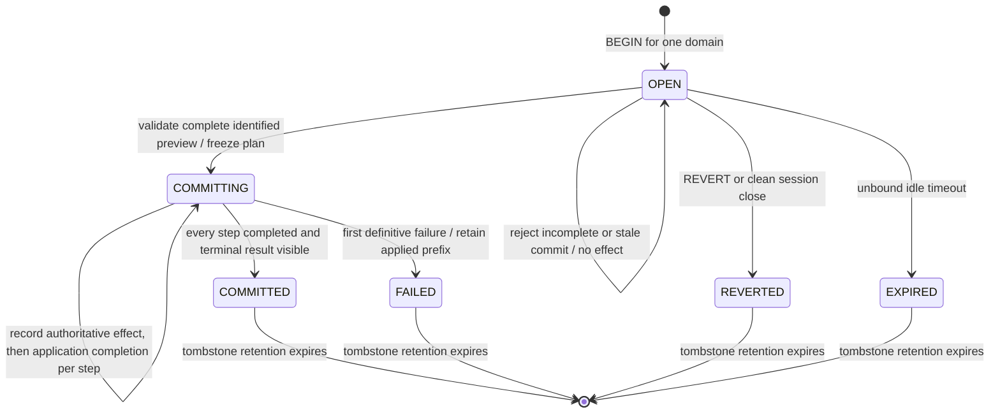

# Transaction Quiescence And Impact Inspection

Nervix plans the effect of a transaction before it changes the running graph. One typed impact
report explains what each accepted operation contributes, what each atomic execution step requires,
and what the transaction requires as a whole. The same report follows the transaction through
commit, application, failure, and retained inspection. A planned pause and a pause actually engaged
are separate facts.

This chapter owns impact planning, scoped quiescence, actual engagement reporting, inspection, and
retention. [Control Plane](./control-plane.md#replicated-nspl-transactions) owns the broader
transaction lifecycle and registry mutation rules; [Command Completion](./command-completion.md#transactions)
owns when a command is usable and acknowledged. [Domain Clock](./domain-clock.md),
[Cluster Interconnect](./interconnect.md), [Consensus Storage And Replication](./consensus-storage-and-replication.md),
and [Shutdown And Recovery](./shutdown.md) own their respective time, transport, durability, and
process recovery boundaries.

## From Accepted Operations To Execution Steps

`BEGIN` opens one transaction for an existing selected domain. Every queued statement must belong
to that domain. A successful append receives a stable, one-based operation number in written order
and advances the accepted position. Transaction controls, inspection, and rejected admission consume
no number. An exact retry of an admitted append returns its original number and identified preview;
it does not append again or extend transaction activity. The original source is retained for
display, while execution uses the structured statement.

The planner and executor partition that ordered sequence the same way:

| Content | Execution boundary |
| --- | --- |
| Consecutive model `CREATE`, supported `ALTER`, `DROP`, and `REBIND RESOURCE` operations | One atomic model run, evaluated in written order against one candidate graph. |
| `ALTER DOMAIN`, `START`, `STOP`, `CREATE RESOURCE`, or `RESET WASM PROCESSOR ... STATE` | One step each; each ends a preceding model run. |

A model run's configuration and schedule are published in one authoritative step. Its *base-to-final*
diff determines the effective impact: an intermediate change can be cancelled, a drop followed by
recreation can change the schema or wiring, and several individually valid operations can jointly
require a wider pause. The run is revalidated as a complete graph before publication. A failure
before that publication writes none of its candidate models. Other steps retain their own atomic
effect boundaries; the transaction as a whole is **not** atomic. Commit stops at the first
definitive failure and retains its applied prefix. A step can have an authoritative effect while
runtime activation is still `APPLYING`; completion is recorded separately.

Queue admission replays the accepted prefix in this exact order. An unfinished *final* model run
may be admitted with an `INCOMPLETE` candidate and planning diagnostics when a later operation in
that same run can make it valid. An intervening lifecycle, domain, resource-catalog, or reset step
ends the run, so a later run cannot repair the earlier one. An incomplete candidate is never a
complete empty scope, and `COMMIT` requires every step to plan completely.



## Three Levels Of Impact

An **operation contribution** records its typed operation, ordered reasons, and effects attributable
to that statement. It has no independent effective quiesce level or execution outcome. In
particular, the ordered clauses of one `ALTER` remain ordered reasons, while shared affected items
can name several contributing operation numbers.

An **execution step** records its inclusive operation range, completeness, required pause, planned
effects, actual engagement history, actual effects, and `UNATTEMPTED`, `APPLYING`, `APPLIED`, or
`FAILED` outcome. The effective requirement comes from the whole model run or the single
non-model step, including schedule changes. The **transaction summary** combines the effective
requirements of all steps: no pause contributes nothing, entity subgraphs combine their nodes and
gates, and any domain pause makes the summary domain-wide. This is the *planned* maximum. A commit
result reports the highest level actually engaged by executed steps, which can be lower after a
pre-engagement failure or higher after recorded recovery expansion.

| Required level | Typed scope | What it requires before the step's effect |
| --- | --- | --- |
| `DYNAMIC` | `NO_PAUSE` | No execution gate or domain drain. Configuration, lifecycle, listener, or activation work may still be required. |
| `ENTITY_PAUSE` | One named subgraph, its concrete branch coverage, and admission relay gates | Hold new admission at those boundaries and drain the affected work while unrelated graph traffic continues. |
| `DOMAIN_PAUSE` | The owning domain | Stop domain intake and generators and drain all attached execution work before publication. |

The pause requirement is a typed `NO_PAUSE`, `SUBGRAPH`, or `DOMAIN` value. The displayed level is
derived from that value, so a domain level cannot carry an entity-only scope. An entity gate is
installed on every live node for the affected relay and branch coverage. The planner includes
downstream consumers and every member of an affected hard placement group. Engaging any entity
gate also requests a force flush of the full current execution graph; **force-flushed work is not
the set of paused entities**. A domain pause covers all execution nodes on both sides of the
change. [Data Plane](./data-plane.md) explains the runtime work these gates protect;
[Control Plane](./control-plane.md#alter-lock-and-quiesce-classification) lists the model changes
that normally contribute each level. An ingestor's `ON QUIESCE` mode controls its external-source
behavior under a hold; it is distinct from the step's quiesce level.

The report keeps separate effect sets for configuration creation/change/drop, resource catalog and
version bindings, domain lifecycle, ownership moves, activations and deactivations, rebuilds,
state resets, force flushes, and affected topology. An HTTPS `VHOST` version refresh can therefore
be `DYNAMIC` while every live node still installs a new listener certificate. A running-domain
primary move raises an otherwise dynamic model or placement change to `ENTITY_PAUSE`; replica-role
changes alone do not. A schedule rebuild can raise a narrower model change to `DOMAIN_PAUSE`. In
a stopped domain, a model or resource rebinding has no running work to pause and reports
`DYNAMIC`, although the changed configuration still matters at the next start. Explicit `START`
and `STOP` are individual `NO_PAUSE` steps with lifecycle effects; they determine whether later
model steps plan against a running or stopped domain. [Resource Versions And Bindings](./resource-versions.md#classification-and-state-effects)
owns what each pinned resource version loads and which rebindings reset state.

An automatic schedule change that moves work away from a node the leader has marked unavailable
retains its planned and actual impact. Completion waits for the leader's current required runtime
participants, including the connected local node, and does not wait for preparation by that
unavailable node. If the node rejoins, its later catch-up is a separate application of the current
revision; it does not change the committed step's impact report.

### Concrete joint and mixed-scope examples

| Accepted sequence in one domain | Effective plan and interpretation |
| --- | --- |
| On a running graph, change a relay's capacity, then add an optional field to its schema in the same consecutive model run. | Capacity alone is dynamic, but the run changes a schema. Its single step is `DOMAIN_PAUSE`, with both operations attributed to the affected result. |
| Add an optional schema field, then drop that field in the same model run. | The base and final graph match. The run is a `DYNAMIC` no-op even though the operations keep their individual contributions and ordered reasons. |
| Change the keys of two deduplicators on independent relay paths in one run. | Both contribute `ENTITY_PAUSE`; the step's subgraph is the union of the two path scopes. If both paths share an admission relay, that gate appears once with both operation numbers. Unrelated paths stay outside the paused subgraph. |
| Reset one concrete branch of a WASM processor, then change an unrelated deduplicator key across its declared branch. | These are separate `ENTITY_PAUSE` steps. The reset retains selected-key coverage while the model step covers every key of its own branch; the transaction summary unions their two subgraphs without broadening the reset to all branches. |
| `STOP`, change a schema, `START`, then change that schema again. | Four boundaries: stop, a stopped-domain dynamic model step, start, and a running-domain model step requiring `DOMAIN_PAUSE`. The summary is domain-wide even though the earlier schema step needed no pause. |

The qualification scenarios in `tests/features/runtime/nspl_transactions.feature` and the
planner checks in `src/registry/transaction/tests.rs` exercise the first, second, and lifecycle
patterns. The scoped topology and shared-gate checks also exercise branch and relation identity.

## Affected Topology And Attribution

Each step carries affected topology **before** and **after** its effect. These are snapshots of
the relevant graph at that step, not a lookup into today's live graph. The before side retains
dropped nodes and disconnected or rewired relations; the after side shows the graph activation
installs. A transaction view composes steps in order, so an entity created and dropped in different
steps can be transient even if absent from the transaction's final graph.

Nodes have typed model-kind and name identities. Execution nodes additionally state whether their
coverage is all executions, the unbranched execution, every key of one declared branch, or
selected concrete keys. Selected key values are represented by fingerprints; the report does not
expose raw, potentially sensitive branch fields. Configuration-only nodes have no execution
coverage. Relations distinguish configuration dependency, dataflow, message-error, correlation-
timeout, and materialized-state edges. Parallel relations between the same two nodes remain
distinct. A configuration dependency explains a model relationship; downstream pause traversal
follows record or state effects, so it is not simply a traversal of every dependency in the
displayed graph.

The topology includes shared admission gates, branch coverage, hard-group members, moved owners,
and the source and destination of each move. Every affected node, edge, gate, and effect retains
the operation numbers that contributed to it. This is why a change to an emitter sink, for
example, can show a changed emitter, upstream gate, force-flushed work, and replacement activation
as different roles rather than as one ambiguous list of “affected nodes.”

## Coherent Preview And Guarded Commit

The planner uses one captured view of the domain, models, resource versions, schedule, placement,
membership, and liveness inputs for an ordered prefix. Its planning-basis fingerprint identifies
the inputs relevant to that report. The report also carries the accepted-operation position and
`COMPLETE` or `INCOMPLETE` with non-sensitive diagnostics. An identified preview combines the
transaction id, accepted position, and planning basis. It names the **whole transaction**, even
when inspection focuses on one operation. A coherent preview is current for the inputs it read;
it does not promise that no other command will change those inputs after inspection.

`COMMIT` can name the expected preview. Before engaging a gate or applying an effect, admission
checks its position and captured inputs. A stale expected preview is refused with both expected
and current identities; the transaction remains `OPEN` with the same binding and no effect. The
caller inspects the attached transaction again and decides whether to retry. A commit with no
expected identity applies the transaction's current complete preview. Once admitted, consensus
stores the report, exact execution plan, captured inputs, and domain mutation fence together with
the transition to `COMMITTING`. Every step then executes that frozen plan; leader replacement or
restart does not replan it against later configuration. A conflict discovered after admission is
reported as a step failure, not a silent widening or substitution of the frozen plan.

```mermaid
sequenceDiagram
    participant C as Client
    participant S as Session and planner
    participant R as Replicated control plane
    participant G as Runtime gates and owners
    C->>S: append statement with request reference and expected position
    S->>S: plan coherent ordered prefix
    S->>R: durably admit numbered operation and preview identity
    R-->>C: operation number and whole-transaction identity
    C->>S: DESCRIBE TRANSACTION or OPERATION n
    S->>S: read and plan without mutating transaction
    S-->>C: one typed report, text or JSON projection
    C->>S: COMMIT with reviewed identity
    alt identity stale or report incomplete
        S-->>C: refuse before effects; retain OPEN transaction
    else complete and current
        S->>R: freeze report, plan, inputs and mutation fence
        loop each ordered execution step
            S->>R: record requested engagement
            S->>G: engage exact gate or domain pause
            G-->>S: confirmed, failed or uncertain
            S->>R: record engagement and authoritative effect progress
            S->>G: activate or rebuild, then release held scope
            S->>R: record application complete or failed
        end
        R-->>C: terminal outcome and actual aggregate
    end
    C->>S: inspect retained transaction by id
    S-->>C: frozen plan plus recorded actual outcomes
```

## Actual Engagement And Application

The actual history records each pause attempt in order: `REQUESTED`, then `CONFIRMED`, a
diagnostic `FAILED`, or `UNCERTAIN` when a remote response cannot prove whether the gate engaged;
cleanup records `RELEASED`. A request followed by a definitive failure *before* engagement
contributes only `DYNAMIC` to the actual aggregate. A confirmed or uncertain engagement contributes
its possible scope even if the step subsequently fails or the gate is released. The report never
rewrites the planned requirement to make a later outcome appear expected.

The step changes from `UNATTEMPTED` to `APPLYING` when its authoritative effect transition is
recorded. It becomes `APPLIED` only after required activation, source readiness, handoff, and
gate release complete. A failure records a diagnostic and the transaction's completed prefix;
it does not erase a pause already observed. A committed model effect can remain visible despite a
later activation failure. The special case is a model step that took no pause and whose HTTPS
listener installation fails: its failure record restores the preceding models and schedule before
the command reports failure. [Command Completion](./command-completion.md#transactions) owns the
durable completion boundary; [Errors And Diagnostics](./errors-and-diagnostics.md) owns typed
failure propagation and public diagnostic rendering.

A new leader resumes a `COMMITTING` transaction from its recorded applying step and frozen plan.
Completed effects are not repeated. If an owner timed out, inspection can show `UNCERTAIN` rather
than falsely declaring that no gate engaged. Recovery may have to rebuild a whole domain after an
entity swap cannot complete; the actual history then appends a `DOMAIN_PAUSE` attempt and recovery
rebuild effects beside the original entity plan. The actual aggregate rises accordingly. Node
shutdown and restart use their own intake, drain, and former-owner fences, described in
[Shutdown And Recovery](./shutdown.md); the transaction report does not redefine them.

| What inspection shows | Operator interpretation |
| --- | --- |
| `INCOMPLETE` on an `OPEN` final model run | The candidate is stageable but does not yet supply a complete commit scope. Inspect its planning diagnostics, finish the same run, and inspect again. |
| Stale-preview refusal | Nothing engaged or applied. The transaction remains open; refresh the attached preview before another identified commit. |
| Planned `ENTITY_PAUSE`, actual `DYNAMIC`, `REQUESTED, FAILED` | Gate engagement failed definitively before pausing work. The planned scope remains useful for diagnosing the attempted change. |
| Planned `DOMAIN_PAUSE`, actual `DOMAIN_PAUSE`, `REQUESTED, CONFIRMED, FAILED, RELEASED` | A domain drain failed after the pause engaged; the hold was then released. |
| `UNCERTAIN` remote engagement | The remote node may have gated admission. Include that scope in actual impact and inspect the retained result after leadership or connection recovery. |
| A failed later step after earlier `APPLIED` steps | The earlier steps are the applied prefix. Inspect both their historical topology and the failing step; do not infer transaction-wide rollback. |

## Persistence, Retention, And Delivery

The control plane persists report identity, operation summaries, step plans, applying and terminal
outcomes, and the topology needed to reconstruct before and after views. Header, operation, and
step records are keyed; topology is content-addressed into bounded node and edge records shared
across report revisions. A finished transaction retains its frozen report with its tombstone for
the configured retention period, **15 minutes by default**, including after subsequent graph
changes. Retention cleanup removes the transaction's report records and topology content no other
retained report references. Once its tombstone is reclaimed, inspection by id returns unknown.

These are control-plane facts. Arrow record batches, payload attempts, relay or connector buffers,
handoff data, ACK guards, tokens, and maps remain volatile data-plane state. Inspection cannot
recover or reconstruct any of those payloads. Bounded Raft log reading and snapshot transfer carry
large stored reports without imposing a 2 MiB semantic cutoff; an inspection reconstructs the
**complete** referenced report before returning one result. Text, JSON, typed API, and console
responses do not paginate or silently truncate nodes, edges, operations, or steps. Encoding or
transport failure yields an error rather than a successful partial report. Consumers should budget
response memory and rendering time in proportion to the accepted operations and affected graph.
The multi-mebibyte replay, restart, and response evidence is recorded in
`tests/transaction-quiesce-qualification-ledger.md`.

## Inspection Through NSPL And Clients

The public form is:

```nspl,ignore
DESCRIBE TRANSACTION [ '<id>' ] [ OPERATION <positive-number> ] [ FORMAT TEXT | JSON ];
```

An omitted id reads the transaction attached to the caller's session. An explicit id can read
another transaction owned by the same authenticated user, including one in another domain, without
attaching or taking it over. The owner check is the same one attach uses. Inspection never changes
the inspected transaction's activity time, queue position, or content. Explicit-id inspection also
cannot change the caller's binding or selected domain, or the commit basis for the caller's
attached transaction. The statement runs on its own beside an open transaction, before queue
admission; it consumes no operation number or durable execution reference. Combining it with
another statement in one request is refused before either runs.

`OPERATION n` selects an accepted number for presentation, leading text with that operation's
contribution and containing step. The typed result and JSON still contain the **whole** report.
The server renders `TEXT` (the default) and `JSON` from the same typed inspection. That envelope
holds the inspected transaction's status, optional selected operation, and report; it is distinct
from the command outcome's transaction-status field, which continues to describe the caller's own
session binding. The session protocol carries the envelope as typed FlatBuffers fields, including
in the command outcome; text and JSON are server-rendered projections, not a second semantic wire
report. Subscription Row frames and ordinary live-graph snapshots have separate contracts. A
refusal reports no attached transaction, unknown or expired id, wrong owner,
unknown operation number, or unavailable report, including a transaction that ended before any
operation was planned. A report is complete or the read fails; no refusal carries a partial graph.

The Rust client's inspected attached report refreshes its cached whole-transaction preview only
at the attached transaction's current accepted position. An explicit inspection of another id, an
older position, or a stale-commit refusal cannot replace that basis. Request correlation also
prevents delayed or out-of-order responses from updating the wrong waiter. Reconnect and leader
redirect recover the same admitted command by execution reference; a side-effect-free inspection
can instead be read again. [Rust Client Library](./client-library.md#inspecting-a-transaction),
[Command Line Client](./client-tools-cli.md), and [NSPL Overview](./nspl-overview.md) own usage;
[Client Session Protocol](./client-session-protocol.md) owns client reconnection, correlated
response handling, and the exact recovery of transaction requests.

The web console uses the typed envelope directly. Its outline selects the whole transaction, an
effective execution step, or one operation's contribution. The graph combines each step's before
and after topology at stable positions, then offers **Before**, **Changes**, and **After** and
**Planned** or **Actual** views. Details show reasons, operation attribution, branch coverage,
parallel relations, shared gates, ownership moves, rebuilds, and state resets. A domain-wide pause
gets an explicit domain outline; a force flush outside the pictured subgraph remains visible in
the domain summary. An incomplete or stale preview is marked, and a refresh obtains a new basis.
The console reads a report again only when the inspector opens or changes its target, when the
attached transaction's position, state, or applied count changes, or when the operator refreshes;
a delivered report never requests itself again.
Historical retained topology is drawn from the report rather than a live graph snapshot. Selecting
one operation still sends the whole-transaction preview identity on commit. See
[Web Console](./client-tools-web-console.md#inspecting-a-transaction) for the controls.

## Observing A Transaction

For an open transaction, inspect its accepted position, planning basis, completeness, effective
step scopes, and transaction summary before deciding to commit. For a committing transaction,
compare the frozen planned effects with the applying step's engagement history and application
outcome. For a finished transaction, use its retained report to distinguish the applied prefix
from a failed or uncertain later step. `SHOW TRANSACTIONS` gives a compact state and progress
listing; `DESCRIBE TRANSACTION` gives the full historical explanation. The report's diagnostics
name planning, topology, quiescence, ownership, activation, application, or recovery failures
without carrying sensitive payload values. Per-record details and hot-path buffers are outside
this inspection contract. Ingestor quiesce buffer metrics and current live observations remain in
[Metrics And Observability](./metrics-and-observability.md); retained impact is the source for
what this transaction required and actually engaged.
