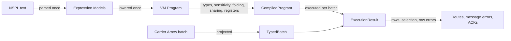

# VM Functions

Every NSPL expression runs through one expression VM. That covers a route's `SET`, `WHERE`, and
`INVOKE`, a source or processor filter, a key or ordering expression, an emitter mapping, and a
window aggregate's arguments. This chapter is the implementation reference for that VM and its
function catalog. It covers:

- how an expression Model becomes a compiled program
- how a program executes over an Arrow batch
- which kernels compute each function family, and how far each one vectorizes
- how window aggregates and sketches keep branch-local state
- how to add a function without weakening any of these contracts

[Expression Functions](./filter-map-functions.md) owns every contract a user relies on: signatures,
exact types, nulls, errors, limits, and measured costs. This chapter explains how the
implementation delivers those contracts, and links to the reference instead of restating them.
Four other chapters own neighbouring contracts:

- [Data Plane](./data-plane.md): payload, persistence, and acknowledgement semantics
- [Data-Plane Concurrency](./data-plane-concurrency.md): the concurrency of branch tasks and
  published state
- [Domain Clock](./domain-clock.md): the execution snapshot that supplies every expression's time
- [Shutdown And Recovery](./shutdown.md): what a stopping node does with windows it has not emitted

Five rules hold throughout:

- **Arrow batches are the only payload.** A program reads Arrow columns and writes Arrow columns.
  No row is ever held as a map of fields. A value every row shares is held once, not copied into
  each row.
- **Types are exact.** The compiler never inserts a conversion, and every operation's result type
  is decided when the program is compiled.
- **A failure belongs to a row whenever it can.** A kernel records which rows failed and why. Only
  a failure of the batch as a whole, such as a UDF trap, fails the batch.
- **Time is an input.** No kernel reads a clock. The current time arrives in the execution context
  from the caller's domain execution snapshot.
- **The VM decides nothing about the graph.** It runs one program against the bindings its caller
  hands it, and knows nothing of relays, branches, schedules, or connectors.

## Ownership By Layer

| Layer | Owner | What it owns |
| --- | --- | --- |
| Vocabulary | Expression Models in `nervix-models` | `Expression`, `RouteConstruction`, `Assignment`, `Invocation`, and `JsonPath`. A builtin name is a validated `BuiltinFunctionName` identifier, not a closed set, and a UDF name is a `UdfName`. |
| Language | `nervix-nspl` | Parsing a call as a generic `name(args)` or `udf::name(args)` into those Models. The grammar has no function-name table; completion offers an identifier at a call position. |
| Engines and infrastructure | `nervix-vm` | Lowering Models into VM programs, the semantic catalog of every operator, cast, and builtin, type and sensitivity checking, compilation into instructions over typed registers, every kernel, and window aggregate lowering and route compilation. |
| Engines and infrastructure | `nervix-roto` | Compiling a `CREATE UDF`, and the `FunctionInjector` that answers the VM's UDF calls over Arrow arrays under a watchdog. |
| Decisions | Registry validation | Compiling every expression it can check with the same compiler the runtime uses when a statement is applied, so a statement is rejected with exactly the error execution would report. |
| Data plane | Runtime bindings and hosts | Compiling runtime programs against runtime schemas, projecting carrier batches into VM input, supplying the execution context and injectors, turning row errors into structured message errors, and owning branch-local window accumulators. |
| Control plane | Subscriptions | Compiling a session subscription's `WHERE` into a read-only predicate when the subscription is created. |

The data plane does not yet receive compiled plans. It compiles its programs from the Models its
active graph carries, as the header of `src/runtime/vm_compile.rs` states. That contradicts the
layer order, in which the data plane never reads a Model. `just ratchet` counts the remaining
sites as `model_matches_in_data_plane`, and a planner that hands the data plane validated programs
removes them.

## The Expression Pipeline

Each representation is produced once, at its boundary, and the next stage consumes it:



Models are persisted; programs are not. A compiled program and everything prepared inside it, such
as a compiled regular expression or an `IN` set, live in memory beside the runtime node that runs
it. Nothing prepared at compile time ever enters a stored Model, and no executable NSPL text is
stored for a runtime to parse again.

### Lowering

`crates/nervix-vm/src/frontend.rs` converts Models once into the VM's program vocabulary in
`program.rs`. The result is a `Program` with an optional `filter`, ordered `set` assignments, and
ordered `invoke` calls, each built from `Expr` trees. Each route kind has one lowering, and each
lowering fixes the scopes a bare field name reads and writes:

| Lowering | Used for | Bare reads and writes |
| --- | --- | --- |
| `lower_transforming_route` | Transforming routes, which begin empty and may `INHERIT` | read and write `output` |
| `lower_set_only_route` | Set-only constructions, such as a set-only processor route or a materialized-state `DEFAULT` | write `output` only |
| `lower_generated_route` | Generator routes | read `generated`, write `output` |
| `lower_branch_construction` | `BRANCHED BY ... SET` | read and write `branch` |
| `lower_finalized_output_filter` | A route `WHERE` over finalized output | read `output` only |
| `lower_route_construction` | A construction under a scope policy its caller chooses, such as a correlator route, an emitter `VALUES` mapping, or an error record | set by the caller |
| `lower_expression` | One standalone expression, such as a subscription `WHERE` | set by the caller |

Window routes have their own lowering in `window.rs`, described under
[Window Aggregates And Sketches](#window-aggregates-and-sketches).

`SemanticScopePolicy` decides what a bare read or write means. A scope the route kind does not
expose is a typed `FrontendError`, never a fabricated name that later fails name resolution.
Lowering also removes surface forms the compiler does not need to know about:

| Surface form | Lowered to |
| --- | --- |
| `IF` | `CASE` |
| `NOT IN`, `NOT BETWEEN` | negated membership and range tests |
| `TRY_CAST` | a cast whose failure yields a typed null |
| `INHERIT` | plain assignments; a field inherited with `LEAK SENSITIVE` is wrapped in `leak_sensitive` |
| `udf::name(...)` | `FunctionName::Udf` |

Lowering resolves datetime builtins further than other calls, because their literal arguments
choose the kernel. It resolves literal units, time zones, formats, and bin widths once into a
`DatetimeFunction`, and the call keeps only its row-valued arguments. Every other name is parsed,
case-insensitively, into the closed `FunctionName` enum. An alias such as `ceiling`, `power`, or
`substring` maps to the same variant as `ceil`, `pow`, or `substr`, and messages always use the
canonical name. A name that matches nothing becomes `FunctionName::Unknown`, which the compiler
rejects.

A span in the VM is an operation ordinal, not a source offset: the i-th assignment, the route
`WHERE`, or the j-th `INVOKE`. Every node inside one operation shares that operation's span. The
runtime maps a span back to the node, route, operation, operation index, and fields that a
structured message error reports.

The VM never parses NSPL in production code. `nervix-nspl` is a development dependency that only
its tests and benchmarks use to build Models from text.

### The Semantic Catalog

`crates/nervix-vm/src/semantics.rs` is the one catalog of every operation's meaning. Registration
is a set of exhaustive `match` expressions over closed enums, not a runtime table, so a builtin that
misses a decision does not compile. For each builtin the catalog and its neighbours decide:

| Decision | Where | What it records |
| --- | --- | --- |
| Name | `FunctionName::parse` and `as_str` in `program.rs` | The canonical name and its aliases. |
| Lowering | `builtin_descriptor`, producing a `BuiltinLowering` | The operation the runtime executes. Some variants carry values prepared at compile time: a regular-expression call, an `IN` set, an Aho-Corasick matcher, a constant network, or a resolved datetime function. |
| Semantics | `builtin_semantics_for_lowering`, producing `OperationSemantics` | Volatility (`Immutable`, `Stable`, `Volatile`), dependency scope (`Constant`, `ExecutionLocal`, `RowLocal`), side effects, whether it can report a per-row error, and null propagation (`NeverNull`, `Strict`, `Custom`). |
| Signature | `builtin_signature` and `builtin_output_type` | Arity, exact argument types, and the result type. |
| Conditional arms | `builtin_arm_execution`, producing `ArmExecution` | Whether a conditional arm runs the kernel over the whole batch or only over the rows it selects. |
| Folding | `fold_builtin_call` in `compiler.rs` | A folding arm, or an explicit refusal. |
| Execution | `execute_builtin` in `runtime.rs` | The kernel call. It has no wildcard arm. |
| Optional result | `Compiler::expr_may_be_null` | Exceptions to "optional when any argument is". |

`ExpressionSemantics::from_operation` combines an operation with its children bottom-up. It takes
the most volatile child, the widest dependency scope, and any child's side effects or ability to
fail. Some calls have no descriptor: `leak_sensitive`, `LOOKUP_HASH_MAP`, the header functions,
window aggregates, and UDFs. The compiler handles those specially. For a tree that contains one,
`expr_semantics` returns no semantics, so the tree is neither folded nor shared through the builtin
path.

No builtin has side effects. The language's one side effect, `write_header`, is an `INVOKE`
statement rather than an expression.

A value rule that both folding and execution apply is defined once in the catalog:

- `CaseMapping`: full Unicode, locale-independent `lower` and `upper`
- `FloatClass`: the floating-point classification behind `is_nan`, `is_finite`, and `is_infinite`
- `BitwiseOperation` and `IntegerBits`: integer bit operations
- the IP address and URL text checks

Execution may reach the same value by a faster route. `lower` and `upper` map a column whose
visible bytes are all ASCII in one pass over its buffer, for example, but must produce exactly the
value the contract defines. This is what keeps `upper('grüßen')` and `upper(input.text)` equal.

### Types, Nullability, And Sensitivity

The compiler in `compiler.rs` infers every expression's type from its input bindings and the
catalog. Argument types match by Arrow `DataType` equality. No numeric widening, parsing,
stringification, or datetime–text interchange happens unless the program spells it out as a cast,
`TRY_CAST`, or `JSON_VALUE`. Messages name types by their Arrow names, which the
[reference](./filter-map-functions.md#errors) maps back to NSPL names. A result is optional when
any argument is, unless the catalog or `expr_may_be_null` records an exception. The exceptions are
listed in [Function Properties](./filter-map-functions.md#function-properties).

A program compiles against `CompileBinding`s. Each binding has a namespace, a schema, the sensitive
fields of that schema, and whether it is readable and writable. With more than one binding, input
fields are qualified by namespace, such as `left.id` and `right.id`.

Sensitivity is a compile-time property:

- **Propagation.** `expr_is_sensitive` marks a result sensitive when any operand is sensitive. That
  includes a `CASE` condition, because the arm a sensitive condition selects reveals it.
- **The only exemption.** `leak_sensitive(...)` is the only operation that removes sensitivity. It
  compiles to its argument and costs nothing at run time.
- **Where a leak is rejected.** A `sensitive_leak` error rejects each of these:
  - a sensitive value assigned to a non-sensitive output field
  - an inherited field that would pass sensitive data through
  - a sensitive `write_header` argument
- **The bypass.** `CompileOptions::allow_sensitive_output` turns these checks off where the output
  never leaves Nervix. A predicate always compiles with it off.
- **Unbound sensitivity.** A binding compiled without its sensitive fields enforces nothing. A
  caller whose output can leave Nervix must bind the sensitivity of every input it reads.

For direct emitter `VALUES`, the registry lowers each mapping through the same route frontend and
infers its type and sensitivity against the declared input schema. The inference result retains
sensitivity for each assigned field, including a field assigned more than once. The registry
rejects a sensitive mapping before activation unless its expression explicitly calls
`leak_sensitive(...)`; the target column or attribute is identified without including its value.

A `CompileError` carries a stable code, a message, and its operation's span. The codes fall into
these groups:

- binding and namespace errors, such as `unknown_identifier` and `wrong_stream`
- typing errors, such as `type_mismatch` and `unsupported_cast`
- function errors, such as `unknown_function` and `invalid_argument`
- `IN`-set errors
- output-contract errors, such as `missing_set` and `null_for_required_field`
- invocation errors
- `sensitive_leak`

### Folding, Sharing, And Scalar Values

Three mechanisms avoid repeated work. None of them changes a result.

**Constant folding.** `compile_expr` folds an expression only when all of these hold:

- it is not volatile and its dependency scope is `Constant`
- it cannot fail and has no side effects
- the folder produces a non-null value

A folded value becomes one `Literal` instruction. The folder is deliberately small. It folds only:

- among builtins, `lower`, `upper`, `trim`, `length`, `coalesce`, `is_null`, `nullif`,
  `is_nan`, `is_finite`, `is_infinite`, the bitwise functions, `bit_count`, `contains`,
  `starts_with`, `ends_with`, `is_ip_address`, and `is_url`
- among binary operators, comparisons, `AND`, and `OR`

Casts, arithmetic, membership, ranges, JSON, and every other builtin are never folded.

Folding applies the catalog's value contracts rather than calling the runtime kernels, so a folded
call and an executed call agree by construction. `trim` and `length` are the exception: each has a
separate folding implementation beside its kernel. A new folding arm must reuse a catalog contract
rather than add a second implementation.

Three kinds of constant argument are prepared while the call is lowered: a regular-expression
pattern, a `contains_any` pattern list, and an `ip_in_network` network.

- An invalid constant pattern is kept, and every row that evaluates it reports the error.
- An invalid constant network is a compile error.

**Sharing.** Identical expressions share one register within one generation of the compiler's
expression cache. The generation advances each time an assignment rebinds a writable field, and
each time an uninitialized field is materialized. So an expression is shared within one assignment,
and, after the last assignment, among the route `WHERE` and the invocations. The cache key ignores
spans. An expression is shared only when all of these hold:

- it has no side effects and cannot fail
- it is not volatile
- inside a conditional arm, it contains no injected call, `TRY_CAST`, or JSON extraction, because
  those answer only the rows the arm selects and leave nulls on the others

A failing expression is compiled at each occurrence, so each occurrence reports its own error. A
UDF call follows its own rule: it is shared unless the UDF, or a UDF among its arguments, is
declared `VOLATILE`. Extractions from one JSON document share one scan for each document register
and selection, as the JSON entry of [Function Families](#function-families) describes.

**Scalar values.** A register holds either a column or a scalar, which is a one-row array standing
for every row:

- **What is scalar.** Literals are scalar. An instruction whose operands are all scalar and that
  is not volatile is computed once, over one row. That covers an all-literal call that was not
  folded, such as `clamp(5, 1, 3)`, and `now()`, which has no operands.
- **Errors.** When a scalar computation fails, as `1 / 0` does, its row error is copied to every
  row that evaluates it.
- **Expansion.** A scalar becomes a column only when a kernel or an output field needs one. It is
  expanded at most once per register and cached.
- **Kernels that read scalars.** `Operand` implements Arrow's `Datum`, so Arrow comparison kernels,
  the checked numeric lanes, and most string and selection kernels take a scalar as it is.

### Compiled Programs And Their Lifetime

`CompiledProgram` in `ir.rs` holds:

- its input and output schemas
- the bindings that load input columns into registers and read outputs from them
- the invocation bindings
- the instruction list
- the register layout of each register space
- the filter register
- an optional injector

Registers are typed. The types are:

- the thirteen scalar types: eight integer widths, two float widths, `Boolean`, `Utf8`, and
  `Binary`
- `Datetime`, a nanosecond UTC timestamp
- `Generic`, for lists

The register spaces are `Input`, `Temp`, `Condition`, and `Output`. An `Instruction` carries its
kind, its span, and a selection register. It carries a selection only when its result depends on
which rows it runs for: an operation that can fail, an injected call, a JSON scan, or a cast that
reads or writes text.

Two optimization passes run after compilation:

- **Dead instructions and moves.** Instructions whose results are never read are removed, except
  volatile builtins and injected calls. Redundant moves are removed as well.
- **Temporary registers.** Temporaries are renumbered to reuse slots.

Input registers are never pruned: every readable field is bound, and binding one costs an Arc clone.

There is no separate constant pool. Literals are instructions, and prepared artifacts live inside
their `BuiltinLowering` behind shared pointers. Cloning a program therefore shares its prepared
patterns, sets, matchers, and pattern caches. `CompiledPredicate` wraps a program privately, so a
general construction program cannot be passed where only a read-only filter is allowed.

The VM has no notion of plan activation. The host holds each program as a
`triomphe::Arc<CompiledProgram>` and replaces it when the Model it was compiled from changes. A
prepared artifact therefore lives exactly as long as its program. A route that `ALTER` replaces
compiles fresh artifacts, and a batch always runs against the patterns and sets its own program
prepared.

### Where Programs Are Compiled

Registry validation compiles or type-infers expressions when a statement is applied and discards
the result. The exceptions, which are first checked when their domain's execution is built or a
subscription is created, are listed in
[Where Expressions Run](./filter-map-functions.md#where-expressions-run). The runtime compiles again
against runtime schemas:

| Program | Compiled for execution |
| --- | --- |
| Routes of junctions, deduplicators, reorderers, inferencers, reingestors, correlators, and WASM processors, and processor `FROM ... WHERE` and `FILTER WHERE` | Lazily, on the first batch of each concrete branch instance, then cached on that instance's route. Every branch instance compiles and holds its own copy, prepared artifacts included. The cache is cleared when the route's Model or message-error policy changes. |
| `DEDUPLICATE ON`, reorderer `BY`, and `CORRELATE WHERE` | On the first batch of each branch instance |
| Ingestor `FILTER WHERE`, routes, and `BRANCHED BY ... SET` | When the ingestor starts |
| Emitter `FROM ... WHERE`, routes, HTTP `METHOD` and `PATH`, SQS `FIFO GROUP`, `VALUES`, and OpenTelemetry mappings | When the emitter task starts |
| Window argument and output programs, and inferencer `INPUTS` | Once per processor template when the plan is built, then shared by every branch |
| Generator routes | When the domain's execution is built |
| Materialized-state `DEFAULT` | Compiled and executed in one step when the default binds |
| `ON MESSAGE ERROR SEND TO ... SET` | Once for each error record it builds |
| Subscription `WHERE` | When the subscription is created |

### The Runtime Bridge

The host builds a program's input with `project_vm_input_batch` in `src/runtime/vm_input.rs`:

- **Carrier columns.** Each is an Arc clone of the carrier batch's column, checked for its exact
  type. No buffer is copied.
- **Built columns.** Branch key fields, broadcast materialized-state values, lookup results, and
  selected ingest metadata are built as new columns. `SharedVmInputColumns` builds each of them
  once per dispatched batch and shares it among every output route that reads it.
- **Uninitialized outputs.** These stay `TypedArray::Uninitialized` until finalization
  materializes them.

The host also builds an `ExecutionContext`. It carries the domain execution snapshot's timestamp,
and optionally an injector for this execution alone, such as the header reader or a window's
aggregate results.

`execute_program_with_selection_in_context` returns an `ExecutionResult`. It holds the output
batch, the selection that survived the program's `WHERE`, and any `write_header` invocations. The
VM applies the `WHERE` itself, and always keeps a row that carries an error in the selection, so
the caller sees every failure. A caller must therefore check `batch.errors()` for each selected row
before treating that row as a result.

`src/runtime/filter_map.rs` shows the complete handling:

1. It acknowledges each row the `WHERE` dropped.
2. It turns each row that carries an error into a structured message error. The error holds the
   stable reference, the code, the operation and its index, the fields, and the execution's domain
   time, together with the partial output when the error route reads it.
3. It passes every remaining row on as output.
4. A returned `RuntimeError` fails the whole batch through the node's general error handling.

## Implementation Map

All paths are relative to the repository root.

| Path | Owns |
| --- | --- |
| `crates/nervix-vm/src/lib.rs` | The public surface and the `with_typed_registers!` expansion over the scalar register types |
| `crates/nervix-vm/src/frontend.rs` | Lowering Models into programs, scope policies, and frontend errors |
| `crates/nervix-vm/src/program.rs` | `Program`, `Expr`, `FunctionName`, and resolved datetime calls |
| `crates/nervix-vm/src/semantics.rs` | The semantic catalog: lowerings, semantics, signatures, arm execution, and shared value contracts |
| `crates/nervix-vm/src/compiler.rs` | Type and sensitivity checking, folding, sharing, register allocation, instruction emission, and optimization |
| `crates/nervix-vm/src/ir.rs` | `CompiledProgram`, `CompiledPredicate`, instructions, registers, and bindings |
| `crates/nervix-vm/src/runtime.rs` | Execution, register banks, scalar sharing, conditional arms, the builtin dispatch, and the list, cast, and most string kernels |
| `crates/nervix-vm/src/batch.rs`, `operand.rs` | Typed batches and arrays; column versus scalar operands and broadcasting |
| `crates/nervix-vm/src/error.rs` | `CompileError`, `RuntimeError`, `SideError`, error codes, and sparse `RowErrors` |
| `crates/nervix-vm/src/numeric.rs` and `numeric/` | Checked numeric lanes, comparisons, math, bit operations, and decimal rounding |
| `crates/nervix-vm/src/datetime.rs` and `datetime/` | Fixed-unit datetime kernels, calendar arithmetic, time zones, and formats |
| `crates/nervix-vm/src/text_column.rs` | The bounded builder for `STRING` and `BYTES` values whose length an argument chooses |
| `crates/nervix-vm/src/text_search.rs`, `regexp.rs` | Splitting, joining, `LIKE`, `contains_any`, NFC normalization, and regular expressions with their caches |
| `crates/nervix-vm/src/membership.rs`, `extremum.rs`, `count.rs` | `IN` sets, `greatest`, `least`, and `clamp`, and integer counts read without narrowing |
| `crates/nervix-vm/src/bytes.rs` | Encodings, hashes, and UTF-8 conversion of `BYTES` |
| `crates/nervix-vm/src/json.rs` | Typed JSON extraction over one parse per document |
| `crates/nervix-vm/src/ip_address.rs`, `url_component.rs` | IP addresses, CIDR networks, and URL components |
| `crates/nervix-vm/src/window.rs`, `window/route.rs` | Lowering window assignments into aggregate demands, and compiling each route's argument and output programs |
| `crates/nervix-vm/benches/` | The Criterion harness, workload shapes, and allocation probe |
| `crates/nervix-roto/src/lib.rs` | The UDF injector and its watchdog |
| `src/registry/validation/` | Apply-time compilation, including `window_route.rs` and the sketch budget in `processor/sketch.rs` |
| `src/runtime/vm_compile.rs` | Runtime compilation and message-error sites |
| `src/runtime/vm_input.rs` | Input projection and lookup key execution |
| `src/runtime/filter_map.rs` | Program execution and result handling for routes and filters |
| `src/runtime/ingest_metadata.rs`, `lookup_hash_map.rs` | The header injector and hash-map lookup calls |
| `src/runtime/message_error.rs` | Structured message errors and error-record programs |
| `src/runtime/window_processor.rs`, `window_accumulator/`, `window_state.rs` | Branch-local windows, their aggregate structures, and their snapshots |
| `src/runtime/subscription_predicate.rs` | Session subscription filters |

## Worked Example: `clamp`

This example traces one assignment from its declaration to its execution:

```nspl,ignore
SET bounded = clamp(input.latency_ms, 0, input.budget_ms)
```

Here `input.latency_ms` and `input.budget_ms` are `I64` fields and `bounded` is an `I64` output
field.

1. **Parse.** The parser produces `Expression::Call` with the name `clamp` and three argument
   Models. It knows nothing about `clamp`.
2. **Lower.** `clamp` is not a datetime name, so `FunctionName::parse` yields `FunctionName::Clamp`.
   The assignment is the route's first operation, and every node in it carries that operation's
   span.
3. **Catalog.** `builtin_descriptor` maps it to `BuiltinLowering::Clamp`. Its semantics:
   - immutable, with a constant dependency scope
   - strict nulls
   - it can fail, because a row's low bound can exceed its high bound or be NaN

   Its arm execution is `WholeBatch`, because two comparison bitmaps and two selections cost less
   than narrowing a batch to the selected rows.
4. **Type check.** `builtin_output_type` requires three arguments of one identical, ordered type
   (numeric, `STRING`, or `DATETIME`) and returns that type:
   - an `I32` bound beside an `I64` value is a `type_mismatch`
   - a `BOOL` value is `unsupported_function`

   The result is optional when any argument is, and sensitive when any argument is.
5. **Compile.** Because `clamp` can fail, it is neither folded nor shared. The compiler emits
   `InstructionKind::Builtin { lowering: Clamp, inputs }`. It writes the assignment with a fallback,
   so a row that fails leaves `bounded` null. Inside a `CASE` arm, the instruction also carries the
   arm's selection register. The literal `0` stays a scalar register.
6. **Execute.** `execute_builtin` calls `extremum::clamp`:
   - **Comparisons.** For integers and floats it compares the value with each bound in one pass
     over the value buffers, with IEEE 754 rules, so a NaN value is neither below nor above
     anything. For `STRING` and `DATETIME` it calls Arrow's `lt` and `gt`.
   - **Selection.** Two `zip` selections pick the bound or the value for each row. `nullif` then
     nulls every row that has a null argument or invalid bounds.
   - **Errors.** It returns bitmaps of the rows whose bounds are invalid. The runtime builds a
     `SideError` with `InvalidClampBounds` only for the set bits of those bitmaps, so a clean batch
     allocates no error at all.
7. **Report.** A failed row reaches the route's `ON MESSAGE ERROR` policy. Its error has the code
   `evaluation`, the kind `invalid_argument`, the operation `set`, and the operation index `0`. The
   runtime built its field set when it compiled the route: the assigned field and every field the
   expression reads, sorted as `input.budget_ms`, `input.latency_ms`, and `output.bounded`.

The public contract is in [Extrema](./filter-map-functions.md#extrema). Unit tests are in
`extremum_tests.rs`, and the public qualification is the `Greatest, least and clamp` outline in
`tests/features/runtime/membership_ranges_extrema.feature`.

## Batch Execution

### Typed Batches And Registers

`TypedBatch` carries:

- its schema, held rather than rebuilt for each batch
- one `TypedArray` per field
- its row count
- the row errors it arrived with

A `TypedArray` has one variant per scalar register type, plus these:

- `Datetime`, a nanosecond UTC timestamp array
- `Generic`, for lists
- `Uninitialized`, for an output no assignment has written yet

Each NSPL type has one Arrow representation, and the VM executes over all of them:

| NSPL type | Arrow type |
| --- | --- |
| `U8`, `I8`, `U16`, `I16`, `U32`, `I32`, `U64`, `I64` | The matching unsigned or signed integer type |
| `F32`, `F64` | `Float32`, `Float64` |
| `BOOL` | `Boolean` |
| `STRING` | `Utf8` |
| `BYTES` | `Binary`. Its values may be empty or hold any octets, and are never read as UTF-8 without an explicit conversion. |
| `DATETIME` | `Timestamp(Nanosecond, "+00:00")`. RFC 3339 is only a wire representation of it. |
| `ARRAY<T, n>`, `VEC<T>` | `FixedSizeList` and `List` of the element type |

Execution checks the schema once and then works through these steps:

1. It allocates one register bank for the batch.
2. It loads each input register with an Arc clone of its column. A sliced array keeps its offset,
   and kernels read only its visible span of values.
3. It carries the batch's incoming row errors forward.
4. It runs the instructions in order.
5. It reads each output register, expanding a scalar into a column at this point.
6. For a program with a `WHERE`, it filters the output columns, the invocation arguments, and the
   row errors together.

Route construction is one ordered program, and it executes as follows:

1. **Inherited fields.** An inherited field that no assignment changes is bound straight to its
   input register, so the output column is the input column itself.
2. **Assignments.** Assignments run in written order. A repeated target rebinds the field to the
   later value's register, so it replaces the current output column. A later assignment that reads
   the field reads the value it holds at that point.
3. **Finalization.** Each field is then finalized:
   - Uninitialized optional outputs materialize as typed nulls.
   - A required output that is still uninitialized, or holds a null, fails. The compiler rejects
     both cases statically wherever it can prove them.
4. **Route `WHERE`.** The route's `WHERE` then reads the finalized `output`.

This is the implementation of [The Working Message](./working-message.md), which owns the scopes
and their edge cases.

### Conditional Arms And Selected Rows

The compiler compiles each `CASE` arm under a selection:

- An arm's condition is compiled as `coalesce(condition, false)`, over the rows that no earlier arm
  answered.
- Its result is compiled over the rows its condition selected.
- A nested arm narrows its parent's selection with `AND`.

An instruction observes its arm's selection only when its result on a selected row depends on
which rows it runs for:

- an operation that can report a per-row error
- an injected call
- a JSON scan
- a cast that reads or writes text

Every other instruction runs over the whole batch, even inside an arm. Its value on an unselected
row is discarded, and nothing else it does is observable. This covers every function that cannot
fail, such as `lower`, `replace`, `date_part`, or `format_datetime`.

For an instruction that does observe the selection, an `ArmSelection` reads the selection mask
once. It classifies the mask as all rows, no rows, or some rows, and every instruction under the
same mask reuses that classification. The runtime then chooses how to execute each instruction:

| Case | Plan |
| --- | --- |
| The arm selects no row | Write a typed null without running the kernel. |
| Every operand is scalar and the instruction is not volatile | Compute one row, and copy its errors to the selected rows. |
| `WholeBatch` | Run the kernel over the whole batch, then discard the errors it reported for unselected rows by truncating each row's error list back to its earlier length. |
| `SelectedRows` | Narrow each column operand to the selected rows with one Arrow `filter`, run the kernel over those rows only, and scatter the result back with `take`. Unselected rows get nulls, and errors are re-indexed onto the batch rows. |

`execute_select` then merges the arms from last to first with Arrow `zip`. It skips an arm that
selected no row and takes an arm that selected every row as it is.

The catalog's `ArmExecution` makes the cost decision for each fallible builtin. Narrowing costs a
few nanoseconds for each row of the batch, so it pays only for kernels that cost more per row:

- **`SelectedRows`:**
  - regular expressions, `LIKE`, `contains_any`, `split`, `join`, and `concat_ws`
  - NFC normalization
  - the encodings and decodings, `sha256`, and UTF-8 conversion
  - the transcendental functions
  - `uuid_v7`
  - reading and writing IP address text, and URL parsing
  - `date_trunc`, `date_add`, `date_diff`, and `parse_datetime`
  - casts that read or write text

  `repeat`, `lpad`, and `rpad` must use `SelectedRows`, and not only for cost. Every row's text
  shares one column's size limit, so text built for an unselected row could exhaust that limit and
  fail a selected row.
- **`WholeBatch`:** checked arithmetic, `clamp`, bit shifts, `date_bin`, `from_unix`, and non-text
  casts, which are vectorized kernels.

An injected call, whether a header read, a window aggregate, or a UDF, receives only the narrowed
arguments, the batch indices of the selected rows, and the errors those rows already carry. It is
not called at all when its arm selects no row. A JSON scan parses only the selected documents.

`AND`, `OR`, and `coalesce` compile every operand under the same selection. They run Arrow's
Kleene boolean and `zip` kernels over whole columns. Only conditional arms narrow evaluation.

### Row Errors And Batch Errors

A per-row failure is a `SideError`: a typed `SideErrorReason` and the operation's span. Each reason
maps to one stable `ErrorCode`:

- `division_by_zero`
- `overflow`
- `cast_failed`
- `invalid_argument`

The reason stays typed until the host reports it, so its text is formatted only for a row that
actually failed. `RowErrors` is sparse. A batch without failures allocates nothing, and
`push_failures` builds reasons only for the set bits of a kernel's failure bitmap. Reasons name the
operation, the target type, or a position or length, never the value.

There are two exceptions:

- A regular-expression syntax error carries the regex crate's message, which quotes the pattern.
  A pattern read from a field can therefore appear in `error.message`, as
  [Regular Expressions](./filter-map-functions.md#regular-expressions) states.
- An injected call's error text is chosen by the injector.

A failure that belongs to the batch is a `RuntimeError`, returned as `Err`:

- a schema that does not match the program
- an Arrow kernel error
- a collection larger than Arrow can address
- a blocking task that failed
- a formatted datetime column larger than its offsets allow
- an invalid injected result, such as the wrong type or row count

Not every caller of the VM has an error route. The [Errors](./filter-map-functions.md#errors)
section of the reference says what each context does with a row error.

### Prepared Patterns, Sets, And Matchers

| Artifact | Prepared | Held | Bound |
| --- | --- | --- | --- |
| Constant regular expression | Once, when the call is lowered (`ConstantPattern`) | Inside the program; one search cache is borrowed from the regex's pool for each batch, so no row takes a lock | 10 MiB compiled size, 2 MiB lazy-DFA search cache |
| Pattern read from a field | On a miss, on the executing thread | `DynamicPatterns`, one cache per call site per program, shared by clones and across batches. Each batch loads one `ArcSwap` snapshot and publishes a miss copy-on-write. | 64 patterns, oldest compiled evicted first; rows that repeat the previous row's pattern skip the lookup |
| Constant `contains_any` list | Once, as an Aho-Corasick matcher | Inside the program | 128 patterns and 64 KiB; over that, each non-null row fails |
| Per-row `contains_any` set | On a miss, for each batch | A per-call cache for one batch; a hit borrows the Arrow strings without allocating | 64 sets per batch |
| `IN` set | Once, from evaluated constant elements | `MembershipSet` | Up to 8 fixed-width values compared in turn; larger fixed-width sets and every `STRING` set hashed |
| Constant CIDR network | Once, when the call is lowered | Inside the program | A per-row network is reparsed only when its text differs from the previous row's |
| Datetime zone and format | Once, when the call is lowered | Inside the resolved call | A 256-byte longest formatted value, checked at compile time |

`LOOKUP_HASH_MAP` is not a VM function at run time. The runtime rewrites each lookup into an
internal input field, and runs the key expression as its own program before the route's program.
Identical lookups of one program are answered once, and the answer enters the program as an input
column. A key expression that fails fails the batch. The map itself is the resource version the
graph pins; see [Lookups](./lookups.md) and [Resource Versions And
Bindings](./resource-versions.md).

### Allocation And Result Bounds

Registers are allocated for each execution and are not reused across batches. Kernels reserve
their output from the input where the size is known:

- string builders sized from the input's offsets and values
- 32 bytes per row for `md5`
- numeric lanes sized up front
- one scratch string reused across the rows of a batch

The per-row allocations that remain belong to functions whose output is irregular:

- the Unicode path of `lower` and `upper`
- `repeat`
- `uuid_v4`'s text
- list `contains` and `overlap`, which slice each row
- the error copied to each row of a failed shared value

The limits users see are enforced in these places:

- **Argument-sized text.** A value whose length an argument chooses is built through
  `ByteColumnBuilder` in `text_column.rs`. It sizes each value before allocating it and refuses one
  that would take the column past 2,147,483,647 bytes. A shared value is charged once for each row
  it stands for. A refused value fails its row with `overflow`.
- **Text built without that check.** `concat`, `replace`, `regexp_replace`, `translate`, `lower`,
  `upper`, and `initcap` use Arrow's ordinary builders, so no row reports `overflow` for them.
  Arrow's builder does not return an error when its 32-bit offsets overflow: it panics. The
  reference's [Result Size](./filter-map-functions.md#result-size) asks users to keep these results
  within the column limit for that reason.
- **Other bounds.** `split` stops at 65,536 parts, `LIKE` patterns at 4 KiB, JSON documents at
  16 MiB and 128 levels, and `format_datetime` at its preallocated column. Lists that Arrow cannot
  address fail the batch with `CollectionTooLarge`.

### Scheduling And Execution Bounds

The VM's entry point alone decides where a program runs:

| Condition | Where it runs |
| --- | --- |
| At most `SPAWN_BLOCKING_ROW_THRESHOLD` (1,024) rows, and no injected function asks for the blocking pool | Inline, on the caller's task |
| More than 1,024 rows | On `tokio::task::spawn_blocking` |
| Any `Inject` instruction whose injector's `FunctionExecutionPolicy` is `SpawnBlocking` | On the blocking pool, whatever the batch size. Every UDF call does this. |

A caller only awaits the result, and chooses no executor.

The VM never yields and has no cancellation point. A program runs every instruction over its batch
to completion, and the batch's size and the limits above bound that work. Stopping a node or a
processor therefore takes effect between batches. Host loops call `consume_budget` once per batch
iteration, not the VM. A blocking task that has started runs to completion even if its awaiting
future is dropped. A UDF adds its own watchdog, described [below](#extension-boundaries).

## Kernels

### Kernel Classes

Every kernel falls into one of four classes. The class decides how its cost scales and which claim
about vector instructions it supports.

| Class | Examples | Claim |
| --- | --- | --- |
| Arrow compute kernel | Boolean logic, `STRING`/`BYTES`/`DATETIME` comparisons, `LIKE`/`ILIKE`, `contains`/`starts_with`/`ends_with`, casts, `CASE`/`coalesce`/`nullif` selection, filter/take/zip/interleave, UTC `date_part`, `bitwise_and`/`or`/`xor`, list `sum` per row | Whatever Arrow 58.4's kernels do; Nervix adds none of its own |
| One pass over value buffers | Checked integer and float arithmetic, numeric comparisons, fixed-width `IN`, `abs`/`sign`/negation, `ceil`/`floor`/`round`/`trunc`, `sqrt`, shifts, classification, fixed-unit `date_trunc`/`date_bin`/`date_add`/`date_diff`, `to_unix`/`from_unix`, `length`/`octet_length`/`bit_length`, ASCII `lower`/`upper`, list `count` | Written so LLVM may auto-vectorize the loop for the target CPU; no claim that it does |
| Library with runtime SIMD dispatch | JSON structure (simd-json), base64 (base64-simd), hexadecimal (faster-hex), `sha256` (sha2 with SHA-NI detection) | The library selects instructions at run time; `xxh3_64` selects them when the binary is built |
| Irregular, per row | Transcendental math, `round(value, digits)`, zoned and calendar datetimes, datetime formatting and parsing, Unicode case mapping and NFC, regular expressions, Aho-Corasick, substring and padding functions, `md5`, IP and URL parsing, JSON path walk and conversion, most list functions, UUIDs | Batch API with optimized substeps; scalar work per row |

### Arrow Kernel Reuse

The VM reuses Arrow kernels from `arrow-arith`, `arrow-ord`, `arrow-select`, `arrow-string`, and
`arrow-cast` wherever their semantics are exactly NSPL's. It deliberately avoids them in these
cases:

- **Numeric comparisons.** Arrow's comparison kernels order floats by the IEEE 754 total order.
  NSPL comparison is IEEE 754 equality and ordering, in which NaN equals nothing and the two zeros
  are equal. `numeric::Comparison` evaluates every numeric comparison, integers included, over the
  value buffers. `IS DISTINCT FROM`, `nullif`, list `contains`, `IN`, `greatest`, `least`, and
  `clamp` apply the same float rules.
- **Arithmetic.** Arrow's wrapping or erroring arithmetic cannot report which rows failed. The
  checked lanes described below compute arithmetic instead.
- **List `sum` and fixed-width float `dot`.** These keep ordered accumulation, checked integer
  overflow, and a finiteness check, rather than Arrow's wrapping sum.
- **Three casts.** A float-to-`STRING` cast uses Rust formatting. A `STRING`-to-`DATETIME` cast
  parses RFC 3339 through chrono. `BOOL`–`DATETIME` casts always yield null.
- **UTC `date_part`.** It reads the column as a zoneless timestamp, so Arrow does not convert every
  lane through an offset.

List `min` and `max` are the one place that intentionally keeps Arrow's total order. The reference
[documents](./filter-map-functions.md#array-and-vector-functions) how that differs from `greatest`,
`least`, and the window aggregates.

### Checked Buffer Kernels

`numeric.rs` computes every lane of a checked operation in one branch-free loop:

- **Failure bitmap.** Each lane returns its value and whether it failed, and the loop packs the
  failure flags into a bitmap 64 lanes at a time.
- **Failed lanes.** A failed lane becomes null and its value is zeroed, so a wrapped result never
  escapes.
- **Validity.** A result lane is null wherever any operand lane is null.
- **No rerun.** The kernel never reruns a batch. The failure bitmap, restricted to lanes whose
  operands are valid, is the only record of a failure.
- **Scalar operands.** A scalar operand is folded into the lane function.
- **Inlining.** Each operator passes its own lane function, so the call inlines.

The datetime kernels share these lanes. Their Euclidean truncation and binning, and their i128
elapsed-time arithmetic, fail a lane rather than wrap it.

Floating-point operations fail a lane that produces NaN or infinity. The transcendental functions
come from the platform math library as opaque calls per lane that no loop vectorizes, so those
kernels skip runs of null lanes instead. `round(value, digits)` rounds exactly in integer arithmetic
on the value's significand, and a digit count beyond ±400 rounds as ±400 does. A shift reads its
count from any integer type and fails a negative one. A count at or beyond the value's width moves
every bit out, and the lanes stay branch-free.

### Batch Execution, Compiler Vectorization, And Explicit SIMD

These are three different claims, and the implementation makes them separately:

- **Batch execution.** Every function computes a whole column in one call, and the cost of
  dispatch, type checks, and registers is paid once per batch. Every function in the catalog
  executes this way, including the irregular ones.
- **Compiler vectorization.** A buffer loop is written so that LLVM *can* widen it to the vector
  instructions of the CPU the binary targets, and its result is the same whether or not it does.
  The repository sets no `target-cpu`, so an x86-64 build targets the baseline instruction set.
  No kernel names an instruction set or an intrinsic. Neither the benchmark report nor this chapter
  claims that a particular loop is vectorized, because that needs target-specific inspection of the
  generated instructions, which has not been done.
- **Explicit SIMD.** Only third-party libraries use explicit SIMD, and they choose instructions at
  run time: simd-json, base64-simd, faster-hex, and sha2. xxhash chooses when the binary is built.
  Nervix's own code contains no `std::arch`, `target_feature`, or runtime feature detection.

The [VM functions measurement report](https://github.com/nervix-io/nervix/blob/main/benches/reports/vm-functions-18.md)
records what the measurements establish, and
[Measured Performance](./filter-map-functions.md#measured-performance) turns them into user
guidance:

- **Fixed-width work.** Checked arithmetic ran at about 127 million rows per second on a clean
  1,024-row batch.
- **Variable-length work.** Ragged lists, text search, and JSON ran at single-digit millions.
- **Failures.** Dense failures made checked arithmetic about six times slower, because each failed
  row builds an error.
- **The blocking-pool hop.** Crossing the 1,024-row threshold costs more than executing a small
  batch.
- **Conditional arms.** A regular expression in an arm that selects half the batch costs about
  twelve times one that selects none.
- **JSON sharing.** Four extractions from one document cost less than a third of four extractions
  from four documents.

The timings were taken on one development machine with other builds running, so they are
diagnostic. Without hardware counters or generated-instruction inspection, they do not establish a
SIMD speedup.

### Nulls, NaN, Overflow, And Unicode

- **Nulls.** A strict kernel's result is null wherever any operand is null. Membership
  and length results reuse the input's null buffer as it is. `IS [NOT] DISTINCT FROM` combines both
  validity bitmaps into a never-null result.
- **Cast failures.** A strict cast runs Arrow's safe cast, which nulls a value it cannot convert. It
  then reports the rows that became null without being null in the input, and skips that check
  when the null counts are equal. `TRY_CAST` keeps those nulls silently.
- **NaN.** Comparisons are IEEE 754 everywhere except list `min` and `max`. An `IN` set stores
  floats by bit pattern after canonicalizing `-0.0`, and never matches NaN.
- **Overflow.** Integer overflow, division by zero, and `MIN / -1` fail their lane. Datetime results
  outside the nanosecond range fail their lane. A window's integer `SUM` accumulates in i128 and is
  checked only when the window emits.
- **Unicode.** `STRING` values are valid UTF-8 by Arrow's contract. Case mapping is full Unicode
  without a locale. `length` counts code points by skipping continuation bytes. `STRING` ordering
  is bytewise, which for UTF-8 equals code-point order. Nervix has no collation.

## Operations That Do Not Reduce To SIMD

Several widely used operations cannot be expressed as a fixed-width loop over value buffers. For
the functions this catalog delivers, the implementation optimizes the substeps that can be batched
and leaves the irregular remainder per row, still inside one batch call:

| Operation | Optimized substeps | Remaining scalar or irregular work |
| --- | --- | --- |
| Unicode case mapping and NFC normalization | A column whose visible text is all ASCII is case-mapped in one pass over its value buffer, reusing its offsets and nulls. NFC writes into one bounded builder. | A column with any non-ASCII byte is mapped row by row with allocation. Normalization composes each row. Nervix has no collation to optimize: strings compare bytewise. |
| Regular expressions and captures | Constant patterns compile once. A batch borrows one search cache per pattern. Field-supplied patterns are cached across batches and deduplicated within one. The regex engine runs its own vectorized literal prefilters. Inside a conditional arm, only selected rows are searched. | Each row runs its own search. Captures allocate their slots once per pattern per batch, then each match is extracted and interpolated per row. |
| JSON extraction | simd-json finds a document's structure with instructions chosen at run time. Every extraction from one document column shares one parse. A literal document is parsed once per batch. | The path walk over each tape, conversion to the declared type, and the depth check are per row. |
| Formatted datetimes | A format compiles once. Writing lays the format out into fixed-width templates and fills one preallocated buffer. | Parsing is a strict per-row reader. |
| Calendar and time-zone logic | Fixed-length units in UTC or at a fixed offset use the vectorizable fixed-unit lanes. A time zone resolves once from the bundled database. Consecutive lanes inside one offset span reuse one zone lookup. | Months, quarters, years, and local days or weeks under an IANA zone compute per row through Jiff's civil calendar, including disambiguation and month-end clamping. |
| `contains_any` and `IN` | Constant pattern lists build one Aho-Corasick matcher. Small fixed-width sets compare in turn and larger ones hash, with the threshold chosen by benchmark. | Each row is scanned or hashed individually. Per-row pattern sets build a matcher per distinct set per batch. |
| Lists | Counts read offsets. First, last, and nth are index arithmetic plus one `take`. `min` and `max` over fixed-width lists without null elements compare whole columns one element position at a time. | Ragged-list extrema, `mean`, `distance`, `dot`, `contains`, and `overlap` loop over each row's elements. |
| Sketches and window structures | Aggregate arguments are evaluated once per batch as Arrow columns. Rows are admitted in runs of one argument batch. Structures merge rather than rescan where the algorithm allows. | Admission into accumulators and sketches is per row. Hashing, t-digest insertion, and Misra-Gries counting are irregular by nature. |
| Encodings and hashes | Base64, hex, and SHA-256 use library SIMD dispatch per value. Output lengths are checked before encoding. | Each value is encoded or hashed separately. `md5` is scalar. |
| IP addresses and URLs | Constant networks parse once. A containment test is one mask and compare on fixed-width integers. A scalar URL parses once per batch. | Address text and URLs parse per row under the URL Standard. |
| Roto UDFs | One vectorized call per batch or selection, with column methods over Arrow arrays. | Whatever the UDF body does. Its `get` and builder methods are an explicit per-row path. |

## Function Families

The reference owns each family's contract. These notes describe its implementation.

- **Numeric.** Checked lanes cover arithmetic, comparison, `abs`, `sign`, and rounding.
  - `round(value, digits)` rounds exactly, with halves away from zero, using integer arithmetic on
    the significand. Integer rounding to negative digits computes in 128 bits.
  - Bit operations reuse Arrow's `binary` and `unary` for `and`, `or`, `xor`, and `not`, and
    branch-free lanes for shifts.
  - Classification never fails.
- **Temporal.** A `DATETIME` is signed nanoseconds since the epoch in an Arrow UTC timestamp.
  - Fixed units compute in checked lanes.
  - Calendar units and zones use Jiff with the IANA database it bundles, and never read the host's
    zone or locale.
  - Time zones, formats, units, and widths resolve once when the call is lowered.
  - `now()` and every execution-local instant come from the execution context.
- **Strings.**
  - `length`, `bit_length`, `octet_length`, and `trim` read or copy contiguous slices.
  - `LIKE` and `ILIKE` are Arrow kernels behind a pattern-length bound.
  - `split` returns an Arrow list, bounded in parts and bytes.
  - Search, capture, and normalization are described [above](#operations-that-do-not-reduce-to-simd).
  - Only NFC normalization exists.
- **Arrays and vectors.** `ListColumn` reads a variable list's offsets or a fixed list's width.
  - Construction and `concat` use Arrow `interleave`. `slice` builds indices for one `take`.
  - `ListElements` in the catalog decides, when the call is compiled, which functions reject
    nested elements, so no batch reaches a kernel with an element type it cannot read.
- **Bytes, encodings, and hashes.** `BYTES` is an Arrow `Binary` column.
  - Encoders check each output's length against the column before encoding.
  - `bytes_from_utf8` reuses the text's buffers without copying.
  - Hashing preserves sensitivity like any other function.
- **JSON.** One `JsonScan` instruction per document register and selection parses each document
  once, into a tape. Every `JsonScanOutput` then walks its path over that tape and appends directly
  to a typed column of its declared type, truncating back to a mark when a row fails.
  - A document is never held as an untyped value, and no row becomes a map.
  - `JSON_VALUE` and `TRY_JSON_VALUE` are one extraction with different `CastFailure` choices.
    Even the tolerant form still reports a result too large for its column.
- **Network.** An IP address is a 4- or 16-byte `BYTES` value, held internally as a 32- or 128-bit
  integer.
  - A network is a network and mask pair, so containment is one mask and compare.
  - URLs parse with the `url` crate, and the functions never resolve a host or fetch anything.
- **Conversions.** `AS` and `TRY_CAST` share one cast path through Arrow's safe cast. A `STRING`
  read as a number follows Arrow's parser.

## Context, Determinism, And Extension Boundaries

### Domain Time

The one timestamp an execution sees is `ExecutionContext::now`. The host takes it from the
[domain execution snapshot](./domain-clock.md#execution-time-snapshots) of the unit of work. All of
these use it:

- `now()`, and every datetime function applied to it
- `uuid_v7()`, whose timestamp field it encodes
- `error.occurred_at` in a structured message error

`now()` is `Stable` with an `ExecutionLocal` dependency scope. It is therefore never folded, which
requires a constant scope, but it is shared and computed once per execution. A paced domain's time
before the epoch reaches `uuid_v7()` as it is, and each row that evaluates the call fails rather
than encoding a different instant. No VM or datetime code calls `SystemTime` or `Instant`.

### Deterministic And Volatile Functions

Only `uuid_v4` and `uuid_v7` are `Volatile`. A volatile builtin:

- is never shared by the compiler
- is never computed once for all rows
- is never removed as dead code

Window aggregates and header reads are `Stable`, because they answer from their context. A UDF is
deterministic unless it is declared `VOLATILE`. Only a volatile UDF can call `now`, `rand_f64`, or
`uuid_v4`, and UDF code never runs during constant folding.

### Extension Boundaries

The `FunctionInjector` trait is the VM's only extension point. The compiler emits an `Inject`
instruction for three kinds of call: `read_header` and `read_headers`, window aggregates, and UDFs.

At run time the VM looks for an injector in two places: the injector in the execution context
first, then the one compiled into the program. Every answer is validated. A result of the wrong
type or row count, or a side error that names a row outside the call, is a batch error.

The injectors:

- **Header reads.** `IngestHeaderFunctionInjector` answers header reads from the ingest metadata of
  one execution.
- **Window aggregates.** `WindowAggregateResults` answers window aggregates from the accumulators at
  emission.
- **UDFs.** `nervix-roto`'s `UdfExecutor` answers UDF calls:
  - It receives one call per batch or selection, and masks rows whose required arguments are null
    or already failed.
  - It runs every UDF on the blocking pool, and catches panics.
  - It reports per-row errors as side errors, and fails the batch for a trap, a wrong type or row
    count, an unexplained null, or a call that returns after its 5-second watchdog.
  - The watchdog is checked only after the call returns. It cannot reclaim a worker from native
    code that never returns, as [User-Defined Functions](./udfs.md) explains.

WASM processors are not VM functions. `nervix-wasm` does not depend on the VM. A WASM processor's
routes are ordinary set-only VM programs over the guest's output, and the host gathers guest
columns with Arrow identity, slice, take, and concatenate. Guest execution, isolation, and state
belong to [WASM Processor Guests](./wasm-processor-guests.md) and
[WASM State And Recovery](./wasm-state.md).

## Window Aggregates And Sketches

### Planning

`window.rs` lowers a window route's assignments:

- **What is rejected.** It rejects `INHERIT` and `INVOKE`, and targets other than a bare field or
  `output.<field>`. `input` may be read only inside an aggregate argument, and an aggregate
  argument may read only `input`. Nested aggregates, and configuration arguments that are not
  constants, are rejected too.
- **Demands.** It rewrites each aggregate call into a demand. A demand names its function, its
  shared storage kind, and its per-row arguments. Two demands merge when their storage, arguments,
  histogram configuration, and sketch configuration all match. That merging is what lets `AVG` and
  `STDDEV_POP` of one argument share one `moments` structure.

`window/route.rs` then compiles two kinds of program for each route:

- **The argument program.** One program evaluates every demand's per-row arguments over an input
  batch, writing internal `window_argument.demand_<id>_<position>` fields.
- **The output programs.** For each assignment, a one-row output program turns aggregate results
  into the output field. Each aggregate call becomes an `Inject` instruction. Aggregate calls may
  therefore sit inside arithmetic, a conditional, or a list, because they compile like any other
  scalar operand.

Registry validation compiles the same route with the same compiler when the processor is applied.
It also rejects `BYTES` arguments and checks the sketch budget.

### Branch Ownership And Accumulation

A window and every accumulator in it are fields of the live window of exactly one concrete branch.
Only that branch's task changes them, through `&mut self`, without a lock. What leaves the task is
an immutable publication. See [Window and WASM
state](./data-plane-concurrency.md#window-and-wasm-state).

For each batch, the task works through these steps:

1. It evaluates the argument program once. A whole-batch failure fails every message in the batch.
2. It refuses a row whose argument failed, or whose float argument is not finite where the
   structure requires finite values.
3. It checks the state budget, then admits the rest in runs of consecutive rows. A run ends where
   the window's width fills.
4. For each run, every structure admits the rows from the shared argument columns. Each retained
   row holds its sequence, its timestamp, and a row view of the Arc'd input and argument batches.
5. It emits while the width is met, and then steps the window. Stepped rows are acknowledged.

Tumbling and sliding windows use this same path, with different `WIDTH` and `STEP`.

| Structure | Functions | Algorithm | Retraction when the window steps |
| --- | --- | --- | --- |
| `counter` | `COUNT` | Exact 64-bit count | Subtract |
| `truth_counter` | `COUNT_IF`, `BOOL_AND`, `BOOL_OR` | Exact true and false counts | Subtract |
| `sum` over integers | `SUM` | Exact 128-bit sum, checked against the argument type at emission | Subtract |
| `sum` over floats | `SUM` | Knuth two-sum compensated sum in a two-stack window; `F32` accumulates in `F64` | Recomputed from survivors, never subtracted |
| `moments` | `AVG`, variances, standard deviations | Centered count, mean, and M2 with pairwise merging, in a two-stack window | Recomputed from survivors |
| `co_moments` | Covariances, `CORR` | Centered co-moments in a two-stack window; `CORR` clamped to `[-1, 1]` | Recomputed from survivors |
| `extremes`, `sequence`, `arg_extremes` | `MIN`/`MAX`, `FIRST`/`LAST`, `ARG_MIN`/`ARG_MAX` | Monotonic candidate deque ordered by value, arrival, or key; ties keep the earliest row | Drop front candidates older than the first survivor |
| `linear_histogram` | `PERCENTILE_LINEAR_HISTOGRAM` | Fixed-range buckets, answered with a bucket midpoint | Immediately, or after the configured delay on the domain clock |
| `hll` | `APPROX_COUNT_DISTINCT` | HyperLogLog over the first 8 bytes of a BLAKE3 hash of a type-tagged key, with linear counting at small cardinalities | Rebuilt from survivors |
| `quantile_sketch` | `APPROX_QUANTILE` | t-digest capped at its capacity, merging the least-cost adjacent centroids; exact while it holds every value | Rebuilt from survivors |
| `frequent_items` | `APPROX_TOP_K` | Misra-Gries candidates, ordered by count and then key bytes | Rebuilt from survivors |

The two-stack window keeps its floating-point statistics exact under sliding:

- **Front.** A stack whose entries aggregate the oldest retained rows. Its top entry covers the
  oldest front row together with every newer front row, so dropping that row pops one entry.
- **Back.** One aggregate of every retained row after the front, extended as rows are admitted.
- **Refold.** A retraction that reaches past the front folds the surviving rows from newest to
  oldest into a fresh front.

Nothing is ever subtracted, so a value that left the window leaves no rounding behind, at amortized
constant cost per row.

### Sketch Panes, Merge, And Expiry

A sketch window keeps one sketch per pane. A pane is a span of the greatest common divisor of
`WIDTH` and `STEP`, aligned to the Unix epoch, and a window spans at most `WIDTH / pane + 2` panes.
At emission the window merges every live pane into a fresh sketch:

- HyperLogLog takes the register-wise maximum.
- The t-digest inserts every centroid and compresses.
- Misra-Gries adds weighted counts.

Each top-k value is sliced from the earliest retained row with that key.

A sketch cannot subtract a row. When a window steps, every pane is cleared, and every surviving row
is admitted again. This rebuilds the whole window rather than one pane, so a row that left the
window never contributes to a later estimate. Mergeability is what makes the pane merge cheap; it
never implies that a sketch can retract a row.

### Bounded State

A sketch's reservation per pane is fixed by its configuration:

- `2^precision + 128` bytes for HyperLogLog
- `32 * capacity + 128` bytes for the t-digest
- `160 * capacity + 128` bytes for Misra-Gries

When the processor is applied, `processor/sketch.rs` requires these declarations:

- `MAX STATE SIZE`
- duration `WIDTH` and `STEP`
- for a branched window, a branch that declares `MAX INSTANCES`

It rejects a route when `1024 + reservations * (maximum panes + 1)` bytes exceed that size. The
extra pane is the merged sketch built at emission.

At run time, `check_admission` charges a branch before any state changes. The charge covers:

- a fixed base
- per-row bookkeeping
- each shared input and argument batch, charged once at the greater of its actual and its
  estimated size
- the branch key
- every sketch in every active pane, plus the merged sketch

A run that does not fit is retried one row at a time. A single row that still does not fit is
refused through the node's message-error policy, which logs it and leaves it unacknowledged. More
active panes than the maximum is refused the same way. Restoring a snapshot passes the same check.
Only a window that declares `MAX STATE SIZE` is charged, and every sketch window must declare it.
Histogram buckets are not charged, as the reference
[states](./filter-map-functions.md#linear-histogram-percentiles).

### Publication, Handoff, And Recovery

A branch task marks its window dirty after every admission and every emission that changes it. It
publishes an immutable generation through an `ArcSwap` on these occasions:

- at each replication poll, while the window is dirty
- before an ownership-handoff checkpoint
- when the branch stops

The snapshot task persists publications on its own interval. See
[Data Plane](./data-plane.md) for the persistence guarantees.

A published window carries its retained rows, each with its sequence, timestamp, key, and the Arrow
row views of its input and argument columns. It does not carry the accumulators themselves. The
snapshot codec seals those views as bounded Arrow sections on the bulk executor. Only the
histogram's delayed removals ride beside them in a typed section, because the retained rows cannot
reproduce them.

A snapshot from an earlier incarnation of the branch restores an empty window and marks it for
publication, so a late checkpoint of a previous lifetime cannot restore its panes. Otherwise,
restoring checks that the snapshot's sequences are consecutive, that its input schema matches, and
that every row belongs to this branch. It then re-admits every row in order. That rebuilds every
exact structure and every sketch pane from the rows themselves, then reapplies any delayed
removals.

How each ending treats the window:

| Ending | Effect on the window |
| --- | --- |
| Handoff or detach | Flushes a window whose width is met, then publishes what remains. |
| Eviction | Resets the window first, so its final publication is empty and a later branch with the same key starts fresh. |
| A task aborted after its shutdown grace period | Loses the changes made after its last publication. |

Snapshot transfer between nodes follows the bulk transfer rules of the [Cluster
Interconnect](./interconnect.md#membership-consensus-and-bulk-transfer). Drain and forced flush at
shutdown follow [Shutdown And Recovery](./shutdown.md#draining-admitted-work).

A result that does not fit its type fails the window when it emits:

- a `SUM` outside its argument type
- a statistic that overflows `F64`
- a sketch estimate outside `I64`

That failure fails every retained row's acknowledgement and clears the window. The routes the
window emitted before the failing one keep their output.

## Adding A Function

Treat this as the checklist for a new builtin, or for a new family.

1. **Decide the contract first.** Write down these, and check that the function respects the
   reference's [Function Properties](./filter-map-functions.md#function-properties):
   - exact argument and result types, and which results are optional
   - null handling, and every error kind and message
   - volatility and dependency scope
   - sensitivity and eligible contexts

   A new type shape, such as a general decimal or a map payload, is a product change that needs
   its own contract, not a scalar function name.
2. **Register it.** Add the following:
   - a `FunctionName` variant with its `parse` and `as_str` arms, plus aliases only when they are
     part of the contract
   - a `BuiltinLowering` variant
   - its arms in `builtin_descriptor`, `builtin_semantics_for_lowering`, `builtin_output_type`, and
     `builtin_arm_execution`
   - any `expr_may_be_null` exception

   A datetime function resolves its literal arguments at lowering instead.
3. **Decide folding.** Either add a folding arm that applies a shared catalog contract, or list
   the function in `fold_builtin_call`'s refusals. Never fold anything that can fail, is volatile,
   or reads execution-local state.
4. **Decide `can_error` honestly.** A builtin that pushes a row error must declare `can_error`.
   Otherwise the compiler shares it and gives it no selection, so the errors of unselected `CASE`
   arms would leak into error handling.
5. **Choose the kernel.**
   - Reuse an Arrow kernel when its semantics are exactly NSPL's, including float ordering,
     overflow, and null rules.
   - Otherwise write one pass over value buffers with the checked lanes, pushing failures from a
     bitmap.
   - Keep a dependency with runtime SIMD dispatch only when it preserves the semantic contract.
   - Irregular work stays a batch API with per-row substeps.

   Build text or bytes whose length an argument chooses through the bounded column builder. Read
   integer counts through `count.rs`. Take scalars as `Operand`s instead of expanding them.
6. **Choose arm execution.** Use `SelectedRows` for work costing well above a few nanoseconds per
   row, and for any text sized by an argument. Use `WholeBatch` for vectorized kernels.
7. **Keep errors typed.** Add a `SideErrorReason` variant with typed fields and its `ErrorCode`.
   Format nothing per row, and never include an argument's value in a reason. A failure of the
   batch as a whole extends `RuntimeError` and propagates through `error-stack`.
8. **Preserve the invariants.**
   - no implicit conversion
   - sensitivity from every operand
   - no clock read
   - no row-oriented carrier
   - no lock per row
   - no prepared object outside the compiled program
9. **Test it.**
   - kernel and compiler unit tests next to the code, through `just test-vm`, covering nulls, NaN,
     overflow, sliced arrays, scalar operands, and conditional arms
   - a public Cucumber scenario outline on one and three nodes that proves values and failures
     through a graph and a session subscription, run with `just test-scenarios --input <feature>`
   - a row in the [qualification ledger](https://github.com/nervix-io/nervix/blob/main/tests/vm-function-qualification.md)
   - window structures also need interleaved branches, eviction, and snapshot restore
10. **Measure it.** Add a Criterion case to `crates/nervix-vm/benches/vm.rs` or its workload
    shapes, and run it with `just bench-vm`. Use `just bench-vm-alloc` for allocation evidence, and
    the serialized `just benchmark-ab` for any end-to-end claim.
    - Claim vectorization only after inspecting the generated instructions for the target.
    - Claim a speedup only from a same-host A/B.
    - Record the result beside the existing report.
11. **Document it.**
    - Add its contract to [Expression Functions](./filter-map-functions.md), including a catalog
      row.
    - Update the NSPL skill only where its routing or checks change, then regenerate the book.
    - Update this chapter when the function changes a mechanism rather than adding an instance of
      one.

## Guarantees And Limits

**Guarantees:**

- An expression's value never depends on the other rows in its batch, on the batch's size, or on
  whether a kernel was vectorized.
- A folded, shared, or scalar computation produces the value that per-row evaluation would.
- Only a conditional expression evaluates an operand for some rows and not others. An unselected
  arm never reports an error.
- Every execution reads one domain timestamp, supplied by its caller.
- Window state belongs to one branch task. It is published only as immutable generations, and
  after a handoff or recovery it is rebuilt from its retained rows.

**Limits:**

- Column limits: 2,147,483,647 bytes of text or bytes in one column; 1,024 rows before execution
  moves to the blocking pool.
- Regular expressions: 10 MiB compiled and a 2 MiB search cache per pattern, and 64 field-supplied
  patterns cached per call.
- Pattern sets: 128 patterns and 64 KiB per constant `contains_any` list, and 64 per-row pattern
  sets per batch.
- Text functions: 4 KiB `LIKE` patterns and 65,536 `split` parts.
- JSON: 16 MiB, 128-level documents, and 64-step paths.
- Datetimes: 256-byte formatted values.
- Sketches: precision 4–16, capacity 32–4096, and `k` at most the capacity.

The complete user-facing limits are in [Limits](./filter-map-functions.md#limits).

**Current boundaries:**

- The data plane compiles its programs from Models rather than receiving validated plans.
- Routes compile lazily on each branch instance's first batch. A branched processor therefore
  pays compilation, and holds its routes' prepared patterns and sets, once for every concrete
  branch it runs, where window and inferencer programs are compiled once per processor.
- An error-record program compiles once per record it builds.
- The text functions listed under [Allocation And Result Bounds](#allocation-and-result-bounds)
  build their columns without the size check.
- A statement that makes a batch's program slow is bounded only by the input and the limits above.
  The VM has no instruction budget and no preemption.
